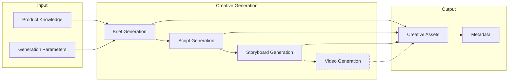
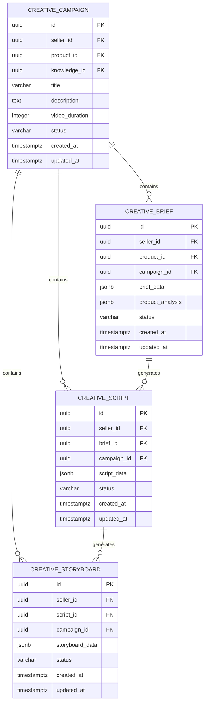
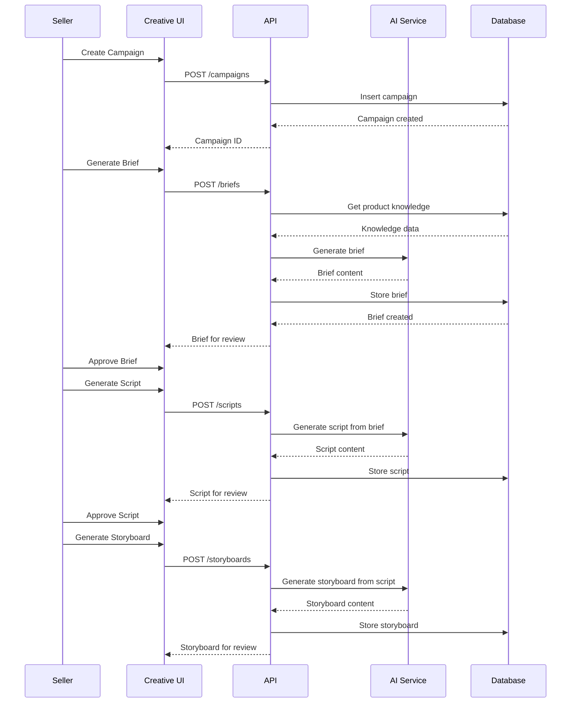
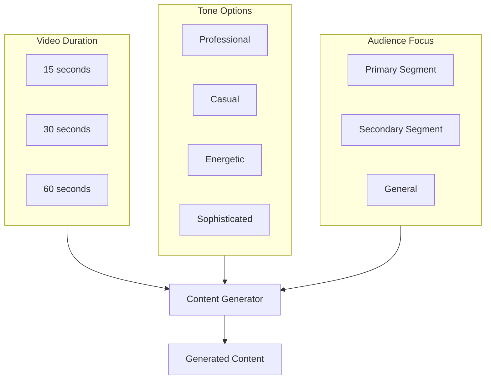
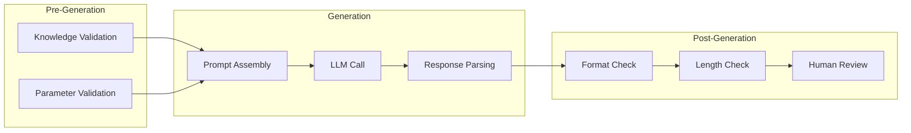

# Creative Studio Flow Diagram

## Overview

The content generation pipeline from Product Knowledge to creative assets.

## Generation Pipeline

*Note: Video Generation is planned functionality.*

## Campaign Structure

## Generation Workflow

## Generation Parameters

## Quality Controls

