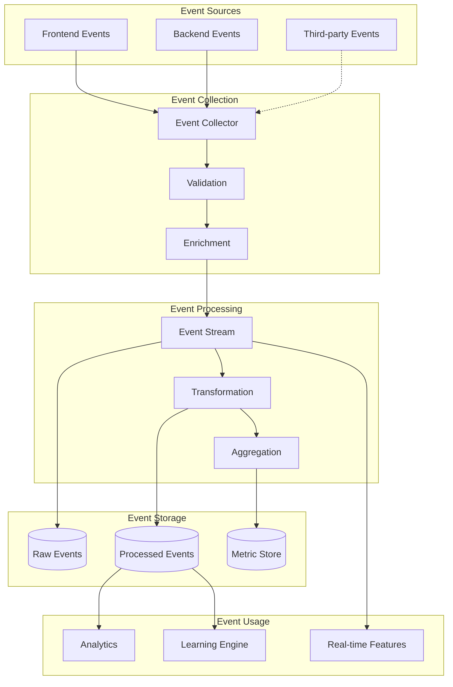
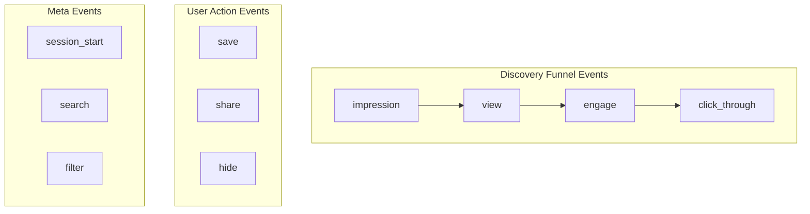
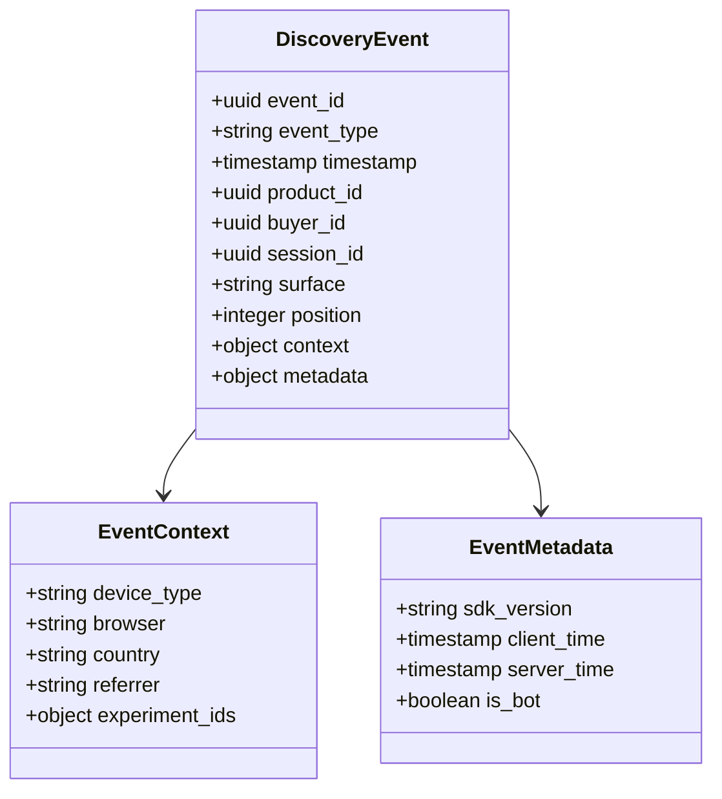
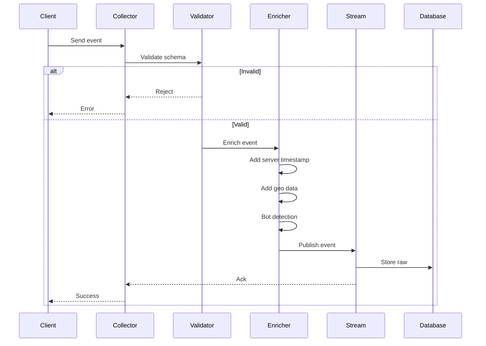
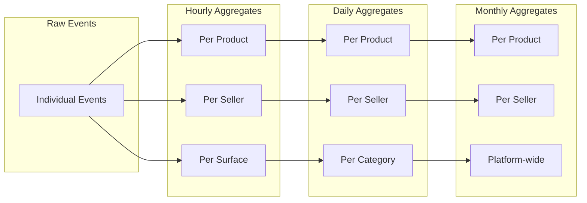
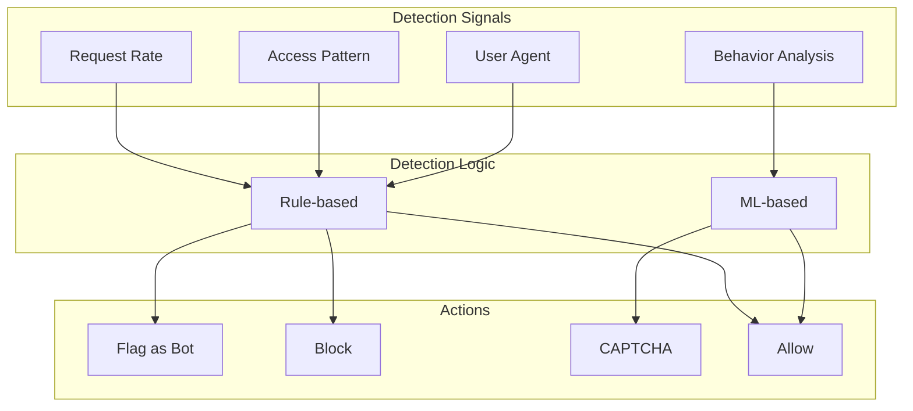

# Discovery Event Flow Diagram

## Overview

How discovery events are captured, processed, and used for analytics and learning.

## Event Flow

## Event Types

## Event Structure

## Processing Pipeline

## Aggregation Levels

## Bot Detection

