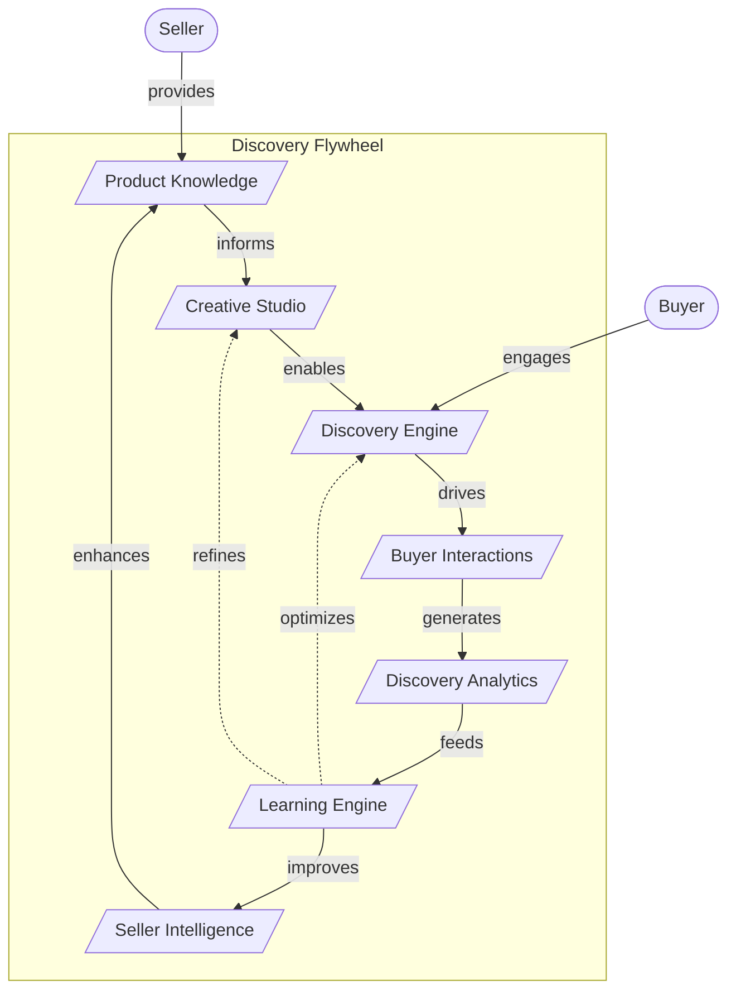

# Discovery Flywheel Diagram

## Overview

The Discovery Flywheel illustrates the virtuous cycle that creates compounding value in PinkCurve.

## Flywheel Diagram

## Flywheel Mechanics

### Stage 1: Knowledge Capture
- Sellers provide product knowledge
- Rich data enables better matching
- Completeness drives quality

### Stage 2: Content Creation
- Knowledge informs creative generation
- AI produces compelling content
- Content quality affects discovery

### Stage 3: Discovery Matching
- Engine matches buyers with products
- Relevance prioritized over ad spend
- Better matching → better engagement

### Stage 4: Buyer Engagement
- Buyers interact with discovered products
- Engagement signals generated
- Click-throughs deliver value

### Stage 5: Signal Capture
- Events tracked and processed
- Analytics identify patterns
- Data quality maintained

### Stage 6: Learning
- Models trained on signals
- Patterns become predictions
- Continuous improvement

### Stage 7: Intelligence Delivery
- Insights reach sellers
- Recommendations actionable
- Sellers improve products

### The Loop Closes
- Better knowledge → better discovery
- Better discovery → more engagement
- More engagement → better learning
- Better learning → better everything

## Why It's a Flywheel

Each turn of the wheel:
1. Generates more data
2. Improves model quality
3. Attracts more participants
4. Creates more value

**Momentum builds over time** — the system gets better with use.

## Flywheel Metrics

| Stage | Key Metric |
|-------|------------|
| Knowledge | Completeness Score |
| Creative | Content Quality |
| Discovery | Match Relevance |
| Engagement | QPV Rate |
| Analytics | Signal Quality |
| Learning | Model Improvement |
| Intelligence | Recommendation Adoption |
