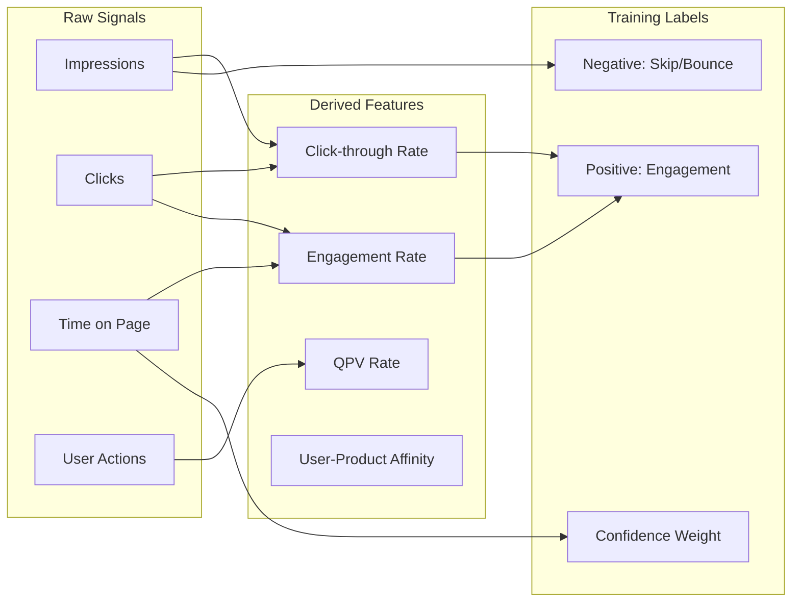
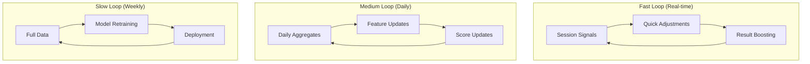
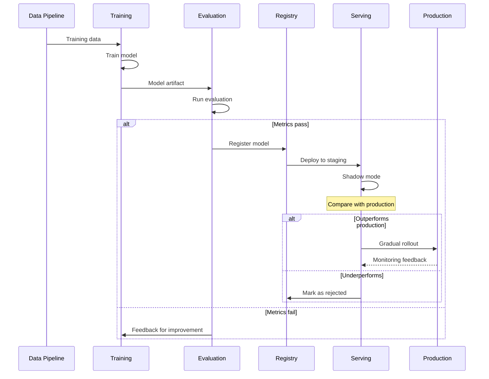
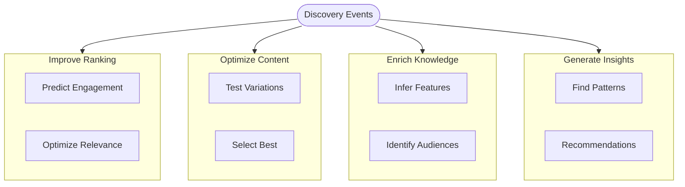
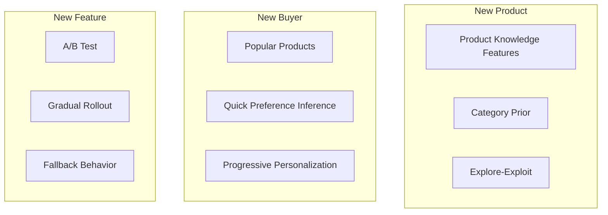

# Learning Engine Flow Diagram

## Overview

How the Learning Engine processes signals to improve discovery and generate insights.

## Learning Flow

```mermaid
flowchart TB
    subgraph Input["Signal Input"]
        Events[Discovery Events]
        Feedback[Explicit Feedback]
        Outcomes[Outcome Data]
    end

    subgraph Process["Signal Processing"]
        Aggregate[Aggregation]
        Features[Feature Engineering]
        Labels[Label Generation]
    end

    subgraph Train["Model Training"]
        Split[Train/Val Split]
        Train[Training]
        Eval[Evaluation]
    end

    subgraph Deploy["Model Deployment"]
        Registry[Model Registry]
        Serve[Model Serving]
        Monitor[Monitoring]
    end

    subgraph Apply["Application"]
        Ranking[Discovery Ranking]
        Recs[Recommendations]
        Insights[Seller Insights]
    end

    Events --> Aggregate
    Feedback --> Aggregate
    Outcomes --> Aggregate

    Aggregate --> Features
    Features --> Labels
    Labels --> Split

    Split --> Train
    Train --> Eval
    Eval --> Registry

    Registry --> Serve
    Serve --> Monitor

    Serve --> Ranking
    Serve --> Recs
    Serve --> Insights
```

## Signal Processing



## Feedback Loops



## Model Pipeline



## Learning Objectives



## Cold Start Handling


