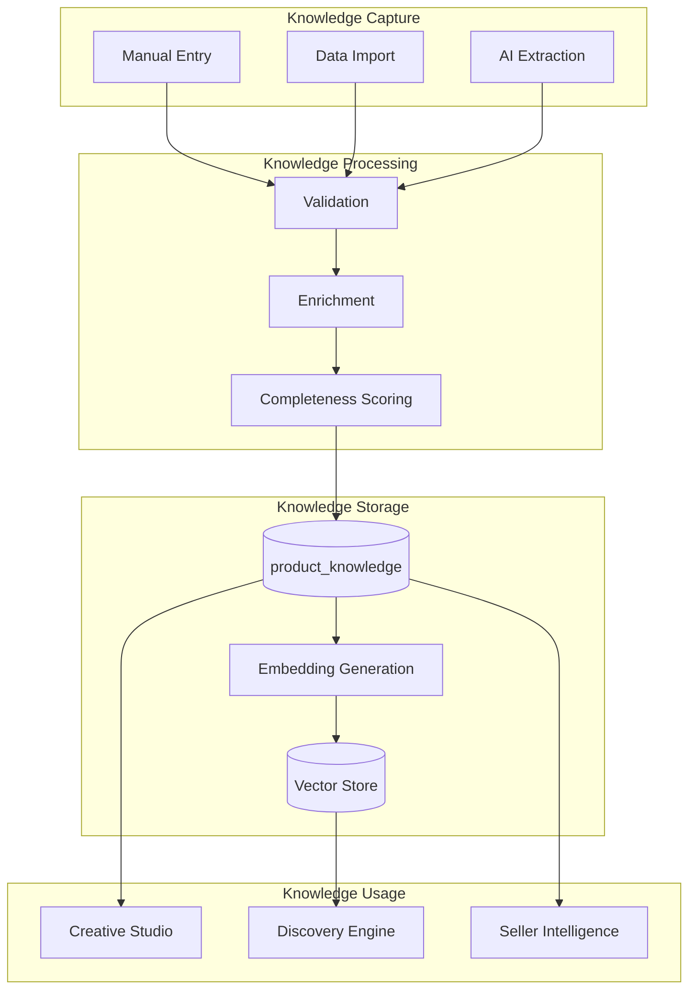
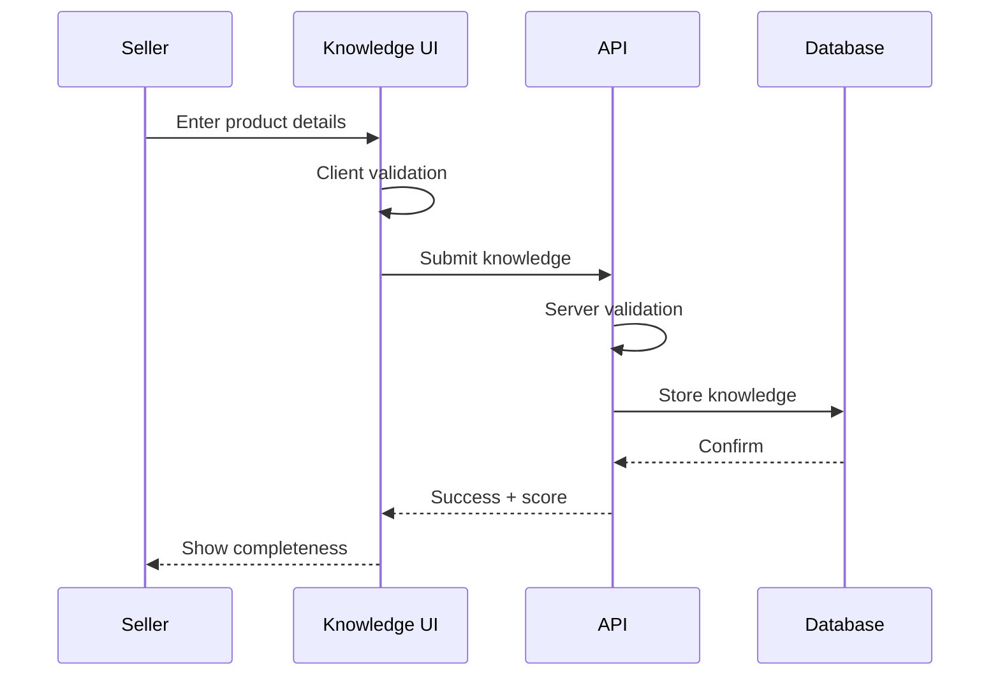
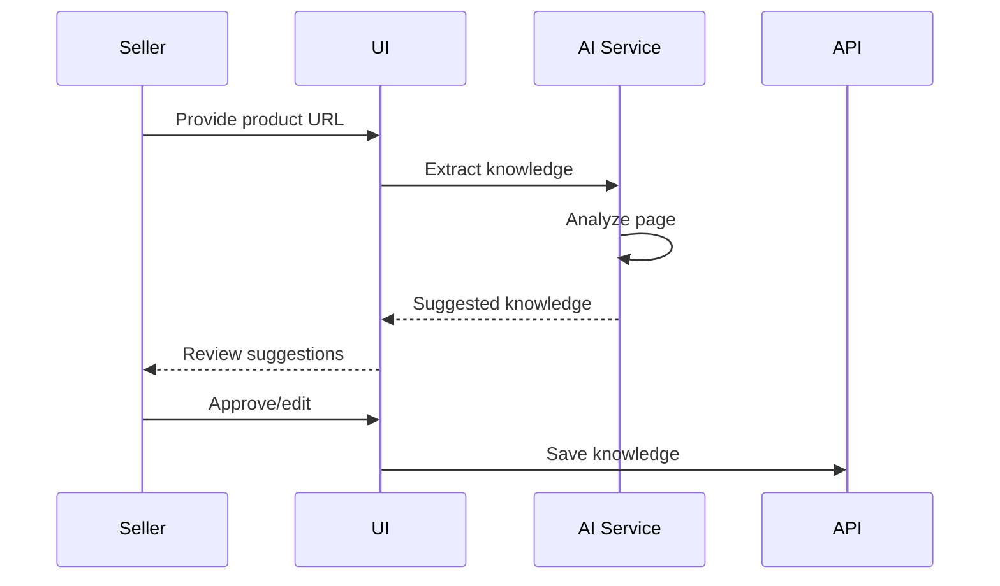
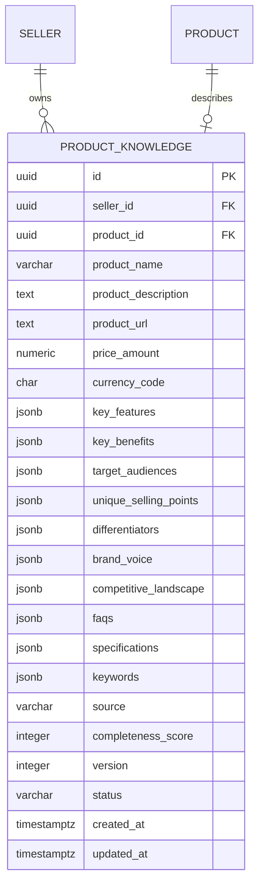
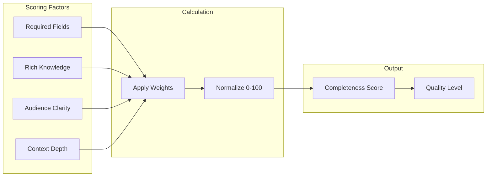

# Product Knowledge Flow Diagram

## Overview

How product knowledge is captured, enriched, and used throughout the platform.

## Knowledge Flow

## Capture Methods

### Manual Entry

### AI Extraction (Planned)

## Knowledge Entity Structure

## Completeness Scoring

| Score Range | Level | Capability |
|-------------|-------|------------|
| 0-25 | Minimal | Basic listing only |
| 26-50 | Basic | Simple matching |
| 51-75 | Good | Effective discovery |
| 76-100 | Comprehensive | Optimal matching |
