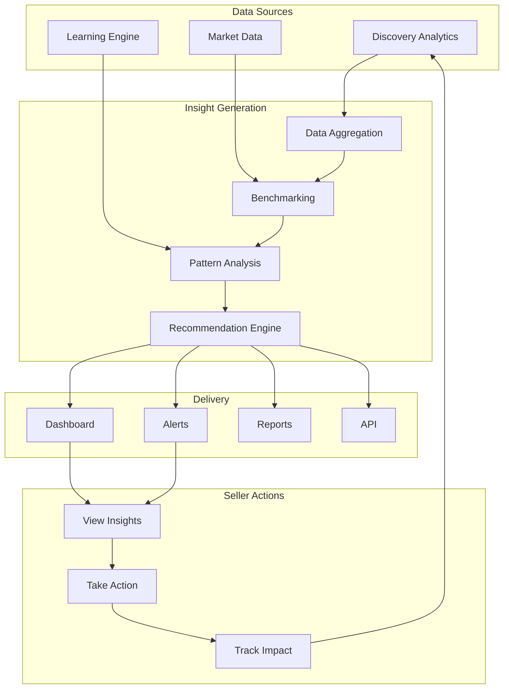
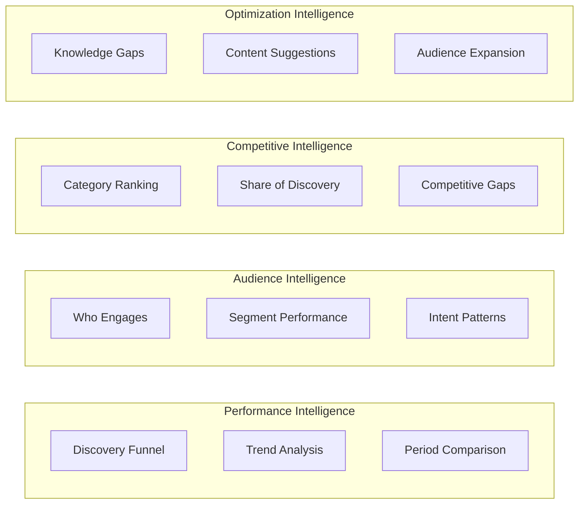
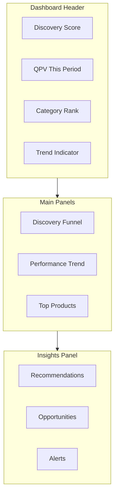
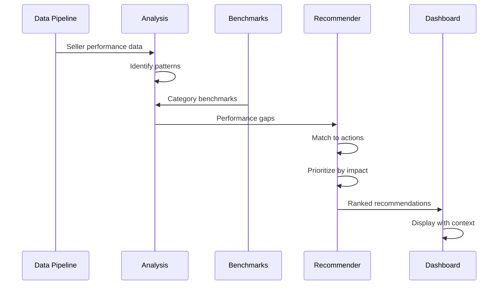
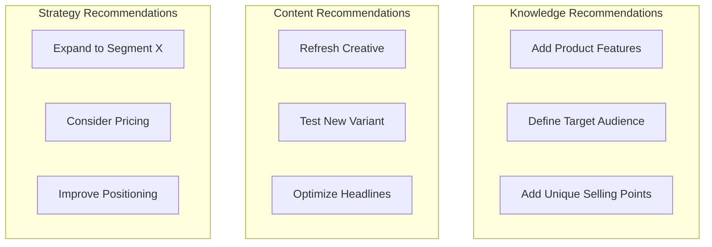
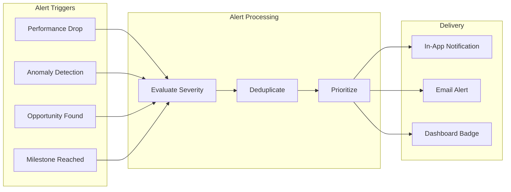
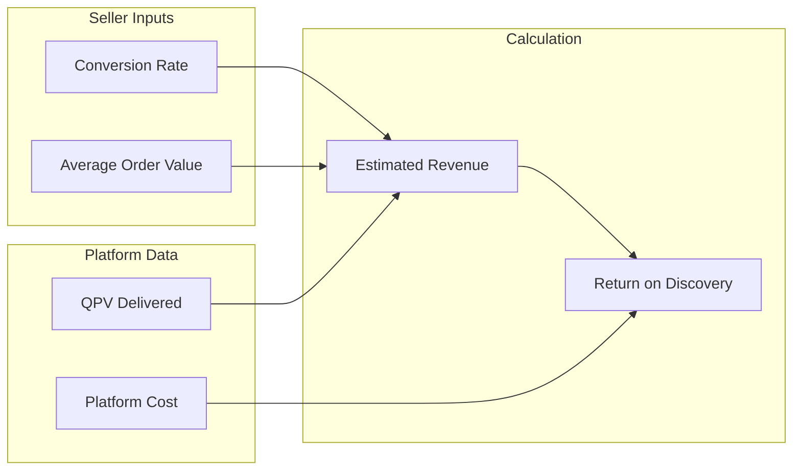

# Seller Intelligence Flow Diagram

## Overview

How insights are generated and delivered to sellers.

## Intelligence Flow



## Intelligence Categories



## Dashboard Structure



## Recommendation Generation



## Recommendation Types



## Alert System



## Return on Discovery Calculation



**Formula:**
```
Estimated Revenue = QPV × Conversion Rate × AOV
ROD = Estimated Revenue / Platform Cost
```
