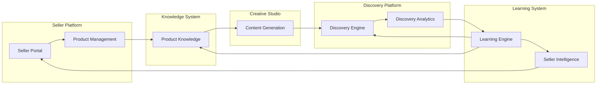

# Product Architecture

## Document Status

| Field | Value |
|-------|-------|
| **Status** | Draft |
| **Version** | 0.1 |
| **Owner** | PinkCurve Engineering Team |
| **Last Reviewed** | 2026-07-23 |
| **Related Components** | All platform components |

---

## Overview

This document describes the high-level architecture of the PinkCurve platform. It covers the main system components, their responsibilities, and how they interact.

---

## Platform Flow

The core value creation loop:

```
Seller
  → Product Knowledge (capture and enrich product data)
    → Creative Studio (generate compelling content)
      → Discovery Engine (match buyers with products)
        → Buyer Interaction (engagement on platform)
          → Discovery Analytics (measure effectiveness)
            → Learning Engine (improve from signals)
              → Seller Intelligence (actionable insights)
                → improved Product Knowledge, creative, and discovery
```

This is a continuous loop. Learnings from buyer interactions flow back to improve product knowledge, creative content, and discovery matching.

---

## System Components

### 1. Seller Platform

**Responsibility:** Seller onboarding, authentication, product management, and dashboard.

**Current Capabilities:**
- Seller registration and authentication
- Basic product CRUD operations
- Workspace management

**Planned Capabilities:**
- Seller verification workflows
- Multi-product management
- Team collaboration

### 2. Product Knowledge System

**Responsibility:** Capture, store, and enrich rich product knowledge.

**Current Capabilities:**
- Basic product data storage
- Product-brief relationship

**Planned Capabilities:**
- Knowledge entity management
- AI-assisted knowledge extraction
- Knowledge completeness scoring

See: [Product Knowledge](04-product-knowledge.md)

### 3. Creative Studio

**Responsibility:** AI-powered content generation for product storytelling.

**Current Capabilities:**
- Creative briefs generation
- Script generation from briefs
- Storyboard generation from scripts

**Planned Capabilities:**
- Campaign workflows
- Video generation
- A/B creative variations

See: [Creative Studio](05-creative-studio.md)

### 4. Discovery Engine

**Responsibility:** Match buyers with relevant products.

**Current Status:** Planned

**Planned Capabilities:**
- Intent-based matching
- Personalized discovery feeds
- Search and browse experiences

See: [Discovery Engine](06-discovery-engine.md)

### 5. Discovery Analytics

**Responsibility:** Track and measure discovery effectiveness.

**Current Status:** Planned

**Planned Capabilities:**
- Discovery event tracking
- Discovery Score calculation
- Funnel analytics

See: [Discovery Analytics](07-discovery-analytics.md)

### 6. Learning Engine

**Responsibility:** Process signals to improve discovery.

**Current Status:** Planned

**Planned Capabilities:**
- Signal processing pipeline
- Model training infrastructure
- Feedback loop automation

See: [Learning Engine](08-learning-engine.md)

### 7. Seller Intelligence

**Responsibility:** Deliver actionable insights to sellers.

**Current Status:** Planned

**Planned Capabilities:**
- Performance dashboards
- Competitive insights
- Recommendation engine

See: [Seller Intelligence](09-seller-intelligence.md)

### 8. AI Platform

**Responsibility:** Shared AI/ML infrastructure.

**Current Capabilities:**
- LLM integration for content generation
- Basic embedding generation

**Planned Capabilities:**
- Vector similarity search
- Model management
- Evaluation infrastructure

See: [AI Platform](10-ai-platform.md)

---

## Data Flow



---

## Technology Stack

### Current Implementation

| Layer | Technology |
|-------|------------|
| Frontend | React (Vite) |
| Backend | Node.js (Express) |
| Database | PostgreSQL (Cloud SQL) |
| Hosting | Firebase (frontend), Cloud Run (backend) |
| AI | Claude API (Anthropic) |

### Planned Additions

| Capability | Candidate Technologies |
|------------|----------------------|
| Vector Search | pgvector, Pinecone, or Weaviate |
| Event Processing | Cloud Pub/Sub or Kafka |
| ML Training | Vertex AI or custom infrastructure |
| CDN | Cloud CDN or Cloudflare |

Technology decisions are documented in the [decisions/](../decisions/) directory.

---

## Integration Points

### External Integrations

| Integration | Purpose | Status |
|-------------|---------|--------|
| Anthropic Claude | Content generation | Active |
| Stripe | Payments | Configured |
| Firebase Auth | Authentication | Active |

### API Design

All internal and external APIs follow REST conventions with:
- JSON request/response bodies
- Bearer token authentication
- Consistent error formats
- Versioned endpoints (planned)

---

## Deployment Architecture

### Current State

```
┌─────────────────────────────────────────┐
│              Firebase Hosting            │
│           (Frontend - React)             │
└─────────────────────┬───────────────────┘
                      │
                      ▼
┌─────────────────────────────────────────┐
│              Cloud Run                   │
│         (Backend - Node.js)              │
└─────────────────────┬───────────────────┘
                      │
                      ▼
┌─────────────────────────────────────────┐
│              Cloud SQL                   │
│           (PostgreSQL)                   │
└─────────────────────────────────────────┘
```

### Planned Evolution

- Add Cloud Pub/Sub for event-driven processing
- Add Cloud Functions for specific workloads
- Add Redis for caching layer
- Add vector database for similarity search

---

## Scalability Considerations

### Current Scale
- Single Cloud Run instance (auto-scaling)
- Single Cloud SQL instance
- Designed for early-stage usage

### Future Scale
- Horizontal scaling via Cloud Run
- Read replicas for Cloud SQL
- Event-driven architecture for decoupling
- CDN for static content and caching

---

## Related Documents

- [Data Architecture](11-data-architecture.md)
- [AI Platform](10-ai-platform.md)
- [Platform Architecture Diagram](../diagrams/platform-architecture.md)
