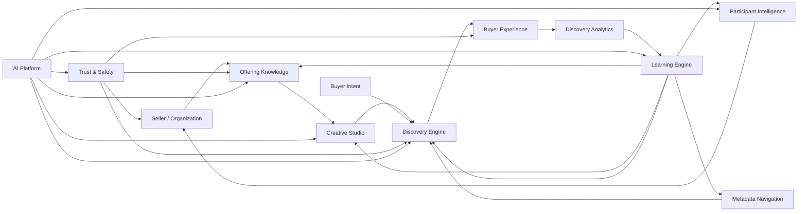

# Product Architecture

## Document Status

| Field                  | Value                      |
| ---------------------- | -------------------------- |
| **Status**             | Draft                      |
| **Version**            | 0.3                        |
| **Owner**              | PinkCurve Engineering Team |
| **Last Reviewed**      | 2026-08-18                 |
| **Related Components** | All platform components    |

---

## Overview

PinkCurve is an AI-powered visual discovery platform that connects buyers with offerings that may be relevant, useful, interesting, or timely.

The fundamental discovery object within PinkCurve is an **Offering**.

An Offering may represent:

* A product
* A commercial service
* A promotion
* An event
* A community service
* A public service
* A brand-awareness or brand-recognition offering
* Other future discoverable items

PinkCurve does not require every offering to lead directly to a transaction. Its primary responsibility is **discovery**: helping buyers discover what matters and helping sellers and organizations reach relevant audiences.

Transactions, when applicable, normally occur on the seller's or provider's destination site.

The architecture therefore centers on five connected capabilities:

1. Understanding offerings
2. Understanding buyer intent
3. Presenting relevant offerings visually
4. Learning from interactions and feedback
5. Protecting trust throughout the ecosystem

---

## Core Platform Loop

PinkCurve operates as a continuous discovery and learning system.

```text
Seller / Organization
        ↓
Offering Knowledge
        ↓
Creative Studio
        ↓
Discovery Engine
        ↓
Buyer Experience
        ↓
Buyer Interaction & Feedback
        ↓
Discovery Analytics
        ↓
Learning Engine
        ↓
Participant Intelligence
        ↓
Improved Knowledge, Creative, Discovery, and Experience
        ↺
```

The loop continuously improves PinkCurve.

Buyer interactions provide signals about:

* relevance
* interest
* usefulness
* preferences
* negative feedback
* discovery patterns
* location patterns
* creative effectiveness

These signals help PinkCurve improve future discovery while respecting privacy, security, trust, and buyer control.

---

## Platform Architecture

PinkCurve consists of interconnected platform systems rather than a single recommendation engine.

```text
                    ┌──────────────────────┐
                    │ Seller / Organization│
                    └──────────┬───────────┘
                               │
                               ▼
                    ┌──────────────────────┐
                    │ Offering Knowledge   │
                    └──────────┬───────────┘
                               │
                               ▼
                    ┌──────────────────────┐
                    │   Creative Studio    │
                    └──────────┬───────────┘
                               │
                               ▼
┌──────────────────┐  ┌──────────────────────┐
│ Buyer Intent &   │─▶│   Discovery Engine   │
│ Metadata Signals │  └──────────┬───────────┘
└──────────────────┘             │
                                 ▼
                    ┌──────────────────────┐
                    │   Buyer Experience   │
                    │ Visual Discovery +   │
                    │ Metadata Navigation  │
                    └──────────┬───────────┘
                               │
                               ▼
                    ┌──────────────────────┐
                    │ Discovery Analytics  │
                    └──────────┬───────────┘
                               │
                               ▼
                    ┌──────────────────────┐
                    │   Learning Engine    │
                    └──────────┬───────────┘
                               │
                               ▼
                    ┌──────────────────────┐
                    │Participant Intelligence│
                    └──────────┬───────────┘
                               │
                               └───────────────↺
```

Trust, safety, security, privacy, and fraud prevention operate across the entire architecture rather than as a single isolated component.

---

# System Components

## 1. Participant Platform

The Participant Platform manages the people and organizations that interact with PinkCurve.

Primary participant types include:

* Buyers
* Sellers
* Commercial organizations
* Future public and community organizations

Commercial providers are generally referred to as **sellers** throughout the Blueprint.

### Responsibilities

* Participant registration
* Authentication
* Identity and contact verification
* Seller and organization onboarding
* Buyer account management
* Offering management
* Workspace management
* Account security
* Participant status and reputation signals

### Planned Capabilities

* Seller verification workflows
* Buyer verification workflows
* Organization verification
* Multi-offering management
* Team collaboration
* Fraud and abuse detection
* Participant reputation signals

---

## 2. Offering Knowledge System

The Offering Knowledge System captures, organizes, enriches, and manages knowledge about everything PinkCurve can present for discovery.

The **Offering** is the fundamental discovery object in PinkCurve.

Offering Knowledge may include:

* Offering name
* Category
* Brand
* Description
* Price
* Features
* Benefits
* Target audiences
* Images
* Videos
* Destination URL
* Location
* Availability
* Promotions
* Specifications
* FAQs
* Reviews
* Keywords
* Metadata
* Seller-provided information
* AI-generated enrichment

The knowledge system provides the foundation for discovery, creative generation, metadata navigation, analytics, and learning.

### Planned Capabilities

* Knowledge entity management
* AI-assisted knowledge extraction
* URL-based offering analysis
* Metadata generation
* Knowledge completeness scoring
* Knowledge validation
* Knowledge versioning

See: [Offering Knowledge](04-offering-knowledge.md)

---

## 3. Creative Studio

The Creative Studio transforms Offering Knowledge into visual discovery experiences.

PinkCurve is designed around the principle that buyers should be able to understand offerings primarily through **visual content rather than large amounts of text**.

Creative content may include:

* Images
* Short-form videos
* Stories
* Promotional creatives
* Brand-recognition creatives
* Campaign variations

### Responsibilities

* Creative brief generation
* Story generation
* Script generation
* Storyboard generation
* Creative asset organization
* Campaign creation

### Planned Capabilities

* AI-assisted campaign workflows
* Video generation and assembly
* Creative variations
* Creative performance learning
* A/B testing
* Seller-uploaded creative support

See: [Creative Studio](05-creative-studio.md)

---

## 4. Discovery Engine

The Discovery Engine determines which offerings should be presented to a buyer.

Its purpose is not simply to maximize clicks. It attempts to identify offerings that are relevant and useful to the buyer while maintaining quality, diversity, fairness, and trust.

### Discovery Signals

Discovery may use signals including:

* Buyer intent
* Offering metadata
* Buyer-selected metadata
* Location
* Previous interactions
* Positive feedback
* Negative feedback
* Trending activity
* New offerings
* Promotions
* Community relevance
* Discovery quality signals

### Discovery Modes

PinkCurve may support several discovery experiences:

* Intent-driven discovery
* Metadata-guided discovery
* Personalized discovery
* New offerings
* Trending offerings
* Promotions and discounts
* Location-aware discovery
* Community information
* Brand discovery

The Discovery Engine supplies the Buyer Experience but does not control the buyer. Buyers must always have mechanisms to redirect and refine discovery.

See: [Discovery Engine](06-discovery-engine.md)

---

## 5. Buyer Experience

The Buyer Experience is the primary discovery surface of PinkCurve.

PinkCurve is designed as a **visual-first, mobile-first discovery environment**.

The basic interaction model is:

```text
Open → See → Swipe → Discover → Refine → Explore
```

Buyers should not need to construct complicated search queries or navigate large text-heavy interfaces.

### Core Capabilities

* Visual offering feed
* Video and image discovery
* Adaptive Metadata Navigation
* Buyer intent controls
* Offering exploration
* Positive and negative feedback
* Ratings and comments where appropriate
* Location-aware discovery
* Links to seller or provider destinations

### Adaptive Metadata Navigation

Adaptive Metadata Navigation allows buyers to progressively refine what they want using metadata generated from the offerings currently available.

Rather than hiding product characteristics behind traditional filters, PinkCurve can expose useful discovery dimensions directly to buyers.

Metadata navigation and the Discovery Engine work together:

```text
Buyer Intent
     ↓
Initial Offerings
     ↓
Relevant Metadata
     ↓
Buyer Refinement
     ↓
More Relevant Offerings
     ↓
Updated Metadata
     ↺
```

This allows discovery to become increasingly focused without requiring the buyer to know exactly what to search for in advance.

See: [Buyer Experience](20-buyer-experience.md)

---

## 6. Discovery Feed

PinkCurve is not intended to be used only when a buyer performs an explicit search.

The platform may continuously provide useful and interesting discovery opportunities through a dynamic discovery feed.

The feed may include:

* New offerings
* Trending offerings
* Relevant promotions
* Discounts
* Location trends
* Brand discovery
* Community bulletins
* Public information
* Personalized discoveries

The purpose is to make PinkCurve useful to open regularly while avoiding the engagement-maximization patterns of traditional social media.

The feed remains a **discovery experience**, not a social-media feed.

---

## 7. Discovery Analytics

Discovery Analytics measures how effectively PinkCurve connects buyers with relevant offerings.

### Responsibilities

* Discovery event tracking
* Offering views
* Buyer interactions
* Click-through tracking
* Metadata-navigation behavior
* Positive and negative feedback
* Discovery Score calculation
* Creative performance
* Seller value measurement
* Brand-recognition measurement
* Funnel analytics

Analytics provides signals to both the Learning Engine and Participant Intelligence systems.

See: [Discovery Analytics](07-discovery-analytics.md)

---

## 8. Learning Engine

The Learning Engine converts interaction signals into improvements throughout PinkCurve.

It learns from:

* Offering views
* Buyer navigation
* Click-throughs
* Ratings
* Comments
* Positive feedback
* Negative feedback
* Creative performance
* Seller activity
* Discovery outcomes

Learning can improve:

* Offering Knowledge
* Metadata
* Discovery ranking
* Buyer experiences
* Creative generation
* Seller recommendations
* Fraud detection
* Platform quality

The Learning Engine should not treat engagement alone as success. Learning must remain aligned with relevance, usefulness, trust, and buyer control.

See: [Learning Engine](08-learning-engine.md)

---

## 9. Participant Intelligence

Participant Intelligence converts platform knowledge and learning into useful intelligence for different participants.

It may evolve into several specialized intelligence systems.

### Seller Intelligence

Helps sellers understand:

* Offering performance
* Discovery performance
* Buyer interest
* Creative effectiveness
* Brand recognition
* Campaign performance
* Value received from PinkCurve
* Opportunities for improvement

See: [Seller Intelligence](09-seller-intelligence.md)

### Buyer Intelligence

Buyer Intelligence helps PinkCurve better serve individual buyers.

It may include:

* Discovery preferences
* Intent patterns
* Metadata preferences
* Location relevance
* Feedback patterns
* Discovery history

Buyer Intelligence must operate within PinkCurve's privacy and trust principles.

### Community Intelligence

Future Community Intelligence may help identify:

* Useful local resources
* Community trends
* Public information
* Location-relevant services
* Emerging community needs

Participant Intelligence is therefore broader than Seller Intelligence alone.

---

## 10. Trust, Safety, and Verification

Trust is a platform-wide architectural capability.

PinkCurve must protect buyers, sellers, organizations, offerings, interactions, and platform infrastructure.

### Responsibilities

* Seller verification
* Buyer verification
* Contact verification
* Offering verification
* Fraud detection
* Scam prevention
* Bot detection
* Abuse prevention
* Account security
* Suspicious activity detection
* Content integrity
* Privacy protection

AI may assist with detection and prioritization, but high-risk decisions may require human review.

Trust signals may influence whether participants or offerings are eligible for discovery.

See: [Security, Privacy, and Trust](12-security-privacy-and-trust.md)

---

## 11. AI Platform

The AI Platform provides shared AI capabilities across PinkCurve.

AI is not limited to content generation.

It may support:

* Offering Knowledge extraction
* Metadata generation
* Creative generation
* Discovery
* Ranking
* Embeddings
* Semantic retrieval
* Learning
* Seller Intelligence
* Buyer Intelligence
* Community Intelligence
* Fraud detection
* Trust and safety
* Customer support
* Platform operations

### Platform Capabilities

* LLM integration
* Embedding generation
* Vector retrieval
* Model management
* Prompt management
* Model evaluation
* AI observability
* Safety controls
* Human-in-the-loop workflows

See: [AI Platform](10-ai-platform.md)

---

# Data Flow



---

# Technology Architecture

The product architecture defines **what PinkCurve must do**. Specific technologies may evolve as the platform develops.

## Current Implementation

| Layer            | Technology                                          |
| ---------------- | --------------------------------------------------- |
| Frontend         | React                                               |
| Backend APIs     | Node.js / Express and evolving service architecture |
| Primary Database | PostgreSQL                                          |
| Hosting          | Google Cloud                                        |
| Authentication   | Firebase Authentication                             |
| AI / LLM         | Model-provider integrations                         |

PinkCurve should avoid coupling its long-term product architecture to a single AI model or infrastructure provider.

---

## Planned Infrastructure Capabilities

| Capability             | Candidate Technologies                                  |
| ---------------------- | ------------------------------------------------------- |
| Vector Search          | pgvector, Pinecone, Weaviate, or equivalent             |
| Event Processing       | Google Cloud Pub/Sub, Kafka, or equivalent              |
| ML / AI Infrastructure | Vertex AI, managed model APIs, or custom infrastructure |
| Caching                | Redis or equivalent                                     |
| CDN                    | Cloud CDN, Cloudflare, or equivalent                    |
| Object Storage         | Cloud Storage or equivalent                             |

Technology selections should remain replaceable where practical.

Technology decisions are documented separately so that the Blueprint describes the durable product architecture rather than locking PinkCurve to temporary implementation choices.

---

# API Architecture

PinkCurve APIs should provide consistent interfaces between platform components.

Current and future APIs may use REST, event-driven messaging, and other service interfaces where appropriate.

Core principles include:

* Structured request and response formats
* Authentication and authorization
* API versioning
* Consistent error handling
* Observability
* Rate limiting
* Service isolation
* Security controls

---

# Deployment Evolution

PinkCurve should evolve from a simple startup architecture toward a distributed architecture only as scale requires it.

### Early Stage

```text
Frontend
   ↓
Backend APIs
   ↓
PostgreSQL
   ↓
AI / External Services
```

### Growth Stage

```text
Frontend / Mobile Clients
          ↓
       API Layer
          ↓
 ┌────────┼────────┐
 ↓        ↓        ↓
Discovery Knowledge Creative
Services   Services  Services
 ↓        ↓        ↓
Databases / Vector Stores / Object Storage
          ↓
     Event Platform
          ↓
 Analytics / Learning / Intelligence
```

This evolutionary approach avoids unnecessary infrastructure complexity during the early stages of PinkCurve while preserving a path toward large-scale operation.

---

# Scalability Principles

PinkCurve should scale according to actual platform demand.

Architectural principles include:

* Stateless service scaling where practical
* Event-driven processing for asynchronous workloads
* Caching of frequently accessed discovery data
* Vector retrieval for semantic discovery
* Distributed storage when required
* CDN delivery for media
* Background processing for AI workloads
* Independent scaling of discovery, creative, analytics, and AI workloads

Premature infrastructure complexity should be avoided.

---

# Architectural Principles

PinkCurve architecture should preserve several long-term principles.

### Offering-Centered

The Offering remains the fundamental object of discovery.

### Buyer-Controlled Discovery

AI assists discovery, but buyers retain control through intent and metadata navigation.

### Visual First

Discovery should prioritize images, video, and visual understanding over text-heavy interfaces.

### Learning Driven

Every meaningful interaction may improve future discovery.

### Trust by Design

Trust, verification, security, privacy, and fraud prevention are architectural requirements rather than optional features.

### AI as Shared Infrastructure

AI capabilities should support the entire platform rather than exist as isolated features.

### Provider Independence

PinkCurve should avoid unnecessary dependency on any single AI, database, cloud, or infrastructure provider.

### Discovery Before Transaction

PinkCurve's primary responsibility is helping buyers discover relevant offerings. Commercial transactions normally remain with sellers or service providers.

---

# Related Documents

* [Design Principles](02-design-principles.md)
* [Offering Knowledge](04-offering-knowledge.md)
* [Creative Studio](05-creative-studio.md)
* [Discovery Engine](06-discovery-engine.md)
* [Discovery Analytics](07-discovery-analytics.md)
* [Learning Engine](08-learning-engine.md)
* [Seller Intelligence](09-seller-intelligence.md)
* [AI Platform](10-ai-platform.md)
* [Data Architecture](11-data-architecture.md)
* [Security, Privacy, and Trust](12-security-privacy-and-trust.md)
* [Buyer Experience](20-buyer-experience.md)
* [Platform Architecture Diagram](../diagrams/platform-architecture.md)
