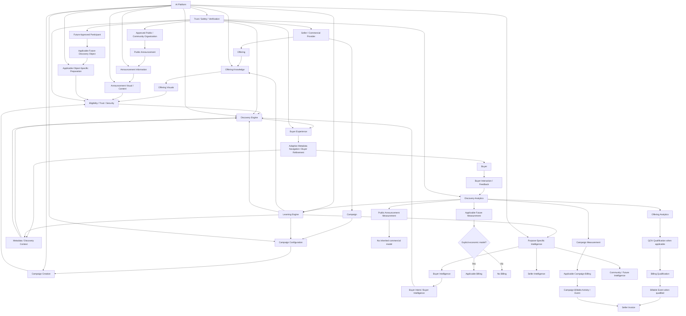

# Product Architecture

## Document Status

| Field                  | Value                      |
| ---------------------- | -------------------------- |
| **Status**             | Draft                      |
| **Version**            | 0.3                        |
| **Owner**              | PinkCurve Engineering Team |
| **Last Reviewed**      | 2026-09-26                 |
| **Related Components** | All platform components    |

---

## Overview

PinkCurve is an AI-powered visual discovery platform that helps people discover things that may be relevant, useful, interesting, or timely.

PinkCurve supports multiple types of discovery rather than requiring everything that can be discovered to be represented as an Offering.

Examples include:

- Offerings,
- Campaigns,
- Public Announcements, and
- future approved discovery types.

An **Offering** represents something a Seller or provider makes available for Buyers to discover, such as:

- a product,
- a commercial service,
- a free product,
- a free service, or
- another applicable provider Offering.

A **Campaign** is a separate discovery object used for approved brand or promotional discovery.

A **Public Announcement** is a separate discovery object intended for applicable public, community, civic, safety, assistance, or informational discovery.

Additional discovery object types may be introduced as PinkCurve expands.

PinkCurve does not require every discovery object to lead directly to a transaction.

Its primary responsibility is **discovery**: helping people discover what matters while helping Sellers, organizations, public-service providers, community participants, and other approved participants reach relevant audiences.

Transactions, when applicable, normally occur on the Seller's or provider's destination site.

Different discovery object types may have different identities, knowledge structures, lifecycles, governance, Trust requirements, interaction models, measurement models, and economic models while sharing common PinkCurve Discovery capabilities.

The architecture therefore centers on five connected capabilities:

1. Understanding applicable discovery objects and their context
2. Understanding Buyer intent and discovery context
3. Presenting relevant discovery content visually
4. Learning from interactions and feedback
5. Protecting Trust throughout the ecosystem

The detailed relationship among Offering, Campaign, Public Announcement, and future discovery types is defined by the Discovery Object Model below.

---

## Discovery Object Model

PinkCurve Discovery is designed to support multiple types of discoverable objects rather than requiring all discoverable content to be represented as an Offering.

An **Offering** is therefore an important PinkCurve discovery object, but it is not the only possible discovery object.

Conceptually:

```text
PinkCurve Discovery
        │
        ├── Offering
        │     ├── Paid product
        │     ├── Free product
        │     ├── Paid service
        │     └── Free service
        │
        ├── Campaign
        │     └── Brand / promotional message
        │
        ├── Public Announcement
        │     ├── Free food distribution
        │     ├── Community giveaway
        │     ├── Emergency information
        │     ├── Public program
        │     └── Community information
        │
        └── Future Discovery Types
```

Each discovery object should represent the purpose and meaning of what is being discovered.

The discovery object type should not be determined simply by whether something is free or paid.

For example, a product or service offered at no cost may still be an Offering when it represents something a provider makes available for people to discover.

A Public Announcement, by contrast, represents information whose primary purpose is to inform people about a public, community, civic, safety, assistance, or other applicable opportunity or condition.

Therefore:

```text
Free ≠ Public Announcement
Paid ≠ Offering

Object Type
    ↓
Determined by purpose and meaning

Price / Cost
    ↓
Attribute of the applicable object
```

Different discovery objects may have different:

- identities,
- knowledge structures,
- visual content,
- lifecycle states,
- approval requirements,
- Trust and Security requirements,
- destinations,
- interaction models,
- measurement models,
- governance requirements, and
- economic models.

At the same time, they may share common PinkCurve capabilities.

Conceptually:

```text
Offering ────────────────┐
Campaign ────────────────┤
Public Announcement ─────┤
Future Discovery Type ───┤
                         ↓
                 PinkCurve Discovery
                         ↓
                 Buyer Experience
                         ↓
                 Discovery Events
                         ↓
              Analytics and Learning
```

Shared capabilities may include:

- Discovery Engine,
- Buyer Intelligence,
- Adaptive Metadata Navigation,
- Buyer Experience,
- Trust and Security,
- Discovery Analytics,
- Learning Engine,
- AI Platform, and
- applicable Participant Intelligence.

Sharing PinkCurve capabilities does not require different discovery objects to share the same business identity or lifecycle.

For example:

```text
Offering
    ↓
Offering Discovery

Campaign
    ↓
Campaign Discovery

Public Announcement
    ↓
Public Announcement Discovery
```

These discovery paths may ultimately appear within a unified Buyer discovery experience while remaining independently identifiable within PinkCurve.

PinkCurve should avoid forcing a new form of discovery into an existing discovery object merely because that object already exists in the platform.

When a future form of discovery has meaningfully different identity, lifecycle, governance, Trust, interaction, measurement, or economic requirements, PinkCurve may represent it as an independent discovery object while allowing it to participate in the common PinkCurve Discovery architecture.

This extensible Discovery Object Model allows PinkCurve to expand beyond commercial Offering discovery while preserving clear meaning for Buyers, Sellers, organizations, public-service providers, community participants, and future PinkCurve participants.

---

## Core Platform Loop

PinkCurve operates as a continuous discovery and learning system.

Different discovery objects may enter PinkCurve through different creation, knowledge, content, verification, and governance processes before becoming eligible for discovery.

Conceptually:

```text
Seller / Commercial Provider
        │
        ├── Offering
        │      ↓
        │   Offering Knowledge / Visuals
        │
        └── Campaign
               ↓
            Campaign Configuration / Creative

Approved Public / Community Organization
        │
        └── Public Announcement
               ↓
            Announcement Information / Content

Future Approved Participant
        │
        └── Applicable Future Discovery Object
               ↓
            Object-Specific Preparation

                    ↓
         Eligibility / Trust Checks
                    ↓
        PinkCurve Discovery Services
                    │
        ┌───────────┴───────────┐
        │                       │
        ▼                       ▼
 Human Discovery          Agent Discovery
        │                       │
        ▼                       ▼
 Buyer Experience       PinkCurve Agent Interface
 Visual-First UI                 │
        │                        ▼
        │               Authorized Personal Agent
        │                        │
        └───────────┬────────────┘
                    ▼
             Registered Buyer
                    ↓
        Buyer Interaction,
        Intent & Feedback
                    ↓
           Discovery Analytics
                    ↓
             Learning Engine
                    ↓
        Purpose-Specific Intelligence
                    ↓
 Improved Knowledge, Content, Discovery,
       Intelligence, and Experience
                    ↺
```

The exact preparation path depends on the discovery object.

For example:

```text
Offering
    ↓
Offering Knowledge
    ↓
Applicable Offering Visuals
    ↓
Offering Discovery
```

```text
Campaign
    ↓
Campaign Configuration
    ↓
Campaign Creative
    ↓
Campaign Discovery
```

Future discovery objects may define their own preparation and governance paths.

For example:

```text
Public Announcement
    ↓
Announcement Information
    ↓
Announcement Visual / Content
    ↓
Public Announcement Discovery
```

These paths remain independently identifiable even when they share common PinkCurve Discovery capabilities.

Once eligible discovery content enters the Discovery Engine, the common PinkCurve learning loop can use applicable interactions and feedback to improve future discovery.

Buyer interactions may provide signals about:

- relevance,
- interest,
- usefulness,
- preferences,
- negative feedback,
- discovery patterns,
- location patterns,
- content or creative effectiveness, and
- other signals appropriate to the applicable discovery object.

Not every signal applies to every discovery object.

PinkCurve should interpret interaction evidence according to the meaning, governance, and measurement model of the applicable discovery object rather than assuming that all discovery interactions represent the same type of activity.

These signals help PinkCurve improve future discovery while respecting privacy, security, Trust, Buyer control, and the boundaries among different discovery object types.

---

## Platform Architecture

PinkCurve consists of interconnected platform systems supporting multiple independently identifiable discovery-object types rather than a single Offering-only pipeline.

Different discovery objects may use different knowledge, configuration, content, Creative, verification, and governance capabilities before becoming eligible for discovery.

They converge through shared PinkCurve Discovery capabilities while retaining their own identity, lifecycle, governance, measurement, and economic rules.

Conceptually:

```text id="x3t4ga"
 ┌──────────────────────────────────────────────┐
 │ Seller / Organization / Approved Participant │
 └──────────────────────┬───────────────────────┘
                        │
                        ▼
              ┌───────────────────┐
              │ Discovery Objects │
              └─────────┬─────────┘
                        │
        ┌───────────────┼──────────────────┐
        │               │                  │
        ▼               ▼                  ▼
   ┌─────────┐     ┌──────────┐    ┌───────────────────┐
   │Offering │     │ Campaign │    │Public Announcement│
   └────┬────┘     └────┬─────┘    └────────┬──────────┘
        │               │                   │
        ▼               ▼                   ▼
 ┌──────────────┐ ┌──────────────┐  ┌─────────────────┐
 │ Offering     │ │ Campaign     │  │ Announcement    │
 │ Knowledge    │ │ Configuration│  │ Information     │
 └──────┬───────┘ └──────┬───────┘  └────────┬────────┘
        │                │                   │
        ▼                ▼                   ▼
 ┌──────────────┐ ┌──────────────┐  ┌─────────────────┐
 │ Offering     │ │ Campaign     │  │ Announcement    │
 │ Visuals      │ │ Creative     │  │ Visual / Content│
 └──────┬───────┘ └──────┬───────┘  └────────┬────────┘
        │                │                   │
        └────────────────┼───────────────────┘
                         │
                         ▼
                ┌──────────────────┐
                │ Eligibility,     │
                │ Trust & Security │
                └────────┬─────────┘
                         │
                         ▼
              ┌─────────────────────────┐
              │ PinkCurve Discovery     │
              │ Services                │
              │                         │
              │ • Discovery Engine      │
              │ • Buyer Intelligence    │
              │ • AMN / Discovery       │
              │   Refinement            │
              └────────────┬────────────┘
                           │
               ┌───────────┴───────────┐
               │                       │
               ▼                       ▼
       ┌──────────────────┐    ┌───────────────────┐
       │ Human Discovery  │    │ Agent Discovery   │
       └────────┬─────────┘    └─────────┬─────────┘
                │                        │
                ▼                        ▼
       ┌──────────────────┐    ┌───────────────────┐
       │ Buyer Experience │    │ PinkCurve Agent   │
       │ Visual-First UI  │    │ Interface         │
       └────────┬─────────┘    └─────────┬─────────┘
                │                        │
                │                        ▼
                │              ┌───────────────────┐
                │              │ Authorized        │
                │              │ Personal Agent    │
                │              └─────────┬─────────┘
                │                        │
                └───────────┬────────────┘
                            │
                            ▼
                    ┌───────────────┐
                    │ Registered    │
                    │ Buyer         │
                    └───────┬───────┘
                            │
                            ▼
                ┌──────────────────────┐
                │ Buyer Interaction,   │
                │ Intent & Feedback    │
                └──────────┬───────────┘
                           │
               ┌───────────┴────────────┐
               │                        │
               ▼                        ▼
     ┌──────────────────────┐   ┌──────────────────────┐
     │ Discovery Analytics  │   │ PinkCurve Discovery  │
     └──────────┬───────────┘   │ Services             │
                │               └──────────┬───────────┘
                │                          │
                │                          └────────────↺
                │
                ▼
              ┌─────────────────────────────┐
              │                             │
              ▼                             ▼
   ┌──────────────────────┐      ┌──────────────────────┐
   │   Learning Engine    │      │ Billing & Commercial │
   │                      │      │ Integrity             │
   └──────────┬───────────┘      └──────────┬───────────┘
              │                             │
              ▼                             ▼
   ┌──────────────────────┐       Applicable Billable
   │ Purpose-Specific     │       Events / Adjustments /
   │ Intelligence         │       Seller Invoices
   └──────────┬───────────┘
              │
    ┌─────────┼───────────────┐
    │         │               │
    ▼         ▼               ▼
 Seller     Buyer        Community /
 Intelligence Intelligence Future Intelligence
    │         │               │
    └─────────┴───────────────┘
              │
              ▼
      Platform Improvement
              │
              └──────────────────────────────↺
```

This diagram represents an architectural pattern rather than requiring every discovery object to use identical components.

For example:

- Offering Knowledge applies specifically to Offerings.
- Campaign Configuration and Campaign Creative apply specifically to Campaigns.
- Public Announcement information and content apply specifically to Public Announcements.
- Future discovery objects may introduce other object-specific capabilities.

These object-specific capabilities prepare content for discovery but do not require the underlying business objects to become related to one another.

The Discovery Engine provides a shared discovery capability across eligible discovery-object types.

Buyer Intent, Buyer Intelligence, metadata signals, context, eligibility, Trust, Security, and other applicable signals may help determine what discovery content is appropriate for a Buyer.

The Buyer Experience may present different discovery-object types within a coherent visual discovery environment while preserving enough source identity for PinkCurve to apply the correct interaction, governance, analytics, and economic rules.

PinkCurve Discovery may reach a registered Buyer through more than one authorized Discovery channel.

Human Discovery uses the PinkCurve Buyer Experience as the primary visual-first Discovery surface.

Future Agent Discovery may use the PinkCurve Agent Interface to provide structured and multimodal Discovery capabilities to an authorized Personal Agent acting on behalf of the registered Buyer.

These channels SHALL use the applicable shared PinkCurve Discovery capabilities rather than creating separate Discovery Engines.

The Discovery channel SHALL remain identifiable so PinkCurve can apply appropriate interaction, authorization, Analytics, Trust, Security, Buyer-control, and economic rules.

Discovery Analytics records and interprets activity according to the applicable discovery source and object type.

Discovery Analytics may provide evidence to multiple downstream capabilities according to the meaning, provenance, qualification state, and governance of that evidence.

The Learning Engine may learn across PinkCurve while preserving appropriate boundaries among discovery-object types and their evidence.

Purpose-Specific Intelligence may provide intelligence appropriate to Sellers, Buyers, organizations, community participants, and other approved participant types through capabilities such as Seller Intelligence, Buyer Intelligence, Community Intelligence, and future intelligence capabilities.

Billing and Commercial Integrity is a downstream branch from applicable qualified Discovery evidence rather than part of the universal Discovery and Learning loop.

Only discovery activity governed by an explicit economic model should enter the applicable Billing path.

For example:

```text
Offering Discovery Evidence
        ↓
QOV Qualification when applicable
        ↓
Billing Qualification when applicable
        ↓
Billable Event when qualified
        ↓
Seller Invoice
```

Campaign billing may use a different qualification and economic model.

Public Announcement and future discovery-object types SHALL NOT inherit Offering or Campaign billing rules merely because they use shared PinkCurve infrastructure.

Therefore:

```text
Shared Discovery Analytics
          ≠
Shared Billing Rules

Shared Billing Infrastructure
          ≠
Shared Economic Model
```

Offering, Campaign, Public Announcement, and future discovery-object types may share Discovery Analytics and applicable commercial infrastructure while retaining separate qualification, billable-activity, pricing, adjustment, audit, and economic rules.

Billing SHALL remain downstream of applicable Discovery, measurement, and qualification decisions.

Billing and Commercial capabilities SHALL NOT control Discovery relevance, ranking, eligibility, Trust, Security, or Buyer Experience merely to increase revenue or consume available budget.

Trust, safety, security, privacy, verification, fraud prevention, and content integrity operate across the entire architecture rather than as a single isolated component.

Shared platform capabilities SHALL NOT erase the identity, lifecycle, governance, measurement, qualification, lineage, or economic boundaries among Offering, Campaign, Public Announcement, and future discovery-object types.

---

## Discovery Channels

PinkCurve Discovery should support multiple authorized channels through which a registered Buyer may receive and interact with discovery.

The initial and primary channel is **Human Discovery** through the PinkCurve Buyer Experience.

PinkCurve should also support a future **Agent Discovery** channel in which an authorized Personal Agent accesses PinkCurve Discovery on behalf of a registered Buyer.

Conceptually:

```text
                         Registered Buyer
                               │
                  ┌────────────┴────────────┐
                  │                         │
                  ▼                         ▼
          Human Discovery            Agent Discovery
                  │                         │
                  ▼                         ▼
        PinkCurve Buyer             Authorized
           Experience              Personal Agent
        Visual-First UI                   │
                  │                       ▼
                  │              PinkCurve Agent Interface
                  │                       │
                  │              ┌────────┴────────┐
                  │              │                 │
                  │              ▼                 ▼
                  │        Authentication     Authorization /
                  │                           Permissions /
                  │                           Buyer Controls
                  │              │                 │
                  │              └────────┬────────┘
                  │                       │
                  └──────────────┬────────┘
                                 ▼
                       PinkCurve Discovery
                           Services
                                 │
             ┌───────────────────┼───────────────────┐
             │                   │                   │
             ▼                   ▼                   ▼
      Discovery Engine     Buyer Intelligence    AMN /
                                             Discovery Refinement
             │                   │                   │
             └───────────────────┼───────────────────┘
                                 │
                                 ▼
                    Eligible Discovery Objects
                                 │
             ┌───────────────────┼───────────────────┐
             │                   │                   │
             ▼                   ▼                   ▼
          Offering           Campaign        Public Announcement
                                                     │
                                             Future Discovery
                                                  Types

---

# System Components

## 1. Participant Platform

The Participant Platform manages the people and organizations that interact with PinkCurve.

Primary participant types include:

- Buyers
- Sellers
- Commercial organizations
- Public-service organizations
- Community organizations
- Other future approved participant types

Commercial providers are generally referred to as **Sellers** throughout the Blueprint.

Not every participant type must support every discovery-object type.

For example, a Seller may create Offerings and Campaigns, while an approved public or community organization may eventually create Public Announcements or other applicable discovery objects.

Authorization to create or manage one discovery-object type does not automatically authorize a participant to create or manage another type.

### Responsibilities

- Participant registration
- Authentication
- Identity and contact verification
- Seller and organization onboarding
- Buyer account management
- Discovery-object ownership and management
- Participant authorization for applicable discovery-object types
- Workspace management
- Account security
- Participant status and reputation signals

Discovery-object management should preserve the identity and governance boundaries of each applicable object type.

For example:

```text id="61gqwn"
Seller
   ├── Offering(s)
   └── Campaign(s)

Approved Public / Community Organization
   └── Public Announcement(s)

Future Participant
   └── Applicable Future Discovery Object(s)
```

This represents authorization and ownership relationships rather than requiring all participant types or discovery objects to use the same lifecycle or governance model.

### Planned Capabilities

- Seller verification workflows
- Buyer verification workflows
- Organization verification
- Discovery-object authorization
- Multi-object management
- Team collaboration
- Fraud and abuse detection
- Participant reputation signals
- Future participant-type governance

PinkCurve should apply verification, authorization, Trust, and governance requirements appropriate to both the participant and the discovery-object type being created or managed.

---

## 2. Offering Knowledge System

The Offering Knowledge System captures, organizes, enriches, and manages knowledge about **Offerings** available for discovery through PinkCurve.

An **Offering** is a primary PinkCurve discovery object representing something a Seller or provider makes available for Buyers to discover.

Offerings may include paid or free products, paid or free services, and other applicable provider Offerings.

Offering Knowledge applies specifically to the Offering discovery path.

Conceptually:

```text id="5b7wqc"
Seller / Provider
        ↓
     Offering
        ↓
Offering Knowledge
        ↓
Offering Visuals
        ↓
Offering Discovery
```

Other PinkCurve discovery objects do not become Offerings merely because they also participate in PinkCurve Discovery.

For example:

```text id="0qj6hm"
Offering
    ↓
Offering Knowledge

Campaign
    ↓
Campaign Configuration
    ↓
Campaign Creative

Public Announcement
    ↓
Announcement Information
    ↓
Announcement Visual / Content
```

These discovery-object types may share platform capabilities while maintaining separate knowledge, content, lifecycle, governance, and measurement models.

Offering Knowledge may include:

- Offering name
- Category
- Brand
- Description
- Price
- Features
- Benefits
- Target audiences
- Images
- Videos
- Destination URL
- Location
- Availability
- Promotions
- Specifications
- FAQs
- Reviews
- Keywords
- Metadata
- Seller-provided information
- AI-generated enrichment

The Offering Knowledge System provides the foundation for **Offering Discovery**, applicable Offering visual generation, metadata navigation, Offering analytics, learning, and Seller Intelligence.

Offering Knowledge may contribute evidence or aggregate intelligence to other PinkCurve capabilities where explicitly authorized, but such use SHALL NOT create an identity or lifecycle relationship between an Offering and another discovery object.

### Planned Capabilities

- Knowledge entity management
- AI-assisted knowledge extraction
- URL-based Offering analysis
- Metadata generation
- Knowledge completeness scoring
- Knowledge validation
- Knowledge versioning

See: [Offering Knowledge](04-offering-knowledge.md)

---

## 3. Creative Studio

The Creative Studio provides shared capabilities for creating, organizing, preparing, and improving visual content used within PinkCurve Discovery.

PinkCurve is designed around the principle that Buyers should be able to understand discoverable content primarily through **visual experiences rather than large amounts of text**.

Creative Studio may support multiple discovery-object types while preserving the identity and governance boundaries of each object.

Conceptually:

```text id="9spw13"
Offering Knowledge
        ↓
Offering Visuals
        │
        ├──────────────────┐
                           │
Campaign Configuration     │
        ↓                  │
Campaign Creative          │
        │                  │
        ├──────────────────┤
                           │
Public Announcement        │
Information                │
        ↓                  │
Announcement Visual        │
        │                  │
        └──────────────────┤
                           ↓
                    Creative Studio
                    Capabilities
                           ↓
                 Visual Discovery Content
```

Creative Studio is a shared capability, but the resulting visual assets remain associated with their applicable discovery objects.

For example:

```text id="dt3i5k"
Offering
    ↓
Offering Visual
    ↓
Offering Discovery

Campaign
    ↓
Campaign Creative
    ↓
Campaign Discovery

Public Announcement
    ↓
Announcement Visual / Content
    ↓
Public Announcement Discovery
```

An Offering Visual does not automatically become a Campaign Creative.

A Campaign Creative does not become an Offering asset merely because the same Seller owns both objects.

Similarly, visual content associated with a future discovery-object type should retain the identity, approval status, governance, and lifecycle appropriate to that object.

Creative content may include:

- Images
- Posters
- Short-form videos
- Stories
- Campaign Creatives
- Offering visuals
- Public Announcement visuals
- Creative variations
- Other future approved visual formats

Not every creative format must apply to every discovery-object type.

### Responsibilities

- Creative brief generation
- Story generation
- Script generation
- Storyboard generation
- Creative asset organization
- AI-assisted visual-content preparation
- Seller-uploaded and participant-uploaded creative support
- Creative variation generation
- Creative validation
- Creative versioning
- Creative eligibility support

Creative Studio may use information appropriate to the applicable discovery object.

For example:

```text id="4pq1zu"
Offering Creative Preparation
    ↓
Offering Knowledge
+ Seller-provided assets
+ Applicable AI capabilities
    ↓
Offering Visual
```

```text id="k52myv"
Campaign Creative Preparation
    ↓
Campaign Configuration
+ Seller-provided Campaign assets
+ Applicable AI capabilities
    ↓
Campaign Creative
```

Creative Studio SHALL NOT require Campaign Creative generation to depend on Offering Knowledge or an `offering_id`.

Where different discovery-object types use similar or visually identical source material, PinkCurve should still preserve their separate asset identity, approval state, provenance, lifecycle, and applicable governance.

### Planned Capabilities

- AI-assisted creative workflows
- Image and video generation or assembly
- Creative variations
- Creative performance learning
- A/B testing where appropriate
- Seller-uploaded creative support
- Participant-uploaded creative support
- Object-specific creative validation
- Creative provenance and version management
- Future visual-format support

Creative performance evidence should be interpreted according to the applicable discovery-object type rather than assuming that the same measurement model applies to every visual asset.

See: [Creative Studio](05-creative-studio.md)

---
## 4. Discovery Engine

The Discovery Engine determines which eligible discovery content should be presented to a Buyer.

It is a shared PinkCurve capability capable of supporting multiple discovery-object types while preserving the identity, eligibility rules, governance, and discovery behavior of each type.

Conceptually:

```text
Offering Discovery Candidates ─────────┐
                                       │
Campaign Discovery Candidates ─────────┤
                                       │
Public Announcement Candidates ────────┤
                                       │
Future Discovery Candidates ───────────┤
                                       ↓
                               Discovery Engine
                                       ↑
                              Buyer Intent
                              Buyer Intelligence
                              Metadata / Context
                              Location
                              Trust / Security
                              Eligibility Rules
                                       ↓
                                Discovery Results
                                        │
                                        ▼
                                Authorized Discovery
                                        Channels
                                        │
                                ┌───────┴───────┐
                                │               │
                                ▼               ▼
                        Human Discovery      Agent Discovery
```

The Discovery Engine does not determine how a qualified Discovery result is ultimately presented to the registered Buyer.

Discovery results may be delivered through an authorized Discovery channel, including the Human Discovery channel through the Buyer Experience and, in the future, the Agent Discovery channel through the PinkCurve Agent Interface.

Channel-specific presentation, interaction, authorization, measurement, and economic rules are applied outside the core Discovery Engine as appropriate.

The purpose of the Discovery Engine is not simply to maximize clicks, views, or engagement.

It attempts to identify discovery content that is relevant, useful, interesting, or timely for the Buyer while maintaining quality, diversity, Buyer control, Trust, Security, and the applicable rules of each discovery-object type.

The Discovery Engine SHALL NOT require different discovery-object types to become related business objects merely because they participate in the same discovery process.

For example, presenting an Offering and a Campaign within the same Buyer Experience does not create a relationship between that Offering and Campaign.

### Discovery Candidate Sources

Discovery candidates may originate from independently governed discovery-object types such as:

- Offerings,
- Campaigns,
- Public Announcements, and
- future approved discovery types.

Each candidate should retain sufficient source identity for PinkCurve to determine:

- discovery-object type,
- applicable object identifier,
- content or Creative identity where applicable,
- eligibility,
- approval status,
- Trust and Security status,
- applicable discovery rules,
- applicable measurement rules, and
- applicable economic rules.

Only discovery content eligible under the rules of its applicable discovery-object type should enter the appropriate Discovery candidate pool.

### Discovery Signals

Discovery may use applicable signals including:

- Buyer intent,
- Buyer Intelligence,
- object-specific metadata,
- Buyer-selected metadata,
- location,
- current discovery context,
- previous interactions,
- positive feedback,
- negative feedback,
- trending activity,
- freshness or timeliness,
- community relevance,
- applicable Campaign context,
- applicable public or community relevance,
- Discovery quality signals,
- Trust and Security signals, and
- other authorized signals appropriate to the discovery-object type.

Not every signal applies to every discovery-object type.

For example, Offering availability may be important to Offering Discovery, Campaign Configuration may constrain Campaign Discovery, and timeliness may be especially important to a Public Announcement.

The Discovery Engine should interpret signals according to the applicable discovery context rather than assuming that all discovery objects have identical meaning.

### Discovery Modes

PinkCurve may support several discovery experiences, including:

- Intent-driven discovery
- Metadata-guided discovery
- Personalized discovery
- New and timely discovery
- Trending discovery
- Location-aware discovery
- Offering discovery
- Campaign or brand discovery
- Community discovery
- Public-information discovery
- Future approved discovery modes

A discovery mode does not necessarily correspond one-to-one with a discovery-object type.

For example, location-aware discovery may include relevant Offerings, Campaigns, Public Announcements, or future discovery objects when each is independently eligible for that context.

### Discovery Object Independence

The Discovery Engine may evaluate candidates from multiple discovery-object types, but it SHALL preserve their independent identity.

Conceptually:

```text
Offering
   ↓
Offering Candidate
   ↓
Offering Discovery Event

Campaign
   ↓
Campaign Candidate
   ↓
Campaign Discovery Event

Public Announcement
   ↓
Public Announcement Candidate
   ↓
Public Announcement Discovery Event
```

These events may share a common Discovery Event architecture while retaining sufficient source information to determine what generated the event and which downstream rules apply.

Discovery of one object type SHALL NOT automatically create, modify, qualify, approve, rank, bill, or establish lineage for another discovery-object type.

Any later analytical relationship among separate discovery events should be treated according to applicable Analytics and attribution rules rather than changing their direct discovery lineage.

### Buyer Control

The Discovery Engine supplies qualified discovery results to authorized Discovery channels but does not control how the registered Buyer ultimately receives, explores, or acts on those results.

Buyers should have mechanisms to redirect, refine, suppress, or otherwise influence their discovery experience where appropriate.

Buyer feedback should help PinkCurve improve discovery without allowing engagement maximization to override relevance, usefulness, Trust, Security, or Buyer control.

The Discovery Engine should therefore function as a shared discovery capability while preserving the distinct business meaning and governance of every discovery-object type it serves.

See: [Discovery Engine](06-discovery-engine.md)

---

## 5. Buyer Experience

The Buyer Experience is the primary human discovery surface of PinkCurve.

It provides the visual-first interface through which registered Buyers directly discover, explore, refine, and interact with Discovery Objects.

Future Agent Discovery may provide an additional authorized discovery channel through the PinkCurve Agent Interface without replacing the Buyer Experience or creating a separate Discovery Engine.

PinkCurve is designed as a **visual-first, mobile-first discovery environment** in which Buyers may discover multiple independently identifiable types of content through a coherent experience.

The Buyer Experience may present eligible content from:

- Offerings,
- Campaigns,
- Public Announcements, and
- future approved discovery-object types.

The basic interaction model remains:

```text id="r8jf0z"
Open → See → Swipe → Discover → Refine → Explore
```

Buyers should not need to construct complicated search queries or navigate large text-heavy interfaces.

Different discovery-object types may appear within the same overall Buyer Experience while retaining enough visual, interaction, and source distinction for Buyers to understand what they are discovering.

For example:

```text id="nh2zwc"
                  Buyer Experience
                         │
        ┌────────────────┼────────────────┐
        │                │                │
        ▼                ▼                ▼
    Offering          Campaign       Public Announcement
        │                │                │
        ▼                ▼                ▼
Explore Offering   Discover Brand /   View Relevant
or Provider        Campaign Message   Public Information
```

The Buyer Experience should not require every discovery-object type to behave identically.

An Offering may support exploration of something a Seller provides.

A Campaign may present a Seller or brand message through an approved Campaign Creative.

A Public Announcement may provide timely public, community, civic, safety, assistance, or other applicable information.

Future discovery-object types may introduce other Buyer interactions appropriate to their purpose.

### Core Capabilities

The Buyer Experience may provide:

- Visual discovery feed
- Video and image discovery
- Adaptive Metadata Navigation
- Buyer intent controls
- Discovery-object exploration
- Positive and negative feedback
- Ratings and comments where appropriate
- Location-aware discovery
- Source-appropriate destinations and actions
- Buyer controls for refining or suppressing discovery
- Clear handling of different discovery-object types

Not every capability applies to every discovery object.

For example, ratings may be appropriate for certain Offerings but inappropriate for an emergency Public Announcement.

Similarly, an outbound Seller destination may be appropriate for an Offering, while another discovery-object type may use a different action or destination model.

### Discovery Source Clarity

PinkCurve should preserve enough distinction among discovery-object types for Buyers to understand the nature of the content being presented.

The Buyer Experience should not intentionally make paid Campaign content appear to be an organic Offering or make commercial content appear to be public-service information.

Similarly, Public Announcements should retain the identity and context appropriate to their source and purpose.

Buyer-facing presentation rules may evolve, but PinkCurve should preserve the underlying principle:

> Different discovery objects may participate in one discovery experience without pretending to be the same kind of content.

### Adaptive Metadata Navigation

Adaptive Metadata Navigation allows Buyers to progressively refine discovery using metadata relevant to the discovery content and context currently available.

For Offering Discovery, AMN may expose useful characteristics derived from eligible Offerings.

Conceptually:

```text id="z0e34p"
Buyer Intent
     ↓
Initial Offering Candidates
     ↓
Relevant Offering Metadata
     ↓
Buyer Refinement
     ↓
More Relevant Offering Candidates
     ↓
Updated Metadata
     ↺
```

This allows Offering Discovery to become increasingly focused without requiring the Buyer to know exactly what to search for in advance.

AMN may also support other discovery-object types where their metadata and interaction model make progressive refinement useful.

However, PinkCurve should not assume that every discovery-object type requires the same metadata structure or AMN behavior.

For example:

```text id="h8ky61"
Offering
    ↓
Offering Metadata
    ↓
Applicable AMN

Campaign
    ↓
Campaign Context / Metadata
    ↓
Applicable Discovery Controls

Public Announcement
    ↓
Announcement Context / Metadata
    ↓
Applicable Discovery Controls
```

Whether a discovery-object type uses AMN, another refinement mechanism, or little refinement at all should depend on the meaning and needs of that discovery type.

### Buyer Control

The Buyer remains in control of the discovery experience.

Buyer interactions, intent, refinement, feedback, blocking, and other applicable controls should help PinkCurve determine what is useful while respecting privacy, Trust, Security, and applicable discovery-object boundaries.

Buyer behavior toward one discovery-object type should not automatically be interpreted as equivalent behavior toward another type.

For example, viewing an emergency Public Announcement should not automatically be treated as equivalent to commercial interest in an Offering or engagement with a Campaign.

The Buyer Experience therefore provides a common visual discovery surface while allowing each discovery-object type to retain its appropriate meaning, interaction model, and Buyer protections.

See: [Buyer Experience](20-buyer-experience.md)

---

## 6. Discovery Feed

PinkCurve is not intended to be used only when a Buyer performs an explicit search.

The platform may continuously provide useful, relevant, interesting, or timely discovery opportunities through a dynamic Discovery Feed.

The Discovery Feed is a **Buyer Experience surface**, not a separate discovery-object type.

It may present eligible content from multiple independently governed discovery-object types.

Conceptually:

```text id="a4z6nm"
Offering Discovery ──────────────┐
                                 │
Campaign Discovery ──────────────┤
                                 │
Public Announcement Discovery ───┤
                                 │
Future Discovery Types ──────────┤
                                 ↓
                         Discovery Feed
                                 ↓
                              Buyer
```

The feed may include:

- New Offerings
- Trending Offerings
- Offering-specific discounts, incentives, or promotional attributes where applicable
- Discounts
- Location-relevant Offerings
- Brand and Campaign discovery
- Community information
- Public Announcements
- Public-service information
- Timely local information
- Personalized discoveries
- Other future approved discovery content

Each item presented in the Discovery Feed should retain the identity of its underlying discovery object.

For example:

```text id="b1gn7p"
Feed Item
   │
   ├── Offering
   │      └── offering_id
   │
   ├── Campaign
   │      └── campaign_id
   │          └── creative_id
   │
   ├── Public Announcement
   │      └── public_announcement_id
   │
   └── Future Discovery Object
          └── applicable object identifier
```

The exact identifiers for future discovery-object types should be defined when those objects are formally introduced into the PinkCurve architecture.

Presentation within the same Discovery Feed does not create a business relationship among the underlying discovery objects.

For example, a Campaign appearing near an Offering does not cause the Campaign to reference that Offering, and a Public Announcement appearing near a commercial Offering does not make the announcement commercial content.

### Feed Composition

The Discovery Engine may compose the feed using applicable signals such as:

- Buyer intent,
- Buyer Intelligence,
- relevance,
- metadata and context,
- location,
- timeliness,
- freshness,
- diversity,
- Buyer feedback,
- discovery history,
- eligibility,
- Trust and Security signals, and
- object-specific Discovery rules.

Different discovery-object types may require different eligibility, ranking, frequency, freshness, diversity, or presentation rules.

For example, a time-sensitive Public Announcement may require different freshness treatment from an Offering, while paid Campaign Discovery may require Campaign-specific eligibility and frequency controls.

Shared feed composition SHALL NOT erase those differences.

### Feed Diversity

PinkCurve should avoid allowing one discovery-object type, Seller, organization, Campaign, category, or other source to overwhelm the Buyer Experience.

Feed composition should preserve appropriate diversity while remaining relevant to the Buyer.

Paid Campaign content should not displace relevant organic or public-interest discovery merely for the purpose of consuming Campaign budget.

Likewise, public or community content should be presented according to its relevance, timeliness, applicable governance, and Buyer context rather than being artificially promoted simply because it belongs to a particular discovery-object type.

### Buyer Control

Buyers should be able to influence the Discovery Feed through applicable intent controls, metadata refinement, positive and negative feedback, blocking, suppression, and other Buyer Experience controls.

The meaning of Buyer interaction should remain appropriate to the discovery-object type involved.

For example, dismissing a Campaign, hiding an Offering, or acknowledging a Public Announcement may represent different Buyer signals and should not automatically be treated as equivalent behavior.

### Discovery, Not Social Media

The purpose of the Discovery Feed is to make PinkCurve useful to open regularly while avoiding the engagement-maximization patterns of traditional social media.

The feed remains a **discovery experience**, not a social-media feed.

Its objective is to help Buyers discover what matters to them rather than maximize time spent, scrolling, clicks, or engagement for their own sake.

---

## 7. Discovery Analytics

Discovery Analytics measures and interprets how effectively PinkCurve connects Buyers with relevant, useful, interesting, or timely discovery content.

Discovery Analytics is a shared platform capability supporting multiple discovery-object types while preserving the identity, lineage, evidence, and measurement rules applicable to each type.

Conceptually:

```text id="x6k8fd"
Offering Discovery
        ↓
Offering Discovery Event
        │
        ├───────────────────┐
                            │
Campaign Discovery          │
        ↓                   │
Campaign Discovery Event    │
        │                   │
        ├───────────────────┤
                            │
Public Announcement         │
Discovery                   │
        ↓                   │
Public Announcement         │
Discovery Event             │
        │                   │
        └───────────────────┤
                            ↓
                   Discovery Analytics
                            ↓
                  Object-Appropriate
                  Measurement & Evidence
```

Discovery Analytics may use a common Discovery Event architecture where appropriate, but every event should preserve sufficient source identity to determine what generated the event.

Applicable source information may include:

- `discovery_source_type`,
- applicable discovery-object identifier,
- applicable content or Creative identifier,
- `discovery_event_id`,
- Buyer or session context where authorized,
- event time,
- applicable Discovery context,
- evidence provenance, and
- other information required by the applicable measurement model.

For example:

```text id="7m43ba"
ORGANIC_OFFERING
    ↓
offering_id
    ↓
discovery_event_id
    ↓
Offering Analytics
    ↓
QOV Qualification when applicable
```

```text id="0hvn5r"
PAID_CAMPAIGN
    ↓
campaign_id
    ↓
creative_id
    ↓
discovery_event_id
    ↓
Campaign Measurement
```

A future Public Announcement path may similarly preserve its own source identity:

```text id="97vksm"
PUBLIC_ANNOUNCEMENT
    ↓
public_announcement_id
    ↓
discovery_event_id
    ↓
Public Announcement Measurement
```

The exact Public Announcement data and measurement model should be defined when that discovery-object type is formally designed.

### Responsibilities

Discovery Analytics may support:

- Discovery Event tracking
- Discovery-source identification
- Offering views and interactions
- Campaign delivery and interaction measurement
- Public Announcement measurement when introduced
- Buyer interactions
- Applicable click-through tracking
- Metadata-navigation behavior
- Positive and negative feedback
- Discovery Score calculation where applicable
- Creative and visual-content performance
- Seller value measurement
- Brand-recognition measurement
- Discovery funnel analytics where applicable
- Object-specific measurement
- Evidence provenance
- Analytics required by Learning and Participant Intelligence

Not every metric applies to every discovery-object type.

For example, a QOV is part of the applicable Offering Discovery path and should not automatically be treated as a Campaign or Public Announcement metric.

Likewise, Campaign delivery or Campaign Creative interaction should not automatically be interpreted as Offering interest.

### Direct Lineage and Attribution

Discovery Analytics should distinguish **direct discovery lineage** from later analytical relationships or attribution.

For example:

```text id="jqp5fw"
Campaign Discovery Event
        ↓
Later independent Offering Discovery Event
        ↓
QOV when applicable
```

The later Offering Discovery Event remains directly associated with the Offering.

If PinkCurve later determines that prior Campaign exposure may have influenced the Buyer, that relationship is **attribution or analytical evidence**, not direct Campaign-to-Offering lineage.

Conceptually:

```text id="b7m0uc"
Direct Lineage
Offering → Offering Discovery Event → QOV

Separate Analytical Relationship
Campaign Discovery Event
        ↓
Possible Influence / Attribution
        ↓
Later Offering Discovery Event
```

Analytics SHALL NOT rewrite the direct identity or lineage of one discovery object merely because activity involving another discovery object occurred earlier.

### Observed and Inferred Evidence

Discovery Analytics should distinguish directly observed evidence from inferred, estimated, modeled, or attributed outcomes.

For example:

```text id="w5t6hf"
Observed
    ↓
Campaign Creative was presented

Observed
    ↓
Buyer interacted with Campaign Creative

Inferred / Attributed
    ↓
Campaign may have contributed to later brand recognition
or other Buyer behavior
```

PinkCurve SHALL NOT represent inferred or attributed outcomes as directly observed evidence.

The same principle applies across Offering, Campaign, Public Announcement, and future discovery-object types.

### Downstream Use

Discovery Analytics provides evidence to:

- Learning Engine,
- Seller Intelligence,
- Buyer Intelligence where appropriate,
- Community Intelligence where appropriate,
- Billing where explicitly applicable,
- Trust and Security,
- Platform Operations, and
- future approved intelligence or governance capabilities.

Downstream systems should consume Analytics according to the meaning and provenance of the underlying evidence.

Shared Analytics infrastructure SHALL NOT imply that every discovery-object type uses the same measurement, qualification, attribution, billing, or success model.

See: [Discovery Analytics](07-discovery-analytics.md)

---

## 8. Learning Engine

The Learning Engine converts authorized Discovery interactions, outcomes, feedback, and other applicable evidence into improvements throughout PinkCurve.

It is a shared platform capability that may learn from multiple discovery-object types while preserving the meaning, provenance, context, and governance of the underlying evidence.

Conceptually:

```text id="6k5nx2"
Offering Evidence ────────────────┐
                                  │
Campaign Evidence ────────────────┤
                                  │
Public Announcement Evidence ─────┤
                                  │
Future Discovery Evidence ────────┤
                                  ↓
                           Learning Engine
                                  ↓
                     Purpose-Specific Learning
                                  ↓
          Improved Discovery / Intelligence /
          Knowledge / Creative / Trust / Experience
```

The Learning Engine should not assume that evidence from different discovery-object types has equivalent meaning.

For example:

```text id="xk1t9f"
Buyer explores Offering
        ↓
Possible Offering-interest signal
```

```text id="g9y4mz"
Buyer views Campaign Creative
        ↓
Campaign discovery evidence
```

```text id="r2m8wd"
Buyer views Emergency Public Announcement
        ↓
Public-information interaction evidence
```

These interactions may all contribute useful learning, but they should not automatically produce the same Buyer-interest, ranking, personalization, commercial-intent, or Seller-value interpretation.

### Learning Inputs

The Learning Engine may learn from authorized evidence including:

- Offering views and interactions
- Campaign delivery and interactions
- Public Announcement interactions when introduced
- Buyer navigation
- Applicable click-throughs
- Ratings where appropriate
- Comments where appropriate
- Positive feedback
- Negative feedback
- Metadata-navigation behavior
- Creative and visual-content performance
- Seller activity
- Organization activity where applicable
- Discovery outcomes
- Trust and Security evidence
- Recommendation outcome evidence
- Other approved object-specific signals

Not every input applies to every discovery-object type.

All learning inputs should retain sufficient context and provenance to determine their original meaning.

### Purpose-Specific Learning

Learning Engine outputs should be created for defined purposes rather than treated as unrestricted conclusions about Buyers, Sellers, organizations, or discovery objects.

Learning may improve:

- Offering Knowledge
- Object-specific metadata
- Candidate retrieval
- Discovery ranking
- Buyer intent understanding
- Context understanding
- Similar-content retrieval
- Exploration
- New-content exposure
- Diversity
- Feed composition
- Buyer Experience
- Creative generation and selection
- Campaign recommendations
- Seller Intelligence
- applicable Community Intelligence
- Trust and fraud detection
- Platform quality
- future discovery-object capabilities

A learned output intended for one purpose should not automatically be reused for another purpose without appropriate validation and authorization.

Conceptually:

```text id="m2t4za"
Evidence
   ↓
Learning Engine
   ↓
Purpose-Specific Learning Output
   ↓
Authorized Consuming Capability
```

This allows PinkCurve to learn broadly without turning the Learning Engine into an uncontrolled decision-maker.

### Cross-Object Learning

PinkCurve may learn useful patterns across discovery-object types where the evidence supports doing so.

For example, the platform may learn general visual-presentation, contextual-relevance, location, diversity, or Trust patterns that improve multiple discovery experiences.

However:

```text id="kn8p3w"
Shared Learning
      ≠
Shared Identity

Shared Evidence Infrastructure
      ≠
Equivalent Evidence Meaning
```

Cross-object learning SHALL NOT create a business-object relationship between otherwise independent discovery objects.

For example, learning from Campaign Creative performance does not create a relationship between that Campaign and an Offering.

Similarly, learning that certain visual presentation characteristics are effective across multiple discovery types does not cause their underlying content objects to share identity or lifecycle.

### Buyer Learning Boundaries

Buyer interactions should be interpreted according to context.

PinkCurve should avoid inferring commercial intent solely from behavior involving noncommercial or public-interest discovery.

For example, viewing:

- an emergency announcement,
- a free-food distribution notice,
- a community resource,
- or other public-information content

does not by itself establish that the Buyer has commercial interest in related products or services.

Likewise, Campaign exposure does not by itself establish Offering intent.

Where PinkCurve derives Buyer Intelligence from discovery interactions, the applicable context, source type, confidence, freshness, privacy classification, and provenance should be preserved.

### Learning and Discovery Integrity

The Learning Engine should not treat engagement alone as success.

Learning must remain aligned with:

- relevance,
- usefulness,
- Buyer intent,
- Buyer control,
- diversity,
- Trust,
- Security,
- privacy,
- discovery-object meaning, and
- applicable governance.

The system should avoid learning strategies whose primary effect is to maximize clicks, viewing time, repeated exposure, or other engagement measures without corresponding Discovery value.

### Learning Governance

Learned outputs should remain traceable to applicable evidence and governed according to their intended use.

Where applicable, Learning Engine outputs should preserve:

- output identity,
- output type,
- intended consuming capability,
- context,
- learned value, rule, parameter, score, or model reference,
- confidence,
- supporting evidence,
- provenance,
- model or rule version,
- evaluation status,
- creation time,
- validity or freshness period,
- governance status, and
- approval status.

This allows PinkCurve capabilities to use learning while preserving accountability and preventing unsupported reuse of learned conclusions.

See: [Learning Engine](08-learning-engine.md)

---

## 9. Participant Intelligence

Participant Intelligence converts authorized platform knowledge, Analytics, and Learning into useful intelligence for different PinkCurve participants and platform capabilities.

Participant Intelligence is broader than Seller Intelligence alone.

As PinkCurve supports additional participant and discovery-object types, Participant Intelligence may evolve into multiple specialized intelligence capabilities.

Conceptually:

```text
Discovery Analytics
        +
Learning Engine
        +
Authorized Platform Evidence
        ↓
Participant Intelligence
        │
        ├── Seller Intelligence
        ├── Buyer Intelligence
        ├── Community Intelligence
        └── Future Participant Intelligence
```

Each intelligence capability should use evidence appropriate to its purpose and authorized participants.

Sharing Analytics and Learning infrastructure does not mean that all participant intelligence has the same purpose, evidence, access rules, or outputs.

### Seller Intelligence

Seller Intelligence helps Sellers understand and improve their participation in PinkCurve.

It may help Sellers understand:

- Offering performance
- Offering Discovery performance
- Campaign performance
- Campaign Creative effectiveness
- Buyer interest where appropriately supported
- Brand-recognition evidence
- Discovery performance
- Value received from PinkCurve
- Opportunities for improvement
- Recommendations
- Recommendation outcome evidence

Offering Intelligence and Campaign Intelligence may both contribute to Seller Intelligence while preserving their separate underlying discovery lineage.

Conceptually:

```text
Offering Analytics ──────┐
                         │
Campaign Analytics ──────┤
                         ↓
                Seller Intelligence
                         ↓
             Seller Insights /
             Opportunities /
             Recommendations
```

Seller Intelligence may combine evidence for Seller-level understanding where appropriate, but it SHALL NOT create an identity or lifecycle relationship between an Offering and a Campaign.

For example, Seller Intelligence may inform a Seller that Campaign awareness increased during the same period that Offering Discovery activity changed.

That does not by itself establish that the Campaign caused the Offering activity.

Any causal, influence, or attribution conclusion should follow applicable Discovery Analytics and evidence requirements.

See: [Seller Intelligence](09-seller-intelligence.md)

### Buyer Intelligence

Buyer Intelligence helps PinkCurve better serve individual Buyers.

It may include:

- Discovery preferences
- Intent patterns
- Metadata preferences
- Location relevance
- Feedback patterns
- Discovery history
- Discovery-object context
- Applicable freshness and confidence
- Evidence provenance

Buyer Intelligence may use authorized evidence from multiple discovery-object types, but the meaning of the source interaction should be preserved.

Conceptually:

```text
Buyer + Offering Interaction
        ↓
Offering-context evidence

Buyer + Campaign Interaction
        ↓
Campaign-context evidence

Buyer + Public Announcement Interaction
        ↓
Public-information-context evidence
```

These interactions should not automatically be interpreted as equivalent Buyer intent.

For example, viewing a Public Announcement about free food distribution does not by itself establish commercial interest in food products.

Likewise, exposure to a Campaign does not by itself establish intent toward an Offering.

Buyer Intelligence must operate within PinkCurve's privacy, Trust, Security, purpose-limitation, and Buyer-control principles.

### Community Intelligence

Future Community Intelligence may help PinkCurve understand useful community and public discovery patterns without requiring community or public content to become an Offering.

It may help identify:

- Useful local resources
- Community trends
- Public information
- Location-relevant services
- Public Announcements
- Emerging community needs
- Time-sensitive community information
- Other applicable community discovery patterns

Community Intelligence should distinguish aggregate community evidence from conclusions about an individual Buyer.

For example:

```text
Multiple Authorized Discovery Signals
                ↓
        Aggregate Patterns
                ↓
       Community Intelligence
```

Community Intelligence may eventually help PinkCurve improve Public Announcement Discovery, community-resource discovery, location relevance, and other future discovery capabilities.

Its detailed data, privacy, governance, and intelligence model should be defined when the capability is formally developed.

### Intelligence Boundaries

Participant Intelligence should preserve the context and provenance of the evidence it consumes.

Conceptually:

```text
Discovery Evidence
        ↓
Discovery Analytics
        ↓
Learning where applicable
        ↓
Purpose-Specific Intelligence
        ↓
Authorized Participant or Capability
```

Participant Intelligence SHALL NOT treat all discovery interactions as equivalent evidence.

It SHALL NOT create relationships among independent discovery objects merely because their evidence contributes to the same intelligence capability.

It SHALL NOT represent correlation, inferred influence, or attribution as directly observed causation.

Different Participant Intelligence capabilities may share PinkCurve infrastructure while retaining their own:

- purpose,
- evidence,
- permissions,
- privacy requirements,
- outputs,
- governance, and
- consuming participants or capabilities.

Participant Intelligence therefore provides a common architectural pattern for converting PinkCurve evidence into useful intelligence without erasing the boundaries among participants or discovery-object types.

---

## 10. Trust, Safety, and Verification

Trust, Safety, and Verification are platform-wide architectural capabilities.

PinkCurve must protect Buyers, Sellers, organizations, other approved participants, discovery objects, Discovery interactions, destinations, data, and platform infrastructure.

Trust requirements apply across PinkCurve, but the exact verification, approval, eligibility, monitoring, and governance requirements may differ by participant type and discovery-object type.

Conceptually:

```text id="y28m3p"
Participant Verification
          +
Discovery-Object Verification
          +
Content / Creative Verification
          +
Destination Verification
          +
Ongoing Trust & Security Monitoring
          ↓
Discovery Eligibility
```

Verification of the participant alone does not automatically make every object or piece of content created by that participant eligible for discovery.

Similarly, approval of one discovery-object type does not automatically approve another.

For example:

```text id="qp0e1x"
Verified Seller
      │
      ├── Offering
      │      ↓
      │   Offering Verification
      │      ↓
      │   Offering Discovery Eligibility
      │
      └── Campaign
             ↓
          Campaign Verification
             +
          Campaign Creative Verification
             ↓
          Campaign Discovery Eligibility
```

A future Public Announcement may require its own verification model:

```text id="k8r4mj"
Approved Organization
        ↓
Public Announcement
        ↓
Announcement Source /
Content / Authority Verification
        ↓
Public Announcement
Discovery Eligibility
```

The detailed requirements for Public Announcement verification should be defined when that discovery-object type is formally designed.

### Responsibilities

Trust, Safety, and Verification may include:

- Seller verification
- Buyer verification
- Organization verification
- Contact verification
- Identity verification
- Discovery-object verification
- Offering verification
- Campaign verification
- Campaign Creative verification
- Future Public Announcement verification
- Content integrity
- Destination verification
- URL integrity
- Fraud detection
- Scam prevention
- Phishing detection
- Bot detection
- Abuse prevention
- Account security
- Compromised-account detection
- Suspicious activity detection
- Privacy protection
- Discovery eligibility enforcement
- Ongoing post-approval monitoring

Not every verification process applies to every participant or discovery-object type.

### Independent Approval Boundaries

Verification and approval should preserve discovery-object boundaries.

For example:

```text id="q95dpc"
Approved Offering
      ≠
Approved Campaign

Approved Campaign
      ≠
Approved Campaign Creative

Approved Seller
      ≠
Every Seller-created object automatically approved
```

Similarly, approval of a Public Announcement should not automatically approve future announcements from the same organization unless PinkCurve explicitly defines such a policy.

Each discovery object should satisfy the Trust, Security, verification, and eligibility requirements applicable to its type.

### Continuous Trust

Trust is not a one-time approval decision.

PinkCurve should continue evaluating applicable risks after initial approval.

These may include:

- Seller or organization fraud,
- compromised accounts,
- malicious or changed destinations,
- phishing,
- changed content after approval,
- suspicious redirect behavior,
- abuse,
- newly identified security threats,
- expired or outdated information,
- loss of participant eligibility, and
- other conditions that may make previously approved discovery content unsafe or inappropriate.

Conceptually:

```text id="wy78lt"
Initial Verification
        ↓
Approval
        ↓
Discovery Eligibility
        ↓
Continuous Monitoring
        ↓
Remain Eligible
   or
Restrict / Suspend / Re-verify
```

Previously approved content SHALL NOT be assumed permanently safe or eligible merely because it passed an earlier verification.

### Destination Integrity

Where a discovery object leads a Buyer to another destination, PinkCurve should apply the destination and URL-integrity controls appropriate to that discovery path.

Applicable controls may include:

- destination legitimacy verification,
- approved-URL comparison,
- re-verification of changed URLs,
- redirect-chain evaluation,
- malicious redirect detection,
- phishing detection, and
- ongoing destination monitoring.

Destination approval for one discovery object SHALL NOT automatically authorize that destination for another discovery object where separate approval is required.

### Discovery Eligibility

Trust signals may influence whether a participant, discovery object, Creative, destination, or other applicable content is eligible for discovery.

The Discovery Engine should consume eligibility decisions and Trust signals through governed capability interfaces rather than independently bypassing Trust requirements.

Conceptually:

```text id="m0k7cs"
Discovery Object
       ↓
Object-Specific Verification
       ↓
Trust / Security Evaluation
       ↓
Eligibility Decision
       ↓
Discovery Engine
```

A discovery object that fails applicable Trust, Security, verification, or eligibility requirements should not enter or remain in the applicable Discovery candidate pool.

### AI and Human Review

AI may assist with:

- detection,
- classification,
- anomaly identification,
- risk scoring,
- prioritization,
- content analysis,
- destination analysis, and
- other approved Trust and Safety functions.

AI assistance does not eliminate governance requirements.

High-risk, ambiguous, disputed, ownership-related, or otherwise designated decisions may require human review or additional approval.

Human access and actions should themselves remain governed, authorized, auditable, and limited to applicable capabilities.

Trust, Safety, and Verification therefore operate across the entire PinkCurve architecture while preserving the distinct verification, approval, eligibility, and governance requirements of each participant and discovery-object type.

See: [Security, Privacy, and Trust](12-security-privacy-and-trust.md)

---

## 11. AI Platform

The AI Platform provides shared AI capabilities across PinkCurve.

AI is not limited to content generation and is not owned by any single discovery-object type or product capability.

The AI Platform may support Offering, Campaign, Public Announcement, and future discovery capabilities while preserving their independent business meaning, data boundaries, governance, and lifecycle.

Conceptually:

```text id="f7m3nq"
Offering Capabilities ─────────────┐
                                   │
Campaign Capabilities ─────────────┤
                                   │
Public Announcement Capabilities ──┤
                                   │
Buyer Intelligence ────────────────┤
                                   │
Seller Intelligence ───────────────┤
                                   │
Trust / Security ──────────────────┤
                                   │
Other PinkCurve Capabilities ──────┤
                                   ↓
                              AI Platform
                                   ↓
                         Shared AI Capabilities
```

The AI Platform provides AI capabilities to consuming PinkCurve products and services.

It does not own the business decisions of those consuming capabilities.

For example:

```text id="x3k9vp"
AI Platform
    ↓
Classification Capability
    ↓
Trust / Security
    ↓
Trust Decision
```

The AI Platform may provide classification evidence, scores, model outputs, or other AI results, but Trust and Security remains responsible for the applicable Trust decision.

Similarly:

```text id="w6j4sa"
AI Platform
    ↓
Ranking / Retrieval Capability
    ↓
Discovery Engine
    ↓
Discovery Decision
```

The Discovery Engine remains responsible for determining appropriate discovery according to applicable product rules, eligibility, Buyer context, Trust, and Discovery integrity.

### Supported Uses

The AI Platform may support:

- Offering Knowledge extraction
- Object-specific knowledge or content extraction
- Metadata generation
- Creative generation
- Campaign Creative assistance
- Future Public Announcement content assistance where appropriate
- Discovery
- Candidate retrieval
- Ranking
- Classification
- Embeddings
- Semantic retrieval
- Learning
- Seller Intelligence
- Buyer Intelligence
- Community Intelligence
- Fraud and anomaly detection
- Trust and Safety
- Verification assistance
- Customer support
- Platform operations
- Other approved AI-assisted capabilities

Not every AI capability applies to every discovery-object type.

AI use should be determined by the requirements, risks, governance, and purpose of the consuming capability.

### Shared AI Capabilities

The AI Platform may provide shared capabilities such as:

- Large Language Models
- Embedding models
- Ranking models
- Retrieval models
- Classification models
- Fraud and anomaly-detection models
- Rules and heuristics
- Multimodal models
- Model evaluation
- Prompt management
- Model management
- AI observability
- Safety controls
- Human-in-the-loop support

These capabilities may be provided by internal models, external model providers, deterministic systems, rules, heuristics, or combinations of these approaches.

PinkCurve should not assume that an LLM is the appropriate solution for every AI-supported task.

### Discovery-Object Boundaries

Shared AI infrastructure SHALL NOT erase the boundaries among discovery-object types.

For example:

```text id="t4u8kf"
Offering Data
    ↓
AI Capability
    ↓
Offering-Specific Output

Campaign Data
    ↓
AI Capability
    ↓
Campaign-Specific Output
```

Using the same underlying model or AI service does not create a relationship between the Offering and Campaign.

Similarly, a future Public Announcement may use the same classification, embedding, or content-analysis infrastructure without becoming an Offering or Campaign.

AI outputs should preserve sufficient context to identify:

- the consuming capability,
- applicable discovery-object type,
- applicable source data,
- model or rule identity,
- model or rule version,
- prompt version where applicable,
- generation or evaluation time,
- provenance,
- confidence where applicable,
- validation status, and
- other required governance information.

### Data and Access Boundaries

AI capabilities should receive only the data required for their authorized purpose.

Access to data should occur through governed capability interfaces rather than unrestricted direct access to PinkCurve data stores.

Conceptually:

```text id="c7r5my"
Domain / Capability
        ↓
Authorized Data
        ↓
AI Platform Capability
        ↓
AI Output
        ↓
Domain / Capability Decision
```

The consuming capability remains responsible for deciding how an AI output may be used.

Sensitive, private, restricted, or otherwise governed data should be handled according to PinkCurve Security, Privacy, Trust, and Data Architecture requirements.

### External AI Providers

Where PinkCurve uses external AI providers, data sharing should be limited to the minimum information required for the authorized operation.

External AI providers should not become uncontrolled repositories of PinkCurve knowledge, Buyer information, Seller information, proprietary data, or private retrieval context.

PinkCurve should preserve provider independence where practical and maintain governance over:

- provider selection,
- authorized data sharing,
- model usage,
- privacy,
- security,
- evaluation,
- observability,
- cost,
- provider failure, and
- replacement or backup capability.

### Platform Capabilities

The AI Platform should provide infrastructure for:

- LLM integration
- Embedding generation
- Vector retrieval
- Model management
- Prompt management
- Model evaluation
- AI observability
- AI cost monitoring
- Safety controls
- Human-in-the-loop workflows
- Model and provider governance
- AI output provenance
- Version tracking
- Future AI capability integration

The AI Platform should remain a **shared enabling platform** rather than becoming the owner of Offering, Campaign, Public Announcement, Discovery, Trust, Intelligence, or other domain-specific business decisions.

See: [AI Platform](10-ai-platform.md)

---

## 12. Billing and Commercial Integrity

Billing and Commercial Integrity manages the controlled transition from qualified PinkCurve activity to applicable financial records.

Billing is a downstream commercial capability. It does not determine Discovery relevance, Discovery eligibility, Trust or Security approval, Buyer intent, or whether an Offering interaction qualifies as a QOV.

Those decisions belong to their applicable PinkCurve capabilities.

Conceptually:

```text id="k1j4cw"
Offering Discovery Event
        ↓
Discovery Analytics
        ↓
QOV Qualification
        ↓
Billing Qualification
        ↓
Billable Event when applicable
        ↓
Seller Invoice
```

A **QOV is not automatically a Billable Event**.

A QOV represents qualified Offering Discovery activity according to the applicable QOV rules.

Billing separately determines whether that qualified activity satisfies the applicable billing rules.

Conceptually:

```text id="87cfn5"
QOV
 ↓
Billing Qualification
 │
 ├── Qualified for Billing
 │        ↓
 │   Billable Event
 │
 └── Not Qualified for Billing
          ↓
     No Billable Event
```

For QOV-based billing:

```text id="hjkrb6"
qov_id
   ↓
0..1 QOV-derived billable_event_id
```

A Seller Invoice aggregates applicable Billable Events and adjustments. The invoice does not determine whether the underlying activity was billable.

### Object-Specific Economic Models

Billing rules should preserve the economic model of the applicable discovery-object type.

For example:

```text id="j6zqhn"
Offering Discovery
        ↓
Offering Analytics
        ↓
QOV Qualification when applicable
        ↓
Applicable Billing Qualification
```

remains separate from:

```text id="yq6k3m"
Campaign Discovery
        ↓
Campaign Measurement
        ↓
Applicable Campaign Billing
```

A Campaign Discovery Event SHALL NOT be converted into an Offering QOV for billing purposes.

Public Announcements and future discovery-object types should not inherit Offering or Campaign billing rules merely because they use shared PinkCurve Discovery infrastructure.

Any future economic model for another discovery-object type should be defined explicitly.

### Billing Integrity

PinkCurve should preserve an auditable relationship among:

- the originating Discovery evidence,
- applicable qualification decisions,
- QOV where applicable,
- Billable Event where applicable,
- pricing or billing rule applied,
- Seller Invoice,
- adjustments, credits, refunds, reversals, or disputes where applicable,
- timestamps,
- rule or policy versions, and
- applicable provenance and actor information.

Billing corrections should preserve the original financial and qualification history.

A later correction should therefore create the applicable governed adjustment, credit, refund, reversal, or dispute record rather than silently rewriting or deleting the original Billable Event.

### Commercial Boundary

Billing SHALL NOT control Discovery ranking, relevance, eligibility, Trust decisions, or Buyer Experience merely to increase revenue or consume Seller budget.

Commercial rules must remain subordinate to PinkCurve's Discovery, Buyer relevance, Trust, Security, and governance requirements.

Campaign budgets represent authorized spending limits rather than requirements for PinkCurve to spend the available amount.

If appropriate discovery opportunities do not exist, unused Campaign budget may remain unused.

Billing and commercial mechanisms must therefore preserve PinkCurve's fundamental separation between:

```text id="zj0hhn"
Discovery Decision
      ≠
Billing Decision
      ≠
Invoice Aggregation
```

This separation helps protect Buyers, Sellers, PinkCurve Discovery integrity, and financial auditability.

---

# Data Flow

PinkCurve data flows through object-specific preparation paths and shared platform capabilities.

Different discovery-object types retain their own identity, knowledge or configuration, content, eligibility, and governance while participating in common Discovery, Buyer Experience, Analytics, Learning, and Intelligence capabilities.

Conceptually:


```mermaid
flowchart TD

    %% PARTICIPANTS

    S[Seller / Commercial Provider]
    PO[Approved Public / Community Organization]
    FP[Future Approved Participant]

    %% DISCOVERY OBJECT CREATION

    S --> O[Offering]
    S --> C[Campaign]

    PO --> PA[Public Announcement]

    FP --> FO[Applicable Future Discovery Object]

    %% OBJECT-SPECIFIC PREPARATION

    O --> OK[Offering Knowledge]
    OK --> OV[Offering Visuals]

    C --> CC[Campaign Configuration]
    CC --> CR[Campaign Creative]

    PA --> PAI[Announcement Information]
    PAI --> PAC[Announcement Visual / Content]

    FO --> FOC[Applicable Object-Specific Preparation]

    %% ELIGIBILITY / TRUST

    OV --> EL[Eligibility / Trust / Security]
    CR --> EL
    PAC --> EL
    FOC --> EL

    %% DISCOVERY

    EL --> DE[Discovery Engine]

    BI[Buyer Intent / Buyer Intelligence] --> DE
    DC[Metadata / Discovery Context] --> DE

    %% BUYER EXPERIENCE

    DE --> BX[Buyer Experience]
    BX --> AMN[Adaptive Metadata Navigation / Buyer Refinement]
    AMN --> B[Buyer]

    %% AMN REFINEMENT LOOP

    AMN --> DC
    DC --> DE

    %% BUYER INTERACTION

    B --> IF[Buyer Interaction / Feedback]
    IF --> DA[Discovery Analytics]

    %% OBJECT-SPECIFIC ANALYTICS

    DA --> OA[Offering Analytics]
    DA --> CM[Campaign Measurement]
    DA --> PAM[Public Announcement Measurement]
    DA --> FM[Applicable Future Measurement]

    %% OFFERING COMMERCIAL PATH

    OA --> QOV[QOV Qualification when applicable]
    QOV --> BQ[Billing Qualification]
    BQ --> BE[Billable Event when qualified]
    BE --> SI[Seller Invoice]

    %% CAMPAIGN COMMERCIAL PATH

    CM --> CB[Applicable Campaign Billing]
    CB --> CBE[Campaign Billable Activity / Event]
    CBE --> SI

    %% PUBLIC / FUTURE ECONOMIC BOUNDARY

    PAM --> PAE[No inherited commercial model]

    FM --> FE{Explicit economic model?}
    FE -->|Yes| FB[Applicable Billing]
    FE -->|No| FN[No Billing]

    %% LEARNING

    DA --> LE[Learning Engine]

    LE --> PSI[Purpose-Specific Intelligence]

    PSI --> SELI[Seller Intelligence]
    PSI --> BUYI[Buyer Intelligence]
    PSI --> COMI[Community / Future Intelligence]

    %% LEARNING FEEDBACK

    LE --> OK
    LE --> CC
    LE --> DE
    LE --> DC

    BUYI --> BI

    %% TRUST / SAFETY / VERIFICATION

    TS[Trust / Safety / Verification] --> S
    TS --> PO
    TS --> FP

    TS --> EL
    TS --> DE
    TS --> BX
    TS --> DA

    %% AI PLATFORM

    AI[AI Platform] --> OK
    AI --> CC
    AI --> CR
    AI --> PAI
    AI --> PAC
    AI --> FOC

    AI --> DE
    AI --> LE
    AI --> PSI
    AI --> TS
```

This diagram illustrates the shared architectural pattern rather than requiring every discovery-object type to use exactly the same components.

The principal discovery paths are conceptually:

```text
Offering
    ↓
Offering Knowledge
    ↓
Offering Visual
    ↓
Eligibility
    ↓
Discovery Engine
    ↓
Offering Discovery
```

```text
Campaign
    ↓
Campaign Configuration
    ↓
Campaign Creative
    ↓
Eligibility
    ↓
Discovery Engine
    ↓
Campaign Discovery
```

```text
Public Announcement
    ↓
Announcement Information
    ↓
Announcement Visual / Content
    ↓
Eligibility
    ↓
Discovery Engine
    ↓
Public Announcement Discovery
```

Future discovery-object types may introduce their own preparation paths and connect to the shared Discovery architecture after satisfying their applicable eligibility requirements.

### Shared Discovery Flow

Once content is eligible for discovery, shared PinkCurve capabilities may participate in determining whether and how it should be presented.

Conceptually:

```text
Eligible Discovery Content
          +
Buyer Intent / Buyer Intelligence
          +
Metadata / Discovery Context
          +
Trust / Security Signals
          ↓
     Discovery Engine
          ↓
     Buyer Experience
          ↓
   Discovery Analytics
          ↓
     Learning Engine
          ↓
Participant Intelligence
          ↓
Platform Improvement
```

Shared infrastructure does not imply shared business identity.

An Offering, Campaign, and Public Announcement may pass through the same Discovery Engine, Buyer Experience, Analytics, Learning, or AI infrastructure while remaining independent discovery objects.

### Discovery Event Flow

The Buyer Experience produces interactions that Discovery Analytics interprets according to the source of the discovery.

Conceptually:

```text id="yb7ey1"
Buyer Experience
       ↓
Discovery Interaction
       ↓
Discovery Event
       ↓
Source Identification
       │
       ├── Offering
       │      ↓
       │   Offering Analytics
       │      ↓
       │   QOV Qualification when applicable
       │      ↓
       │   Billing Qualification when applicable
       │      │
       │      ├── Qualified
       │      │      ↓
       │      │   Billable Event
       │      │      ↓
       │      │   Seller Invoice
       │      │
       │      └── Not Qualified
       │             ↓
       │        No Billable Event
       │
       ├── Campaign
       │      ↓
       │   Campaign Measurement
       │      ↓
       │   Applicable Campaign Billing
       │      when applicable
       │
       ├── Public Announcement
       │      ↓
       │   Announcement Measurement
       │      ↓
       │   No inherited Offering or
       │   Campaign billing model
       │
       └── Future Discovery Type
              ↓
           Applicable Measurement
              ↓
           Explicit Economic Model
           when defined and applicable
```

A shared Discovery Event architecture SHALL NOT cause downstream activity to lose its direct discovery source.

For example:

```text
Offering Discovery Event
        ↓
QOV Qualification when applicable
```

remains separate from:

```text
Campaign Discovery Event
        ↓
Campaign Measurement
```

A Campaign Discovery Event SHALL NOT become the direct source of an Offering QOV merely because a Buyer later discovers or explores an Offering.

Any relationship between earlier Campaign exposure and later Offering activity belongs to applicable Analytics or attribution rather than direct object lineage.

### Learning and Feedback Flow

Analytics and Learning may improve multiple PinkCurve capabilities.

However, learned information should return only to capabilities authorized to consume it and should retain the context and provenance required to interpret it correctly.

Conceptually:

```text
Discovery Evidence
        ↓
Discovery Analytics
        ↓
Learning Engine
        ↓
Purpose-Specific Learning Output
        ↓
Authorized Capability
```

Examples may include:

```text
Offering Evidence
        ↓
Learning
        ↓
Offering Knowledge / Offering Discovery Improvement
```

```text
Campaign Evidence
        ↓
Learning
        ↓
Campaign Recommendation / Campaign Discovery Improvement
```

```text
Aggregate Public / Community Evidence
        ↓
Learning
        ↓
Applicable Community or Public Discovery Improvement
```

Cross-object learning may occur where authorized and supported by evidence, but it SHALL NOT create identity or lifecycle relationships among otherwise independent discovery objects.

### Trust and AI Across the Flow

Trust, Safety, Security, Privacy, Verification, and Fraud Prevention operate across the complete data flow rather than at only one point.

The AI Platform similarly provides shared capabilities across the architecture.

Neither Trust nor AI replaces the business responsibilities of the consuming domain.

Conceptually:

```text
Trust / Security
      ↓
Eligibility and Protection
      ↓
Domain Capability

AI Platform
      ↓
AI Output / Capability
      ↓
Domain Capability
      ↓
Business Decision
```

The applicable domain or capability remains responsible for its business decisions, while shared platform capabilities provide governed evidence, services, and controls.

---

# Technology Architecture

The product architecture defines **what PinkCurve must do**. Specific technologies may evolve as the platform develops.

## Current Implementation

| Layer            | Technology                                          |
| ---------------- | --------------------------------------------------- |
| Frontend         | React                                               |
| Backend APIs     | Node.js / Express and evolving service architecture |
| Primary Database | PostgreSQL                                          |
| Hosting          | Google Cloud                                        |
| Authentication   | Firebase Authentication                             |
| AI / LLM         | Model-provider integrations                         |

### Identity and Authentication Boundary

Authentication technology should be distinguished from PinkCurve's internal identity and authorization architecture.

For example, Firebase Authentication may provide authentication services for the current implementation, but it does not define the canonical identity, role, ownership, authorization, or capability model used within PinkCurve.

Conceptually:

```text
Authentication Provider
        ↓
Authenticated Principal
        ↓
PinkCurve Identity
        ↓
Roles / Ownership / Relationships
        ↓
Authorization
        ↓
Permitted Capabilities and Actions
```

PinkCurve should maintain its own governed identity relationships for applicable platform actors, including:

- Buyers
- Sellers
- Seller actors
- Organization actors
- Internal human actors
- AI agents
- Services and other machine identities where applicable
- Future approved participant or actor types

External authentication identifiers may be associated with PinkCurve identities, but they SHALL NOT replace PinkCurve's canonical internal identity model.

Authentication establishes who or what has authenticated.

PinkCurve authorization determines what that authenticated identity is permitted to access or do.

Changing an authentication provider should therefore not require PinkCurve to redefine its internal identities, ownership relationships, permissions, capability boundaries, or audit history.

PinkCurve should avoid coupling its long-term product architecture to a single AI model or infrastructure provider.

---

## Planned Infrastructure Capabilities

| Capability             | Candidate Technologies                                  |
| ---------------------- | ------------------------------------------------------- |
| Vector Search          | pgvector, Pinecone, Weaviate, or equivalent             |
| Event Processing       | Google Cloud Pub/Sub, Kafka, or equivalent              |
| ML / AI Infrastructure | Vertex AI, managed model APIs, or custom infrastructure |
| Caching                | Redis or equivalent                                     |
| CDN                    | Cloud CDN, Cloudflare, or equivalent                    |
| Object Storage         | Cloud Storage or equivalent                             |

Technology selections should remain replaceable where practical.

Technology decisions are documented separately so that the Blueprint describes the durable product architecture rather than locking PinkCurve to temporary implementation choices.

---

# API Architecture

PinkCurve APIs should provide consistent, governed interfaces between platform components.

Current and future APIs may use REST, event-driven messaging, and other service interfaces where appropriate.

APIs should preserve the business, security, data-access, and discovery-object boundaries defined by the PinkCurve architecture.

Core principles include:

- Structured request and response formats
- Authentication and authorization
- Capability-based access
- Discovery-object boundary enforcement
- API versioning
- Consistent error handling
- Observability
- Rate limiting
- Service isolation
- Security controls
- Auditable privileged actions where applicable

PinkCurve capabilities should access data and actions through authorized interfaces rather than unrestricted direct access to underlying data stores.

Conceptually:

```text
Caller
   ↓
Authentication
   ↓
Authorization
   ↓
Capability API
   ↓
Permitted Data / Action
```

Discovery-object APIs should preserve the identity and governance boundaries of the objects they manage.

For example:

```text
Offering Capability
       ↓
Offering API
       ↓
Offering Data / Actions
```

```text
Campaign Capability
       ↓
Campaign API
       ↓
Campaign Data / Actions
```

```text
Public Announcement Capability
       ↓
Public Announcement API
       ↓
Public Announcement Data / Actions
```

Shared infrastructure SHALL NOT imply unrestricted cross-object access.

Authorization to manage an Offering does not automatically authorize access to a Campaign, Public Announcement, or another discovery object.

Similarly, access to one participant, Seller, organization, domain, or capability should not automatically provide access to another.

Internal services, human operators, AI systems, and AI agents should use authorized capability interfaces appropriate to their responsibilities.

Where cross-capability information is required, it should be exchanged through explicitly governed interfaces rather than through uncontrolled direct data access.

This API architecture allows PinkCurve to share infrastructure while preserving domain ownership, discovery-object independence, security boundaries, and auditable access.

---

# Deployment Evolution

PinkCurve should evolve from a simple startup architecture toward a distributed architecture only as scale requires it.

### Early Stage

```text
Frontend
   ↓
Backend APIs
   ↓
PostgreSQL
   ↓
AI / External Services
```

### Growth Stage

As PinkCurve grows, capabilities may be separated according to scaling, security, ownership, operational, and reliability requirements.

```text
Frontend / Mobile Clients
          ↓
       API Layer
          ↓
 ┌────────┼─────────────┐
 ↓        ↓             ↓
Discovery Object-Specific Shared Platform
Services  Services        Services
 ↓        ↓             ↓
Databases / Vector Stores / Object Storage
          ↓
     Event Platform
          ↓
 ┌───────────────────────────────┐
 ↓                               ↓
Analytics / Learning /      Billing /
Intelligence                Commercial Services
```

Object-specific services may include capabilities such as:

```text
Offering Services
    ├── Offering Knowledge
    └── Offering Visuals

Campaign Services
    ├── Campaign Configuration
    └── Campaign Creative

Public Announcement Services
    ├── Announcement Information
    └── Announcement Content

Future Discovery-Object Services
    └── Applicable Object-Specific Capabilities
```

Shared platform services may include capabilities such as Discovery, Trust and Security, AI Platform services, and other infrastructure that appropriately serves multiple PinkCurve domains.

Billing and Commercial Services may consume explicitly qualified commercial evidence from applicable PinkCurve domains while preserving each discovery object's economic model.

For example, Offering QOV-based billing and Campaign billing may use shared commercial infrastructure without requiring them to use the same qualification rules, billing events, pricing model, or economic semantics.

Billing and Commercial Services remain downstream of the applicable Discovery and measurement decisions and SHALL NOT control Discovery relevance, ranking, eligibility, Trust, or Buyer Experience merely to increase revenue or consume available budget.

This diagram represents a possible architectural evolution rather than a requirement to deploy each capability as a separate service.

PinkCurve should separate services only where operational scale, security boundaries, ownership, reliability, deployment independence, or other demonstrated requirements justify the additional complexity.

This evolutionary approach avoids unnecessary infrastructure complexity during the early stages of PinkCurve while preserving a path toward large-scale operation.

---

# Scalability Principles

PinkCurve should scale according to actual platform demand.

Architectural principles include:

* Stateless service scaling where practical
* Event-driven processing for asynchronous workloads
* Caching of frequently accessed discovery data
* Vector retrieval for semantic discovery
* Distributed storage when required
* CDN delivery for media
* Background processing for AI workloads
* Independent scaling of discovery, object-specific processing, visual and Creative processing, analytics, learning, Participant Intelligence, Trust and Security, Billing and Commercial processing, and AI workloads where required

Premature infrastructure complexity should be avoided.

---

# Architectural Principles

PinkCurve architecture should evolve according to a small set of durable principles.

These principles guide technical decisions while preserving the product model, Buyer experience, Trust, extensibility, and long-term integrity of the platform.

### Discovery-Object Architecture

PinkCurve supports multiple independently identifiable discovery-object types.

Offering is a primary PinkCurve discovery object, but it is not a universal container for everything that may be discovered.

Current and planned discovery objects include:

- Offering
- Campaign
- Public Announcement
- future discovery-object types

Each discovery-object type may define its own:

- identity,
- ownership,
- knowledge or configuration,
- metadata,
- content or Creative,
- lifecycle,
- verification,
- approval,
- eligibility,
- Trust and Security requirements,
- destination behavior,
- Buyer interactions,
- measurement,
- governance, and
- economic model where applicable.

Conceptually:

```text id="47cgby"
PinkCurve Discovery
       │
       ├── Offering
       ├── Campaign
       ├── Public Announcement
       └── Future Discovery Types
```

PinkCurve SHALL NOT force a new form of discovery into an existing discovery-object type merely because that object or its infrastructure already exists.

Shared platform capabilities do not require shared business-object identity.

### Shared Capabilities, Independent Objects

Different discovery-object types may use common PinkCurve capabilities such as:

- Discovery Engine
- Buyer Experience
- Discovery Analytics
- Learning Engine
- Buyer Intelligence
- Seller Intelligence
- Community Intelligence
- Creative Studio
- Trust, Safety, and Verification
- Billing and Commercial Services where applicable
- AI Platform
- Data infrastructure and governed data services
- platform operations

However:

```text
Shared Capability
       ≠
Shared Business Object
```

Using the same Discovery Engine, AI model, Analytics infrastructure, Creative capability, Buyer Experience, Billing infrastructure, or other shared platform capability SHALL NOT create an identity, lifecycle, ownership, lineage, measurement, qualification, or economic relationship among otherwise independent discovery objects.

In particular:

```text
Shared Billing Infrastructure
            ≠
Shared Economic Model
```

Offering, Campaign, Public Announcement, and future discovery-object types may have different economic models.

For example, Offering QOV-based billing and applicable Campaign billing may use common Billing and Commercial infrastructure while retaining separate qualification rules, billable activity definitions, pricing rules, financial records, and audit lineage.

A discovery-object type with no defined commercial model SHALL NOT inherit another object's billing rules merely because it uses shared PinkCurve infrastructure.

### Object-Specific Meaning

Discovery interactions should be interpreted according to the meaning and context of their source object.

For example:

```text id="mj4a7e"
Offering Interaction
        ≠
Campaign Interaction
        ≠
Public Announcement Interaction
```

The same Buyer action may have different meaning depending on the discovery context.

PinkCurve should therefore preserve discovery-object identity, source, context, and provenance through Analytics, Learning, Intelligence, and other downstream capabilities.

### Visual First

PinkCurve is fundamentally a visual discovery platform.

Buyer experiences should prioritize visual understanding and rapid exploration over dense text, complex navigation, and information overload.

Visual-first design applies across applicable discovery-object types while allowing each type to define the information necessary for Buyers to understand what they are seeing.

### Discovery Before Transaction

PinkCurve's primary responsibility is helping Buyers discover relevant, useful, interesting, timely, or otherwise worthwhile content.

For commercial Offerings, transactions generally occur on the Seller or provider destination rather than inside PinkCurve.

Other discovery-object types may not involve a transaction at all.

For example:

```text id="j9o40d"
Offering Discovery
      ↓
Possible Seller Destination
      ↓
Possible Transaction
```

while:

```text id="5b86nr"
Public Announcement Discovery
      ↓
Buyer Receives Useful Information
```

may complete the discovery purpose without any commercial transaction.

PinkCurve should therefore optimize the quality of Discovery rather than treating transactions as the universal purpose of every discovery object.

### Buyer Control

Buyers should retain meaningful control over their discovery experience.

This includes applicable control over:

- discovery preferences,
- metadata navigation,
- feedback,
- unwanted content,
- Sellers or organizations they do not wish to see,
- Campaign exposure where applicable,
- personalization where configurable, and
- other supported discovery controls.

Buyer control should remain an architectural consideration rather than only a user-interface feature.

### Trust by Design

Trust, Security, Privacy, Safety, and Verification should be built into PinkCurve architecture rather than added after product development.

Eligibility for discovery should depend on applicable Trust, Security, verification, and governance requirements.

Approval should not be treated as permanent trust.

PinkCurve should continuously evaluate applicable risks throughout the lifecycle of participants, discovery objects, content, Creatives, destinations, and interactions.

### Learning With Boundaries

PinkCurve should learn from authorized interactions and evidence while preserving their context, purpose, provenance, and governance.

Learning from multiple discovery-object types does not mean that their evidence has equivalent meaning.

Learned outputs should be purpose-specific and used only by authorized consuming capabilities.

Cross-object learning may improve PinkCurve, but it SHALL NOT silently create business-object relationships, direct lineage, or unsupported conclusions about Buyer intent.

### Capability-Based Boundaries

PinkCurve capabilities should access only the data and actions required for their responsibilities.

Domain and platform capabilities should communicate through governed interfaces rather than relying on unrestricted access to underlying data.

Conceptually:

```text id="vep7md"
Capability
    ↓
Authorized Interface
    ↓
Required Data / Action
```

Shared infrastructure does not imply unrestricted data access.

This principle applies to software services, internal users, AI systems, AI agents, and other platform actors.

### Domain Ownership of Decisions

Shared capabilities may provide evidence, models, scores, classifications, recommendations, or infrastructure, but the applicable domain remains responsible for its business decisions.

For example:

```text id="b8u8zj"
AI Platform
     ↓
AI Output
     ↓
Trust Capability
     ↓
Trust Decision
```

or:

```text id="v2n4y8"
Learning Engine
      ↓
Learning Output
      ↓
Discovery Engine
      ↓
Discovery Decision
```

The shared capability assists the decision; it does not automatically own the decision.

### Evolvable Architecture

PinkCurve should be designed so that new discovery-object types, capabilities, intelligence systems, AI models, data infrastructure, and participant types can be introduced without requiring the existing architecture to be redefined around them.

Evolution should occur through explicit extension rather than by overloading existing objects with unrelated responsibilities.

Conceptually:

```text id="l4rxjj"
Existing Architecture
        +
New Discovery Object / Capability
        ↓
Explicit Extension
```

rather than:

```text id="whhktb"
New Requirement
      ↓
Force Into Existing Object
      ↓
Increasing Coupling and Ambiguity
```

This principle allows PinkCurve to expand while preserving clear product and system boundaries.

### Observable and Auditable

Important PinkCurve decisions and state changes should be observable and auditable.

Where applicable, PinkCurve should preserve:

- identifiers,
- timestamps,
- source information,
- provenance,
- versions,
- decision evidence,
- eligibility status,
- approval status,
- model or rule information,
- lifecycle changes, and
- applicable actor identity.

Observability and auditability support Trust, debugging, operations, governance, billing integrity, learning quality, and future platform evolution.

### Progressive Complexity

PinkCurve should implement the minimum architecture necessary to provide a secure, trustworthy, useful MVP while preserving clear paths for future expansion.

Future requirements should not unnecessarily complicate the MVP.

At the same time, MVP shortcuts should avoid architectural decisions that make important future capabilities unsafe or prohibitively difficult to introduce.

PinkCurve should therefore favor:

```text id="rcdnvo"
Simple Now
    +
Clear Boundaries
    +
Extensible Architecture
```

rather than premature complexity or irreversible shortcuts.

---

# Related Documents

* [Design Principles](02-design-principles.md)
* [Offering Knowledge](04-offering-knowledge.md)
* [Creative Studio](05-creative-studio.md)
* [Discovery Engine](06-discovery-engine.md)
* [Discovery Analytics](07-discovery-analytics.md)
* [Learning Engine](08-learning-engine.md)
* [Seller Intelligence](09-seller-intelligence.md)
* [AI Platform](10-ai-platform.md)
* [Data Architecture](11-data-architecture.md)
* [Security, Privacy, and Trust](12-security-privacy-and-trust.md)
* [Business Model](13-business-model.md)
* [Buyer Experience](20-buyer-experience.md)
* [Adaptive Metadata Navigation](23-adaptive-metadata-navigation.md)
* [Buyer Intelligence](24-buyer-intelligence.md)
* [Platform Architecture Diagram](../diagrams/platform-architecture.md)
