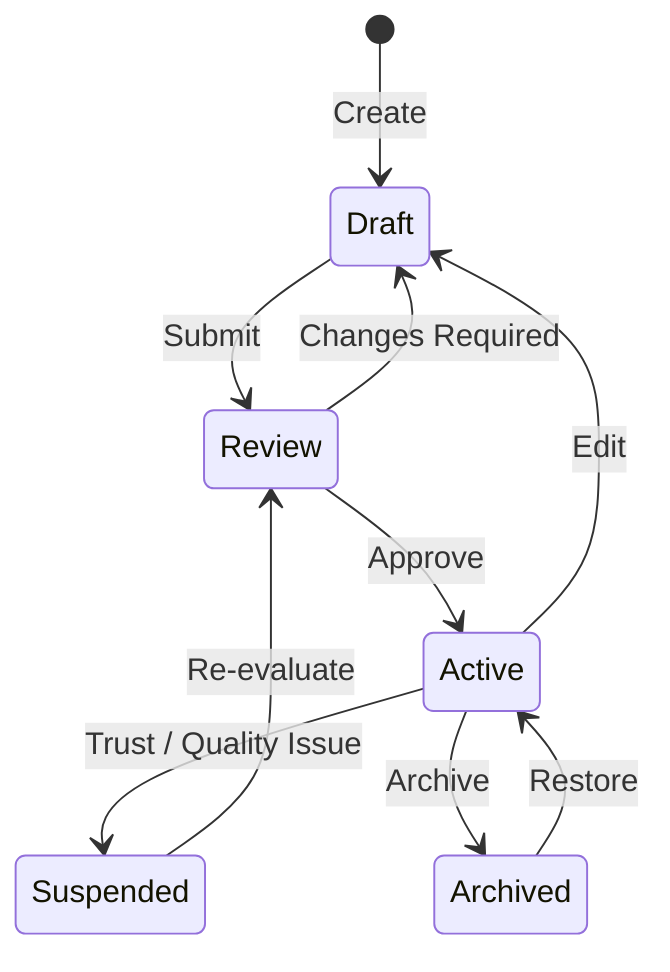
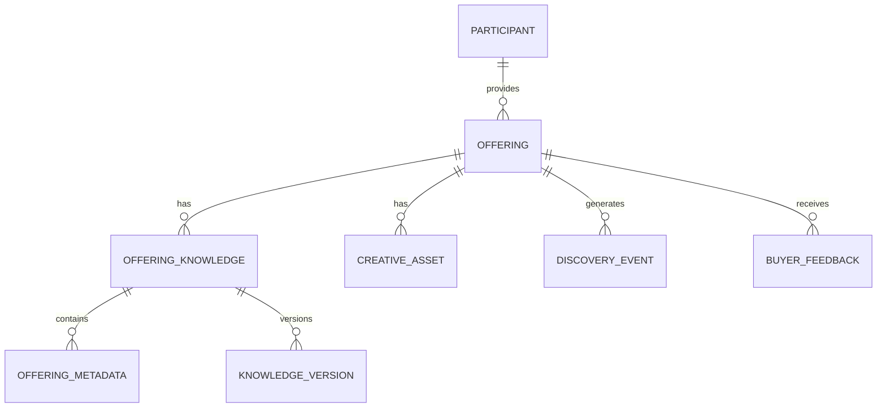

# Offering Knowledge

## Document Status

| Field                  | Value                                                                                                                 |
| ---------------------- | --------------------------------------------------------------------------------------------------------------------- |
| **Status**             | Draft                                                                                                                 |
| **Version**            | 0.3                                                                                                                   |
| **Owner**              | PinkCurve Product Team                                                                                                |
| **Last Reviewed**      | 2026-08-18                                                                                                            |
| **Related Components** | Creative Studio, Discovery Engine, Adaptive Metadata Navigation, Discovery Analytics, Learning Engine, Trust & Safety |

---

## Overview

Offering Knowledge is PinkCurve's structured understanding of an **Offering**.

It goes beyond a traditional listing by capturing not only what an offering is, but also:

* What it provides
* Who may find it useful
* What needs or interests it addresses
* What makes it different
* Where and when it is relevant
* How it can be discovered
* What visual and creative assets describe it
* How buyers interact with it
* How PinkCurve's understanding of it improves over time

Offering Knowledge provides a shared knowledge foundation for discovery, Adaptive Metadata Navigation, creative generation, analytics, learning, seller intelligence, and trust.

---

# The Offering as the Fundamental Discovery Object

An **Offering** is anything PinkCurve can present to a buyer for discovery.

Offering types may include:

* Product
* Commercial Service
* Promotion
* Event
* Community Service
* Public Service
* Brand-awareness or brand-recognition offering
* Other future discoverable items

This abstraction allows PinkCurve to use a common discovery architecture while supporting very different types of offerings.

For example:

```text
Product
    → Running shoes

Commercial Service
    → Home cleaning service

Promotion
    → Restaurant lunch discount

Event
    → Community festival

Public Service
    → Free vaccination clinic

Community Resource
    → Local food assistance program

Brand Recognition
    → Introduction to a local business
```

Not every knowledge field applies to every offering type.

The knowledge model therefore must be **extensible rather than rigid**.

---

# Why Offering Knowledge Matters

Traditional listings commonly contain:

* Name
* Description
* Price
* Basic specifications
* Images
* URL

This may be sufficient to display an item, but it is not sufficient for intelligent discovery.

PinkCurve needs to understand relationships such as:

```text
Offering
   ↓
Characteristics
   ↓
Benefits
   ↓
Needs / Interests
   ↓
Relevant Buyers
   ↓
Discovery Context
```

For example, knowing that an offering is a "running shoe" is useful.

Knowing that it is:

* lightweight
* designed for trail running
* waterproof
* suitable for long-distance runners
* available locally
* discounted this week

provides much stronger discovery knowledge.

That knowledge can help PinkCurve determine **when, where, why, and for whom the offering may matter**.

---

# Knowledge Layers

PinkCurve should distinguish between different sources and types of knowledge.

## 1. Source Knowledge

Source Knowledge contains information supplied or verified by the seller, organization, or authoritative source.

Examples include:

* Offering name
* Description
* Price
* Features
* Specifications
* Location
* Availability
* Images
* Videos
* Destination URL
* Promotion terms

Source Knowledge represents what the provider says about the offering.

---

## 2. Derived Knowledge

Derived Knowledge is generated or enriched by PinkCurve from Source Knowledge.

Examples include:

* Categories
* Metadata
* Semantic concepts
* Potential benefits
* Audience relevance
* Offering relationships
* Search terms
* Embeddings
* Visual characteristics
* Suggested discovery dimensions

AI may assist in producing Derived Knowledge.

Derived knowledge should maintain provenance so PinkCurve knows how and when it was generated.

---

## 3. Learned Knowledge

Learned Knowledge emerges from actual discovery activity.

Examples include:

* Which metadata buyers use
* Which attributes attract interest
* Which audiences respond
* Which creative representations perform well
* Which discovery contexts produce useful interactions
* Which attributes buyers reject
* Which metadata paths frequently lead to exploration

Learned Knowledge allows PinkCurve's understanding of an offering to improve over time.

Learned Knowledge should complement—not silently overwrite—verified Source Knowledge.

---

# Core Offering Information

Common core fields may include:

| Field                  | Description                                              |
| ---------------------- | -------------------------------------------------------- |
| `offering_id`          | Unique offering identifier                               |
| `offering_type`        | Product, service, promotion, event, public service, etc. |
| `offering_name`        | Display name                                             |
| `offering_description` | Description of the offering                              |
| `offering_url`         | Destination page supplied by the provider                |
| `provider_id`          | Seller or organization responsible for the offering      |
| `category`             | Primary offering category                                |
| `brand`                | Brand or organization where applicable                   |
| `price_amount`         | Numeric price where applicable                           |
| `currency_code`        | Currency where applicable                                |
| `price_description`    | Price context such as "per month"                        |
| `availability`         | Availability information                                 |
| `location`             | Geographic relevance where applicable                    |
| `valid_from`           | Beginning of time-sensitive availability                 |
| `valid_until`          | Expiration where applicable                              |

Not all fields are required for every Offering type.

For example, a public service may have no price, while an online commercial product may have no meaningful physical location.

---

# Rich Knowledge

Rich Offering Knowledge may include:

| Field                   | Description                                    |
| ----------------------- | ---------------------------------------------- |
| `key_features`          | Important characteristics                      |
| `key_benefits`          | Potential benefits                             |
| `target_audiences`      | Relevant audience descriptions                 |
| `use_cases`             | Situations in which the offering may be useful |
| `needs_addressed`       | Needs or interests the offering may address    |
| `unique_selling_points` | Important differentiators                      |
| `differentiators`       | Differences from similar offerings             |
| `brand_voice`           | Tone and communication guidelines              |
| `faqs`                  | Common questions and answers                   |
| `specifications`        | Structured specifications                      |
| `keywords`              | Search and discovery terms                     |
| `categories`            | Classification hierarchy                       |
| `metadata`              | Structured discovery dimensions                |
| `creative_assets`       | Images, videos, and related assets             |

---

# Offering Metadata

Metadata is a particularly important part of Offering Knowledge because it connects the knowledge system to **Adaptive Metadata Navigation**.

Metadata describes characteristics buyers may use to understand and refine discovery.

For example:

```text
Running Shoes
│
├── Activity
│   ├── Road Running
│   ├── Trail Running
│   └── Walking
│
├── Features
│   ├── Waterproof
│   ├── Lightweight
│   └── Cushioned
│
├── Price Range
│
├── Brand
│
├── Size
│
├── Location / Availability
│
└── Promotion
```

Metadata should not be treated merely as internal tags.

It may become part of the buyer-facing discovery interface.

---

## Adaptive Metadata

The metadata useful for discovery may change depending on:

* Offering category
* Current result set
* Buyer intent
* Location
* Available inventory
* Buyer selections
* Discovery context

For example, after a buyer selects:

```text
Shoes
    ↓
Running
    ↓
Trail Running
```

PinkCurve may determine that the most useful next metadata dimensions are:

```text
Waterproof
Terrain
Cushioning
Price
Brand
Availability Nearby
```

The metadata presented to the buyer therefore does not have to be a fixed global taxonomy.

Offering Knowledge provides the metadata foundation from which Adaptive Metadata Navigation operates.

---

# Location and Time Knowledge

Some offerings have geographic or temporal relevance.

Examples include:

* Local services
* Restaurants
* Events
* Promotions
* Community resources
* Public services
* Local inventory

Offering Knowledge may therefore include:

### Location

* Country
* Region or state
* City
* Service area
* Geographic coordinates where appropriate
* Online-only availability

### Time

* Availability periods
* Event dates
* Promotion start and expiration
* Business availability
* Seasonal relevance

Location and time can become important discovery dimensions.

---

# Creative Assets

Offering Knowledge should maintain references to the visual materials available for discovery.

These may include:

* Product images
* Seller-provided videos
* Logos
* Promotional images
* Generated creatives
* Creative variants
* Supporting media

The Creative Studio can use these assets together with structured Offering Knowledge to create discovery content.

---

# Knowledge Capture

Offering Knowledge may enter PinkCurve through several paths.

## Manual Entry

Sellers or organizations directly provide structured information.

The interface should guide participants toward useful knowledge without requiring unnecessarily complicated data entry.

---

## URL-Based Knowledge Capture

A destination URL is an important source of Offering Knowledge.

With seller permission, PinkCurve may analyze the supplied page to extract information such as:

* Offering name
* Description
* Features
* Price
* Images
* Specifications
* FAQs
* Brand information
* Other useful structured knowledge

Extracted information should be presented for review where appropriate.

---

## AI-Assisted Extraction

AI may analyze:

* Offering pages
* Uploaded documents
* Images
* Existing descriptions
* Seller-provided materials
* Structured feeds

AI can suggest knowledge rather than requiring sellers to manually enter every field.

---

## Structured Import

PinkCurve may support imports from:

* E-commerce systems
* Product feeds
* Catalogs
* APIs
* Structured files
* Organization databases

---

## Learning

Discovery interactions may enrich knowledge after an offering becomes active.

This creates a continuous knowledge cycle:

```text
Provider Knowledge
       ↓
AI Enrichment
       ↓
Offering Knowledge
       ↓
Discovery
       ↓
Buyer Interaction
       ↓
Learning
       ↓
Knowledge Enrichment
       ↺
```

---

# Knowledge Provenance

PinkCurve should know where important knowledge came from.

Knowledge may be labeled as:

* Provider supplied
* Provider verified
* AI extracted
* AI inferred
* Imported
* Learned from discovery
* Platform generated

Provenance is important because not all knowledge has the same authority.

For example:

```text
Price
Source: Seller
Verification: Seller confirmed

Category
Source: AI generated
Verification: Seller approved

Metadata: "Good for hiking"
Source: AI inferred

Metadata: "Frequently explored by trail runners"
Source: Discovery learning
```

Provenance helps PinkCurve distinguish **facts, interpretations, and learned signals**.

---

# Knowledge Verification and Trust

Offering Knowledge must not become a mechanism for spreading false or misleading claims.

Knowledge may therefore require different levels of verification.

Potential controls include:

* Seller verification
* Offering verification
* URL validation
* Automated content checks
* Duplicate detection
* Suspicious claim detection
* Prohibited content detection
* Human review when necessary

Trust status may affect whether an Offering becomes eligible for discovery.

AI-generated knowledge should not automatically be treated as verified fact.

See: [Security, Privacy, and Trust](12-security-privacy-and-trust.md)

---

# Knowledge Completeness

PinkCurve may calculate a **Knowledge Completeness Score** to identify missing information.

Example:

| Score Range | Interpretation |
| ----------- | -------------- |
| 0–25        | Minimal        |
| 26–50       | Basic          |
| 51–75       | Good           |
| 76–100      | Comprehensive  |

Possible factors include:

* Required information
* Rich knowledge coverage
* Metadata quality
* Creative asset availability
* Destination URL quality
* Location information where relevant
* Offering-type-specific fields

However, completeness does **not** mean discovery quality.

An offering with extensive information is not automatically more relevant or valuable than another offering.

The completeness score should primarily help sellers and PinkCurve identify missing knowledge.

The weighting algorithm remains an experimental product decision and should be validated using discovery outcomes.

---

# Knowledge Quality

Completeness and quality should be treated separately.

Knowledge Quality may consider:

* Accuracy
* Freshness
* Consistency
* Source reliability
* Verification status
* Metadata usefulness
* Duplicate information
* Contradictions
* Buyer feedback

An Offering could therefore have:

```text
Completeness: 95
Quality: 62
```

if it contains extensive but outdated or poorly verified information.

---

# Knowledge Lifecycle



### Draft

Knowledge is being entered, imported, or enriched.

### Review

PinkCurve or the provider is validating information before discovery.

### Active

The Offering is eligible for discovery.

### Suspended

The Offering has been temporarily removed from discovery because of trust, quality, policy, or verification concerns.

### Archived

The Offering is no longer actively presented but its historical knowledge may be retained where appropriate.

---

# Knowledge Versioning

Offering Knowledge changes over time.

Changes may result from:

* Seller edits
* Price changes
* Promotion changes
* AI enrichment
* Metadata changes
* Verification
* Learning
* Corrections

PinkCurve should preserve enough version history to understand significant changes and support auditing, rollback, analytics, and learning.

Only appropriate approved knowledge should be used for active discovery.

---

# Relationships



The logical architecture separates the Offering itself from its evolving knowledge.

This allows PinkCurve to preserve historical knowledge while maintaining a current active representation for discovery.

---

# Integration with Other Components

## Creative Studio

Offering Knowledge provides the factual and contextual foundation for creative generation.

Creative Studio may use:

* Features
* Benefits
* Audiences
* Brand voice
* Images
* Videos
* Differentiators
* Metadata
* Destination information

See: [Creative Studio](05-creative-studio.md)

---

## Discovery Engine

Offering Knowledge provides the information needed to retrieve, understand, and rank offerings.

Discovery may use:

* Semantic meaning
* Metadata
* Category
* Location
* Availability
* Audience relevance
* Learned signals
* Trust status

See: [Discovery Engine](06-discovery-engine.md)

---

## Adaptive Metadata Navigation

Offering metadata provides the dimensions buyers use to progressively refine discovery.

AMN may determine which metadata is most useful based on the currently available offerings and buyer context.

Offering Knowledge therefore acts as the primary knowledge source for Adaptive Metadata Navigation.

---

## Discovery Analytics

Analytics measures how Offering Knowledge performs during discovery.

Examples include:

* Which metadata buyers select
* Which attributes correlate with exploration
* Which offerings receive negative feedback
* Which knowledge gaps reduce discovery effectiveness

See: [Discovery Analytics](07-discovery-analytics.md)

---

## Learning Engine

The Learning Engine can enrich Offering Knowledge using discovery signals.

Examples include:

* Emerging buyer interests
* Useful metadata relationships
* Audience response patterns
* Creative effectiveness
* Negative signals
* Offering relationships

Learned information should maintain provenance and should not silently replace verified provider information.

See: [Learning Engine](08-learning-engine.md)

---

## Seller Intelligence

Seller Intelligence can use Offering Knowledge and discovery results to help sellers improve their offerings and campaigns.

Examples include:

* Missing knowledge
* Weak metadata
* Buyer interest patterns
* Creative opportunities
* Discovery opportunities
* Knowledge freshness issues

See: [Seller Intelligence](09-seller-intelligence.md)

---

# Data Model

See schema:

`../schemas/offering-knowledge.schema.json`

Primary logical entities may include:

* `offerings`
* `offering_knowledge`
* `offering_metadata`
* `knowledge_versions`
* `creative_assets`
* `knowledge_sources`

Exact physical database design is defined in the Data Architecture rather than this document.

See: [Data Architecture](11-data-architecture.md)

---

# Current Implementation Status

## Implemented

* Basic Offering Knowledge storage
* Seller relationship
* Offering relationship
* Basic CRUD operations

## In Progress

* Knowledge capture workflow
* Offering Knowledge model refinement
* Completeness scoring

## Planned

* URL-based knowledge extraction
* AI-assisted enrichment
* Metadata generation
* Adaptive metadata support
* Knowledge provenance
* Knowledge quality scoring
* Knowledge versioning
* Structured import
* Learning-based enrichment
* Trust and verification integration

---

# Open Questions

See [Open Decisions](19-open-decisions.md) for decisions including:

* Knowledge completeness weighting
* Knowledge quality measurement
* Multiple active knowledge versions
* Conflict handling between provider and AI-generated knowledge
* Metadata governance
* Learned Knowledge approval
* Knowledge retention and versioning

---

# Design Principles

Offering Knowledge should follow several long-term principles.

### Provider Knowledge Remains Authoritative

PinkCurve may enrich knowledge, but verified provider facts should not be silently changed by AI or learning systems.

### Knowledge Must Be Explainable

PinkCurve should know where significant knowledge came from.

### Metadata Is Part of the Product Experience

Metadata is not merely internal tagging. It can become a buyer-facing discovery mechanism through Adaptive Metadata Navigation.

### Learning Enriches Rather Than Rewrites

Behavioral signals can improve PinkCurve's understanding without redefining factual offering information.

### Knowledge Is Dynamic

Offering Knowledge evolves as offerings, markets, buyers, and discovery patterns change.

### Quality Matters More Than Volume

More fields do not automatically create better discovery.

### Trust Applies to Knowledge

AI-generated or seller-provided claims must be subject to appropriate quality and trust controls.

---

# Related Documents

* [Product Architecture](03-product-architecture.md)
* [Creative Studio](05-creative-studio.md)
* [Discovery Engine](06-discovery-engine.md)
* [Discovery Analytics](07-discovery-analytics.md)
* [Learning Engine](08-learning-engine.md)
* [Seller Intelligence](09-seller-intelligence.md)
* [Data Architecture](11-data-architecture.md)
* [Security, Privacy, and Trust](12-security-privacy-and-trust.md)
* [Buyer Experience](20-buyer-experience.md)
* [Open Decisions](19-open-decisions.md)
* [Offering Knowledge Flow Diagram](../diagrams/offering-knowledge-flow.md)
