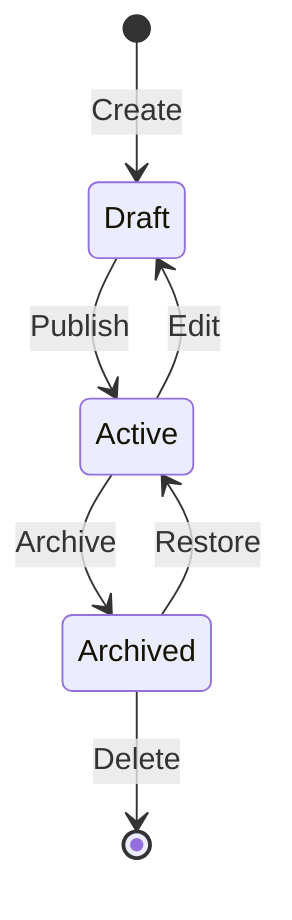
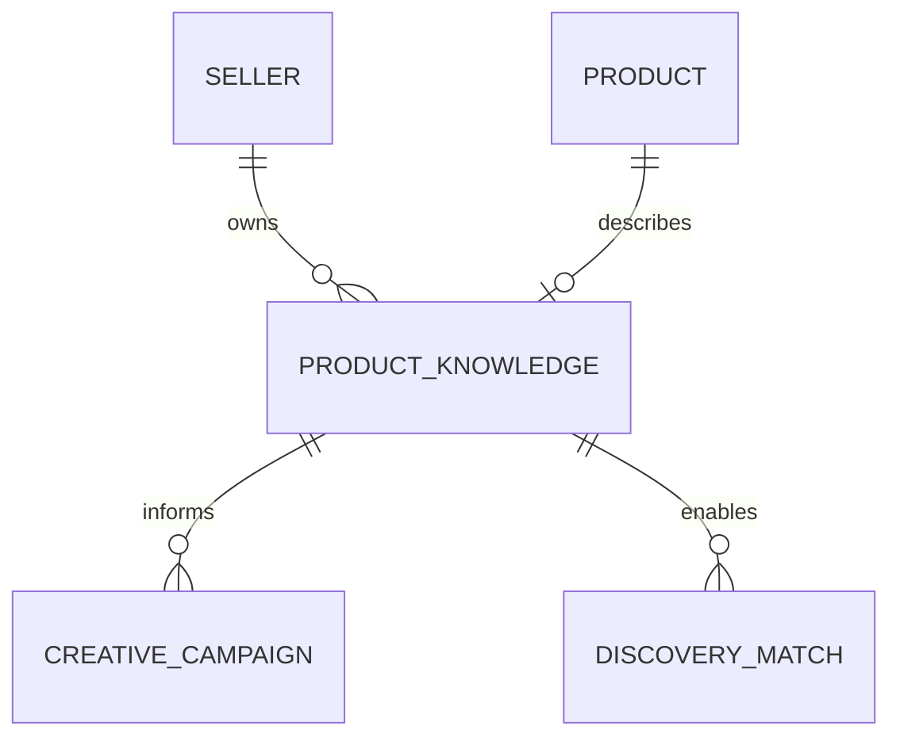

# Product Knowledge

## Document Status

| Field | Value |
|-------|-------|
| **Status** | Draft |
| **Version** | 0.1 |
| **Owner** | PinkCurve Product Team |
| **Last Reviewed** | 2026-07-23 |
| **Related Components** | Creative Studio, Discovery Engine, Learning Engine |

---

## Overview

Product Knowledge is the foundation of effective discovery. It represents rich, structured information about products that goes beyond basic listings—capturing not just what a product is, but why it matters, who it's for, and how it's different.

---

## Why Product Knowledge Matters

Traditional product listings contain:
- Name, description, price
- Basic specifications
- A few images

This is insufficient for intelligent discovery. To match buyers with products effectively, we need to understand:
- What problems the product solves
- Who the ideal buyer is
- What makes the product different
- How the product should be positioned
- What emotional triggers resonate

**Product Knowledge captures this richer understanding.**

---

## Knowledge Structure

### Core Information

| Field | Description |
|-------|-------------|
| `product_name` | Display name |
| `product_description` | Full description |
| `product_url` | Link to seller's product page |
| `price_amount` | Numeric price |
| `currency_code` | Currency (e.g., USD) |
| `price_description` | Contextual price info (e.g., "per month") |

### Rich Knowledge

| Field | Description | Type |
|-------|-------------|------|
| `key_features` | Primary product features | Array |
| `key_benefits` | Benefits to the buyer | Array |
| `target_audiences` | Ideal buyer segments | Array |
| `unique_selling_points` | Differentiators | Array |
| `differentiators` | Competitive advantages | Array |
| `brand_voice` | Tone and style guidelines | Object |
| `competitive_landscape` | Market context | Object |
| `faqs` | Common questions and answers | Array |
| `specifications` | Technical specifications | Object |
| `keywords` | Discovery keywords | Array |

### Metadata

| Field | Description |
|-------|-------------|
| `source` | How knowledge was captured (manual, ai-extracted, imported) |
| `completeness_score` | 0-100 score indicating knowledge completeness |
| `version` | Knowledge version number |
| `status` | draft, active, archived |

---

## Knowledge Capture

### Manual Entry
Sellers directly input product knowledge through structured forms. The UI guides sellers through each knowledge component.

### AI-Assisted Extraction (Planned)
AI analyzes existing product pages, descriptions, and materials to suggest knowledge components. Sellers review and approve extracted knowledge.

### Import (Planned)
Bulk import from product feeds, e-commerce platforms, or structured data sources.

---

## Completeness Scoring

Products are scored 0-100 based on knowledge completeness:

| Score Range | Level | Discovery Impact |
|-------------|-------|------------------|
| 0-25 | Minimal | Limited discovery potential |
| 26-50 | Basic | Basic matching possible |
| 51-75 | Good | Effective matching |
| 76-100 | Comprehensive | Optimal discovery |

**Scoring Factors:**
- Required fields populated
- Rich knowledge fields completed
- Description quality (length, detail)
- Feature and benefit coverage
- Audience definition clarity

*Note: Scoring algorithm is a hypothesis; weightings may change based on discovery performance data.*

---

## Knowledge Lifecycle

### States

- **Draft:** Knowledge is being captured or edited; not used for discovery
- **Active:** Knowledge is complete and used for discovery matching
- **Archived:** Knowledge is preserved but not used for active discovery

---

## Relationships

- A seller owns multiple product knowledge entities
- A product may have one active knowledge entity
- Knowledge informs creative campaigns
- Knowledge enables discovery matching

---

## Integration with Other Components

### Creative Studio
Product Knowledge is the input for creative generation:
- Briefs draw from key features, benefits, and audiences
- Scripts incorporate unique selling points and brand voice
- Storyboards reflect visual style preferences

### Discovery Engine
Product Knowledge enables matching:
- Keywords drive search relevance
- Target audiences enable segment matching
- Differentiators inform competitive positioning

### Learning Engine
Discovery signals improve knowledge:
- Which features resonate most
- Which audiences engage
- What language performs better

---

## Data Model

See schema: [product-knowledge.schema.json](../schemas/product-knowledge.schema.json)

Database table: `product_knowledge`

Key constraints:
- `seller_id` required (foreign key to sellers)
- `product_id` optional (foreign key to products, SET NULL on delete)
- `completeness_score` 0-100
- `status` IN ('draft', 'active', 'archived')

---

## Current Implementation Status

### Implemented
- Database table schema (`product_knowledge`)
- Basic CRUD operations
- Relationship with sellers and products

### In Progress
- Knowledge capture UI
- Completeness scoring algorithm

### Planned
- AI-assisted extraction
- Knowledge versioning
- Import/export capabilities

---

## Open Questions

See [Open Decisions](19-open-decisions.md) for:
- How to weight completeness scoring factors
- Whether to support multiple active knowledge versions per product
- How to handle conflicting AI-extracted vs. manual knowledge

---

## Related Documents

- [Creative Studio](05-creative-studio.md)
- [Discovery Engine](06-discovery-engine.md)
- [Data Architecture](11-data-architecture.md)
- [Product Knowledge Flow Diagram](../diagrams/product-knowledge-flow.md)
