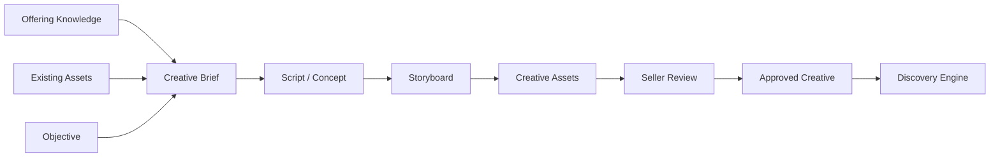
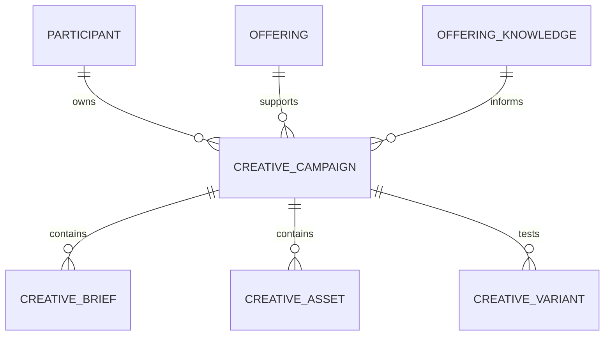
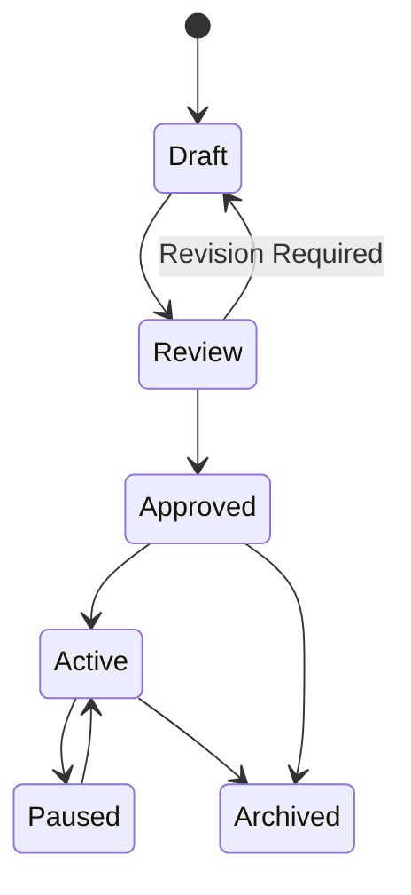

# Creative Studio

## Document Status

| Field                  | Value                                                                                                        |
| ---------------------- | ------------------------------------------------------------------------------------------------------------ |
| **Status**             | Draft                                                                                                        |
| **Version**            | 0.3                                                                                                          |
| **Owner**              | PinkCurve Product Team                                                                                       |
| **Last Reviewed**      | 2026-08-18                                                                                                   |
| **Related Components** | Offering Knowledge, Discovery Engine, Discovery Analytics, Learning Engine, AI Platform, Seller Intelligence |

---

## Overview

Creative Studio is PinkCurve's system for transforming **Offering Knowledge into visual discovery experiences**.

Its purpose is broader than generating advertisements.

Creative Studio helps sellers and organizations communicate why an offering may be:

* Relevant
* Useful
* Interesting
* Timely
* Worth exploring

Creative Studio may work with:

* Seller-provided images
* Seller-provided videos
* Existing marketing materials
* Offering URLs
* AI-generated content
* AI-assisted modifications
* PinkCurve-generated discovery creatives

The objective is to create or prepare visual content that buyers can understand quickly, particularly on mobile devices.

---

# Creative Philosophy

PinkCurve is a **visual-first discovery platform**.

Buyers should not have to read large amounts of promotional text before understanding an offering.

Creative Studio therefore follows several principles.

### Understand Quickly

Creative should communicate the main idea of an offering within a short period of attention.

### Show Rather Than Explain

Images, video, demonstrations, scenes, and concise visual information should carry much of the message.

### Remain Grounded in Offering Knowledge

Creative should accurately represent the offering and should not introduce unsupported claims.

### Preserve Authenticity

Seller-provided content may often be more authentic and informative than completely AI-generated content.

### Support Buyer Discovery

Creative should help buyers decide whether an offering deserves further exploration rather than pressure them into a transaction.

### Mobile First

Creative must work well on small screens and in visual feed environments.

### Trustworthy

Creative must not intentionally mislead buyers or disguise important limitations.

---

# Creative Studio Is Not an Ad Generator

Traditional advertising systems primarily ask:

> How can we persuade someone to click or buy?

PinkCurve asks a different question:

> How can we help someone quickly understand whether this offering may matter to them?

This distinction affects Creative Studio design.

Creative Studio may produce advertising-style material, but its primary goal is **effective discovery communication**.

A successful creative helps the buyer answer questions such as:

* What is this?
* Why might I care?
* Who is it for?
* What is different about it?
* Is it relevant to me?
* Should I explore it further?

The destination page remains the place where the buyer can investigate details and, where applicable, complete a transaction.

---

# Creative Sources

PinkCurve should not assume that every creative asset must be generated by AI.

Creative Studio may begin with several different sources.

## Seller-Provided Creative

Sellers may upload:

* Product images
* Videos
* Demonstrations
* Commercials
* Brand materials
* Logos
* Promotional images
* Existing social or web creative

If high-quality creative already exists, PinkCurve should make effective use of it rather than regenerate it unnecessarily.

---

## Offering URL

The Offering URL is an important Creative Studio input.

With appropriate permission, PinkCurve may use information available from the offering destination to understand:

* Visual identity
* Existing product imagery
* Offering characteristics
* Brand context
* Important messages
* Available media

The Offering URL connects Creative Studio with the seller's actual destination experience.

---

## Offering Knowledge

Structured Offering Knowledge provides the factual and contextual foundation for creative development.

It may include:

* Features
* Benefits
* Audiences
* Differentiators
* Use cases
* Metadata
* Brand voice
* Images
* Videos
* Location
* Availability
* Promotions
* Destination information

---

## AI-Generated Creative

AI may generate content where useful.

Examples include:

* Creative concepts
* Briefs
* Scripts
* Storyboards
* Headlines
* Captions
* Images
* Voice-over
* Visual variations
* Video segments
* Complete short-form creatives where technology and quality permit

AI generation is one capability of Creative Studio rather than the definition of Creative Studio itself.

---

# Creative Workflow

The Creative Studio workflow may vary depending on the material already available.

A seller with an excellent video may need very little generation.

A seller with only an Offering URL may need substantially more assistance.

The general workflow is:

```text
Offering Knowledge
        +
Existing Creative Assets
        +
Offering URL
        +
Campaign Objective
        ↓
Creative Understanding
        ↓
Creative Strategy
        ↓
Create / Select / Adapt
        ↓
Seller Review
        ↓
Approved Creative
        ↓
Discovery
        ↓
Performance Learning
        ↺
```

Creative Studio should therefore support both **generation** and **creative asset management**.

---

# Creative Pipeline

When new creative must be generated, PinkCurve may use a structured pipeline.



Not every campaign must pass through every stage.

For example:

```text
Existing Seller Video
        ↓
PinkCurve Review / Adaptation
        ↓
Approved Creative
        ↓
Discovery
```

This avoids unnecessary generation work and preserves useful seller-created material.

---

# 1. Creative Brief

The Creative Brief establishes what the creative is trying to communicate.

Possible inputs include:

* Offering Knowledge
* Campaign objective
* Target discovery context
* Intended audience
* Existing creative
* Brand voice
* Desired duration
* Creative format

The brief may define:

* Primary message
* Buyer relevance
* Key benefits
* Important differentiators
* Visual direction
* Tone
* Format
* Duration
* Call to explore
* Restrictions or claims that must be avoided

A seller may create the brief manually, use AI assistance, or allow PinkCurve to propose one.

---

# 2. Creative Concept and Script

For video or story-based content, Creative Studio may generate a concept or script.

A script may contain:

* Opening hook
* Scene descriptions
* Narration
* Dialogue
* Visual actions
* Product or service demonstrations
* On-screen text
* Closing message
* Destination call-to-action

Scripts should remain grounded in approved Offering Knowledge.

---

# 3. Storyboard

A storyboard converts the creative concept into a visual sequence.

It may define:

* Scenes
* Frames
* Shot composition
* Product presentation
* Text placement
* Transitions
* Timing
* Voice-over alignment
* Existing assets to reuse
* Assets that must be generated

The storyboard is particularly useful when assembling creative from multiple sources.

---

# 4. Creative Asset Production

Creative production may combine several methods.

### Seller Assets

Use existing images, videos, logos, or other media.

### AI Assistance

AI may:

* Generate images
* Generate video segments
* Create voice-over
* Create captions
* Resize or reformat content
* Suggest scenes
* Create alternate versions
* Adapt content for different audiences or discovery contexts

### External Creative Tools

Creative Studio may integrate with specialized image, video, audio, or editing systems.

PinkCurve should remain provider-independent where possible because creative-generation technologies change rapidly.

---

# 5. Review and Approval

Generated or modified creative should not automatically become active.

The normal workflow should support seller review.

```text
Draft
  ↓
Review
  ↓
Approved
  ↓
Active
```

Review may check:

* Offering accuracy
* Brand alignment
* Visual quality
* Unsupported claims
* Required disclosures
* Destination accuracy
* Trust and policy compliance

PinkCurve may also perform automated or human review for high-risk content.

---

# Creative Types

Creative Studio should support multiple forms of discovery content.

## Offering Discovery Creative

Introduces an offering and helps buyers understand its relevance.

---

## Promotion Creative

Highlights:

* Discounts
* Limited-time offers
* Special availability
* Seasonal opportunities

Promotion expiration must be represented accurately so outdated promotions are not presented as active.

---

## Brand Recognition Creative

Brand Recognition allows sellers to introduce or reinforce their brand even when the buyer is not immediately ready to purchase a specific offering.

Creative may communicate:

* Who the seller is
* What the seller provides
* What differentiates the brand
* Why the brand may be worth remembering

The seller creates and controls the brand-recognition offering or campaign.

PinkCurve provides discovery and measurement.

---

## Story Creative

Story-style content may explain an offering through:

* Use cases
* Problems and solutions
* Demonstrations
* Before-and-after contexts
* Lifestyle situations
* Customer scenarios

Stories can make discovery more understandable without requiring long descriptions.

---

## New Offering Creative

Introduces recently added offerings.

This content may be particularly useful in PinkCurve's daily discovery feed.

---

## Trending Creative

Highlights offerings experiencing meaningful discovery interest or other qualifying trend signals.

Trending status should be determined by PinkCurve's discovery systems rather than simply claimed by the seller.

---

## Community and Public-Service Creative

Future PinkCurve usage may include content for:

* Community resources
* Public services
* Local programs
* Events
* Public information

These creatives may require different messaging and trust requirements than commercial advertising.

---

# Creative Formats

Creative Studio may support:

* Static images
* Image sequences
* Short-form video
* Story cards
* Animated content
* Existing seller videos
* AI-generated video
* Mixed-media creative
* Future interactive formats

The architecture should not depend on a single media format.

---

# Duration

Short-form video may commonly use durations such as:

* 10–15 seconds for rapid discovery
* 20–30 seconds for fuller explanation
* Longer formats where the offering requires additional context

Duration should not become a rigid platform rule.

The appropriate duration depends on:

* Offering complexity
* Buyer context
* Creative format
* Discovery placement
* Performance evidence

---

# Creative Variants

One offering may have multiple creative representations.

For example:

```text
Offering
   │
   ├── Creative A — Feature Focus
   │
   ├── Creative B — Benefit Focus
   │
   ├── Creative C — Brand Story
   │
   ├── Creative D — Promotion
   │
   └── Creative E — Audience-Specific
```

Variants allow PinkCurve to learn which presentations work best in different discovery contexts.

However, optimization should not simply maximize clicks.

Creative evaluation should consider:

* Relevance
* Exploration
* Buyer feedback
* Negative feedback
* Destination engagement
* Discovery quality
* Seller value
* Trust signals

---

# Campaign Structure

Creative assets may be organized into campaigns.



A campaign may represent:

* Offering discovery
* Promotion
* Brand recognition
* New offering introduction
* Seasonal campaign
* Audience-specific discovery
* Geographic campaign

---

# Campaign Entity

Possible campaign fields include:

| Field            | Description                                        |
| ---------------- | -------------------------------------------------- |
| `campaign_id`    | Unique campaign identifier                         |
| `offering_id`    | Associated offering                                |
| `participant_id` | Seller or organization                             |
| `title`          | Campaign name                                      |
| `objective`      | Discovery purpose                                  |
| `campaign_type`  | Offering, promotion, brand, etc.                   |
| `target_context` | Intended discovery context                         |
| `start_time`     | Campaign start                                     |
| `end_time`       | Campaign end where applicable                      |
| `status`         | Draft, review, active, paused, completed, archived |

Exact physical fields belong in the Data Architecture.

---

# Creative Asset Lifecycle

Creative assets may follow a lifecycle such as:



A trust or policy issue may also suspend an active asset.

Historical versions should be preserved where needed for analytics and auditing.

---

# Grounding and Accuracy

Creative content must remain grounded in Offering Knowledge.

AI should not invent:

* Product features
* Discounts
* Testimonials
* Certifications
* Performance claims
* Availability
* Prices
* Medical or safety claims
* Seller guarantees

without appropriate source information and verification.

Creative Studio should maintain traceability between important creative claims and their knowledge sources where practical.

---

# Creative Quality

Creative quality is broader than visual polish.

Potential dimensions include:

### Accuracy

Does the creative correctly represent the offering?

### Clarity

Can the buyer quickly understand what is being shown?

### Visual Quality

Is the content suitable for PinkCurve's visual experience?

### Relevance

Does the creative communicate information that matters in its discovery context?

### Authenticity

Does it accurately reflect the seller, offering, and brand?

### Trust

Does it avoid misleading or manipulative representation?

### Mobile Suitability

Can it be understood on a small screen?

### Accessibility

Where appropriate, content should support capabilities such as captions, readable text, and other accessibility requirements.

---

# Creative Performance

Discovery Analytics should measure how creatives perform.

Possible signals include:

* Views
* Meaningful viewing time
* Exploration actions
* Click-throughs
* Metadata navigation after viewing
* Positive feedback
* Negative feedback
* Ratings or comments where applicable
* Destination visits
* Brand-recognition signals
* Repeat discovery patterns

Creative performance should be interpreted in context.

A high click-through rate alone does not prove that a creative is useful.

---

# Learning Loop

Creative Studio participates in PinkCurve's continuous learning system.

```text
Creative
   ↓
Buyer Discovery
   ↓
Interaction Signals
   ↓
Discovery Analytics
   ↓
Learning Engine
   ↓
Creative Insights
   ↓
New / Improved Creative
   ↺
```

The Learning Engine may identify patterns such as:

* Which messages resonate
* Which scenes help understanding
* Which formats work for certain offering types
* Which creative performs better with certain discovery contexts
* Which creative produces negative feedback
* Which brand messages improve recognition

These insights may be provided to sellers through Seller Intelligence.

---

# Human-in-the-Loop

AI can reduce creative effort, but PinkCurve should not assume complete automation is always desirable.

Human review may be particularly valuable for:

* New campaigns
* High-value campaigns
* Sensitive claims
* Brand-critical content
* Public-service information
* Content flagged by automated trust systems

Seller approval remains an important control over how sellers and their offerings are represented.

---

# Creative Studio and Adaptive Metadata Navigation

Creative content and metadata serve complementary purposes.

Creative answers:

> What does this offering look or feel like?

Metadata answers:

> What characteristics can I use to refine my discovery?

For example:

```text
Buyer watches trail-running shoe creative
               ↓
PinkCurve presents relevant metadata
               ↓
Waterproof | Lightweight | Terrain | Cushioning
               ↓
Buyer selects Waterproof
               ↓
Discovery becomes more focused
```

Creative Studio should therefore preserve enough linkage between visual creative and Offering Knowledge metadata to support coherent buyer navigation.

---

# Integration Points

## Offering Knowledge → Creative Studio

Offering Knowledge provides:

* Facts
* Features
* Benefits
* Metadata
* Audiences
* Brand context
* Existing media
* Destination information
* Provenance and verification

See: [Offering Knowledge](04-offering-knowledge.md)

---

## Creative Studio → Discovery Engine

Approved creative becomes part of the presentation layer used by the Discovery Engine and Buyer Experience.

The Discovery Engine may choose among available creative variants according to discovery context.

See: [Discovery Engine](06-discovery-engine.md)

---

## Discovery Analytics → Creative Studio

Analytics provides evidence about how creatives perform.

This allows Creative Studio to move from assumptions toward measured improvement.

See: [Discovery Analytics](07-discovery-analytics.md)

---

## Learning Engine → Creative Studio

The Learning Engine may identify creative patterns and recommend new variants or improvements.

Learned optimization must remain subject to accuracy, trust, and seller controls.

See: [Learning Engine](08-learning-engine.md)

---

## Seller Intelligence → Creative Studio

Seller Intelligence may recommend actions such as:

* Improve an opening scene
* Add missing product imagery
* Create a promotion variant
* Produce a shorter version
* Develop a brand-recognition creative
* Refresh an outdated campaign

See: [Seller Intelligence](09-seller-intelligence.md)

---

## AI Platform → Creative Studio

The AI Platform provides reusable capabilities such as:

* LLMs
* Image models
* Video models
* Speech models
* Embeddings
* Evaluation
* Prompt management
* Safety controls
* Model routing

Creative Studio should not depend permanently on one AI provider or model.

See: [AI Platform](10-ai-platform.md)

---

## Trust and Safety → Creative Studio

Creative assets must comply with PinkCurve's trust policies.

Trust systems may evaluate:

* Unsupported claims
* Misleading creative
* Prohibited content
* Impersonation
* Manipulated content
* Destination inconsistencies
* Fraud indicators

See: [Security, Privacy, and Trust](12-security-privacy-and-trust.md)

---

# Current Implementation

## Implemented

* Creative brief storage and API
* Creative script storage and API
* Creative storyboard storage and API
* LLM-assisted content generation
* Workspace-based organization
* Campaign container
* Campaign-to-artifact relationships
* Offering Knowledge-to-campaign relationships

---

## In Progress

* Creative Studio workflow refinement
* Offering-centered campaign architecture
* Seller review workflow
* Existing asset support

---

## Planned

* Seller image and video upload workflows
* URL-assisted creative understanding
* Creative asset library
* Multi-variant generation
* Creative performance analytics
* Learning-based creative recommendations
* Brand-recognition campaigns
* Promotion campaigns
* Feed-oriented creative formats
* Image-generation integrations
* Video-generation integrations
* Creative quality evaluation
* Trust and verification integration
* Human review workflows

---

# AI Video Generation

AI video generation is a useful potential capability, but PinkCurve should not make its product architecture dependent on it.

Video-generation technology continues to evolve in:

* Quality
* Reliability
* Cost
* Latency
* Control
* Brand consistency

PinkCurve can therefore use a hybrid strategy:

```text
Seller Video
       │
Seller Images
       │
Existing Assets
       ├──→ Creative Studio → PinkCurve Discovery
AI Images
       │
AI Video
       │
Mixed Media
```

As video-generation quality improves, PinkCurve can increase its use without changing the core architecture.

---

# Evaluation Hypotheses

Creative Studio should validate several hypotheses rather than assume them.

### Hypothesis 1

AI-assisted creative can reduce the cost and effort required for sellers to participate in PinkCurve.

### Hypothesis 2

Visual creative helps buyers understand offerings faster than traditional text-heavy listings.

### Hypothesis 3

Multiple creative variants can improve discovery when optimization considers buyer usefulness rather than clicks alone.

### Hypothesis 4

Seller-provided creative combined with AI assistance may often outperform fully generated content.

### Hypothesis 5

Creative performance learning can improve future discovery and seller outcomes.

These hypotheses should be tested through actual platform data.

---

# Design Principles

### Visual Discovery Comes First

Creative exists to make discovery easier.

### Use Existing Creative When It Works

PinkCurve should not generate content merely because AI generation is available.

### Ground Creative in Knowledge

Creative claims should originate from reliable Offering Knowledge.

### Seller Control Matters

Sellers should understand and approve how their offerings and brands are represented.

### AI Assists Rather Than Defines Creative Studio

Creative Studio must continue to work regardless of which AI generation technologies succeed.

### Learn From Performance

Creative should improve from real discovery evidence.

### Do Not Optimize for Clicks Alone

Creative quality must consider usefulness, relevance, trust, and seller value.

### Trust Is Required

Misleading creative damages the entire PinkCurve discovery ecosystem.

---

# Related Documents

* [Product Architecture](03-product-architecture.md)
* [Offering Knowledge](04-offering-knowledge.md)
* [Discovery Engine](06-discovery-engine.md)
* [Discovery Analytics](07-discovery-analytics.md)
* [Learning Engine](08-learning-engine.md)
* [Seller Intelligence](09-seller-intelligence.md)
* [AI Platform](10-ai-platform.md)
* [Security, Privacy, and Trust](12-security-privacy-and-trust.md)
* [Buyer Experience](20-buyer-experience.md)
* [Creative Studio Flow Diagram](../diagrams/creative-studio-flow.md)
* [Creative Campaign Schema](../schemas/creative-campaign.schema.json)
