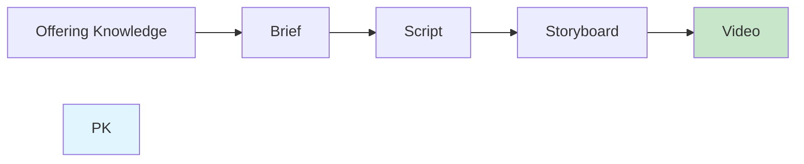
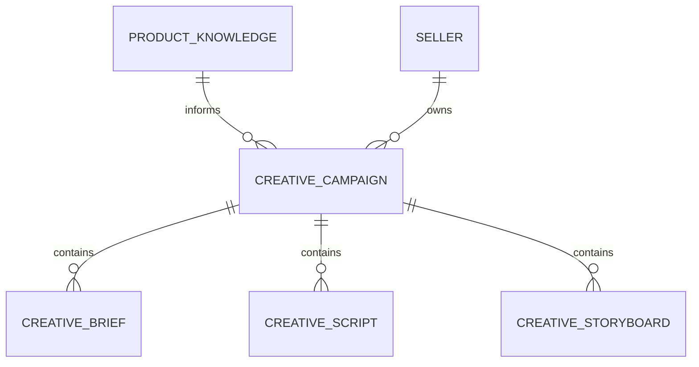
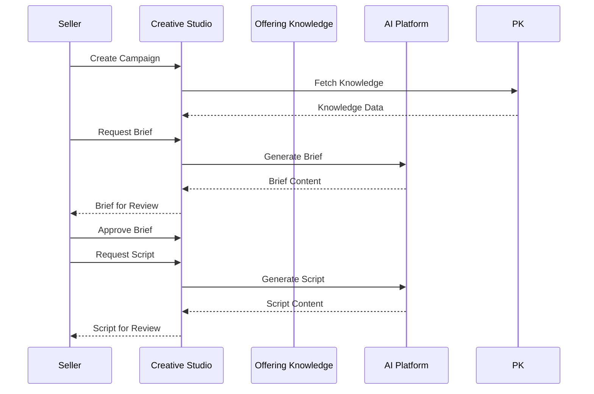

# Creative Studio

## Document Status

| Field | Value |
|-------|-------|
| **Status** | Draft |
| **Version** | 0.1 |
| **Owner** | PinkCurve Product Team |
| **Last Reviewed** | 2026-07-23 |
| **Related Components** | Offering Knowledge, Discovery Engine, AI Platform |

---

## Overview

Creative Studio is PinkCurve's AI-powered content generation system. It transforms Offering Knowledge into compelling creative assets—briefs, scripts, storyboards, and video content—that communicate product value to buyers.

---

## Purpose

### Why AI-Generated Creative?

Many sellers struggle to create compelling product content because:
- Professional video production is expensive
- Writing effective scripts requires specialized skills
- Creating consistent, on-brand content at scale is difficult
- Testing multiple creative variations is resource-intensive

Creative Studio addresses these challenges by:
- Lowering the barrier to quality content creation
- Enabling rapid iteration and testing
- Maintaining consistency with offering knowledge and brand voice
- Scaling content production without proportional cost increase

---

## Creative Pipeline

### 1. Brief Generation

**Input:** Offering Knowledge
**Output:** Creative Brief

The brief establishes:
- Campaign objectives
- Target audience focus
- Key messages to convey
- Tone and style direction
- Duration and format

### 2. Script Generation

**Input:** Creative Brief
**Output:** Video Script

The script includes:
- Spoken narration or dialogue
- Scene descriptions
- Key visual elements
- Call-to-action

### 3. Storyboard Generation

**Input:** Script
**Output:** Visual Storyboard

The storyboard defines:
- Frame-by-frame visuals
- Shot composition
- Transition descriptions
- On-screen text

### 4. Video Generation (Planned)

**Input:** Storyboard
**Output:** Video Content

AI-generated video from storyboard specifications.

*Note: Video generation is planned functionality, not currently implemented.*

---

## Campaign Structure

Creative artifacts are organized into campaigns:

### Campaign Entity

| Field | Description |
|-------|-------------|
| `title` | Campaign name |
| `description` | Campaign purpose |
| `video_duration` | Target duration (15, 30, or 60 seconds) |
| `status` | draft, active, completed, archived |
| `offering_id` | Link to Offering Knowledge |

### Artifact Entities

Each artifact (brief, script, storyboard) includes:
- Link to parent campaign
- Generated content (JSONB)
- Status tracking
- Version history (planned)

---

## Generation Parameters

### Video Duration
- **15 seconds:** Quick hook, single message
- **30 seconds:** Standard format, multiple points
- **60 seconds:** Extended storytelling

### Tone Variations
- Professional
- Casual
- Energetic
- Sophisticated
- (Additional tones can be derived from brand voice)

### Audience Focus
Different creative for different target segments based on Offering Knowledge audience definitions.

---

## Current Implementation

### Implemented
- Creative briefs table and API
- Creative scripts table and API
- Creative storyboards table and API
- LLM integration for content generation
- Workspace-based organization

### Recently Added (Stage 1B)
- Campaign container entity
- Campaign-to-artifact relationships
- Knowledge-to-campaign linking

### Planned
- Multi-variant generation (A/B creative)
- Video generation integration
- Performance-based creative optimization
- Template library

---

## Generation Quality

### Approach
Creative generation uses Offering Knowledge to ensure:
- Accurate product information
- Consistent brand voice
- Relevant audience targeting
- Compelling value propositions

### Hypothesis
*AI-generated creative can perform comparably to professionally-produced content for product discovery purposes.*

This hypothesis needs validation through:
- A/B testing AI vs. professional creative
- Buyer engagement metrics comparison
- Qualitative feedback analysis

### Current Limitations
- Generated content requires human review
- Complex products may need manual refinement
- Brand voice matching is approximate

---

## Integration Points

### Offering Knowledge → Creative Studio
- Features and benefits inform messaging
- Brand voice guides tone
- Target audiences shape focus
- USPs drive differentiation

### Creative Studio → Discovery Engine
- Generated content surfaces in discovery
- Creative performance feeds learning

### Creative Studio → AI Platform
- Uses shared LLM infrastructure
- Follows prompt engineering standards
- Contributes to model evaluation

---

## Workflow

---

## Related Documents

- [Offering Knowledge](04-product-knowledge.md)
- [AI Platform](10-ai-platform.md)
- [Creative Studio Flow Diagram](../diagrams/creative-studio-flow.md)
- [Creative Campaign Schema](../schemas/creative-campaign.schema.json)
