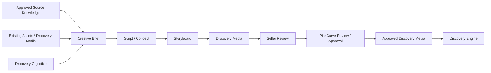
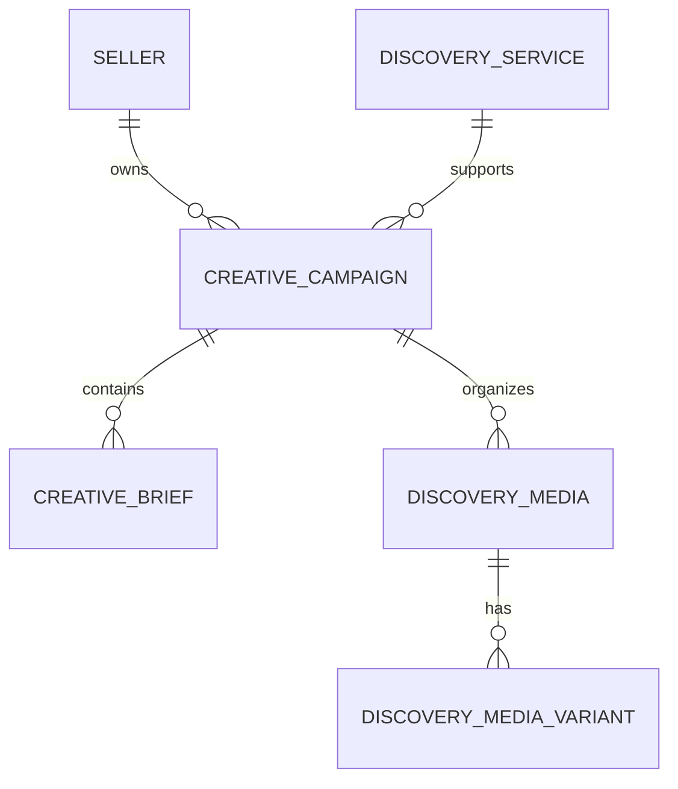

# Creative Studio

## Document Status

| Field                  | Value                                                                                        |
| ---------------------- | -------------------------------------------------------------------------------------------- |
| **Status**             | Draft                                                                                        |
| **Version**            | 0.3                                                                                          |
| **Owner**              | PinkCurve Product Team                                                                       |
| **Last Reviewed**      | 2026-10-03                                                                                   |
| **Related Components** | Offering Knowledge, Discovery Engine, Discovery Analytics, Learning Engine, AI Platform,     |
|                        | Seller Intelligence                                                                          |

---

## Overview

Creative Studio helps Sellers create, enhance, adapt, and prepare Discovery Media for PinkCurve Discovery. Discovery Media may also be created or provided directly by Sellers without being generated by Creative Studio.

Its purpose is broader than generating advertisements.

Creative Studio helps Sellers communicate why a Discovery service or its subject matter may be:

* Relevant
* Useful
* Interesting
* Timely
* Worth exploring

Creative Studio may work with:

* Seller-provided images
* Seller-provided videos
* Existing marketing materials
* Destination URLs
* AI-generated content
* AI-assisted modifications
* PinkCurve-created or assisted Discovery Media

The objective is to help create, enhance, adapt, or prepare Discovery Media that Buyers can understand quickly, particularly on mobile devices.

---

# Creative Philosophy

PinkCurve is a **visual-first discovery platform**.

Buyers should not have to read large amounts of promotional text before understanding a Discovery service or its subject matter.

Creative Studio therefore follows several principles.

### Understand Quickly

Discovery Media should communicate the main idea of the Discovery service or its subject matter within a short period of attention.

### Show Rather Than Explain

Images, video, demonstrations, scenes, and concise visual information should carry much of the message.

### Remain Grounded in Approved Source Knowledge

Discovery Media should accurately represent the Discovery service and its underlying subject matter and should not introduce unsupported claims.

### Preserve Authenticity

Seller-provided content may often be more authentic and informative than completely AI-generated content.

### Separate Truth From Presentation

Creative Studio may improve how a Discovery service and its subject matter are presented, but it should not invent their factual reality.

For factual characteristics of the Discovery service and its underlying subject matter, especially where visual appearance matters, the Seller or another authorized source should supply the underlying truth. PinkCurve may then organize, enhance, format, or present that truth effectively for Discovery.

This principle is especially important for Real-Time Discovery, where a
Seller may provide a current photo and a few factual details while
PinkCurve rapidly creates a useful visual presentation around them.

> **Seller supplies truth → PinkCurve supplies presentation.**

### Support Buyer Discovery

Discovery Media should help Buyers decide whether the Discovery service or its subject matter deserves further exploration rather than pressure them into an action or transaction.

### Mobile First

Discovery Media must work well on small screens and in visual feed environments.

### Trustworthy

Discovery Media must not intentionally mislead Buyers or disguise important limitations.

---

# Creative Studio Is Not an Ad Generator

Traditional advertising systems primarily ask:

> How can we persuade someone to click or buy?

PinkCurve asks a different question:

> How can we help someone quickly understand whether this discovery may matter to them?

This distinction affects Creative Studio design.

Creative Studio may help create or prepare advertising-style Discovery Media, but its primary goal is effective Discovery communication.

Effective Discovery Media helps the Buyer quickly answer questions such as:

* What is this?
* Why might I care?
* Who is it for?
* What is different about it?
* Is it relevant to me?
* Should I explore it further?

The destination page remains the place where the buyer can investigate details and, where applicable, complete a transaction.

---

# Creative Sources

PinkCurve should not assume that Discovery Media must be generated by Creative Studio or by AI.

Creative Studio may work with Seller-provided Discovery Media, source material, and other approved inputs.

## Seller-Provided Discovery Media and Creative Assets

Sellers may provide existing Discovery Media and creative assets such as:

* Product images
* Videos
* Demonstrations
* Commercials
* Brand materials
* Logos
* Promotional images
* Existing social or web creative

If suitable Seller-provided Discovery Media already exists, PinkCurve should make effective use of it rather than regenerate or substantially modify it unnecessarily.

---

## Destination URL

The destination URL, where applicable, is an important Creative Studio input.
With appropriate permission, PinkCurve may use information available from the destination to understand:
- Visual identity
- Existing imagery
- Relevant characteristics
- Brand context
- Important messages
- Available media

The destination URL connects Creative Studio with the Seller's actual destination experience where an external destination exists.

---

## Approved Source Knowledge

Approved source knowledge provides the factual and contextual foundation for creative development.

It may include:

* Features or characteristics
* Benefits
* Audiences
* Differentiators
* Use cases
* Metadata
* Brand voice
* Images
* Videos
* Location
* Availability
* Promotions
* Destination information

Approved source knowledge and Discovery Media serve different purposes. Approved source knowledge provides the factual and contextual basis for representation, while Discovery Media is the visual or other media used to communicate the Discovery service to Buyers. Creative Studio may use approved source knowledge to create, enhance, adapt, or validate Discovery Media.

---

## AI-Assisted and AI-Generated Discovery Media

Creative Studio may use AI to assist in creating, enhancing, adapting, or preparing Discovery Media where useful.

Examples include:

* Creative concepts
* Briefs
* Scripts
* Storyboards
* Headlines
* Captions
* Images
* Voice-over
* Visual variations
* Video segments
* Complete short-form Discovery Media where technology, quality, and applicable policy permit

AI generation is one capability available to Creative Studio. Discovery Media may originate from Sellers, existing authorized sources, Creative Studio, AI-assisted processes, or combinations of these sources.

---

## Rapid Real-Time Discovery Media

Real-Time Discovery may require a much simpler creative path than longer-lived Discovery services or campaigns.

A Seller may provide only:

* A current photo or other authorized factual media
* A short description
* Price or discount where applicable
* Current availability or quantity where applicable
* Location
* Expiration or availability period

Creative Studio may use this information to rapidly create, enhance, or prepare simple Discovery Media such as a poster, card, image, or other feed-oriented presentation.

If no factual photo is available, PinkCurve may create a
typography-based or graphic presentation, but it should not generate an
image that falsely appears to depict the actual subject of the Real-Time Discovery.

Real-Time Discovery Media should prioritize:

* Speed
* Factual accuracy
* Clarity
* Local relevance where applicable
* Freshness
* Low generation cost

Rich scripts, storyboards, video generation, and multiple creative variants should not be required when they would add unnecessary delay or cost to short-lived Real-Time Discovery.

> **The richness of Discovery Media should be proportional to the lifetime and purpose of the Discovery service.**

---

# Creative Workflow

The Creative Studio workflow may vary depending on the material already available.

A Seller with suitable existing Discovery Media may need very little Creative Studio assistance.

A Seller with only limited source material or a Destination URL may need substantially more Creative Studio assistance.

The general workflow is:

```text
Create / Select / Adapt
        ↓
Seller Review
        ↓
Discovery Media
        ↓
Review / Approval
        ↓
Approved Discovery Media
        ↓
Discovery
```

Creative Studio should therefore support creating, selecting, enhancing, adapting, and preparing Discovery Media, together with applicable creative asset management.

The depth of this workflow should depend on the Discovery service's purpose, lifetime, available source material, existing Discovery Media, and presentation requirements.

Long-lived Discovery services may justify a richer workflow involving creative strategy, scripts, storyboards, multiple assets, and Discovery Media variants.

Time-sensitive Discovery services, especially Real-Time Discovery, may use a rapid path in which current factual information, Seller-provided Discovery Media, and applicable approved source knowledge are transformed or adapted into a simple visual presentation for review and publication.

The rapid path should not bypass required accuracy, trust, review, approval, or Seller-control requirements merely because the Discovery service is time-sensitive.

---

# Creative Pipeline

When Discovery Media must be created or materially adapted, Creative Studio may use a structured pipeline.


```mermaid
flowchart LR
    SK[Approved Source Knowledge] --> CB[Creative Brief]
    CA[Existing Assets / Discovery Media] --> CB
    OBJ[Discovery Objective] --> CB

    CB --> SC[Script / Concept]
    SC --> SB[Storyboard]
    SB --> DM[Discovery Media]
    DM --> SR[Seller Review]
    SR --> PR[PinkCurve Review / Approval]
    PR --> ADM[Approved Discovery Media]
    ADM --> DE[Discovery Engine]
```

Not every Discovery Media item or Creative Campaign must pass through every Creative Studio production stage.

For example:

```text
Existing Seller Video
        ↓
PinkCurve Review / Adaptation
        ↓
Discovery Media
        ↓
Seller Review, where applicable
        ↓
PinkCurve Review / Approval
        ↓
Approved Discovery Media
        ↓
Discovery
```

This avoids unnecessary generation work and preserves useful seller-created material.

---

# 1. Creative Brief

The Creative Brief establishes what the intended Discovery Media should communicate and provides direction for applicable Creative Studio work.

Possible inputs include:

* Approved Source Knowledge  
* Discovery objective
* Target discovery context
* Intended audience
* Existing Discovery Media and creative assets
* Brand voice
* Desired duration
* Creative format

The brief may define:

* Primary message
* Buyer relevance
* Key benefits
* Important differentiators
* Visual direction
* Tone
* Format
* Duration
* Call to explore
* Restrictions or claims that must be avoided

A Seller may create the brief manually, use AI assistance, or allow PinkCurve to propose one.

---

# 2. Creative Concept and Script

For video, story-based, or other applicable Discovery Media, Creative Studio may generate a concept or script.

A script may contain:

* Opening hook
* Scene descriptions
* Narration
* Dialogue
* Visual actions
* Discovery service or subject demonstrations
* On-screen text
* Closing message
* Destination call-to-action

Scripts should remain grounded in approved source knowledge applicable to the Discovery service.

---

# 3. Storyboard

A storyboard converts the creative concept into a planned visual sequence for applicable Discovery Media.

It may define:

* Scenes
* Frames
* Shot composition
* Discovery service or subject presentation
* Text placement
* Transitions
* Timing
* Voice-over alignment
* Existing assets to reuse
* Assets that must be generated

The storyboard is particularly useful when assembling Discovery Media from multiple creative assets or sources.

---

# 4. Creative Asset Production

Creative production may combine several methods.

Creative assets are production components that may be used individually or combined to create, enhance, adapt, or prepare Discovery Media.

### Seller Assets

Use existing images, videos, logos, or other media.

### AI Assistance

AI may:

* Generate images
* Generate video segments
* Create voice-over
* Create captions
* Resize or reformat content
* Suggest scenes
* Create alternate versions
* Adapt content for different audiences or discovery contexts

### External Creative Tools

Creative Studio may integrate with specialized image, video, audio, or editing systems.

PinkCurve should remain provider-independent where possible because creative-generation technologies change rapidly.

---

# 5. Review and Approval

New or materially modified Discovery Media should not automatically become eligible for use in Discovery.

The normal workflow should support Seller review before applicable PinkCurve review and approval.

```text
Draft Discovery Media
↓
Seller Review
↓
PinkCurve Review / Approval
↓
Approved Discovery Media
↓
Available for Use When the Associated Discovery Service Is Eligible
```
Discovery Media approval does not by itself authorize the associated Discovery service for active Discovery. The associated Discovery service must independently satisfy its applicable approval, trust, validity, freshness, and Discovery-readiness requirements.

Review may check:

* Discovery service and subject-matter accuracy
* Brand alignment
* Visual quality
* Unsupported claims
* Required disclosures
* Destination accuracy
* Trust and policy compliance

PinkCurve may perform automated or human review of Discovery Media according to applicable risk and approval policies.

Discovery Media review should be risk-based.

New Sellers, first submissions of a Discovery service, materially changed Discovery Media, sensitive claims, suspicious content, or other higher-risk cases may require human review in addition to automated checks.

For trusted Sellers with a strong history, PinkCurve may eventually
allow automated approval of defined low-risk Discovery Media changes when
applicable policy permits, while retaining monitoring and audit
evidence.

For rapid Real-Time Discovery Media, automated checks may evaluate factors such as factual consistency, required information, image and text consistency, destination integrity, prohibited content, and other risk signals before determining whether human review is required.

High AI confidence should not bypass human review where PinkCurve
policy requires human approval.

---

# Creative Studio Purpose and Presentation

Creative Studio does not define PinkCurve's Discovery service taxonomy. A Discovery service determines what is being submitted for Discovery, while Creative Studio determines how that service may be visually communicated.

Creative Studio should therefore distinguish among the underlying Discovery service, the purpose or presentation of the Discovery Media, and the media format used to present it.

## Offering Discovery Presentation

Creative Studio may prepare Discovery Media for Offering Discovery that introduces an Offering and helps Buyers quickly understand its relevance.

---

## Promotion Presentation

Creative Studio may create, enhance, or adapt Discovery Media using a promotion-oriented presentation when the underlying Discovery service includes promotional information such as

* Discounts
* Limited-time offers
* Special availability
* Seasonal opportunities

Promotion expiration must be represented accurately so outdated promotions are not presented as active.

---

## Real-Time Discovery Presentation

Creative Studio supports Real-Time Discovery by creating, enhancing, adapting, or preparing Discovery Media that helps Buyers quickly understand time-sensitive Discovery while it is still relevant and available.

Examples may include:

* Limited-time availability
* Same-day or short-lived specials
* Time-sensitive local opportunities
* Limited quantity or capacity
* Time-sensitive Discovery subjects approaching a defined expiration

Discovery Media used for Real-Time Discovery should emphasize the information necessary for a Buyer to understand the opportunity quickly, including applicable location, price or discount, availability, quantity or capacity, and expiration.

Creative Studio should not continue presenting Real-Time Discovery as current when the underlying Real-Time Discovery service is no longer eligible for active Discovery.
The presentation therefore depends on current approved source knowledge and Discovery readiness rather than on the creative asset alone.

---

## Brand Recognition Presentation

Creative Studio may use a Brand Recognition presentation to help a Seller introduce or reinforce its brand even when the Buyer is not immediately exploring a specific Discovery service or subject matter.

Discovery Media used for Brand Recognition may communicate:

* Who the seller is
* What the seller provides
* What differentiates the brand
* Why the brand may be worth remembering

The Seller controls how its brand is represented, subject to applicable PinkCurve trust, approval, and Discovery requirements.

PinkCurve provides Discovery and measurement.

---

## Story Presentation

Creative Studio may create, enhance, or adapt Discovery Media using a story-oriented presentation to help Buyers understand a Discovery service or its subject matter through:
- Use cases
- Problems and solutions
- Demonstrations
- Before-and-after contexts
- Lifestyle situations
- Customer scenarios

Story presentations can make Discovery more understandable without requiring long descriptions.

---

## New Offering Presentation

Creative Studio may create, enhance, or adapt Discovery Media using a New Offering presentation to introduce an Offering that has recently become available for Discovery.
“New” is a Discovery context or presentation purpose rather than a separate Discovery service classification.
New Offering presentations may be particularly useful in PinkCurve's daily Discovery feed.

---

## Trending Presentation

Creative Studio may create, enhance, or adapt Discovery Media using a Trending presentation when PinkCurve has determined that a Discovery service or its subject matter is experiencing meaningful Discovery interest or other qualifying trend signals.
“Trending” is a PinkCurve-determined Discovery context rather than a Seller-defined Discovery service classification.
Trending status must be determined by PinkCurve's Discovery systems and should not be created or claimed by the Seller.

---

## Community Service and Public Announcement Presentation

Creative Studio may create, enhance, adapt, or prepare Discovery Media for Community Service and Public Announcement Discovery services.
This Discovery Media may communicate information such as:

* Community resources
* Public services
* Local programs
* Events
* Public information

The Discovery Media should reflect the purpose and requirements of the underlying Discovery service rather than treating Community Service or Public Announcement as a Creative Studio classification.

---

# Discovery Media Formats

Discovery Media may use formats such as:

* Static images
* Posters
* Feed cards
* Image sequences
* Short-form video
* Story cards
* Animated content
* Existing Seller videos
* AI-generated video
* Mixed-media Discovery Media
* Future interactive formats

PinkCurve's Discovery Media architecture should not depend on a single media format. Creative Studio should be able to work with applicable formats as they evolve.

---

# Duration

Short-form video may commonly use durations such as:

* 10–15 seconds for rapid discovery
* 20–30 seconds for fuller explanation
* Longer formats where the Discovery service or its subject matter requires additional context

Duration should not become a rigid platform rule.

The appropriate duration depends on:

* Complexity of the Discovery service or its subject matter
* Buyer context
* Creative format
* Discovery placement
* Performance evidence

---

# Discovery Media Variants

A Discovery service may have multiple Discovery Media variants for different presentation purposes, audiences, or Discovery contexts. These variants may be Seller-provided or created, enhanced, or adapted through Creative Studio.

For example:

```text
Discovery Service
   │
   ├── Discovery Media Variant A — Feature / Characteristic Focus
   │
   ├── Discovery Media Variant B — Benefit Focus
   │
   ├── Discovery Media Variant C — Story Presentation
   │
   ├── Discovery Media Variant D — Promotion Presentation
   │
   └── Discovery Media Variant E — Audience-Specific Presentation
```

Discovery Media variants allow PinkCurve to learn which presentations work best in different Discovery contexts.

However, optimization should not simply maximize clicks.

Creative evaluation should consider:

* Relevance
* Exploration
* Buyer feedback
* Negative feedback
* Destination engagement
* Discovery quality
* Seller value
* Trust signals

---

# Campaign Structure

Discovery Media and related Creative Studio work may be organized into Creative Campaigns where useful. A Creative Campaign is optional and is not required for every Discovery service or Discovery Media item.


```mermaid
erDiagram
    SELLER ||--o{ CREATIVE_CAMPAIGN : owns
    DISCOVERY_SERVICE ||--o{ CREATIVE_CAMPAIGN : supports
    CREATIVE_CAMPAIGN ||--o{ CREATIVE_BRIEF : contains
    CREATIVE_CAMPAIGN ||--o{ DISCOVERY_MEDIA : organizes
    DISCOVERY_MEDIA ||--o{ DISCOVERY_MEDIA_VARIANT : has
```

A Creative Campaign may organize Discovery Media around purposes or Discovery contexts such as:

* Offering discovery
* Promotion
* Brand recognition
* New offering introduction
* Seasonal campaign
* Audience-specific discovery
* Geographic campaign

Discovery Media may exist independently of a Creative Campaign and may be Seller-provided or created, enhanced, or adapted through Creative Studio. The knowledge used to create or validate the campaign is determined by the underlying Discovery service and is not modeled as a universal Offering Knowledge relationship.

---

# Campaign Entity

| Field | Description |
|---|---|
| `campaign_id` | Unique Creative Campaign identifier |
| `seller_id` | Seller that owns the Creative Campaign |
| `discovery_service_id` | Associated Discovery service |
| `title` | Campaign name |
| `objective` | Creative Studio purpose |
| `target_context` | Intended Discovery context |
| `start_time` | Campaign start |
| `end_time` | Campaign end where applicable |
| `status` | Draft, review, active, paused, completed, archived |

A Creative Campaign is owned by a Seller and is associated with an applicable Discovery service. Organization ownership is derived through the Seller relationship and should not be redundantly stored on the Creative Campaign.

A Creative Campaign may organize multiple Discovery Media items and Discovery Media variants. Discovery Media does not require a Creative Campaign and may exist independently when submitted directly by a Seller or otherwise prepared for an applicable Discovery service.

Creative Campaign fields organize Creative Studio activity and should not redefine the classification of the underlying Discovery service.

Exact physical fields belong in the Data Architecture.

---

# Discovery Media Lifecycle

Discovery Media may follow a lifecycle such as:


```mermaid
stateDiagram-v2
    [*] --> Submitted
    Submitted --> Review
    Review --> Approved
    Review --> RevisionRequired
    RevisionRequired --> Submitted

    Approved --> InUse: Selected for Discovery
    InUse --> Paused
    Paused --> InUse

    InUse --> Archived
    Approved --> Archived
```

Discovery Media may originate from the Seller, Creative Studio, or other authorized sources. Its PinkCurve lifecycle should therefore be independent of how the Discovery Media was created. Seller review may occur before submission when Creative Studio creates or materially modifies Discovery Media on the Seller's behalf.

A trust, policy, accuracy, or provenance issue may suspend or prevent the use of Approved Discovery Media.

Approved Discovery Media may be stored without being in use. Use of the Discovery Media depends on the associated Discovery service remaining eligible for active Discovery and on the Discovery Media continuing to satisfy applicable PinkCurve requirements.

Historical versions should be preserved where needed for analytics and auditing.

---

# Grounding and Accuracy

Discovery Media must remain grounded in applicable Approved Source Knowledge.

AI should not invent:

* Product features
* Discounts
* Testimonials
* Certifications
* Performance claims
* Availability
* Prices
* Medical or safety claims
* Seller guarantees

without appropriate source information and verification.

PinkCurve should maintain traceability between important claims or representations in Discovery Media and their approved knowledge sources where practical.

Visual representations in Discovery Media should follow the same grounding requirements as textual claims.

When the actual appearance of the subject being represented is material to Buyer understanding, Creative Studio should distinguish Seller-provided or otherwise authorized factual imagery from AI-generated presentation imagery.

AI-generated imagery should not be presented in a way that falsely implies that it is factual imagery of the actual product, food, place, service result, event, community resource, public information, or other subject being represented in Discovery Media.

The same grounding and provenance requirements should apply regardless of whether Discovery Media is Seller-provided, Creative Studio-assisted, or AI-generated.

PinkCurve should preserve sufficient Discovery Media provenance to support this distinction and downstream trust, review, and auditing.

---

# Creative Quality

Creative quality is broader than visual polish.

Potential dimensions include:

### Accuracy

Does the Discovery Media accurately represent applicable facts, claims, conditions, and Approved Source Knowledge?

### Freshness

For time-sensitive Discovery services, does the Discovery Media still represent current Approved Source Knowledge, including applicable availability, price, quantity or capacity, validity period, and expiration?

### Clarity

Can the buyer quickly understand what is being shown?

### Visual Quality

Is the content suitable for PinkCurve's visual experience?

### Relevance

Does the Discovery Media communicate information that matters in its Discovery context?

### Authenticity

Does the Discovery Media accurately reflect the Seller, the applicable Discovery service and its subject matter, and the brand where relevant?

### Trust

Does it avoid misleading or manipulative representation?

### Mobile Suitability

Can it be understood on a small screen?

### Accessibility

Where appropriate, content should support capabilities such as captions, readable text, and other accessibility requirements.

---

# Creative Performance

Discovery Analytics should measure how Discovery Media performs in different Discovery contexts.

Possible signals include:

* Views
* Meaningful viewing time
* Exploration actions
* Click-throughs
* Metadata navigation after viewing
* Positive feedback
* Negative feedback
* Ratings or comments where applicable
* Destination visits
* Brand-recognition signals
* Repeat discovery patterns

Discovery Media performance should be interpreted in context.

A high click-through rate alone does not prove that Discovery Media is useful or that it produced valuable Discovery.

---

# Learning Loop

Creative Studio participates in PinkCurve's continuous learning system.

```text
Discovery Media
   ↓
Buyer Discovery
   ↓
Interaction Signals
   ↓
Discovery Analytics
   ↓
Learning Engine
   ↓
Learned Creative Signals / Models
   ↓
Creative Studio
   ↓
New / Improved Discovery Media
   ↺
```

The Learning Engine may produce learned signals or models that help Creative Studio identify patterns such as:

* Which messages resonate
* Which scenes help understanding
* Which formats work for certain Discovery services, subject types, or Discovery contexts
* Which Discovery Media or presentation characteristics perform better in certain Discovery contexts
* Which Discovery Media or presentation characteristics produce negative feedback
* Which brand messages improve recognition

These insights may be provided to sellers through Seller Intelligence.

---

# Human-in-the-Loop

AI and automation can reduce the effort required to create, prepare, and review Discovery Media, but PinkCurve should not assume complete automation is always appropriate.

Human review of Discovery Media may be particularly valuable for:

* New Sellers or first-time Discovery Media submissions
* Higher-risk or high-value Discovery contexts
* Sensitive claims
* Brand-critical representations
* Public-service or public-announcement information
* Discovery Media flagged by automated trust systems

Seller review remains an important control over how the Seller, its Discovery services, and their subject matter are represented. Seller review does not replace any PinkCurve review or approval required by applicable trust, safety, or Discovery policies.

The authority, responsibilities, and criteria for PinkCurve approval of Discovery Media should be defined by the applicable Discovery Media approval model rather than by Creative Studio itself.

---

# Creative Studio and Adaptive Metadata Navigation

Discovery Media and Offering Knowledge metadata serve complementary purposes in Offering Discovery.

Discovery Media helps answer:
What does this Offering look or feel like?

Metadata answers:

> What characteristics can I use to refine my discovery?

For example:

```text
Buyer views trail-running shoe Discovery Media
               ↓
PinkCurve presents relevant metadata
               ↓
Waterproof | Lightweight | Terrain | Cushioning
               ↓
Buyer selects Waterproof
               ↓
Discovery becomes more focused
```
For Offering Discovery, PinkCurve should preserve sufficient linkage between Discovery Media and applicable Offering Knowledge metadata to support coherent Buyer navigation through Adaptive Metadata Navigation.

---

# Integration Points

## Offering Knowledge → Creative Studio

For Offering Discovery, Offering Knowledge is a primary approved knowledge source for Creative Studio.

Offering Knowledge provides:

* Facts
* Features
* Benefits
* Metadata
* Audiences
* Brand context
* Existing media
* Destination information
* Provenance and verification
* Availability and quantity or capacity where applicable
* Validity and expiration information
* Freshness information
* Discovery-readiness status where applicable

For time-sensitive Offerings, Creative Studio should use current Offering Knowledge when creating, enhancing, or adapting Discovery Media rather than relying only on information that was accurate when the Discovery Media was originally produced.

Changes in availability, validity, expiration, or other Discovery-readiness conditions may require associated Discovery Media to be updated, paused, or no longer presented as current.

Other Discovery services may provide Creative Studio with their own applicable approved source knowledge rather than Offering Knowledge.

See: [Offering Knowledge](04-offering-knowledge.md)

---

## Discovery Media → Discovery Engine

Approved Discovery Media becomes part of the presentation layer used by the Discovery Engine and Buyer Experience.
The Discovery Engine may choose among available Approved Discovery Media and applicable Discovery Media variants according to Discovery context.
Discovery Media approval and Discovery service readiness are separate conditions.
Approved Discovery Media may remain stored and reusable even when its associated Discovery service is temporarily or permanently ineligible for active Discovery.
The Discovery Engine should present Approved Discovery Media only when the associated Discovery service satisfies applicable Discovery-readiness conditions, including current validity, availability, freshness, trust, and other applicable requirements.

See: [Discovery Engine](06-discovery-engine.md)

---

## Discovery Analytics → Creative Studio

Discovery Analytics provides evidence about how Discovery Media performs across different Discovery contexts.

Creative Studio may use these performance signals to evaluate, enhance, adapt, or develop Discovery Media and Discovery Media variants.

This allows Creative Studio to move from assumptions toward measured improvement.

See: [Discovery Analytics](07-discovery-analytics.md)

---

## Learning Engine → Creative Studio

Learning Engine may provide learned creative signals or models that Creative Studio can use to evaluate, enhance, adapt, or develop Discovery Media and Discovery Media variants.

Creative Studio remains responsible for deciding how learned signals or models are applied to Discovery Media production and adaptation, subject to applicable Seller controls and PinkCurve trust, safety, and approval requirements.

See: [Learning Engine](08-learning-engine.md)

---

## Seller Intelligence → Creative Studio

Seller Intelligence may surface Discovery Media insights, opportunities, and recommendations to Sellers based on Discovery performance evidence and other applicable Seller signals.

* Improve an opening scene or presentation
* Add missing or more useful subject imagery
* Create a promotion-oriented Discovery Media variant
* Produce a shorter Discovery Media version
* Develop a Brand Recognition presentation
* Refresh outdated Discovery Media

Seller Intelligence provides Seller-facing guidance; it does not directly modify Discovery Media or determine which Discovery Media is presented to Buyers.

See: [Seller Intelligence](09-seller-intelligence.md)

---

## AI Platform → Creative Studio

AI Platform provides shared AI capabilities that Creative Studio may use to create, enhance, adapt, analyze, or prepare Discovery Media.

* LLMs
* Image models
* Video models
* Speech models
* Embeddings
* Evaluation
* Prompt management
* Safety controls
* Model routing

Creative Studio determines how these capabilities are applied within its workflows. The AI Platform does not determine Discovery Media purpose, Seller representation, approval, or Discovery eligibility.

Creative Studio should not depend permanently on one AI provider or model.

See: [AI Platform](10-ai-platform.md)

---

## Trust and Safety → Creative Studio

Discovery Media must comply with applicable PinkCurve trust, safety, accuracy, provenance, and content policies regardless of whether it is Seller-provided, Creative Studio-assisted, AI-assisted, or AI-generated.

Creative assets used to produce Discovery Media are also subject to applicable requirements, but approval of an individual creative asset does not by itself constitute approval of the resulting Discovery Media.

Approval of Discovery Media does not constitute approval or Discovery readiness of the associated Discovery service.

Trust systems may evaluate:

* Unsupported claims
* Misleading Discovery Media
* Prohibited content
* Impersonation
* Manipulated content
* Destination inconsistencies
* Fraud indicators

See: [Security, Privacy, and Trust](12-security-privacy-and-trust.md)

---

# Current Implementation

## Implemented

* Creative brief storage and API
* Creative script storage and API
* Creative storyboard storage and API
* LLM-assisted content generation
* Workspace-based organization
* Campaign container
* Campaign-to-artifact relationships
* Offering Knowledge-to-campaign relationships

---

## In Progress

* Creative Studio workflow refinement
* Discovery Media architecture integration
* Seller review workflow
* Existing Discovery Media and creative asset support
* Discovery service-to-Creative Campaign relationship refinement

---

## Planned

* Seller Discovery Media upload and submission workflows
* Seller image and video upload workflows
* URL-assisted Discovery Media understanding
* Discovery Media and creative asset library
* Discovery Media approval workflow integration
* Discovery Media provenance tracking
* Discovery Media lifecycle management
* Multi-variant Discovery Media support
* Discovery Media performance analytics
* Learning-based creative signals and models
* Seller-facing Discovery Media insights and recommendations
* Brand-recognition presentation support
* Promotion presentation support
* Feed-oriented Discovery Media formats
* Rapid Real-Time Discovery Media workflow
* Poster and feed-card generation
* Time-sensitive Discovery Media freshness handling
* Image-generation integrations
* Video-generation integrations
* Creative quality evaluation
* Trust and verification integration
* Human review workflows

---

The implemented capabilities reflect the current Creative Studio implementation and may still contain relationships based on the earlier Offering-centered architecture.

As Creative Studio evolves, implementation should support Discovery Media as a platform-level object associated with an applicable Discovery service. Discovery Media may be Seller-provided or created, enhanced, adapted, or prepared through Creative Studio.

Creative Campaigns should remain optional organizational structures. Discovery Media should not require a Creative Campaign in order to exist or participate in Discovery.

For Offering Discovery, Creative Studio may use Offering Knowledge as an approved knowledge source. Other Discovery services may provide their own applicable approved source knowledge.

---

# AI Video Generation

Creative Studio may use AI video generation as one capability for creating, enhancing, or adapting video-based Discovery Media. AI-generated video is not required for Discovery Media, and Discovery Media may instead be provided directly by Sellers or created through other authorized methods.

Video-generation technology continues to evolve in:

* Quality
* Reliability
* Cost
* Latency
* Control
* Brand consistency

PinkCurve can therefore use a hybrid strategy:

```text
Seller Information / Approved Source Knowledge / Creative Assets
                         ↓
                  Creative Studio
                         ↓
             AI-Assisted Video Creation
                         ↓
                  Discovery Media
                         ↓
                  Seller Review
                         ↓
             PinkCurve Review / Approval
                         ↓
            Approved Discovery Media
                         ↓
                    Discovery
```

AI-generated video should follow the same Discovery Media grounding, provenance, Seller-control, review, approval, and lifecycle requirements as Discovery Media created through other methods.

As video-generation quality improves, PinkCurve can increase its use without changing the core architecture.

Video should not become the default Discovery Media format merely because it
can be generated.

Long-lived Discovery services may justify a richer workflow involving creative strategy, scripts, storyboards, multiple assets, and variants.

Short-lived Discovery services, especially Real-Time Discovery, should generally favor simpler, faster, and lower-cost Discovery Media formats when those formats communicate the Discovery service and its subject matter effectively.

> **The richness of Discovery Media should be proportional to the lifetime and purpose of the Discovery service.**

---

# Evaluation Hypotheses

Creative Studio should validate several hypotheses rather than assume them.

### Hypothesis 1

AI-assisted Creative Studio capabilities can reduce the cost and effort required for Sellers to create, enhance, adapt, or prepare Discovery Media for PinkCurve.

### Hypothesis 2

Effective Discovery Media helps Buyers understand the applicable Discovery service and its subject matter more quickly.

### Hypothesis 3

Multiple Discovery Media variants can improve Discovery when optimization considers Buyer usefulness rather than clicks alone.

### Hypothesis 4

Seller-provided Discovery Media combined with AI assistance may often outperform fully AI-generated Discovery Media.

### Hypothesis 5

Discovery Media performance learning can improve future Discovery and Seller outcomes.

These hypotheses should be tested through actual platform data.

---

### Hypothesis 6

A rapid Discovery Media workflow using Seller-provided factual information, Seller-provided Discovery Media or creative assets, and simple PinkCurve-assisted presentation can produce sufficiently clear, trustworthy, and useful Discovery Media for time-sensitive Discovery without requiring the full creative-production workflow.

---

# Design Principles

### Visual Discovery Comes First

Discovery Media should communicate visually whenever visual presentation helps Buyers understand the Discovery service or its subject matter quickly and naturally.
Visual-first does not mean video-first or production-heavy. Images, posters, cards, short video, Seller-provided media, and other appropriate formats may all support effective visual Discovery.
Creative exists to make Discovery easier, not to add unnecessary production complexity.

### Use Existing Discovery Media When It Works

PinkCurve should use suitable Seller-provided or existing authorized Discovery Media when it effectively supports Discovery. Creative Studio should not regenerate, replace, or materially modify Discovery Media merely because AI generation or other creative-production capabilities are available.

### Match Creative Effort to Discovery Service Purpose

Creative effort should reflect the purpose, lifetime, complexity, and presentation needs of the Discovery service.

Long-lived Discovery services may justify richer Discovery Media and more extensive creative production, while short-lived Discovery services, especially Real-Time Discovery, should generally favor simpler and faster approaches when those approaches communicate effectively.

PinkCurve should not add creative complexity that increases cost or
latency without materially improving Buyer understanding.

> **The richness of Discovery Media should be proportional to the lifetime and purpose of the Discovery service.**

### Ground Creative in Knowledge

Claims and representations in Discovery Media should be grounded in applicable Approved Source Knowledge.

Creative Studio may improve presentation, but it should not invent or materially alter the factual reality of the Discovery service or its subject matter.

### Seller Control Matters

Sellers should retain appropriate control over how they, their Discovery services, their subject matter, and their brands are represented through Discovery Media.

When Creative Studio creates or materially modifies Discovery Media on behalf of a Seller, the Seller should have an appropriate opportunity to review the representation before applicable PinkCurve review and approval.

Seller review does not replace any PinkCurve review or approval required by applicable trust, safety, or Discovery policies.

### AI Assists Rather Than Defines Creative Studio

Creative Studio must continue to work regardless of which AI generation technologies succeed. AI is a capability used to assist in creating, enhancing, adapting, analyzing, or preparing Discovery Media; it does not define Creative Studio or the Discovery Media architecture.

### Learn From Performance

Discovery Media and Creative Studio practices should improve from real Discovery evidence, including Buyer interactions, usefulness signals, negative feedback, and other applicable performance evidence.

### Do Not Optimize for Clicks Alone

Discovery Media performance should not be optimized for clicks alone. Evaluation should consider Buyer usefulness, relevance, trust, negative feedback, and Seller value.

### Trust Is Required

Discovery Media must accurately and honestly represent the applicable Discovery service and its subject matter. Misleading, unsupported, or deceptive Discovery Media damages trust in the entire PinkCurve Discovery ecosystem.

---

# Related Documents

* [Product Architecture](03-product-architecture.md)
* [Offering Knowledge](04-offering-knowledge.md)
* [Discovery Engine](06-discovery-engine.md)
* [Discovery Analytics](07-discovery-analytics.md)
* [Learning Engine](08-learning-engine.md)
* [Seller Intelligence](09-seller-intelligence.md)
* [AI Platform](10-ai-platform.md)
* [Security, Privacy, and Trust](12-security-privacy-and-trust.md)
* [Buyer Experience](20-buyer-experience.md)
* [Creative Studio Flow Diagram](../diagrams/creative-studio-flow.md)
* [Creative Campaign Schema](../schemas/creative-campaign.schema.json)
