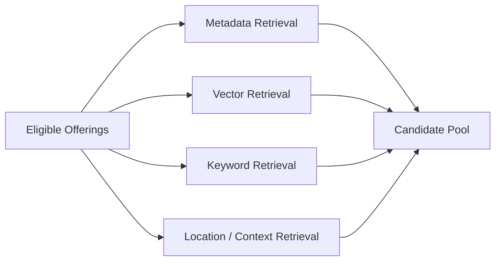
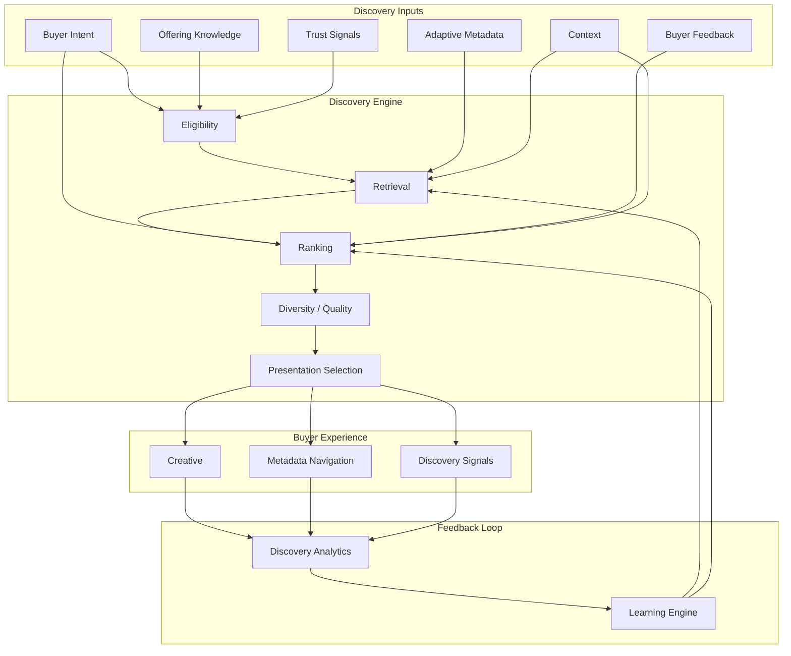

# Discovery Engine

## Document Status

| Field                  | Value                                                                                                                                 |
| ---------------------- | ------------------------------------------------------------------------------------------------------------------------------------- |
| **Status**             | Draft                                                                                                                                 |
| **Version**            | 0.3                                                                                                                                   |
| **Owner**              | PinkCurve Product Team                                                                                                                |
| **Last Reviewed**      | 2026-08-18                                                                                                                            |
| **Related Components** | Offering Knowledge, Buyer Experience, Adaptive Metadata Navigation, Discovery Analytics, Learning Engine, Trust & Safety, AI Platform |

---

## Overview

The Discovery Engine is PinkCurve's intelligent system for connecting buyers with offerings that may be relevant, useful, interesting, timely, or worth exploring.

Unlike traditional advertising systems that frequently prioritize advertiser spend, PinkCurve's Discovery Engine prioritizes **discovery quality**.

Its purpose is not simply to determine:

> Which offering is most likely to receive a click?

Instead, it asks:

> Which offerings are most likely to matter to this buyer in this context, and how can the buyer remain in control of what they discover next?

The Discovery Engine combines:

* Buyer intent
* Offering Knowledge
* Adaptive Metadata Navigation
* Context
* Location
* Trust signals
* Discovery history
* Buyer feedback
* New and trending activity
* Diversity
* Learning

to continuously produce meaningful discovery opportunities.

---

# Discovery Philosophy

PinkCurve exists to help buyers **discover what matters**.

Discovery should therefore be:

* Relevant
* Buyer-controlled
* Visual
* Simple
* Trustworthy
* Diverse
* Privacy-conscious
* Context-aware
* Continuously improving
* Resistant to manipulation

The Discovery Engine should not optimize solely for:

* Clicks
* Viewing time
* Engagement
* Seller spending
* Advertising volume

Those signals may be useful, but none should independently define discovery quality.

PinkCurve should optimize for **useful discovery**.

---

# Discovery vs. Search vs. Advertising

| Approach                       | Primary Driver                                                     | Buyer Experience                                           |
| ------------------------------ | ------------------------------------------------------------------ | ---------------------------------------------------------- |
| **Traditional Advertising**    | Advertiser spend and targeting                                     | Offerings are pushed toward audiences                      |
| **Search**                     | Buyer query                                                        | Buyer must know what to ask for                            |
| **Traditional Recommendation** | Predicted engagement                                               | System decides what may keep the user engaged              |
| **PinkCurve Discovery**        | Buyer intent + Offering Knowledge + adaptive navigation + learning | Buyer and system progressively discover relevance together |

PinkCurve combines the advantages of proactive recommendation and active exploration without requiring buyers to surrender control to an opaque feed.

---

# The Core Discovery Loop

PinkCurve discovery is not a one-time ranking operation.

It is an interactive loop.

```text
Buyer Context / Intent
        ↓
Candidate Offerings
        ↓
Relevant Offerings Presented
        ↓
Visual Discovery
        ↓
Adaptive Metadata
        ↓
Buyer Selection / Feedback / Exploration
        ↓
Updated Intent
        ↓
Updated Candidate Set
        ↓
More Relevant Discovery
        ↺
```

Every meaningful buyer action may improve the understanding of current intent.

This makes discovery an ongoing conversation between the buyer and the available Offering Knowledge.

---

# Buyer Intent

Buyer Intent represents what the buyer appears to want, need, explore, compare, or learn about at a particular moment.

Intent can be temporary and contextual.

A buyer who normally explores travel may currently be looking for:

* A nearby restaurant
* Running shoes
* A home service
* A local event
* A public resource

PinkCurve should therefore avoid assuming that long-term history always represents current intent.

---

## Explicit Intent

Explicit intent comes directly from buyer actions such as:

* Search queries
* Category selection
* Metadata selections
* Location selection
* Price preferences
* Saved preferences
* Positive feedback
* Negative feedback
* "Show me more like this"
* "Not interested"

Explicit intent should generally receive strong weight because it represents direct buyer control.

---

## Implicit Intent

Implicit intent may be inferred from behavior such as:

* Viewing patterns
* Exploration depth
* Repeat views
* Click-through behavior
* Metadata navigation
* Time spent meaningfully viewing content
* Repeated category interest
* Recent interaction sequence

Implicit signals should assist discovery rather than override clear explicit instructions.

---

## Contextual Intent

Context may include:

* Current location
* Time of day
* Day of week
* Season
* Device
* Current discovery session
* Availability
* Local events
* Temporal relevance

Context can alter what is useful even when a buyer's longer-term interests remain unchanged.

---

# Buyer Control

Buyer control is a defining architectural principle of PinkCurve discovery.

The system may proactively suggest offerings, but buyers should be able to redirect discovery quickly.

Buyer controls may include:

* Search
* Metadata navigation
* Category navigation
* Location adjustment
* Price or availability preferences
* Positive feedback
* Negative feedback
* Hide offering
* Hide participant
* Show similar offerings
* Reset or broaden discovery
* Explore another path

The Discovery Engine should interpret these actions as meaningful intent signals.

---

# Adaptive Metadata Navigation

Adaptive Metadata Navigation, or **AMN**, is a core discovery mechanism.

Traditional filtering systems often present a predefined set of filters regardless of what the buyer is currently exploring.

AMN instead determines which metadata dimensions are most useful based on:

* Current Offering Knowledge
* Available candidate offerings
* Buyer selections
* Buyer context
* Discovery path
* Category
* Location
* Learned usefulness of metadata

The metadata evolves as discovery becomes more focused.

---

## Example

A buyer begins with:

```text
Shoes
```

PinkCurve may present:

```text
Running | Walking | Casual | Hiking | Dress
```

The buyer selects:

```text
Running
```

The system may then present:

```text
Road | Trail | Racing | Everyday Training
```

After the buyer selects:

```text
Trail
```

the useful metadata may become:

```text
Waterproof | Terrain | Cushioning | Weight | Price | Nearby
```

The navigation therefore adapts to the current discovery state.

---

## AMN Discovery Loop

```text
Candidate Offerings
        ↓
Available Metadata
        ↓
Metadata Relevance Selection
        ↓
Buyer-Facing Metadata Choices
        ↓
Buyer Selection
        ↓
Intent Updated
        ↓
Candidate Offerings Updated
        ↓
Metadata Recomputed
        ↺
```

AMN allows buyers to progressively communicate intent without needing to formulate complex queries.

---

# Daily Discovery Feed

The Daily Discovery Feed is a major PinkCurve discovery surface.

PinkCurve should be useful even when a buyer does not arrive with a specific search request.

The feed may surface:

* New offerings
* Trending offerings
* Relevant offerings
* Local discoveries
* Promotions
* Discounts
* Brand-recognition offerings
* Seasonal opportunities
* Events
* Community bulletins
* Public resources
* Previously unexplored categories

The goal is to provide **fresh discovery**, not endless engagement.

---

## Feed Principles

The feed should:

* Remain visually simple
* Avoid excessive repetition
* Introduce meaningful variety
* Reflect current buyer interests without trapping buyers inside them
* Include fresh and exploratory content
* Respect negative feedback
* Prioritize trustworthy offerings
* Make navigation easy
* Avoid manipulative engagement patterns

A buyer should be able to open PinkCurve and quickly see whether anything worthwhile has appeared since the previous visit.

---

# Discovery Modes

PinkCurve may support several discovery modes.

## Intent-Driven Discovery

The buyer provides an explicit need or interest.

Example:

```text
"I need waterproof trail-running shoes."
```

The Discovery Engine retrieves offerings relevant to that intent.

---

## Metadata-Guided Discovery

The buyer progressively narrows or redirects discovery using AMN.

This is particularly useful when the buyer knows roughly what they want but does not know the exact terminology or product.

---

## Passive Discovery

PinkCurve proactively surfaces potentially useful offerings through the Daily Discovery Feed.

The buyer does not need to initiate a search.

---

## Search

Keyword or natural-language queries can initiate discovery.

Search results may then transition naturally into metadata navigation.

```text
Search
   ↓
Initial Results
   ↓
Adaptive Metadata
   ↓
Progressive Discovery
```

Search is therefore one entry point into PinkCurve rather than the entire discovery experience.

---

## Browse

Buyers may explore:

* Categories
* Brands
* Locations
* Offering types
* Themes
* Trends

AMN can continue refining discovery inside a browse experience.

---

## Similar Discovery

From an existing offering, buyers may ask to explore:

* Similar offerings
* Alternatives
* Related offerings
* Nearby alternatives
* Different price ranges
* Different characteristics

---

# Offering Fit

Offering Fit represents how well an offering corresponds to current buyer intent and context.

Possible dimensions include:

* Semantic relevance
* Metadata compatibility
* Need or problem alignment
* Feature relevance
* Audience compatibility
* Location relevance
* Availability
* Price compatibility
* Temporal relevance
* Trust
* Buyer feedback history
* Learned usefulness

Offering Fit is not a permanent property of the offering.

The same offering may be highly relevant to one buyer and irrelevant to another—or relevant to the same buyer at a different time.

---

# Discovery Signals

PinkCurve transforms internal knowledge into concise buyer-facing **Discovery Signals**.

Metadata and Discovery Signals serve different purposes.

**Metadata** helps buyers navigate and refine discovery.

**Discovery Signals** help buyers quickly understand why a particular offering may deserve attention.

---

## Examples

| Underlying Information          | Possible Discovery Signal     |
| ------------------------------- | ----------------------------- |
| Geographic distance             | 📍 Nearby — 0.8 miles         |
| Verified provider               | ✓ Verified Provider           |
| Meaningful local trend          | 🔥 Popular Nearby             |
| Active promotion                | Limited-Time Offer            |
| Recently added offering         | New                           |
| Strong current-intent alignment | Matches What You're Exploring |
| Event timing                    | Happening This Weekend        |
| Community relevance             | Community Resource            |

Signals should be:

* Concise
* Understandable
* Truthful
* Visually lightweight
* Relevant to the buyer
* Supported by underlying data

PinkCurve should generally display only a small number of high-value signals at one time.

---

# Why Am I Seeing This?

Where practical, PinkCurve should help buyers understand why an offering appears.

Examples include:

* Because you selected "Waterproof"
* Popular near you
* New in a category you explore
* Similar to something you liked
* Available nearby
* Trending this week
* Sponsored discovery

This improves transparency without exposing internal ranking algorithms or technical scores.

---

# Discovery Pipeline

The Discovery Engine may use a multi-stage pipeline.

```text
Available Offerings
       ↓
Eligibility
       ↓
Candidate Retrieval
       ↓
Intent & Context Matching
       ↓
Ranking
       ↓
Quality / Trust / Diversity Controls
       ↓
Presentation
       ↓
Buyer Interaction
       ↓
Re-ranking / Refinement
```

The exact algorithms may evolve, but the logical stages should remain distinct.

---

# Phase 1: Eligibility

Before ranking, PinkCurve determines which offerings are eligible for discovery.

Eligibility may consider:

* Offering status
* Seller or provider status
* Trust verification
* Policy compliance
* Availability
* Promotion expiration
* Geographic eligibility
* Campaign status
* Required Offering Knowledge

An offering that is ineligible should not enter normal discovery ranking.

---

# Phase 2: Candidate Retrieval

Candidate retrieval reduces the full Offering corpus to a manageable set.

Retrieval methods may include:

* Metadata matching
* Category matching
* Semantic vector retrieval
* Keyword retrieval
* Location filtering
* Availability filtering
* Temporal filtering
* Learned associations
* Similar-offering retrieval

Multiple retrieval methods may operate in parallel.



Candidate retrieval should preserve enough diversity so ranking can consider useful alternatives rather than only near-duplicates.

---

# Phase 3: Feature and Context Construction

Candidate offerings are evaluated using available signals.

Possible features include:

### Buyer Signals

* Explicit intent
* Current metadata selections
* Recent interactions
* Positive feedback
* Negative feedback
* Historical preferences where permitted

### Offering Signals

* Offering metadata
* Features
* Benefits
* Category
* Price
* Availability
* Location
* Freshness
* Creative quality
* Trust status

### Context Signals

* Session context
* Time
* Location
* Discovery surface
* Current discovery path
* Feed versus active exploration

### Learned Signals

* Historical discovery usefulness
* Audience response patterns
* Metadata effectiveness
* Creative effectiveness
* Negative-feedback patterns

---

# Phase 4: Ranking

Ranking determines the ordering of candidate offerings.

PinkCurve should not define ranking as prediction of engagement alone.

A future ranking model may estimate a broader concept such as:

**Expected Discovery Value**

Possible contributors may include:

```text
Discovery Value
    =
Intent Relevance
+ Metadata Fit
+ Context Relevance
+ Trust
+ Quality
+ Freshness
+ Diversity Contribution
+ Learned Usefulness
- Negative Signals
```

This is conceptual rather than a final formula.

Weights and model architecture should be validated empirically.

---

# Ranking Objectives

A ranking system may consider multiple objectives simultaneously.

### Relevance

How closely does the offering match current buyer intent?

### Usefulness

Is the offering likely to provide meaningful value to the buyer?

### Trust

Is the participant and offering sufficiently trustworthy?

### Freshness

Would showing something new improve discovery?

### Diversity

Does the result set expose meaningful alternatives?

### Exploration

Should the system introduce a potentially relevant offering outside established behavior?

### Buyer Feedback

Has the buyer indicated that similar content is unwanted?

### Seller Fairness

Is the system unnecessarily concentrating exposure among a small number of sellers?

No single objective should dominate without evidence that doing so improves overall discovery quality.

---

# Phase 5: Diversity and Quality Controls

The highest-scoring individual offerings may not produce the best overall result set.

For example, a ranking model might produce:

```text
1. Running Shoe — Seller A
2. Running Shoe — Seller A
3. Running Shoe — Seller A
4. Running Shoe — Seller A
5. Running Shoe — Seller A
```

PinkCurve may instead prefer:

```text
1. Running Shoe — Seller A
2. Trail Shoe — Seller B
3. Budget Alternative — Seller C
4. Nearby Option — Seller D
5. Premium Alternative — Seller E
```

when this produces a more useful discovery experience.

Diversity may consider:

* Sellers
* Brands
* Price ranges
* Attributes
* Creative styles
* Offering types
* Locations
* New versus established offerings

Diversity should not mean randomization. It should increase useful choice.

---

# Phase 6: Presentation

The Discovery Engine returns:

* Ranked offerings
* Appropriate creative
* Relevant metadata
* Discovery Signals
* Explanation information
* Navigation opportunities

The Buyer Experience determines how these elements appear visually.

The Discovery Engine should avoid sending unnecessary technical complexity to the interface.

---

# Continuous Re-Ranking

Discovery does not end after the initial list is presented.

The system may update ranking when the buyer:

* Selects metadata
* Hides an offering
* Gives negative feedback
* Gives positive feedback
* Opens an offering
* Changes location
* Searches
* Changes category
* Requests alternatives
* Resets discovery

This creates responsive discovery within the session.

---

# Negative Feedback

Negative feedback is particularly important because buyers need a direct way to tell PinkCurve what they do not want.

Possible actions include:

* Not interested
* Show fewer like this
* Hide this offering
* Hide this seller
* Irrelevant
* Already seen too often
* Misleading
* Incorrect information
* Report offering

Different forms of negative feedback should have different meanings.

For example:

```text
Not Interested
    → Personal discovery signal

Misleading
    → Personal discovery signal + trust review candidate

Report Offering
    → Trust and Safety workflow
```

Negative feedback should be incorporated quickly into current and future discovery where appropriate.

---

# Positive Feedback

Positive feedback may include:

* Like
* Save
* Explore
* Show more like this
* Follow metadata path
* Visit destination
* Rate positively
* Return to offering

Positive feedback helps PinkCurve learn what is useful, but the system should avoid interpreting every click as approval.

---

# Exploration vs. Exploitation

A discovery system that only repeats known preferences can become narrow and repetitive.

PinkCurve therefore needs to balance:

### Exploitation

Show offerings strongly aligned with known interests.

### Exploration

Introduce potentially useful offerings outside existing patterns.

Exploration helps buyers discover things they did not already know to request.

The amount of exploration may depend on:

* Discovery surface
* Buyer behavior
* Session intent
* New inventory
* Feed freshness
* Buyer controls

---

# Cold Start

PinkCurve must work even when little or no buyer history exists.

For a new buyer, discovery may rely on:

* Current intent
* Location
* Selected categories
* AMN interactions
* Trending offerings
* New offerings
* Trusted offerings
* Diverse exploration
* Session behavior

This reduces dependence on long-term personal profiles.

AMN is especially valuable during cold start because buyers can communicate intent interactively.

---

# New Offering Cold Start

New offerings also lack interaction history.

PinkCurve should not disadvantage them simply because they have not yet accumulated engagement data.

New offering discovery may consider:

* Offering Knowledge quality
* Metadata relevance
* Seller verification
* Creative quality
* Current buyer intent
* Controlled exploration opportunities

This allows new sellers and offerings a meaningful opportunity to be discovered.

---

# Personalization

Personalization should be progressive rather than all-or-nothing.

Possible levels include:

| Level                       | Information Used            | Example                           |
| --------------------------- | --------------------------- | --------------------------------- |
| **Contextual**              | Current session and context | Current metadata selections       |
| **Session**                 | Recent interactions         | Adjust results during this visit  |
| **Preference**              | Saved buyer preferences     | Preferred categories or locations |
| **Behavioral**              | Historical interactions     | Longer-term discovery patterns    |
| **Individual Intelligence** | Multiple permitted signals  | Personalized discovery model      |

PinkCurve should prefer the least intrusive level of personalization that provides useful discovery.

---

# Privacy and Personalization

Discovery must follow PinkCurve privacy principles.

Potential requirements include:

* Data minimization
* Clear explanations
* Appropriate consent
* User control over stored preferences
* Ability to reset discovery history
* Limited retention where appropriate
* Protection against unnecessary sensitive inference

Personalization should improve discovery without turning PinkCurve into a surveillance platform.

See: [Security, Privacy, and Trust](12-security-privacy-and-trust.md)

---

# Location-Aware Discovery

Location can be highly valuable for:

* Local services
* Restaurants
* Events
* Community resources
* Public services
* Local inventory
* Promotions

Location-aware discovery may use levels such as:

* Country
* Region
* City
* Approximate local area
* Precise location when voluntarily enabled and necessary

The system should use the minimum geographic precision required for the discovery task.

Location should remain a relevance signal—not a requirement for every offering.

---

# Time-Aware Discovery

Some offerings have strong temporal relevance.

Examples include:

* Promotions
* Events
* Seasonal offerings
* Limited availability
* Community announcements
* New offerings
* Trending items

The engine should account for:

* Start time
* Expiration
* Event timing
* Recency
* Seasonal relevance

Expired promotions and events should not continue to appear as active discoveries.

---

# Trending

Trending can make the Daily Discovery Feed more interesting, but trend status must be meaningful.

Trending should not simply mean:

> Most clicked.

Possible trend signals may include:

* Rapid increase in qualified interest
* Meaningful local activity
* Rising discovery across multiple buyers
* Positive feedback
* New relevance within a category

Trend calculation should include protections against:

* Bot traffic
* Seller manipulation
* Coordinated activity
* Small-sample distortion

---

# New Offerings

New offerings deserve controlled exposure so buyers can discover recent additions.

The Discovery Engine may reserve some discovery capacity for new offerings while maintaining:

* Relevance
* Trust requirements
* Quality thresholds
* Diversity

Newness should help an offering receive an opportunity to be evaluated, not guarantee permanent ranking advantage.

---

# Promotions and Discounts

Promotions may be surfaced when relevant.

Promotion ranking should consider:

* Buyer intent
* Actual promotion value
* Expiration
* Availability
* Location
* Trust

A discount should not automatically outrank a more relevant non-discounted offering.

---

# Brand Recognition Discovery

Brand Recognition is a distinct discovery objective.

A seller may want buyers to become familiar with:

* Brand identity
* Services
* Expertise
* Location
* Value proposition

Brand-recognition campaigns may be relevant even when the buyer is not ready to purchase immediately.

However, paid brand-recognition discovery must remain clearly distinguishable from organic relevance where necessary.

PinkCurve should measure brand-recognition effectiveness separately from transaction-oriented discovery.

---

# Commercial and Non-Commercial Discovery

PinkCurve's discovery architecture should support both commercial and future public/community offerings.

The same basic engine may retrieve:

* Products
* Commercial services
* Events
* Promotions
* Community resources
* Public services

However, ranking objectives may differ by Offering type.

For example, a public emergency resource should not be ranked using the same commercial logic as a retail product.

Offering type and discovery context must therefore influence ranking policy.

---

# Sponsored Discovery

PinkCurve may support paid discovery opportunities as part of its business model.

However:

* Sponsorship must not silently become relevance
* Paid placement should be identifiable
* Trust and eligibility rules still apply
* Spending should not override fundamental relevance or safety
* Buyer experience should remain useful

PinkCurve must avoid becoming a conventional pay-to-win advertising marketplace.

---

# Fairness and Seller Opportunity

Discovery should not unnecessarily concentrate exposure among sellers with the largest budgets, longest history, or most accumulated data.

Potential fairness considerations include:

* Opportunity for new sellers
* Opportunity for new offerings
* Seller diversity
* Brand diversity
* Prevention of monopolized result sets
* Appropriate exploration

Fairness does not mean equal exposure regardless of quality or relevance.

The objective is **fair opportunity to compete for relevant discovery**.

---

# Trust and Safety Integration

Trust operates before and during discovery.

Signals may include:

* Seller verification
* Buyer verification where relevant
* Offering verification
* Destination URL validation
* Fraud signals
* Abuse history
* Policy compliance
* Suspicious activity
* Bot detection

An offering may be:

* Eligible
* Restricted
* Temporarily suspended
* Removed

based on trust status.

High relevance should never override a serious trust or safety problem.

---

# Discovery Architecture



---

# Discovery Events

The engine should emit structured events that allow PinkCurve to understand what happened during discovery.

Examples include:

* Offering presented
* Creative viewed
* Metadata displayed
* Metadata selected
* Offering opened
* Destination clicked
* Positive feedback
* Negative feedback
* Offering hidden
* Seller hidden
* Search performed
* Discovery reset
* Report submitted

Events should contain enough context for analysis without collecting unnecessary personal information.

See: [Discovery Analytics](07-discovery-analytics.md)

---

# Learning Integration

The Learning Engine uses discovery outcomes to improve:

* Retrieval
* Ranking
* Metadata selection
* Creative selection
* Buyer intent interpretation
* Trending detection
* Exploration strategy
* Seller insights

Learning must be evaluated carefully because incorrect optimization can degrade the buyer experience.

For example, optimizing purely for watch time could reward sensational creative rather than useful discovery.

See: [Learning Engine](08-learning-engine.md)

---

# Discovery Evaluation

PinkCurve should evaluate discovery using multiple metrics.

Potential dimensions include:

* Relevance
* Exploration
* Buyer satisfaction
* Negative-feedback rate
* Click-through where meaningful
* Destination engagement
* Diversity
* Trust
* New offering discovery
* Repeat usefulness
* Seller value
* Brand-recognition effectiveness

No single metric should become the sole optimization target.

The experimental Discovery Score may combine selected dimensions.

See: [Discovery Analytics](07-discovery-analytics.md)

---

# Discovery Score

The Discovery Score is a PinkCurve experimental metric intended to represent discovery effectiveness.

It may eventually incorporate measures such as:

* Relevance
* Buyer exploration
* Positive signals
* Negative signals
* Destination engagement
* Trust
* Discovery diversity

The exact definition should be validated using real platform behavior.

The Discovery Score is not an industry standard and should not be treated as proven until tested.

---

# Current Status

## Implemented

* Offering Knowledge foundation
* Initial embedding-generation capabilities through the AI Platform

## In Development

* Offering embeddings
* Discovery architecture
* Metadata model
* Buyer Experience integration

## Planned

* Candidate retrieval
* Vector retrieval
* Keyword and metadata retrieval
* Adaptive Metadata Navigation
* Initial ranking logic
* Discovery feed
* Search
* Browse
* Location-aware discovery
* New and trending discovery
* Negative-feedback integration
* Diversity controls
* Trust eligibility integration
* Learning-based ranking
* Discovery explanation signals

---

# Initial MVP Approach

PinkCurve should avoid building a complex machine-learning ranking system before sufficient discovery data exists.

An initial MVP may use:

```text
Eligibility Rules
      ↓
Metadata / Keyword / Vector Retrieval
      ↓
Rule-Based or Weighted Ranking
      ↓
Diversity Rules
      ↓
Buyer Feedback
      ↓
Analytics
```

This allows PinkCurve to collect real discovery data before training sophisticated ranking models.

As data grows, learned ranking can gradually replace or augment heuristic rules.

The architecture should therefore support increasing intelligence without requiring it at launch.

---

# Open Questions

See [Open Decisions](19-open-decisions.md) for decisions including:

* Initial ranking strategy
* Vector database selection
* AMN metadata selection strategy
* Personalization defaults
* Buyer history retention
* Exploration rate
* Ranking fairness rules
* New offering exposure
* Trending calculation
* Sponsored discovery policy
* Discovery Score definition

---

# Design Principles

### Buyer Intent Comes First

Seller spending should not silently override what the buyer is trying to discover.

### Buyer Control Must Be Visible

Buyers should have easy mechanisms for changing the direction of discovery.

### Metadata Is Interactive

Metadata is not only an internal ranking feature. Through AMN, it becomes part of the buyer's discovery conversation.

### Discovery Is Iterative

Each interaction can refine the current discovery state.

### Relevance Is Not Engagement

Clicks and viewing time are evidence—not the ultimate objective.

### Negative Feedback Matters

Signals about what buyers do not want are essential for useful discovery.

### New Offerings Need Opportunity

Historical engagement should not permanently favor established offerings.

### Diversity Improves Discovery

Useful alternatives should remain visible.

### Trust Overrides Relevance

Unsafe or fraudulent offerings should not be discoverable simply because they match intent.

### Learning Must Remain Accountable

Algorithmic improvement should be measured against buyer usefulness, trust, and seller value.

### Keep the Surface Simple

The underlying intelligence may be complex, but the Buyer Experience should remain visual and understandable.

---

# Related Documents

* [Product Architecture](03-product-architecture.md)
* [Offering Knowledge](04-offering-knowledge.md)
* [Creative Studio](05-creative-studio.md)
* [Discovery Analytics](07-discovery-analytics.md)
* [Learning Engine](08-learning-engine.md)
* [Seller Intelligence](09-seller-intelligence.md)
* [AI Platform](10-ai-platform.md)
* [Data Architecture](11-data-architecture.md)
* [Security, Privacy, and Trust](12-security-privacy-and-trust.md)
* [Buyer Experience](20-buyer-experience.md)
* [Open Decisions](19-open-decisions.md)
* [Discovery Event Flow Diagram](../diagrams/discovery-event-flow.md)
