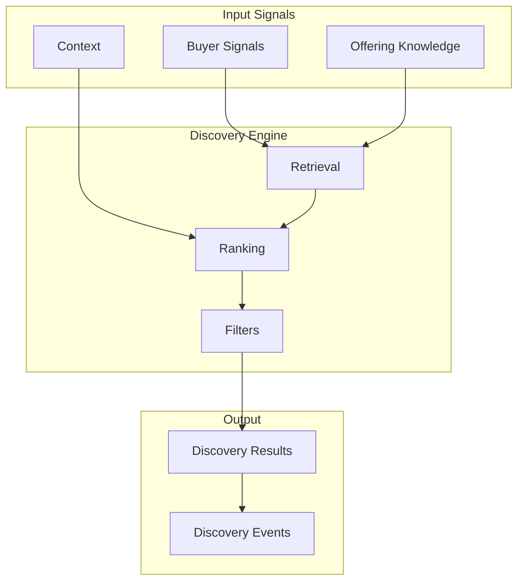

# Discovery Engine

## Document Status

| Field | Value |
|-------|-------|
| **Status** | Draft |
| **Version** | 0.2 |
| **Owner** | PinkCurve Product Team |
| **Last Reviewed** | 2026-08-09 |
| **Related Components** | Offering Knowledge, Discovery Analytics, Learning Engine |

---

## Overview

The Discovery Engine is PinkCurve's intelligent matching system that connects buyers with relevant offerings. Unlike traditional advertising that prioritizes ad spend, the Discovery Engine prioritizes relevance—matching buyers with offerings that are genuinely useful, interesting, or valuable to them.

---

## Purpose

### Discovery vs. Search vs. Ads

| Approach | Primary Driver | Buyer Experience |
|----------|---------------|------------------|
| **Traditional Ads** | Participant ad spend | Often irrelevant, interruptive |
| **Search** | Buyer keywords | Requires buyer to know what to search |
| **Discovery** | Relevance matching | Surfaces relevant offerings proactively |

The Discovery Engine enables:
- **Proactive discovery:** Offerings find buyers, not just buyers finding products
- **Intent-based matching:** Understanding what buyers want, not just what they typed
- **Continuous improvement:** Learning from every interaction

---

## Discovery Philosophy

The Discovery Engine exists to help buyers discover offerings that matter to them.

Rather than optimizing primarily for clicks, advertising spend, or engagement, PinkCurve optimizes for meaningful discovery.

Discovery should be:

- Relevant
- Visual
- Trustworthy
- Respectful of buyer attention
- Privacy-conscious
- Continuously improving

The Discovery Engine supports PinkCurve's guiding principle:

**Discover what matters.**

---

## Core Concepts

### Buyer Intent

Understanding why a buyer is engaging with the platform:
- What problem are they trying to solve?
- What preferences do they have?
- What context are they in?

Intent is inferred from:
- Explicit signals (search queries, filters, stated preferences)
- Implicit signals (browse behavior, engagement patterns, timing)
- Context (device, location, time)

### Offering Fit

How well an offering matches buyer intent:
- Problem-solution alignment
- Audience match
- Preference compatibility
- Context relevance
- Price appropriateness (when applicable)
- Trust signals

### Discovery Score

A composite metric measuring discovery effectiveness. See [Discovery Analytics](07-discovery-analytics.md).

*Note: Discovery Score is an experimental metric, not yet a validated industry standard.*

---

## Discovery Signals

PinkCurve transforms complex metadata and discovery intelligence into simple, meaningful signals that help buyers quickly understand why an offering may be worth exploring.

Discovery Signals are different from raw metadata.

**Metadata** describes an offering or its context.

**Discovery Signals** translate that information into buyer-facing meaning.

Examples:

| Underlying Metadata or Intelligence | Buyer-Facing Discovery Signal |
| ----------------------------------- | ----------------------------- |
| Geographic distance                 | 📍 Nearby — 0.8 miles         |
| Participant verification status     | ⭐ Verified Business           |
| Trending score                      | 🔥 Popular This Week          |
| Promotion information               | 💰 Limited-Time Discount      |
| Relevance score                     | ❤️ Matches Your Interests     |

Discovery Signals should help answer questions such as:

* Why am I seeing this?
* Is this relevant to me?
* Is it nearby?
* Can I understand the trust status?
* Is there something timely or important about this offering?

Discovery Signals should remain concise, visual, and easy to understand on small screens.

They should not expose unnecessary internal model scores or technical complexity.

PinkCurve follows the principle:

**Complex intelligence underneath. Simple, meaningful signals on the surface.**

The Buyer Experience should generally display only a small number of high-value Discovery Signals at one time so that metadata and controls do not obscure the visual offering.

## Matching Approach

### Phase 1: Retrieval (Planned)

Narrow down from all offerings to relevant candidates:

- **Filter criteria:** Category, price range, availability
- **Embedding similarity:** Semantic matching using vector embeddings
- **Candidate set:** ~100-1000 offerings for ranking

### Phase 2: Ranking (Planned)

Order candidates by predicted relevance:

- **Feature extraction:** Buyer signals, offering attributes, context
- **Ranking model:** ML model predicting engagement probability
- **Ranked results:** Ordered by predicted relevance

### Phase 3: Presentation

Present discoveries through various surfaces:
- Discovery feed
- Search results
- Category browsing
- Recommendations

---

## Discovery Surfaces

### Discovery Feed (Planned)
Personalized feed of relevant offerings based on inferred preferences and browsing history.

### Search (Planned)
Keyword-based search enhanced with:
- Semantic understanding
- Relevance ranking
- Personalized results

### Browse (Planned)
Category-based exploration with:
- Smart filtering
- Relevance ordering within categories
- Related offering suggestions

### Recommendations (Planned)
Context-specific suggestions:
- Similar offerings
- Complementary offerings
- "Others also viewed"

---

## Personalization

### Levels of Personalization

| Level | Data Required | Example |
|-------|--------------|---------|
| **None** | No user data | Same results for everyone |
| **Segment** | Demographics | Results for "small business owners" |
| **Behavioral** | Interaction history | Based on recent views/clicks |
| **Individual** | Full profile | Fully personalized ranking |

### Privacy Considerations

Personalization must balance relevance with privacy:
- Consent required for behavioral tracking
- Data minimization principle
- No tracking for non-consenting users
- Clear opt-out mechanisms

See [Security, Privacy, and Trust](12-security-privacy-and-trust.md).

---

## Fairness and Quality

### Avoiding Pay-to-Win

Discovery ranking is based on relevance, not particpant spend:
- Ad spend does not directly boost ranking
- High-quality offferings surface regardless of marketing budget
- Sponsored placements are clearly labeled

Quality signals may include:

- Complete Offering Knowledge
- Participant verification status
- Offering verification
- Trust signals
- Historical performance
- Policy compliance

### Quality Signals

Offerings must meet quality thresholds:
- Complete Offering Knowledge
- Participant verification status
- Offering verification
- Trust signals
- Historical performance
- Policy compliance

### Diversity

Results should include variety:
- Multiple participants represented
- Different price points shown
- Avoid over-concentration

---

## Architecture

---

## Current Status

### Implemented
- None (Discovery Engine is planned)

### In Development
- Offering embedding generation (via AI Platform)

### Planned
- Vector similarity search infrastructure
- Retrieval pipeline
- Ranking model
- Discovery feed UI

---

## Dependencies

- **Offering Knowledge:** Rich knowledge enables better matching
- **AI Platform:** Embedding generation, model serving
- **Discovery Analytics:** Event tracking, performance measurement
- **Learning Engine:** Ranking improvement from feedback

---

## Open Questions

See [Open Decisions](19-open-decisions.md) for:
- Vector database selection (pgvector vs. dedicated vector DB)
- Initial ranking model approach (heuristic vs. ML)
- Personalization consent and defaults
- Cold-start handling for new buyers

---

## Related Documents

- [Offering Knowledge](04-offering-knowledge.md)
- [Discovery Analytics](07-discovery-analytics.md)
- [Learning Engine](08-learning-engine.md)
- [AI Platform](10-ai-platform.md)
- [Discovery Event Flow Diagram](../diagrams/discovery-event-flow.md)
