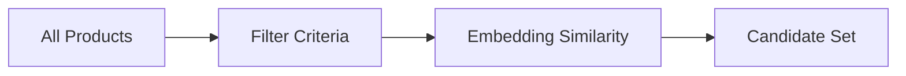
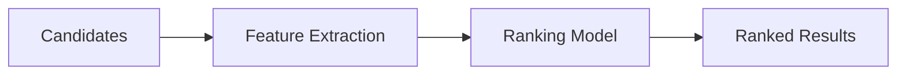

# Discovery Engine

## Document Status

| Field | Value |
|-------|-------|
| **Status** | Draft |
| **Version** | 0.1 |
| **Owner** | PinkCurve Product Team |
| **Last Reviewed** | 2026-07-23 |
| **Related Components** | Product Knowledge, Discovery Analytics, Learning Engine |

---

## Overview

The Discovery Engine is PinkCurve's intelligent matching system that connects buyers with relevant products. Unlike traditional advertising that prioritizes ad spend, the Discovery Engine prioritizes relevance—matching buyers with products they're genuinely likely to want.

---

## Purpose

### Discovery vs. Search vs. Ads

| Approach | Primary Driver | Buyer Experience |
|----------|---------------|------------------|
| **Traditional Ads** | Seller ad spend | Often irrelevant, interruptive |
| **Search** | Buyer keywords | Requires buyer to know what to search |
| **Discovery** | Relevance matching | Surfaces relevant products proactively |

The Discovery Engine enables:
- **Proactive discovery:** Products find buyers, not just buyers finding products
- **Intent-based matching:** Understanding what buyers want, not just what they typed
- **Continuous improvement:** Learning from every interaction

---

## Core Concepts

### Buyer Intent

Understanding why a buyer is engaging with the platform:
- What problem are they trying to solve?
- What preferences do they have?
- What context are they in?

Intent is inferred from:
- Explicit signals (search queries, filters, stated preferences)
- Implicit signals (browse behavior, engagement patterns, timing)
- Context (device, location, time)

### Product Fit

How well a product matches buyer intent:
- Problem-solution alignment
- Audience match
- Preference compatibility
- Price appropriateness

### Discovery Score

A composite metric measuring discovery effectiveness. See [Discovery Analytics](07-discovery-analytics.md).

*Note: Discovery Score is an experimental metric, not yet a validated industry standard.*

---

## Matching Approach

### Phase 1: Retrieval (Planned)

Narrow down from all products to relevant candidates:

- **Filter criteria:** Category, price range, availability
- **Embedding similarity:** Semantic matching using vector embeddings
- **Candidate set:** ~100-1000 products for ranking

### Phase 2: Ranking (Planned)

Order candidates by predicted relevance:

- **Feature extraction:** Buyer signals, product attributes, context
- **Ranking model:** ML model predicting engagement probability
- **Ranked results:** Ordered by predicted relevance

### Phase 3: Presentation

Present discoveries through various surfaces:
- Discovery feed
- Search results
- Category browsing
- Recommendations

---

## Discovery Surfaces

### Discovery Feed (Planned)
Personalized feed of relevant products based on inferred preferences and browsing history.

### Search (Planned)
Keyword-based search enhanced with:
- Semantic understanding
- Relevance ranking
- Personalized results

### Browse (Planned)
Category-based exploration with:
- Smart filtering
- Relevance ordering within categories
- Related product suggestions

### Recommendations (Planned)
Context-specific suggestions:
- Similar products
- Complementary products
- "Others also viewed"

---

## Personalization

### Levels of Personalization

| Level | Data Required | Example |
|-------|--------------|---------|
| **None** | No user data | Same results for everyone |
| **Segment** | Demographics | Results for "small business owners" |
| **Behavioral** | Interaction history | Based on recent views/clicks |
| **Individual** | Full profile | Fully personalized ranking |

### Privacy Considerations

Personalization must balance relevance with privacy:
- Consent required for behavioral tracking
- Data minimization principle
- No tracking for non-consenting users
- Clear opt-out mechanisms

See [Security, Privacy, and Trust](12-security-privacy-and-trust.md).

---

## Fairness and Quality

### Avoiding Pay-to-Win

Discovery ranking is based on relevance, not seller spend:
- Ad spend does not directly boost ranking
- Quality products surface regardless of marketing budget
- Sponsored placements are clearly labeled

### Quality Signals

Products must meet quality thresholds:
- Complete Product Knowledge
- Seller verification status
- Historical performance
- No policy violations

### Diversity

Results should include variety:
- Multiple sellers represented
- Different price points shown
- Avoid over-concentration

---

## Architecture

---

## Current Status

### Implemented
- None (Discovery Engine is planned)

### In Development
- Product embedding generation (via AI Platform)

### Planned
- Vector similarity search infrastructure
- Retrieval pipeline
- Ranking model
- Discovery feed UI

---

## Dependencies

- **Product Knowledge:** Rich knowledge enables better matching
- **AI Platform:** Embedding generation, model serving
- **Discovery Analytics:** Event tracking, performance measurement
- **Learning Engine:** Ranking improvement from feedback

---

## Open Questions

See [Open Decisions](19-open-decisions.md) for:
- Vector database selection (pgvector vs. dedicated vector DB)
- Initial ranking model approach (heuristic vs. ML)
- Personalization consent and defaults
- Cold-start handling for new buyers

---

## Related Documents

- [Product Knowledge](04-product-knowledge.md)
- [Discovery Analytics](07-discovery-analytics.md)
- [Learning Engine](08-learning-engine.md)
- [AI Platform](10-ai-platform.md)
- [Discovery Event Flow Diagram](../diagrams/discovery-event-flow.md)
