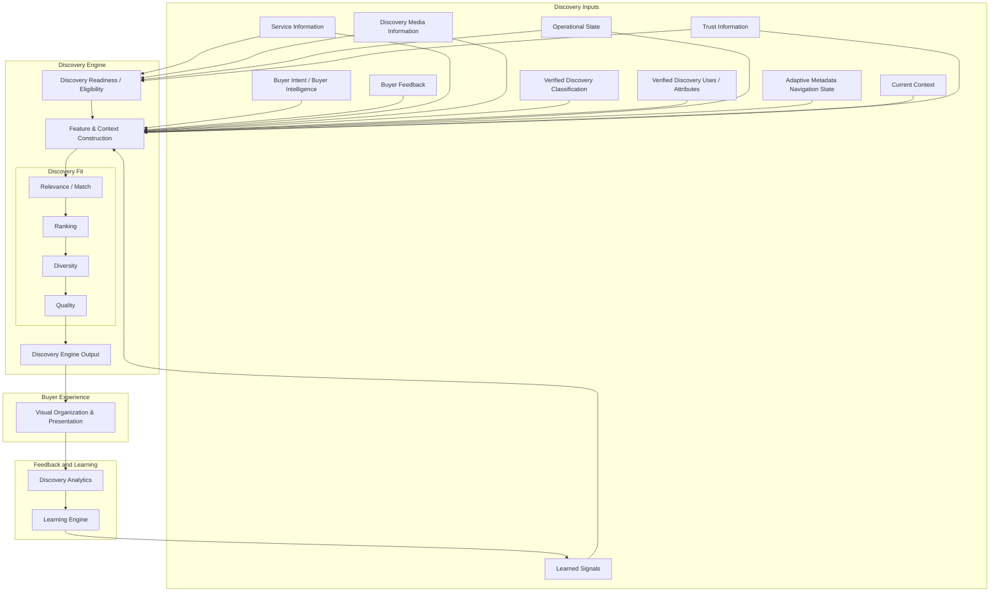

# Discovery Engine

## Document Status

| Field                  | Value                                                                          |
| ---------------------- | -------------------------------------------------------------------------------|
| **Status**             | Draft                                                                          |
| **Version**            | 0.3                                                                            |
| **Owner**              | PinkCurve Product Team                                                         |
| **Last Reviewed**      | 2026-10-05                                                                     |
| **Related Components** | Offering Knowledge, Buyer Experience, Adaptive Metadata Navigation, Discovery  |
|                        | Analytics, Learning Engine, Trust & Safety, AI Platform, Creative Studio.      |
---

## Overview

The Discovery Engine is PinkCurve's intelligent system for connecting
Buyers with Discovery opportunities that may be relevant, useful,
interesting, timely, or worth exploring.

Unlike traditional advertising systems that frequently prioritize advertiser spend, PinkCurve's Discovery Engine prioritizes **discovery quality**.

Its purpose is not simply to determine:

> Which Discovery is most likely to receive a click?

Instead, it asks:

> Which Discovery opportunities are most likely to matter to this Buyer
> in this context, and how can the Buyer remain in control of what they
> discover next?

The Discovery Engine combines:

* Buyer intent
* Service information
* Adaptive Metadata Navigation
* Context
* Location
* Trust signals
* Discovery history
* Buyer feedback
* New and trending activity
* Diversity
* Learning

to continuously produce meaningful discovery opportunities.

The Discovery Engine also supports **Real-Time Discovery** for
time-sensitive service items whose usefulness depends on being
discovered while they are still valid and available.

For Real-Time Discovery, relevance alone is insufficient. The Discovery
Engine must consider current validity, availability, freshness,
location where applicable, quantity or capacity where relevant, and
other applicable Discovery Readiness / Eligibility conditions before
the service item and its associated Discovery Media may participate in
active Discovery.

Real-Time Discovery follows the same buyer-first discovery principles
as other PinkCurve discovery, but places additional importance on
speed, truth, locality, relevance, and freshness.

---

# Discovery Philosophy

PinkCurve exists to help buyers **discover what matters**.

Discovery should therefore be:

* Relevant
* Buyer-controlled
* Visual
* Simple
* Trustworthy
* Diverse
* Privacy-conscious
* Context-aware
* Continuously improving
* Resistant to manipulation

The Discovery Engine should not optimize solely for:

* Clicks
* Viewing time
* Engagement
* Seller spending
* Advertising volume

Those signals may be useful, but none should independently define discovery quality.

PinkCurve should optimize for **useful discovery**.

---

# Discovery vs. Search vs. Advertising

| Approach                       | Primary Driver                       | Buyer Experience                                           |
| ------------------------------ | ------------------------------------ | ---------------------------------------------------------- |
| **Traditional Advertising**    | Advertiser spend and targeting       | Offerings are pushed toward audiences                      |
| **Search**                     | Buyer query                          | Buyer must know what to ask for                            |
| **Traditional Recommendation** | Predicted engagement                 | System decides what may keep the user engaged              |
| **PinkCurve Discovery**        | Buyer intent + service information + | Buyer and system progressively discover relevance together |
|                                | adaptive navigation + learning       |                                                            | 

PinkCurve combines the advantages of proactive recommendation and active exploration without requiring buyers to surrender control 
to an opaque feed.

---

# The Core Discovery Loop

PinkCurve discovery is not a one-time ranking operation.

It is an interactive loop.

```text
Buyer Context / Intent
        ↓
Relevant Discovery
        ↓
Visual Discovery
        ↓
Adaptive Metadata
        ↓
Buyer Selection / Feedback / Exploration
        ↓
Updated Intent
        ↓
Updated Discovery
        ↓
More Relevant Discovery
        ↺
```

Every meaningful buyer action may improve the understanding of current intent.

This makes Discovery an ongoing interaction between the Buyer and
PinkCurve's available Discovery opportunities.

---

# Buyer Intent

Buyer Intent represents what the buyer appears to want, need, explore, compare, or learn about at a particular moment.

Intent can be temporary and contextual.

A buyer who normally explores travel may currently be looking for:

* A nearby restaurant
* Running shoes
* A home service
* A local event
* A public resource

PinkCurve should therefore avoid assuming that long-term history always represents current intent.

---

## Explicit Intent

Explicit intent comes directly from buyer actions such as:

* Search queries
* Category selection
* Metadata selections
* Location selection
* Price preferences
* Saved preferences
* Positive feedback
* Negative feedback
* "Show me more like this"
* "Not interested"

Explicit intent should generally receive strong weight because it represents direct buyer control.

---

## Implicit Intent

Implicit intent may be inferred from behavior such as:

* Viewing patterns
* Exploration depth
* Repeat views
* Click-through behavior
* Metadata navigation
* Time spent meaningfully viewing content
* Repeated category interest
* Recent interaction sequence

Implicit signals should assist discovery rather than override clear explicit instructions.

---

## Contextual Intent

Context may include:

* Current location
* Time of day
* Day of week
* Season
* Device
* Current discovery session
* Availability
* Local events
* Temporal relevance

Context can alter what is useful even when a buyer's longer-term interests remain unchanged.

---

# Buyer Control

Buyer control is a defining architectural principle of PinkCurve discovery.

The system may proactively surface Discovery opportunities, but Buyers
should be able to redirect Discovery quickly.

Buyer controls may include:

* Search
* Metadata navigation
* Category navigation
* Location adjustment
* Price or availability preferences
* Positive feedback
* Negative feedback
* Hide Discovery
* Hide seller
* Show similar discovery
* Reset or broaden discovery
* Explore another path

The Discovery Engine should interpret these actions as meaningful intent signals.

---

# Adaptive Metadata Navigation

Adaptive Metadata Navigation, or **AMN**, is a core discovery mechanism.

Traditional filtering systems often present a predefined set of filters regardless of what the buyer is currently exploring.

AMN instead determines which metadata dimensions are most useful based on:

* Current service information
* Available Discovery opportunities
* Buyer selections
* Buyer context
* Discovery path
* Category
* Location
* Learned usefulness of metadata

The metadata evolves as discovery becomes more focused.

---

## Example

A buyer begins with:

```text
Shoes
```

PinkCurve may present:

```text
Running | Walking | Casual | Hiking | Dress
```

The buyer selects:

```text
Running
```

The system may then present:

```text
Road | Trail | Racing | Everyday Training
```

After the buyer selects:

```text
Trail
```

the useful metadata may become:

```text
Waterproof | Terrain | Cushioning | Weight | Price | Nearby
```

The navigation therefore adapts to the current discovery state.

---

## AMN Discovery Loop

```text
Available Discovery Opportunities
        ↓
Available Metadata
        ↓
Metadata Relevance Selection
        ↓
Buyer-Facing Metadata Choices
        ↓
Buyer Selection
        ↓
Intent Updated
        ↓
Discovery Opportunities Updated
        ↓
Metadata Recomputed
        ↺
```

AMN allows buyers to progressively communicate intent without needing to formulate complex queries.

---

# Daily Discovery

Daily Discovery is PinkCurve's primary unified Buyer Discovery Surface.

Daily Discovery may surface Discovery opportunities such as:

* Relevant discoveries
* New discoveries
* Trending discoveries
* Nearby or local discoveries
* Real-Time and time-sensitive Discovery
* Discount or promotional opportunities
* Free offerings or services
* Brand Recognition Discovery
* Events
* Community Service Discovery
* Public Announcement Discovery
* Seasonal opportunities
* Previously unexplored areas of interest

The goal is to provide **fresh discovery**, not endless engagement.

## Daily Discovery Composition

Daily Discovery is PinkCurve's dynamically composed home discovery
experience. It is a Discovery surface, not a Discovery Classification.

Daily Discovery may organize relevant Discovery opportunities into
Buyer-facing visual groups derived from different kinds of Discovery
information. These groups do not need to represent the same underlying
concept.

For example:

* **For You** may be derived from Buyer intent, context, preferences,
  AMN activity, and learned relevance.
* **Real-Time** may be derived primarily from Discovery Classification
  and current Operational State.
* **Available Near You** may be derived from location, availability,
  and Buyer context.
* **New** may be derived from verified publication or activation state
  and applicable time rules.
* **Trending** may be derived from qualified platform activity.
* **Discounts & Free** may be derived from verified Discovery Uses /
  Attributes.
* **Community** may contain applicable Community Service Discovery.
* **Public Announcements** may contain applicable Public Announcement
  Discovery.

The available groups and their ordering may adapt to the Buyer, current
intent, context, location where permitted, available Discovery
opportunities, and other appropriate Discovery signals. PinkCurve does
not require every Buyer to see the same groups in the same order.

The Discovery Engine determines which Discovery opportunities and
groupings are appropriate for the current Buyer and context. Buyer
Experience determines how those groups and their Discovery Media are
visually organized and presented.

Daily Discovery should support efficient visual exploration rather than
require a traditional linear or infinite-scroll social-media feed.

Real-Time and time-sensitive Discovery may appear within Daily Discovery
when it is relevant to the Buyer and remains Discovery Ready.

Daily Discovery should consider current availability, validity, freshness,
location where applicable, and remaining useful availability when
selecting such content.

Real-Time content should not receive automatic priority merely because
it is urgent or expires soon. It must still provide sufficient relevance
and potential value to the Buyer.

Buyer Experience may visually identify or organize Real-Time content so
that Buyers can quickly understand that the discovery is time-sensitive.

---

## Daily Discovery Principles

Daily Discovery should:

* Remain visually simple
* Avoid excessive repetition
* Introduce meaningful variety
* Reflect current buyer interests without trapping buyers inside them
* Include fresh and exploratory content
* Respect negative feedback
* Prioritize trustworthy Discovery opportunities
* Make navigation easy
* Avoid manipulative engagement patterns

A buyer should be able to open PinkCurve and quickly see whether anything worthwhile has appeared since the previous visit.

---

# Discovery Modes

PinkCurve may support several discovery modes.

A **Discovery Mode** describes how the Buyer enters, explores, navigates,
or refines Discovery within the Buyer experience.

Examples include:

* Search
* Browse
* Intent-driven exploration
* Adaptive Metadata Navigation (AMN)

These modes are not separate Discovery systems or separate primary
Discovery surfaces. They provide different ways for the Buyer to interact
with Discovery and express or refine discovery intent.

The Discovery Engine uses Buyer intent, context, metadata navigation,
service information, Operational State, trust, feedback, and other
applicable signals to determine eligible and relevant Discovery
opportunities.

## Discovery Uses and Attributes Across Discovery Modes

Verified Discovery Uses / Attributes may participate differently depending
on how the Buyer is exploring Discovery.

In **Search**, applicable attributes may contribute to retrieval and
matching when they correspond to explicit Buyer intent. For example, a
Buyer searching for discounted products or free services may retrieve
Discovery opportunities carrying the corresponding verified attributes.

In **Browse**, attributes may help organize, filter, or refine eligible
Discovery opportunities where those attributes are meaningful to the
current browsing context.

In **Adaptive Metadata Navigation (AMN)**, applicable attributes may become
adaptive navigation choices when they help the Buyer meaningfully narrow
or explore the current Discovery space.

During **Presentation**, verified attributes may contribute to Buyer-facing
Discovery Signals such as Discount, Free, Free Delivery, or Limited
Availability.

Discovery Uses / Attributes do not automatically increase ranking merely
because they exist. They should affect retrieval, navigation, ranking, or
presentation only when relevant to the Buyer's intent, context, and the
current Discovery experience.

## Intent-Driven Discovery

The buyer provides an explicit need or interest.

Example:

```text
"I need waterproof trail-running shoes."
```

The Discovery Engine retrieves Discovery opportunities relevant to that
intent.

---

## Metadata-Guided Discovery

The buyer progressively narrows or redirects discovery using AMN.

This is particularly useful when the buyer knows roughly what they want but does not know the exact terminology or product.

---

## Passive Discovery

PinkCurve proactively surfaces potentially useful Discovery opportunities
through Daily Discovery.

The Buyer does not need to initiate a search.

---

## Search

Keyword or natural-language queries can initiate discovery.

Search results may then transition naturally into metadata navigation.

```text
Search
   ↓
Initial Results
   ↓
Adaptive Metadata
   ↓
Progressive Discovery
```

Search is therefore one entry point into PinkCurve rather than the entire discovery experience.

---

## Browse

Buyers may explore:

* Categories
* Brands
* Locations
* Service types
* Themes
* Trends

AMN can continue refining discovery inside a browse experience.

---

## Similar Discovery

From an existing Discovery, Buyers may ask to explore:

* Similar Discovery
* Alternatives
* Related Discovery
* Nearby alternatives
* Different price ranges where applicable
* Different characteristics

---

# Discovery Surface

PinkCurve provides a unified primary Buyer Discovery Surface through
Daily Discovery.

The Discovery Surface is where PinkCurve presents eligible and relevant
Discovery opportunities to the Buyer. It brings together all supported
PinkCurve Discovery services and classifications within a unified Buyer
experience.

Discovery opportunities may include:

* Offering Discovery
* Real-Time Discovery
* Community Service Discovery
* Public Announcement Discovery
* Brand Recognition Discovery
* Future supported Discovery

These Discovery opportunities may be adaptively organized within Daily
Discovery according to the current Buyer, intent, context, available
Discovery opportunities, verified Discovery Uses / Attributes,
Operational State, and applicable Discovery Signals.

For example, Daily Discovery may organize Discovery opportunities into
Buyer-facing groups such as:

* For You
* Available Near You
* Real-Time
* New
* Trending
* Discounts & Free
* Community
* Public Announcements

Discovery Mode, Discovery Surface, and Discovery Classification represent
different concepts:

* **Discovery Mode** — how the Buyer enters, explores, navigates, or
  refines Discovery.
* **Discovery Surface** — where PinkCurve presents the unified Buyer
  Discovery experience.
* **Discovery Classification** — what the Discovery Media fundamentally is.

Changing the Discovery Mode does not change the underlying Discovery
Classification of the Discovery Media.

Verified Discovery Uses / Attributes may also help organize the Discovery
Surface. For example, attributes such as Discount or Free may contribute
to adaptive Buyer-facing groups such as Discounts & Free when sufficient
relevant Discovery opportunities exist.

## Discovery Concept Summary

PinkCurve distinguishes the following Discovery concepts:

* **Discovery Surface** defines **where** PinkCurve presents the unified
  Buyer Discovery experience.
* **Discovery Modes** define **how** the Buyer enters, explores, navigates,
  or refines that experience.
* **Discovery Classification** defines **what** the Discovery Media
  fundamentally is.
* **Discovery Uses / Attributes and Operational State** provide additional
  information that may be used in Discovery decisions where relevant.
  **Discovery Signals** communicate applicable information to the Buyer
  in the current Discovery context.

---

# Discovery Fit

Discovery Fit represents how well an eligible Discovery opportunity
corresponds to the current Buyer intent, context, and Discovery purpose.

Possible dimensions include:

* Semantic relevance
* Metadata compatibility
* Need or problem alignment
* Relevant characteristics or attributes
* Location relevance where applicable
* Temporal relevance
* Current usefulness
* Trust
* Buyer feedback history
* Learned usefulness
* Other Discovery-type-specific relevance factors

Discovery Fit is not a permanent property of a Discovery opportunity.

The same Discovery opportunity may be highly relevant to one Buyer and
irrelevant to another—or relevant to the same Buyer at a different time
or in a different context.

Discovery Fit is evaluated only after applicable Discovery-readiness
requirements are satisfied.

For time-sensitive Discovery, current Operational State may materially
affect Discovery Fit. A Discovery opportunity that remains eligible but
has limited time, quantity, capacity, or other useful availability may
have different relevance depending on Buyer location, current context,
and the Buyer's ability to act while the opportunity remains useful.

However, urgency alone should not create Discovery Fit. A time-sensitive
Discovery opportunity must still satisfy PinkCurve's buyer-first principle:
Discovery should surface something because it may matter to the Buyer,
not merely because it is expiring.

---

# Discovery Signals

PinkCurve transforms internal knowledge into concise buyer-facing **Discovery Signals**.

Metadata and Discovery Signals serve different purposes.

**Metadata** helps buyers navigate and refine discovery.

**Discovery Signals** help Buyers quickly understand why a particular
Discovery may deserve attention.

---

## Examples

| Underlying Information          | Possible Discovery Signal     |
| ------------------------------- | ----------------------------- |
| Geographic distance             | 📍 Nearby — 0.8 miles         |
| Verified seller                 | ✓ Verified Provider           |
| Meaningful local trend          | 🔥 Popular Nearby             |
| Active promotion                | Limited-Time Offer            |
| Recently activated Discovery    | New                           |
| Strong current-intent alignment | Matches What You're Exploring |
| Event timing                    | Happening This Weekend        |
| Community relevance             | Community Resource            |

Signals should be:

* Concise
* Understandable
* Truthful
* Visually lightweight
* Relevant to the buyer
* Supported by underlying data

PinkCurve should generally display only a small number of high-value signals at one time.

Time-sensitive Discovery Signals should communicate useful current
context without creating artificial urgency.

Signals such as **Available Now**, **Ending Soon**, or **Limited
Availability** should be shown only when supported by current service
information, Operational State, and applicable Discovery Readiness /
Eligibility information.

These signals are explanatory information for the Buyer. They should not
independently make a service item or its associated Discovery Media
eligible or relevant.

---

# Why Am I Seeing This?

Where practical, PinkCurve should help Buyers understand why a
particular Discovery appears.

Examples include:

* Because you selected "Waterproof"
* Popular near you
* New in a category you explore
* Similar to something you liked
* Available nearby
* Trending this week
* Available near you now
* Available for a limited time
* Currently available based on your location
* Matches your interests and is available now

This improves transparency without exposing internal ranking algorithms or technical scores.

For time-sensitive Discovery, explanations may include current context
such as availability, location, or validity period when that information
materially contributes to why the discovery is being shown.

Explanations should describe genuine Discovery reasoning and current
service information rather than create promotional pressure or
artificial urgency.

---

# Discovery Pipeline

The Discovery Engine uses a simple multi-stage pipeline to determine
which Discovery should be presented to the current Buyer.

```text
Discovery Readiness / Eligibility
        ↓
Feature & Context Construction
        ↓
Discovery Fit
        ↓
Discovery Engine Output
        ↓
Buyer Experience

---

# Phase 1: Discovery Readiness / Eligibility

Before Feature & Context Construction and Discovery Fit, PinkCurve
determines which service items and their associated Discovery Media are
eligible to participate in active Discovery.

Eligibility may consider:

* Service-item status
* Seller status
* Trust verification
* Policy compliance
* Required approval status
* Required service information
* Validity period
* Current availability
* Quantity or capacity where applicable
* Expiration conditions
* Freshness of time-sensitive knowledge
* Geographic eligibility
* Destination URL validity where applicable
* Other service-type-specific Discovery Readiness / Eligibility requirements

A service item or its associated Discovery Media that is ineligible
should not proceed into Feature & Context Construction or Discovery Fit.

Eligibility is evaluated from current **Discovery Readiness**, not only
from whether the service item and its associated Discovery Media exist
or have previously been approved.

A service item or its associated Discovery Media may therefore
transition from Discovery Ready to Not Discovery Ready without changing
its descriptive service information.

For example, it may expire, become unavailable, exhaust applicable
quantity or capacity, be ended or deactivated early, require URL
reverification, or become restricted by a trust or policy condition.

These conditions should remove the service item and its associated
Discovery Media from active Discovery before Discovery Fit rather than
merely giving them less favorable Discovery Fit treatment.

---

# Phase 2: Feature and Context Construction

After Discovery Readiness / Eligibility, the Discovery Engine constructs
the information needed to evaluate eligible Discovery opportunities for
the current Buyer and context.

Feature and Context Construction may combine current-session information,
Buyer Intelligence, service information, Discovery Media information,
Operational State, trust information, Discovery Uses / Attributes, and
learned signals.

The Discovery Engine consumes these inputs for the current Discovery
decision. It does not own the source systems or persistent knowledge from
which those inputs are derived.

## Buyer Signals

Buyer Signals may include:

* Explicit current intent
* Current metadata selections
* Recent interactions
* Positive feedback
* Negative feedback
* Historical preferences where permitted
* Other applicable Buyer Intelligence

Longer-term Buyer understanding is owned by Buyer Intelligence. The
Discovery Engine may use applicable Buyer Intelligence together with
current-session behavior and explicit current intent, but it should not
maintain a separate persistent model of the Buyer.

Current intent should remain distinguishable from longer-term Buyer
understanding because what a Buyer wants now may differ substantially
from historical interests or behavior.

## Operational Signals

Operational Signals may include:

* Current validity status
* Current availability
* Remaining quantity or capacity where applicable
* Discovery period
* Expiration state
* Operational freshness
* Seller early termination state
* Destination validity where applicable
* Other service-type-specific Discovery Readiness / Eligibility state

For time-sensitive Discovery, operational signals should reflect the
current state of the service item and its associated Discovery Media
rather than only the state that existed when they were originally
approved or activated for Discovery.

Operational signals may contribute to Discovery Fit only after the
service item and its associated Discovery Media have passed applicable
Discovery Readiness / Eligibility requirements. A failed requirement
should be handled by Discovery Readiness / Eligibility rather than
compensated for through Discovery Fit.

## Service Signals

Service Signals may include:

* Service metadata
* Features or characteristics
* Benefits where applicable
* Category
* Price where applicable
* Other relevant service information

## Context Signals

Context Signals may include:

* Session context
* Time
* Location where permitted
* Discovery Surface
* Current Discovery Mode
* Current discovery path

## Learned Signals

Learned Signals may include:

* Historical Discovery usefulness
* Audience response patterns
* Metadata effectiveness
* Discovery Media effectiveness
* Negative-feedback patterns
* Other purpose-specific outputs from the Learning Engine

The Discovery Engine may generate Discovery events and outcomes that
contribute evidence to Buyer Intelligence, Discovery Analytics, and the
Learning Engine. Those capabilities remain responsible for the persistent
knowledge and models they own.

---

# Phase 3: Discovery Fit

Discovery Fit determines which eligible Discovery best fits the current
Buyer and context using the information prepared during Feature and
Context Construction.

Discovery Fit brings together the primary Discovery decision processes:

* Relevance / Match
* Ranking
* Diversity
* Quality

These processes work together to determine the Discovery Engine output
rather than operating as independent top-level pipeline stages.

## Relevance / Match

Relevance / Match evaluates how well an eligible Discovery corresponds
to the current Buyer and Discovery context.

It may consider:

* Explicit Buyer intent
* Current metadata selections
* Applicable Buyer Intelligence
* Buyer Feedback
* Service information
* Verified Discovery Classification
* Verified Discovery Uses / Attributes
* Operational State
* Current context
* Learned signals
* Other applicable Discovery information

Relevance / Match uses the information prepared during Feature and
Context Construction. It does not establish or modify the underlying
classification, attributes, operational state, or other source facts.

The result of Relevance / Match provides evidence used by Ranking as
part of the overall Discovery Fit decision.

## Ranking

Ranking determines the relative ordering of eligible Discovery based on
how well each Discovery fits the current Buyer and context.

Ranking may use multiple criteria rather than relying on a single signal
or score. The importance of individual criteria may vary depending on
Buyer intent, Discovery context, Discovery Classification, Discovery
Uses / Attributes, Operational State, and learned evidence.

Ranking does not operate independently. Its results are considered
together with Relevance / Match, Diversity, and Quality as part of the
overall Discovery Fit decision.

## Discovery Fit Objectives

Discovery Fit may consider multiple objectives simultaneously.

### Usefulness

Is the Discovery likely to provide meaningful value to the Buyer?

### Trust

Trust may affect Discovery at more than one level.

A trust or safety condition that makes a service item or its associated
Discovery Media unsuitable for Discovery should be enforced through
Discovery Readiness / Eligibility.

For Discovery that remains eligible, applicable trust information may
still contribute to Discovery Fit where differences in verified
trustworthiness affect usefulness or reliability for the Buyer.

Trust should never be compensated for by high relevance, popularity,
Seller spending, or other Discovery Fit signals.

### Discovery Novelty

Discovery Novelty considers whether introducing something new or less
familiar may improve the Buyer's Discovery experience.

Novelty may help PinkCurve avoid repeatedly presenting only Discovery
that is already familiar, previously viewed, or strongly represented in
the Buyer's historical behavior.

Novelty should not override relevance, trust, or other applicable
Discovery requirements. Something should not be surfaced merely because
it is new.

The objective is to create meaningful opportunities for discovery while
avoiding unnecessary repetition.

### Operational Freshness

Operational Freshness represents whether time-sensitive information
remains current enough to support Discovery.

It may include the freshness of:

* Availability
* Quantity or capacity
* Price or discount information
* Validity period
* Location-specific information
* Other time-sensitive service or Discovery information

Operational Freshness may act as an eligibility requirement where stale
information would make Discovery unreliable.

When Discovery remains eligible, freshness may also contribute to
Discovery Fit where more current information improves the usefulness or
reliability of the Discovery for the Buyer.

Operational Freshness is therefore different from Discovery Novelty.

**Discovery Novelty asks whether showing something new improves the
Buyer experience. Operational Freshness asks whether the information
being used for Discovery is still current enough to trust.**

### Exploration

Exploration allows PinkCurve to introduce potentially useful Discovery
outside the Buyer's established interests, behavior, or previously
observed patterns.

Exploration may contribute to Discovery Fit when it creates a reasonable
opportunity for the Buyer to discover something worthwhile that would
otherwise receive little exposure.

Exploration should remain controlled. It should not override applicable
eligibility, trust, relevance, or quality requirements.

The purpose of Exploration is to broaden useful discovery rather than
introduce randomness.

## Diversity

Diversity evaluates the Discovery result as a whole rather than only
the fit of each individual Discovery.

The highest-ranked individual Discovery may not always produce the most
useful overall result set. A result set that repeatedly presents highly
similar Discovery from the same Seller, brand, category, price range, or
other dimension may unnecessarily limit the Buyer's opportunity to
discover meaningful alternatives.

Diversity may consider:

* Sellers
* Brands
* Price ranges
* Discovery Uses / Attributes
* Discovery Classifications or service types
* Locations
* New versus established Discovery
* Other dimensions relevant to the current Discovery context

Diversity should not mean randomization or equal exposure. It should
increase useful choice while preserving relevance, trust, and quality.

Diversity may adjust the composition or ordering produced through
Ranking when doing so creates a more useful Discovery experience for
the Buyer.

## Quality

Quality evaluates whether otherwise relevant Discovery is sufficiently
useful, reliable, and appropriate to contribute to a good Buyer
Discovery experience.

Quality may consider applicable evidence such as:

* Completeness and reliability of relevant service information
* Accuracy and clarity of Discovery Media
* Consistency between Discovery Media and the underlying service item
* Verified Discovery Uses / Attributes
* Current Operational State
* Trust information
* Learned evidence about Discovery usefulness
* Other quality information appropriate to the Discovery context

Quality does not replace Discovery Readiness / Eligibility. Conditions
that make a service item or its associated Discovery Media unsuitable
for Discovery should be handled by Eligibility.

For Discovery that remains eligible, Quality may help distinguish among
otherwise relevant Discovery opportunities.

Quality should not be inferred solely from popularity, engagement,
Seller spending, or historical exposure.

---

# Discovery Engine Output

The Discovery Engine outputs the Discovery selected through Discovery Fit.

The output may include:

* The selected service item
* Its associated approved Discovery Media
* Relevant metadata
* Applicable Discovery Signals
* Explanation information
* Navigation information needed by Buyer Experience
* Other information required to support the current Discovery experience

Each service item has one associated Discovery Media. The Discovery
Engine therefore does not select among multiple Discovery Media assets
for the same service item.

The Discovery Engine determines **what should be discovered**.

Buyer Experience determines **how the selected Discovery is visually
organized and presented to the Buyer**.

The Discovery Engine should provide the information needed by Buyer
Experience without exposing unnecessary internal ranking, model, or
technical complexity.

### Discovery Classification

Each Discovery Media has one primary **Discovery Classification**.

The classification identifies the primary purpose and Discovery behavior
of that Discovery Media. The Seller selects the intended classification
during submission, and PinkCurve verifies it before active Discovery.

Examples may include:

* Offering Discovery
* Real-Time Discovery
* Community Service Discovery
* Public Announcement Discovery
* Brand Recognition Discovery
* Other supported Discovery classifications

Discovery Classification should not be used to represent every
characteristic, promotional condition, or possible use of the Discovery
Media.

Sellers may separately identify applicable Discovery uses or attributes,
such as Discount, Free, Free Delivery, Limited Availability, or other
supported characteristics. PinkCurve should require appropriate
supporting information and verify these attributes before they are used
in Buyer-facing Discovery.

Some Buyer-facing Discovery Signals cannot be selected directly by the
Seller because they depend on PinkCurve context or platform state. For
example, Nearby depends on the Buyer's location, Trending depends on
observed Discovery activity, and Ending Soon depends on the current time
relative to the verified validity period.

The Seller therefore provides the intended classification, applicable
attributes, and supporting facts. PinkCurve verifies that information
and derives contextual or system-dependent Discovery Signals when
appropriate.

The Seller may select the intended classification during submission, but
PinkCurve should verify that the classification is consistent with the
Discovery Media, applicable service information, Seller information,
and applicable policies.

The Discovery Classification belongs to the Discovery Media rather than
representing every characteristic of the underlying service item.

For example, a Real-Time Discovery service item for a restaurant may
describe a discounted meal, limited quantity, local availability, and
an expiration time while its associated Discovery Media still has one
primary Discovery Classification:

**Real-Time Discovery**

The other characteristics remain part of applicable service information,
promotion information, metadata, or Operational State as appropriate.

A single primary classification avoids ambiguous treatment of the same
discovery media and provides a consistent basis for:

* Discovery behavior and applicable Discovery Fit treatment
* Buyer Experience organization and labeling
* Discovery Analytics
* Learning
* Applicable pricing and billing policy

Each service item has one associated Discovery Media, and each Discovery
Media has one primary Discovery Classification.

Verified Discovery Uses / Attributes may provide additional characteristics
of that Discovery Media without becoming additional Discovery
Classifications.

For example, a Real-Time Discovery Media may also have verified
attributes such as Discount, Limited Availability, or Free Delivery
while remaining classified as Real-Time Discovery.

Discovery Classification may determine which pricing or billing policy
applies to the discovery media, but pricing must not determine organic
Discovery eligibility, relevance, or ranking.

**One Discovery Media → one primary Discovery Classification.**

The verified Discovery Classification may be used together with applicable
Discovery attributes and Business Model rules to determine the appropriate
discovery behavior and pricing or billing policy.

---

# Continuous Discovery Fit

Discovery Fit does not end after the initial Discovery is presented.

The Discovery Engine may reevaluate Discovery Fit when the Buyer:

* Selects metadata
* Hides a Discovery
* Gives negative feedback
* Gives positive feedback
* Opens or expands a Discovery
* Changes location
* Searches
* Changes category
* Requests alternatives
* Resets discovery

This allows Discovery Fit to respond dynamically as Buyer intent,
context, and applicable Discovery information change.

### Operational State Changes

Continuous Discovery Fit should also respond to changes in the
Operational State of service items and their associated Discovery Media.

Relevant changes may include:

* Availability changes
* Quantity or capacity changes
* Validity-period changes
* Expiration
* Early termination or deactivation
* Freshness changes
* Trust or verification changes
* Destination validity changes
* Other Discovery-readiness changes

When an operational change makes a service item or its associated
Discovery Media no longer Discovery Ready, it should be removed from
active Discovery without waiting for the next Buyer interaction or
Discovery Fit reevaluation.

When the service item remains eligible but its Operational State changes,
the Discovery Engine may reevaluate its Discovery Fit using the updated
information.

This is especially important for Real-Time Discovery, where validity,
availability, freshness, quantity, capacity, or other Operational State
may change quickly.

---

# Negative Feedback

Negative feedback is particularly important because buyers need a direct way to tell PinkCurve what they do not want.

Possible actions include:

* Not interested
* Show fewer like this
* Hide this Discovery
* Hide this seller
* Irrelevant
* Already seen too often
* Misleading
* Incorrect information
* Report this Discovery

Different forms of negative feedback should have different meanings.

For example:

```text
Not Interested
    → Personal discovery signal

Misleading
    → Personal discovery signal + trust review candidate

Report This Discovery
   → Trust and Safety workflow
```

Negative feedback should be incorporated quickly into current and future discovery where appropriate.

---

# Positive Feedback

Positive feedback may include:

* Like
* Save
* Explore
* Show more like this
* Follow metadata path
* Visit destination
* Rate positively
* Return to Discovery

Positive feedback helps PinkCurve learn what is useful, but the system should avoid interpreting every click as approval.

---

# Exploration vs. Exploitation

A discovery system that only repeats known preferences can become narrow and repetitive.

PinkCurve therefore needs to balance:

### Exploitation

Show Discovery strongly aligned with known Buyer interests and current intent.

### Exploration

Introduce potentially useful Discovery outside existing patterns.

Exploration helps buyers discover things they did not already know to request.

The amount of exploration may depend on:

* Discovery surface
* Buyer behavior
* Session intent
* Availability of new Discovery
* Discovery freshness
* Buyer controls

---

# Cold Start

PinkCurve must work even when little or no buyer history exists.

For a new buyer, discovery may rely on:

* Current intent
* Location
* Selected categories
* AMN interactions
* Trending Discovery
* New Discovery
* Trusted Discovery
* Diverse exploration
* Session behavior

This reduces dependence on long-term personal profiles.

AMN is especially valuable during cold start because buyers can communicate intent interactively.

---

# New Discovery Cold Start

New Discovery may have little or no interaction history.

PinkCurve should not disadvantage otherwise relevant and qualified
Discovery simply because it has not yet accumulated interaction or
learning evidence.

New Discovery may consider:

* Quality and completeness of applicable service information
* Metadata relevance
* Seller verification
* Discovery Media quality
* Current Buyer intent
* Controlled exploration opportunities

This allows new Sellers and new Discovery a meaningful opportunity to
participate in relevant Discovery without guaranteeing exposure.

---

# Personalization

Personalization should be progressive rather than all-or-nothing.

Possible levels include:

| Level                       | Information Used            | Example                           |
| --------------------------- | --------------------------- | --------------------------------- |
| **Contextual**              | Current session and context | Current metadata selections       |
| **Session**                 | Recent interactions         | Adjust results during this visit  |
| **Preference**              | Saved buyer preferences     | Preferred categories or locations |
| **Behavioral**              | Historical interactions     | Longer-term discovery patterns    |
| **Individual Intelligence** | Multiple permitted signals  | Personalized discovery model      |

PinkCurve should prefer the least intrusive level of personalization that provides useful discovery.

---

# Privacy and Personalization

Discovery must follow PinkCurve privacy principles.

Potential requirements include:

* Data minimization
* Clear explanations
* Appropriate consent
* User control over stored preferences
* Ability to reset discovery history
* Limited retention where appropriate
* Protection against unnecessary sensitive inference

Personalization should improve discovery without turning PinkCurve into a surveillance platform.

See: [Security, Privacy, and Trust](12-security-privacy-and-trust.md)

---

# Location-Aware Discovery

Location can be highly valuable for:

* Local services
* Restaurants
* Events
* Community resources
* Public services
* Local inventory
* Promotions

Location-aware discovery may use levels such as:

* Country
* Region
* City
* Approximate local area
* Precise location when voluntarily enabled and necessary

The system should use the minimum geographic precision required for the discovery task.

Location should remain a relevance signal—not a requirement for every Discovery.

---

# Time-Aware Discovery

Some Discovery has strong temporal relevance.

Examples include:

* Promotions
* Events
* Seasonal Discovery
* New Discovery
* Limited availability
* Community announcements

* Trending items

The engine should account for:

* Start time
* Expiration
* Event timing
* Recency
* Seasonal relevance
* Current availability
* Quantity or capacity where applicable
* Seller early termination
* Hard real-world availability deadlines
* Freshness of time-sensitive service information

Discovery whose applicable validity period has ended should not continue
to appear as active Discovery.

For Real-Time Discovery, temporal relevance may determine eligibility
rather than merely ranking priority.

A service item should stop participating in active Discovery when its
applicable validity period ends, it becomes unavailable, applicable
quantity or capacity is exhausted, it is ended or deactivated early,
or another time-sensitive Discovery-readiness condition is no longer
satisfied.

The Discovery Engine should therefore reevaluate time-sensitive
eligibility as Operational State changes rather than assuming that
eligibility established at publication remains valid for the service
item's lifetime.

---

# Trending

Trending can help Buyers discover timely and relevant Discovery, but
trend status must be meaningful.

Trending should not simply mean:

> Most clicked.

Possible trend signals may include:

* Rapid increase in qualified interest
* Meaningful local activity
* Rising discovery across multiple buyers
* Positive feedback
* New relevance within a category

Trend calculation should include protections against:

* Bot traffic
* Seller manipulation
* Coordinated activity
* Small-sample distortion

---

# Promotions and Discounts

Promotions may be surfaced when relevant.

Promotion ranking should consider:

* Buyer intent
* Actual promotion value
* Expiration
* Availability
* Location
* Trust

A discount should not automatically outrank more relevant Discovery
simply because it carries a promotional attribute.

---

# Brand Recognition Discovery

Brand Recognition Discovery is a distinct Discovery Classification.

* Brand identity
* Services
* Expertise
* Location
* Value proposition

Brand Recognition Discovery must still satisfy applicable Discovery
Readiness / Eligibility and Discovery Fit requirements. Its
classification should not by itself create relevance or ranking priority.

PinkCurve should measure brand-recognition effectiveness separately from transaction-oriented discovery.

---

# Commercial and Non-Commercial Discovery

PinkCurve's discovery architecture should support both commercial and
non-commercial Discovery.

The same Discovery Engine may support Discovery across different
PinkCurve service types, including:

* Offerings
* Real-Time Discovery
* Community Services
* Public Announcements
* Brand Recognition
* Future supported service types

However, Discovery Fit considerations may differ by service type and
Discovery Classification.

For example, Public Announcement Discovery involving emergency
information should not be evaluated using the same Discovery Fit
considerations as commercial Offering Discovery.

---

# Fairness and Seller Opportunity

Discovery should not unnecessarily concentrate exposure among sellers with the largest budgets, longest history, or most accumulated data.

Potential fairness considerations include:

* Opportunity for new sellers
* Opportunity for new Discovery
* Seller diversity
* Brand diversity
* Prevention of monopolized result sets
* Appropriate exploration

Fairness does not mean equal exposure regardless of quality or relevance.

The objective is **fair opportunity to compete for relevant discovery**.

---

# Trust and Safety Integration

Trust operates before and during discovery.

Signals may include:

* Seller verification
* Buyer verification where relevant
* Service-item and Discovery Media verification
* Destination URL validation
* Fraud signals
* Abuse history
* Policy compliance
* Suspicious activity
* Bot detection

A service item or its associated Discovery Media may be:

* Eligible
* Restricted
* Temporarily suspended
* Removed

based on applicable trust and safety status.

High relevance should never override a serious trust or safety problem.

---

# Discovery Architecture


```mermaid
flowchart TB

    subgraph Inputs["Discovery Inputs"]
        BI[Buyer Intent / Buyer Intelligence]
        FB[Buyer Feedback]
        SI[Service Information]
        DM[Discovery Media Information]
        DC[Verified Discovery Classification]
        DU[Verified Discovery Uses / Attributes]
        OS[Operational State]
        AM[Adaptive Metadata Navigation State]
        CT[Current Context]
        TS[Trust Information]
        LS[Learned Signals]
    end

    subgraph Engine["Discovery Engine"]
        EL[Discovery Readiness / Eligibility]
        FC[Feature & Context Construction]

        subgraph DF["Discovery Fit"]
            RM[Relevance / Match]
            RK[Ranking]
            DV[Diversity]
            QL[Quality]
        end

        DO[Discovery Engine Output]
    end

    subgraph Experience["Buyer Experience"]
        VP[Visual Organization & Presentation]
    end

    subgraph Learning["Feedback and Learning"]
        DA[Discovery Analytics]
        LE[Learning Engine]
    end

    SI --> EL
    DM --> EL
    OS --> EL
    TS --> EL

    EL --> FC

    BI --> FC
    FB --> FC
    SI --> FC
    DM --> FC
    DC --> FC
    DU --> FC
    OS --> FC
    AM --> FC
    CT --> FC
    TS --> FC
    LS --> FC

    FC --> RM
    RM --> RK
    RK --> DV
    DV --> QL
    QL --> DO

    DO --> VP

    VP --> DA
    DA --> LE
    LE --> LS
```
Service information tells PinkCurve what the service item is and
provides the applicable knowledge needed for Discovery.

Operational State tells PinkCurve what is currently true about the
service item and its associated Discovery Media, including whether
applicable Discovery-readiness conditions remain satisfied.

Discovery Classification is established during Discovery Media
submission and verified by PinkCurve before active Discovery. The
Discovery Engine consumes the verified classification as applicable
input to Discovery Readiness / Eligibility, Feature & Context
Construction, and Discovery Fit. The Discovery Engine does not assign
or change the Discovery Classification while making a Discovery
decision.

Each approved Discovery Media has one primary Discovery Classification
established during submission and verified by PinkCurve. The
classification identifies what the Discovery Media fundamentally is.

Supported Discovery Classifications may include:

* Offering Discovery
* Real-Time Discovery
* Community Service Discovery
* Public Announcement Discovery
* Brand Recognition Discovery
* Future supported Discovery classifications

This preserves clear ownership:

* **Creative Studio** creates and manages discovery media.
* **Discovery Classification** identifies the primary discovery purpose
  of each media asset.
* **Discovery Engine** determines Discovery Readiness / Eligibility,
  constructs the information needed for the current Discovery decision,
  evaluates Discovery Fit, and determines what should be discovered.
* **Buyer Experience** organizes and renders discoveries for Buyers.
* **Business Model and billing capabilities** use the verified Discovery
  Classification together with applicable Discovery attributes and
  Business Model rules to determine the applicable pricing or billing
  policy.

Pricing and billing policy must not influence organic Discovery
eligibility, relevance, or ranking.

### Discovery Information Responsibilities

PinkCurve distinguishes four related concepts:

* **Discovery Classification** — what the Discovery Media fundamentally is.
* **Discovery Uses / Attributes** — verified characteristics the Seller wants to communicate.
* **Operational State** — what is true about the service item or its
  associated Discovery Media right now.
* **Discovery Signals** — what PinkCurve communicates to the Buyer in the current context.

These concepts may interact, but they should remain distinct. Seller-provided
classification, uses, attributes, and supporting facts establish the intended
meaning of the Discovery Media, while PinkCurve verification, current
operational state, Buyer context, and Discovery Engine logic determine what
can appropriately be communicated during Discovery.

**Service information** tells PinkCurve what the service item is and
provides the applicable knowledge needed for Discovery.

**Operational State** tells PinkCurve what is currently true about the
service item and its associated Discovery Media.

**Discovery Readiness / Eligibility** uses applicable service
information, Operational State, trust information, and other
requirements to determine whether the service item and its associated
Discovery Media may participate in active Discovery.

## Buyer Discovery Surface

PinkCurve provides a unified Buyer Discovery Surface through Daily Discovery.

Search, Browse, and Adaptive Metadata Navigation (AMN) are ways for the
Buyer to enter, navigate, refine, or reorganize Discovery within the Buyer
experience. They are not separate Discovery systems.

The Discovery Engine determines relevant and eligible Discovery
opportunities, which may include all supported PinkCurve Discovery
services and classifications.

                    Buyer
                      │
                      ▼
             BUYER DISCOVERY SURFACE
               (Daily Discovery)
                      │
          ┌───────────┼───────────┐
          │           │           │
        Search      Browse       AMN
          │           │           │
          └───────────┼───────────┘
                      │
                      ▼
               Discovery Engine
                      │
                      ▼
             Discovery Opportunities
                      │
       ┌──────────────┼──────────────┐
       │              │              │
       ▼              ▼              ▼
    Offering       Real-Time      Community
    Discovery      Discovery       Service
                                      ...
Discovery Opportunities
        │
        ├── Offering Discovery
        ├── Real-Time Discovery
        ├── Community Service Discovery
        ├── Public Announcement Discovery
        ├── Brand Recognition Discovery
        └── Future Discovery

---

# Discovery Events

The engine should emit structured events that allow PinkCurve to understand what happened during discovery.

Examples include:

* Discovery presented
* Discovery Media viewed
* Metadata displayed
* Metadata selected
* Discovery opened
* Destination clicked
* Positive feedback
* Negative feedback
* Discovery hidden
* Seller hidden
* Search performed
* Discovery reset
* Report submitted

Events should contain enough context for analysis without collecting unnecessary personal information.

See: [Discovery Analytics](07-discovery-analytics.md)

---

# Learning Integration

The Learning Engine uses discovery outcomes to improve:

* Relevance / Match
* Ranking
* Diversity
* Quality
* Metadata selection
* Buyer intent interpretation
* Trending detection
* Exploration strategy
* Seller insights

Learning must be evaluated carefully because incorrect optimization can degrade the buyer experience.

For example, optimizing purely for watch time could reward sensational
Discovery Media rather than useful Discovery.

See: [Learning Engine](08-learning-engine.md)

### Human and Automated Discovery Signals

Discovery learning signals should distinguish verified human Buyer
activity from automated or non-human traffic.

Traffic identified as bots, crawlers, unauthorized automation, or other
non-human activity should not be treated as normal Buyer behavior for
personalization, ranking, intent learning, popularity, trending, or
other human-oriented learning models.

If PinkCurve later supports authorized delegated Buyer agents, their
activity should be identified separately from direct human Buyer
activity so that PinkCurve can determine explicitly which agent signals
are appropriate for each learning purpose.

The Discovery Engine and Learning Engine should therefore preserve actor
type and trust context with discovery events rather than assuming that
every interaction represents human Buyer preference.

---

# Discovery Evaluation

PinkCurve should evaluate discovery using multiple metrics.

Potential dimensions include:

* Relevance
* Exploration
* Buyer satisfaction
* Negative-feedback rate
* Click-through where meaningful
* Destination engagement
* Diversity
* Trust
* New Discovery effectiveness
* Repeat usefulness
* Seller value
* Brand-recognition effectiveness

No single metric should become the sole optimization target.

The experimental Discovery Score may combine selected dimensions.

See: [Discovery Analytics](07-discovery-analytics.md)

---

# Discovery Score

The Discovery Score is a PinkCurve experimental metric intended to represent discovery effectiveness.

It may eventually incorporate measures such as:

* Relevance
* Buyer exploration
* Positive signals
* Negative signals
* Destination engagement
* Trust
* Discovery diversity

The exact definition should be validated using real platform behavior.

The Discovery Score is not an industry standard and should not be treated as proven until tested.

---

# Current Status

## Implemented

* Offering Knowledge foundation
* Initial embedding-generation capabilities through the AI Platform

## In Development

* Offering embeddings
* Discovery architecture
* Metadata model
* Buyer Experience integration

## Planned

* Vector retrieval
* Keyword and metadata retrieval
* Adaptive Metadata Navigation
* Initial ranking logic
* Daily Discovery
* Search
* Browse
* Location-aware discovery
* New Discovery support
* Trending Discovery support
* Negative-feedback integration
* Diversity controls
* Trust eligibility integration
* Learning-based ranking
* Discovery explanation signals
* Real-Time Discovery
* Dynamic Discovery-readiness evaluation
* Operational freshness and validity handling
* Operational state-triggered withdrawal and re-ranking
* Discovery Classification

---

# Initial MVP Approach

PinkCurve should avoid building a complex machine-learning ranking system before sufficient discovery data exists.

An initial MVP may use:

```text
Discovery Readiness / Eligibility
      ↓
Feature & Context Construction
      ↓
Discovery Fit
  ├── Metadata / Keyword / Vector Retrieval
  ├── Rule-Based or Weighted Ranking
  └── Diversity / Quality Rules
      ↓
Discovery Engine Output
      ↓
Buyer Experience
      ↓
Buyer Feedback / Analytics
```

This allows PinkCurve to collect real discovery data before training sophisticated ranking models.

As data grows, learned ranking can gradually replace or augment heuristic rules.

The architecture should therefore support increasing intelligence without requiring it at launch.

### Real-Time Discovery in the MVP

Real-Time Discovery should use the same core MVP Discovery Engine
pipeline rather than requiring a separate discovery system.

Real-Time Discovery should pass through:

**Discovery Readiness / Eligibility → Feature & Context Construction →
Discovery Fit → Discovery Engine Output → Buyer Experience**

For Real-Time Discovery, current validity, availability, freshness,
location where applicable, quantity or capacity where relevant, and
other time-sensitive Operational State may have greater importance in
Discovery Readiness / Eligibility and Discovery Fit.

This allows PinkCurve to support Real-Time Discovery in the MVP while
using the same core Discovery Engine architecture used across supported
PinkCurve service types.

More specialized Real-Time Discovery models or strategies may be
introduced later if observed Buyer and Seller behavior demonstrates
that they are needed.

---

# Open Questions

See [Open Decisions](19-open-decisions.md) for decisions including:

* Initial ranking strategy
* Vector database selection
* AMN metadata selection strategy
* Personalization defaults
* Buyer history retention
* Exploration rate
* Ranking fairness rules
* New Discovery exposure
* Trending calculation
* Discovery Score definition

---

# Design Principles

### Buyer Intent Comes First

Seller spending should not silently override what the buyer is trying to discover.

### Buyer Control Must Be Visible

Buyers should have easy mechanisms for changing the direction of discovery.

### Metadata Is Interactive

Metadata is not only an internal ranking feature. Through AMN, it becomes part of the buyer's discovery conversation.

### Discovery Is Iterative

Each interaction can refine the current discovery state.

### Relevance Is Not Engagement

Clicks and viewing time are evidence—not the ultimate objective.

### Negative Feedback Matters

Signals about what buyers do not want are essential for useful discovery.

### New Discovery Needs Opportunity

Historical engagement should not permanently favor established
Discovery over new Discovery.

### Diversity Improves Discovery

Useful alternatives should remain visible.

### Trust Overrides Relevance

A service item or its associated Discovery Media should not be
discoverable when it fails applicable trust or safety requirements,
regardless of how strongly it matches Buyer intent.

### Learning Must Remain Accountable

Algorithmic improvement should be measured against buyer usefulness, trust, and seller value.

### Keep the Surface Simple

The underlying intelligence may be complex, but the Buyer Experience should remain visual and understandable.

### Current Truth Before Ranking

Discovery relevance cannot compensate for a service item or its
associated Discovery Media that is no longer valid, available,
trustworthy, or otherwise Discovery Ready.

For time-sensitive and Real-Time Discovery, PinkCurve should evaluate
current operational truth before ranking and presentation.

A service item or its associated Discovery Media that fails an
applicable Discovery Readiness / Eligibility requirement should leave
active Discovery rather than simply receive a lower ranking score.

**Current truth comes before relevance.**

---

# Related Documents

* [Product Architecture](03-product-architecture.md)
* [Offering Knowledge](04-offering-knowledge.md)
* [Creative Studio](05-creative-studio.md)
* [Discovery Analytics](07-discovery-analytics.md)
* [Learning Engine](08-learning-engine.md)
* [Seller Intelligence](09-seller-intelligence.md)
* [AI Platform](10-ai-platform.md)
* [Data Architecture](11-data-architecture.md)
* [Security, Privacy, and Trust](12-security-privacy-and-trust.md)
* [Buyer Experience](20-buyer-experience.md)
* [Open Decisions](19-open-decisions.md)
* [Discovery Event Flow Diagram](../diagrams/discovery-event-flow.md)
