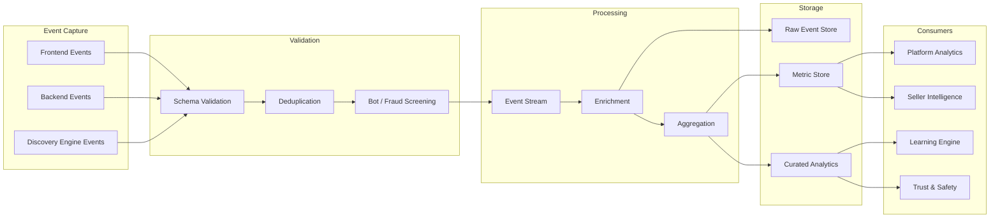

# Discovery Analytics

## Document Status

| Field                  | Value                                                                                                                  |
| ---------------------- | ---------------------------------------------------------------------------------------------------------------------- |
| **Status**             | Draft                                                                                                                  |
| **Version**            | 0.3                                                                                                                    |
| **Owner**              | PinkCurve Product Team                                                                                                 |
| **Last Reviewed**      | 2026-08-18                                                                                                             |
| **Related Components** | Discovery Engine, Buyer Experience, Adaptive Metadata Navigation, Learning Engine, Seller Intelligence, Trust & Safety |

---

## Overview

Discovery Analytics measures whether PinkCurve is helping buyers discover offerings that are relevant, useful, interesting, trustworthy, or worth exploring.

It captures and interprets discovery activity across the platform and provides evidence for:

* Discovery Engine improvement
* Adaptive Metadata Navigation improvement
* Buyer Experience improvement
* Creative optimization
* Seller Intelligence
* Brand-recognition measurement
* Trust and fraud detection
* Learning Engine development
* Product and business decisions

Discovery Analytics should measure more than clicks.

Its fundamental question is:

> Did PinkCurve help the buyer discover something worthwhile?

The answer may differ depending on the Offering type, buyer intent, discovery surface, and seller objective.

---

# Analytics Philosophy

PinkCurve should not allow one easy-to-measure metric to define success.

Clicks, viewing time, saves, and click-throughs can all provide useful evidence, but each can also be misleading when interpreted alone.

For example:

```text
Long Viewing Time
```

may mean:

```text
Strong Interest
```

or:

```text
Confusion
```

Similarly:

```text
High Click-Through Rate
```

may indicate:

```text
Strong Relevance
```

or:

```text
Misleading Creative
```

Discovery Analytics must therefore interpret **multiple signals together**.

---

# What Discovery Analytics Must Answer

## For Buyers

Analytics should help PinkCurve understand:

* Are buyers finding relevant offerings?
* Can buyers redirect discovery easily?
* Is Adaptive Metadata Navigation helping?
* Are buyers seeing excessive repetition?
* Are negative signals being respected?
* Are useful new discoveries appearing?
* Is the Daily Discovery Feed worthwhile?
* Are trust signals understandable?

---

## For Sellers and Organizations

Analytics should help answer:

* Are my offerings being discovered?
* Which offerings generate meaningful interest?
* Which creative works best?
* Which metadata attracts buyer exploration?
* Which audiences or locations respond?
* Are buyers leaving negative feedback?
* Are buyers visiting my destination?
* Is my brand recognition increasing?
* What value is PinkCurve delivering?

---

## For PinkCurve

Platform analytics should answer:

* Is discovery quality improving?
* Are ranking changes helping?
* Is AMN improving intent refinement?
* Are new offerings receiving reasonable exposure?
* Is discovery overly concentrated among a few sellers?
* Is the feed becoming repetitive?
* Are trust problems increasing?
* Are bot or manipulation patterns present?
* Which discovery surfaces are effective?
* Where are buyers abandoning discovery?

---

## For the Learning Engine

Analytics provides evidence about:

* Successful discovery
* Failed discovery
* Metadata usefulness
* Creative effectiveness
* Ranking effectiveness
* Buyer preference signals
* Negative feedback
* Exploration outcomes
* Diversity effects
* Seller outcomes
* Trust patterns

The Learning Engine should use these signals carefully rather than treating all interaction as positive engagement.

---

# Discovery Events

Discovery Analytics begins with structured events.

Events represent what happened during the buyer's discovery journey.

---

## Core Event Types

| Event                 | Meaning                                                 |
| --------------------- | ------------------------------------------------------- |
| `offering_presented`  | Offering was displayed                                  |
| `creative_started`    | Buyer began viewing creative                            |
| `creative_completed`  | Buyer viewed a meaningful portion or completed creative |
| `offering_opened`     | Buyer requested more information                        |
| `destination_clicked` | Buyer followed the provider URL                         |
| `offering_saved`      | Buyer saved an offering                                 |
| `offering_shared`     | Buyer shared an offering                                |
| `positive_feedback`   | Buyer explicitly expressed positive interest            |
| `negative_feedback`   | Buyer explicitly rejected or reduced similar discovery  |
| `offering_hidden`     | Buyer hid the offering                                  |
| `participant_hidden`  | Buyer hid a seller or provider                          |
| `offering_reported`   | Buyer submitted a trust or safety report                |

---

## Adaptive Metadata Events

AMN requires its own analytics.

Possible events include:

| Event                     | Meaning                                                     |
| ------------------------- | ----------------------------------------------------------- |
| `metadata_presented`      | Metadata choice was shown                                   |
| `metadata_selected`       | Buyer selected a metadata value                             |
| `metadata_removed`        | Buyer removed a previous choice                             |
| `metadata_path_reset`     | Buyer broadened or reset navigation                         |
| `metadata_path_completed` | Navigation led to deeper offering exploration               |
| `metadata_ignored`        | Presented metadata received no interaction where measurable |

These events allow PinkCurve to understand whether metadata actually helps buyers express intent.

---

## Discovery Navigation Events

Other navigation events may include:

* Search initiated
* Search reformulated
* Category selected
* Location changed
* Similar offerings requested
* Alternatives requested
* Discovery reset
* Feed refreshed
* Discovery mode changed

---

# Event Structure

A discovery event may contain:

| Field               | Description                            |
| ------------------- | -------------------------------------- |
| `event_id`          | Unique event identifier                |
| `event_type`        | Type of event                          |
| `timestamp`         | Event time                             |
| `offering_id`       | Offering involved where applicable     |
| `participant_id`    | Provider where applicable              |
| `buyer_id`          | Buyer identifier where permitted       |
| `session_id`        | Discovery session                      |
| `surface`           | Feed, search, browse, AMN, etc.        |
| `position`          | Presentation position where relevant   |
| `creative_id`       | Creative shown where relevant          |
| `metadata_context`  | Active metadata path                   |
| `discovery_context` | Context required for interpretation    |
| `experiment_id`     | Experiment assignment where applicable |

Exact event schemas belong in the Data Architecture and schema definitions.

See:

`../schemas/discovery-event.schema.json`

---

# Event Context

Analytics requires enough context to explain an outcome.

For example, knowing:

```text
Offering X received a click
```

is much less useful than knowing:

```text
Buyer selected:
Trail Running
    ↓
Waterproof
    ↓
Offering X presented
    ↓
Buyer opened Offering X
    ↓
Buyer clicked seller destination
```

Context allows PinkCurve to evaluate **why discovery worked**.

However, context collection must follow data-minimization and privacy principles.

---

# Signal Interpretation

Discovery signals should not automatically be categorized as positive simply because an interaction occurred.

A useful signal model may distinguish:

### Exposure Signals

The buyer had an opportunity to see something.

Examples:

* Offering presented
* Metadata presented
* Creative started

---

### Interest Signals

The buyer demonstrated possible interest.

Examples:

* Meaningful creative viewing
* Offering opened
* Metadata selected

---

### Strong Interest Signals

The buyer intentionally chose to continue exploration.

Examples:

* Offering saved
* Show more like this
* Destination clicked
* Directions requested
* Contact initiated

---

### Negative Signals

The buyer communicated that discovery was undesirable.

Examples:

* Not interested
* Show fewer like this
* Hide offering
* Hide seller
* Irrelevant

---

### Trust Signals

The interaction may indicate a trust problem.

Examples:

* Misleading information
* Incorrect offering
* Suspicious seller
* Report offering
* Broken or inconsistent destination

Trust signals should route to Trust & Safety as well as analytics.

---

# Meaningful Discovery

A **Meaningful Discovery** occurs when PinkCurve provides an offering that creates evidence of genuine buyer value.

No single action universally defines Meaningful Discovery.

Examples may include:

* Buyer explores offering details
* Buyer follows a useful metadata path
* Buyer saves an offering
* Buyer shares an offering
* Buyer visits the provider
* Buyer requests directions
* Buyer contacts an organization
* Buyer returns to an offering later
* Buyer positively rates an offering
* Buyer discovers a useful public or community resource

Meaningful Discovery is therefore a **conceptual platform outcome**, not necessarily one database event.

---

# Discovery Outcomes by Offering Type

Different Offering types require different success measurements.

| Offering Type      | Possible Meaningful Outcomes                                  |
| ------------------ | ------------------------------------------------------------- |
| Product            | Explore, save, destination visit                              |
| Commercial Service | Contact, destination visit, directions                        |
| Promotion          | Explore, destination visit, redemption signal where available |
| Event              | Save, directions, event-page visit                            |
| Brand Recognition  | Recall, repeat exposure, later exploration                    |
| Community Service  | Contact, directions, resource access                          |
| Public Service     | Information access, resource follow-through                   |

This prevents commercial click-through behavior from becoming the universal definition of discovery success.

---

# Qualified Offering Visit

A **Qualified Offering Visit (QOV)** is a meaningful click-through from PinkCurve to a commercial seller or provider destination.

QOV is an important measure of commercial discovery value.

A QOV may require criteria such as:

* Human traffic
* Valid discovery session
* Valid offering destination
* No duplicate or fraudulent activity
* Appropriate interaction qualification

Where measurable and privacy-appropriate, additional destination-quality signals may strengthen qualification.

However, PinkCurve may not always be able to observe behavior after the buyer leaves PinkCurve.

QOV should therefore avoid depending on seller-site measurements that PinkCurve cannot reliably or appropriately collect.

---

## QOV Is Not Universal

QOV is especially useful for sellers because PinkCurve normally does not process the final transaction.

However, it should not become the only platform value measure.

For example:

```text
Public Resource
    ↓
Buyer gets phone number
    ↓
Buyer calls service
```

may represent successful discovery without a QOV.

Similarly:

```text
Brand Recognition Creative
    ↓
Buyer remembers brand
    ↓
Buyer explores brand weeks later
```

requires different measurement.

---

# Discovery Funnel

A conventional commercial discovery funnel may look like:

```text
Offering Presented
      ↓
Creative Viewed
      ↓
Offering Explored
      ↓
Destination Clicked
      ↓
Qualified Offering Visit
```

But PinkCurve should support multiple paths.

For example:

```text
Offering Presented
      ↓
Metadata Selected
      ↓
Alternative Offerings
      ↓
Offering Saved
```

or:

```text
Community Resource Presented
      ↓
Offering Opened
      ↓
Directions Requested
```

Discovery Analytics must therefore support **journeys**, not merely one fixed funnel.

---

# Discovery Journey

A discovery journey represents a sequence of interactions within a discovery context.

Example:

```text
Open PinkCurve
      ↓
See Running Shoes
      ↓
Select "Trail"
      ↓
Select "Waterproof"
      ↓
View Offering A
      ↓
Not Interested
      ↓
View Offering B
      ↓
Save Offering B
      ↓
Visit Seller
```

This journey contains both negative and positive evidence.

The negative feedback on Offering A is not a failure of the entire session.

It helped the buyer refine the discovery process.

---

# Adaptive Metadata Navigation Metrics

AMN requires metrics beyond click-through rate.

Potential measures include:

### Metadata Selection Rate

How often presented metadata choices are selected.

### Metadata Progression Rate

How often a metadata selection leads to another useful refinement.

### Metadata Path Depth

How far buyers navigate through adaptive metadata before exploring an offering.

### Metadata Exit Rate

Where buyers abandon or reset navigation.

### Metadata Reversal Rate

How often buyers remove a previous metadata selection.

High reversal may indicate confusing or inappropriate metadata.

### Metadata-to-Exploration Rate

How often a metadata path leads to deeper offering exploration.

### Metadata Usefulness

A learned measure of whether a metadata dimension helps buyers reach meaningful discovery.

---

# AMN Example

```text
Shoes
  ↓
Running
  ↓
Trail
  ↓
Waterproof
  ↓
Offering Exploration
```

Analytics should be able to determine:

* Which metadata was presented
* Which metadata was selected
* Which alternatives were available
* How candidate offerings changed
* Whether the path resulted in useful discovery

This evidence will eventually allow the Learning Engine to improve AMN itself.

---

# Negative Feedback Metrics

Negative feedback is one of PinkCurve's most valuable discovery signals.

Important measurements may include:

* Not Interested rate
* Show Fewer Like This rate
* Hide Offering rate
* Hide Seller rate
* Irrelevance rate
* Misleading-content rate
* Report rate
* Repetition complaints

Analytics should distinguish **personal preference rejection** from **platform trust problems**.

For example:

```text
Not Interested
```

does not necessarily indicate a bad offering.

But:

```text
Misleading
```

may indicate a quality or trust problem requiring broader investigation.

---

# Feedback Response Measurement

PinkCurve should also measure whether it respects negative feedback.

Example:

```text
Buyer selects:
"Show fewer like this"
        ↓
Next 20 discoveries
        ↓
How many similar offerings remain?
```

If similar unwanted content continues to dominate the feed, the system has failed to respond appropriately.

This creates a metric for **feedback effectiveness**, not merely feedback collection.

---

# Discovery Relevance

Direct relevance is difficult to observe perfectly.

PinkCurve may estimate relevance using combinations of:

* Metadata selections
* Search alignment
* Positive feedback
* Negative feedback
* Offering exploration
* Saves
* Destination actions
* Repeat interest
* Immediate rejection

The system should avoid assuming that impression or viewing time alone means relevance.

---

# Discovery Diversity

Analytics should measure whether buyers are receiving meaningful variety.

Potential dimensions include:

* Seller diversity
* Brand diversity
* Price diversity
* Attribute diversity
* Category diversity
* Creative diversity
* Location diversity
* New versus established offerings

Useful metrics may include:

### Seller Concentration

How much discovery exposure is dominated by a small number of sellers.

### Repetition Rate

How often buyers see the same or highly similar offerings.

### Alternative Exposure

Whether buyers receive meaningful alternatives during focused discovery.

### Discovery Breadth

How many distinct offering characteristics appear during exploration.

Diversity metrics should measure useful choice rather than random variety.

---

# New Offering Analytics

PinkCurve should specifically measure the opportunity provided to new offerings.

Metrics may include:

* Initial eligible exposure
* Time to first meaningful discovery
* Time to first positive interaction
* New-offering negative-feedback rate
* New-offering QOV rate
* Exposure relative to comparable established offerings

This helps detect a system that unintentionally favors offerings simply because they already have historical data.

---

# Daily Discovery Feed Metrics

The Daily Discovery Feed needs its own measures.

The goal is not maximizing endless scrolling.

Useful feed measures may include:

* Fresh discovery rate
* Repetition rate
* New offering exposure
* Trending-content usefulness
* Local discovery engagement
* Promotion relevance
* Negative-feedback rate
* Feed-to-exploration rate
* Meaningful discoveries per visit

A potentially important future metric is:

### Useful Visit Rate

The percentage of feed visits that produce at least one meaningful discovery action.

This may better represent PinkCurve's goal than total time spent.

---

# Freshness

Analytics should measure whether buyers are seeing genuinely new opportunities.

Possible measures include:

* New-to-buyer offering rate
* Repeat exposure rate
* Time since previous exposure
* New category exposure
* Newly available local offering exposure

Freshness must be balanced with relevance.

---

# Trending Analytics

Trending systems require careful measurement because popularity can be manipulated.

Trending analytics may examine:

* Rate of qualified interest increase
* Geographic spread
* Buyer diversity
* Positive versus negative feedback
* Bot probability
* Seller concentration
* Time-window stability

Trend status should be auditable enough for PinkCurve to investigate suspicious spikes.

---

# Location Analytics

For location-relevant offerings, metrics may include:

* Discovery by city or region
* Distance ranges
* Nearby-offering exploration
* Location-to-click performance
* Directions requests
* Local trend behavior

Location reporting should use appropriate aggregation to avoid exposing unnecessary individual location data.

---

# Creative Analytics

Creative Studio needs evidence about how creative affects discovery.

Potential measurements include:

* Creative start rate
* Meaningful viewing rate
* Completion rate where applicable
* Offering exploration after creative
* Negative feedback after creative
* Destination click-through
* Performance by creative variant
* Performance by discovery context
* Performance by metadata path

A high-performing creative should not be defined solely by viewing time or clicks.

Creative effectiveness should incorporate downstream discovery quality.

---

# Brand Recognition Analytics

Brand Recognition requires different metrics from direct-response discovery.

Potential measures include:

* Qualified brand impressions
* Unique buyer reach
* Repeat brand exposure
* Brand creative exploration
* Brand-page exploration
* Later offering exploration
* Brand saves or follows if supported
* Geographic reach
* Category reach

Longer-term measurement may attempt to determine whether buyers who saw a brand-recognition creative later explore the seller's offerings.

PinkCurve should avoid claiming causal brand lift without sufficient evidence.

---

# Seller Value Metrics

Seller analytics should help answer:

> Is PinkCurve producing value worth what I am paying?

Potential value measures include:

* Qualified Offering Visits
* Meaningful discoveries
* Offering saves
* Contacts
* Directions
* Brand reach
* Relevant audience exposure
* Repeat interest
* Campaign performance

Seller Intelligence may combine these into a future **Seller Value Index** or similar measure.

The exact definition should remain experimental until validated.

---

# Discovery Score

The **Discovery Score** is PinkCurve's experimental attempt to summarize discovery effectiveness.

The v0.2 formula based primarily on:

```text
View Rate
Engagement Rate
CTR
QOV Rate
```

is too narrow for PinkCurve's broader discovery model.

For v0.3, Discovery Score should be treated as a **framework rather than a fixed formula**.

Possible dimensions may include:

```text
Discovery Score
     │
     ├── Relevance
     ├── Meaningful Exploration
     ├── Positive Feedback
     ├── Negative Feedback
     ├── Destination Value
     ├── Diversity
     ├── Trust
     └── Discovery Freshness
```

The final weighting should be derived from real platform evidence.

---

## Important Constraint

Discovery Score should not become a ranking objective automatically.

If one composite score becomes the sole optimization target, the platform may learn unintended behaviors.

Instead, Discovery Score should initially function as:

* A monitoring indicator
* An experimentation measure
* A comparative diagnostic
* A product-learning tool

Its relationship to ranking should be validated separately.

---

# Metric Hierarchy

PinkCurve may organize metrics into several levels.

## Level 1 — Platform Health

Examples:

* Event-delivery health
* Latency
* Error rate
* Data completeness

---

## Level 2 — Discovery Activity

Examples:

* Offerings presented
* Creative views
* Metadata selections
* Searches
* Offering opens

---

## Level 3 — Discovery Quality

Examples:

* Relevance indicators
* Negative-feedback rate
* AMN usefulness
* Diversity
* Freshness
* Repetition

---

## Level 4 — Buyer Value

Examples:

* Saves
* Useful exploration
* Directions
* Contacts
* Destination visits
* Return interest

---

## Level 5 — Seller or Organization Value

Examples:

* QOV
* Qualified reach
* Contacts
* Brand recognition
* Campaign effectiveness
* Value Index

This hierarchy helps prevent raw activity from being confused with actual value.

---

# Experimentation

Discovery Analytics should support controlled experimentation.

Potential experiments include:

* Ranking approaches
* AMN metadata selection
* Creative formats
* Feed composition
* Discovery Signals
* Negative-feedback controls
* Exploration rate
* New-offering exposure
* Ranking diversity
* Location presentation

Experiments should define:

* Hypothesis
* Control
* Treatment
* Success metrics
* Guardrail metrics
* Duration
* Sample requirements
* Decision criteria

---

# Guardrail Metrics

An experiment may improve one metric while damaging another.

For example:

```text
CTR ↑
```

while:

```text
Negative Feedback ↑
Seller Diversity ↓
Trust Reports ↑
```

should not automatically be considered successful.

Useful guardrails may include:

* Negative-feedback rate
* Trust reports
* Seller concentration
* Repetition
* Latency
* Buyer complaints
* Privacy impact

---

# Seller Dashboard

The Seller Dashboard should translate analytics into understandable business information rather than expose raw platform complexity.

Potential views include:

* Offering discovery
* Meaningful discovery
* QOV
* Campaign performance
* Creative performance
* Metadata insights
* Geographic discovery
* Brand recognition
* Trends
* Negative feedback
* Value delivered

Seller Intelligence should convert analytics into recommended actions.

For example:

```text
Observation:
Buyers frequently select "Waterproof"
but your offering does not clearly show this feature.

Possible Recommendation:
Add waterproof information and supporting imagery.
```

See: [Seller Intelligence](09-seller-intelligence.md)

---

# Platform Analytics

Internal PinkCurve analytics may monitor:

* Overall discovery quality
* Ranking behavior
* AMN performance
* Feed health
* New-offering exposure
* Seller concentration
* Bot traffic
* Trust incidents
* Creative performance
* Experiment results
* System anomalies
* Data pipeline health

Internal analytics may contain more technical detail than seller-facing analytics.

---

# Buyer-Facing Analytics

PinkCurve may eventually provide limited buyer-facing controls or insights such as:

* Saved offerings
* Discovery history
* Preference controls
* Hidden offerings
* Hidden sellers
* Metadata interests

The objective should be control and transparency rather than behavioral profiling for its own sake.

---

# Event Processing Architecture



The exact infrastructure can evolve independently of this logical architecture.

---

# Raw Events and Derived Metrics

PinkCurve should distinguish between:

### Raw Events

What actually happened.

Example:

```text
metadata_selected = "Waterproof"
```

### Derived Metrics

An analytical interpretation.

Example:

```text
Waterproof metadata selection rate = 32%
```

### Learned Signals

Patterns generated by models or statistical analysis.

Example:

```text
"Waterproof" appears highly useful for trail-running discovery.
```

Maintaining this separation improves explainability and auditability.

---

# Data Quality

Analytics is only useful when its underlying data is reliable.

Important controls include:

### Schema Validation

Ensure events conform to expected structures.

### Timestamp Validation

Detect invalid or delayed timestamps.

### Deduplication

Prevent duplicate event counting.

### Session Integrity

Identify corrupted or impossible event sequences.

### Bot Detection

Identify automated or fraudulent interactions.

### Attribution Integrity

Avoid assigning one event to the wrong campaign, offering, or discovery path.

### Missing Event Monitoring

Detect sudden drops that may indicate instrumentation problems.

---

# Bot and Manipulation Detection

Discovery metrics influence seller value and eventually learning.

They therefore represent a potential manipulation target.

Analytics should help detect:

* Automated clicks
* Artificial views
* Coordinated engagement
* Seller-generated fake traffic
* Repeated suspicious sessions
* Abnormal geographic patterns
* Unusual event velocity

Suspicious activity should not be counted as normal discovery value.

See: [Security, Privacy, and Trust](12-security-privacy-and-trust.md)

---

# Privacy

Discovery Analytics must follow PinkCurve's privacy principles.

These include:

* Data minimization
* Purpose limitation
* Appropriate consent
* Secure storage
* Access controls
* Retention policies
* Aggregation
* De-identification where appropriate
* Buyer controls

Analytics should collect information because it supports discovery, trust, operations, or legitimate measurement—not because the information might someday be useful.

---

# Identified Buyers

When a buyer account exists and appropriate permissions apply, analytics may support:

* Cross-session preferences
* Saved offerings
* Discovery history
* Feedback effectiveness
* Personalized discovery

Identity should be separated from analytical data where practical.

---

# Anonymous or Unidentified Sessions

If PinkCurve supports any unidentified browsing states, analytics should minimize persistent tracking and avoid unnecessary cross-session profiling.

The exact account and buyer-verification policy is defined elsewhere in the Blueprint.

---

# Data Retention

Different analytical data may require different retention periods.

For example:

* Raw events
* Aggregated metrics
* Fraud evidence
* Experiment results
* Billing evidence
* Seller reports

should not automatically share the same retention policy.

Retention requirements should be documented in the Data Architecture and privacy policies.

---

# Analytics and Billing

If PinkCurve eventually bills sellers based on measurable discovery activity such as QOV, billing measurements require stronger integrity controls than ordinary analytics.

Billing-related events may require:

* Immutable records
* Deduplication
* Bot exclusion
* Auditability
* Reconciliation
* Seller-visible explanations
* Dispute support

Analytics and billable events may originate from the same event system but should not be assumed to have identical verification requirements.

---

# Current Status

## Implemented

* Limited basic offering-view tracking

---

## In Development

* Discovery event model
* Analytics architecture
* Buyer interaction instrumentation
* AMN event definitions

---

## Planned

* Complete discovery event schema
* Event processing pipeline
* Metadata-navigation analytics
* Negative-feedback analytics
* QOV measurement
* Discovery Score experimentation
* Seller dashboard
* Platform analytics
* Diversity metrics
* New-offering metrics
* Daily Discovery Feed metrics
* Creative analytics
* Brand-recognition analytics
* Location analytics
* Bot and manipulation detection
* Experimentation framework
* Seller Value measurement
* Learning Engine integration

---

# Initial MVP Analytics

PinkCurve does not need every metric before launching an MVP.

The first analytics implementation should focus on capturing high-quality fundamental events.

An initial MVP may measure:

```text
Offering Presented
      ↓
Creative Viewed
      ↓
Offering Opened
      ↓
Metadata Selected
      ↓
Positive / Negative Feedback
      ↓
Destination Clicked
```

Along with:

* Session context
* Discovery surface
* Offering
* Creative
* Active metadata path
* Bot filtering

These events will provide the evidence needed to improve Discovery Engine behavior.

It is more important to capture **correct, interpretable events** than to create dozens of premature metrics.

---

# Open Questions

See [Open Decisions](19-open-decisions.md) for questions including:

* Discovery Score definition
* Meaningful Discovery definition
* QOV qualification
* AMN usefulness metrics
* Seller Value Index
* Feed usefulness measurement
* Brand-recognition measurement
* Attribution windows
* Experiment methodology
* Data retention
* Anonymous browsing analytics
* Billing-event qualification

---

# Design Principles

### Measure Discovery, Not Just Engagement

Activity is evidence. Buyer value is the objective.

### Preserve the Journey

Individual events gain meaning from the discovery path around them.

### Negative Feedback Is Valuable Data

Rejection helps PinkCurve understand relevance and should not be treated merely as failure.

### AMN Must Be Measurable

Adaptive navigation can only improve if PinkCurve understands which metadata helps buyers.

### Commercial Metrics Are Not Universal

QOV matters greatly for sellers but should not define success for every Offering type.

### Avoid Single-Metric Optimization

No single metric should control product behavior without guardrails.

### Protect Metric Integrity

Bots and manipulation can corrupt discovery, learning, seller reporting, and billing.

### Analytics Must Be Explainable

PinkCurve should distinguish raw events, derived metrics, and learned interpretations.

### Privacy Applies to Measurement

The ability to collect information does not automatically justify collecting it.

### Start Simple

The MVP should capture trustworthy events first and add sophisticated metrics as evidence grows.

---

# Related Documents

* [Product Architecture](03-product-architecture.md)
* [Offering Knowledge](04-offering-knowledge.md)
* [Creative Studio](05-creative-studio.md)
* [Discovery Engine](06-discovery-engine.md)
* [Learning Engine](08-learning-engine.md)
* [Seller Intelligence](09-seller-intelligence.md)
* [AI Platform](10-ai-platform.md)
* [Data Architecture](11-data-architecture.md)
* [Security, Privacy, and Trust](12-security-privacy-and-trust.md)
* [Buyer Experience](20-buyer-experience.md)
* [Open Decisions](19-open-decisions.md)
* [Discovery Event Schema](../schemas/discovery-event.schema.json)
* [Discovery Score Schema](../schemas/discovery-score.schema.json)
