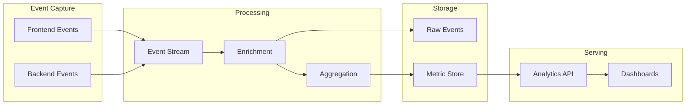

# Discovery Analytics

## Document Status

| Field | Value |
|-------|-------|
| **Status** | Draft |
| **Version** | 0.2 |
| **Owner** | PinkCurve Product Team |
| **Last Reviewed** | 2026-08-10 |
| **Related Components** | Discovery Engine, Learning Engine, Seller Intelligence |

---

## Overview

Discovery Analytics measures the effectiveness of discovery across the PinkCurve platform. It captures buyer interactions with offerings, evaluates discovery quality, and provides the learning signals that continuously improve the Discovery Engine, Buyer Experience, and Participant Intelligence.

---

## Purpose

Discovery Analytics answers key questions:

**For the Platform:**
- How effective is discovery matching?
- Which offerings are being discovered?
- Where are discovery failures occurring?

**For Sellers:**
- How are my offerings performing?
- Who is discovering my products?
- What actions are buyers taking?

**For the Learning Engine:**
- What signals indicate successful discovery?
- What patterns predict engagement?
- How can matching be improved?

---

## Discovery Events

### Event Types

| Event | Description | Signal Strength |
|-------|-------------|-----------------|
| `Offering shown` | Offering shown to buyer | Weak |
| `View offering details` | Buyer clicked to view details | Moderate |
| `Engage with offering` | Extended engagement (scroll, read) | Moderate-Strong |
| `Click through to seller` | Click to seller's website | Strong |
| `Buyer saved offering` | Buyer saved offering | Strong |
| `Share offering` | Buyer shared offering | Strong |

### Event Structure

Each discovery event captures:

| Field | Description |
|-------|-------------|
| `event_id` | Unique event identifier |
| `event_type` | Type of interaction |
| `timestamp` | When it occurred |
| `offering_id` | Offering involved |
| `buyer_id` | Buyer (if identified) |
| `session_id` | Session identifier |
| `surface` | Where discovery occurred (feed, search, browse) |
| `position` | Position in results |
| `context` | Additional context (device, referrer) |

See schema: [discovery-event.schema.json](../schemas/discovery-event.schema.json)

---

## Key Metrics

### Qualified Product Visit (QPV)

A **Qualified Product Visit** is a click-through to the seller's website that meets quality criteria:

- Minimum time on seller site (if measurable)
- Not flagged as bot traffic
- From a verified session

**QPV is the primary unit of value** that PinkCurve delivers to sellers.

### Discovery Score

**Discovery Score** is an experimental composite metric measuring overall discovery effectiveness.

| Component | Weight | Description |
|-----------|--------|-------------|
| View Rate | 20% | Impressions → Views |
| Engagement Rate | 25% | Views → Engagement |
| Click-Through Rate | 30% | Views → Click-throughs |
| QPV Rate | 25% | Click-throughs → Qualified Visits |

*Note: Discovery Score is experimental. Weightings are hypotheses to be validated.*

Formula (draft):
```
Discovery Score = (0.20 × ViewRate) + (0.25 × EngagementRate)
                + (0.30 × CTR) + (0.25 × QPVRate)
```

Normalized to 0-100 scale.

### Funnel Metrics

```
Impressions
    ↓ (View Rate)
Views
    ↓ (Engagement Rate)
Engagements
    ↓ (Click-Through Rate)
Click-Throughs
    ↓ (QPV Rate)
Qualified Product Visits
```

---

## Analytics Dimensions

### Time
- Hourly, daily, weekly, monthly aggregations
- Time-of-day patterns
- Day-of-week patterns

### Offering
- Per-offering performance
- Category performance
- Price range performance

### Seller
- Aggregate seller performance
- Cross-offering insights

### Surface
- Feed vs. search vs. browse performance
- Position effect analysis

### Audience
- Segment performance (if personalization active)
- Geographic performance

---

## Reporting

### Seller Dashboard (Planned)

Real-time and historical views:
- Discovery funnel visualization
- Offering performance rankings
- Trend analysis
- Comparative benchmarks

### Platform Analytics (Planned)

Internal monitoring:
- System-wide discovery health
- Anomaly detection
- A/B test results

---

## Event Processing Architecture



---

## Data Quality

### Event Validation
- Schema validation on ingestion
- Timestamp sanity checks
- Required field enforcement

### Bot Detection
- Traffic pattern analysis
- Known bot filtering
- Anomaly detection

### Deduplication
- Idempotent event processing
- Session-based deduplication

---

## Privacy Considerations

Discovery Analytics must respect privacy:

- **Anonymous users:** Track events without personal identification
- **Consented users:** Additional behavioral tracking with consent
- **Data retention:** Clear retention policies
- **Aggregation:** Individual-level data protected; aggregates available

See [Security, Privacy, and Trust](12-security-privacy-and-trust.md).

---

## Current Status

### Implemented
- Basic offering view tracking (limited)

### Planned
- Full discovery event schema
- Event processing pipeline
- Metrics calculation
- Seller dashboards

---

## Meaningful Discovery

PinkCurve measures more than clicks.

The objective is to understand whether an offering helped a buyer discover something worthwhile.

Examples of meaningful discovery actions include:

- Viewing an offering
- Watching a video
- Saving an offering
- Sharing an offering
- Requesting directions
- Contacting the organization
- Visiting an external website
- Returning later
- Explicitly indicating "Not Interested"

Different offering types may have different success metrics.

Commercial offerings may emphasize Qualified Product Visits.

Community offerings may emphasize contacts, directions, or resource engagement.

Discovery Analytics provides the signals that allow PinkCurve to continuously improve discovery while respecting user privacy.

---

## Related Documents

- [Discovery Engine](06-discovery-engine.md)
- [Learning Engine](08-learning-engine.md)
- [Seller Intelligence](09-seller-intelligence.md)
- [Discovery Event Schema](../schemas/discovery-event.schema.json)
- [Discovery Score Schema](../schemas/discovery-score.schema.json)
