# Learning Engine

## Document Status

| Field                  | Value                                                                                                                                                                                                  |
| ---------------------- | ------------------------------------------------------------------------------------------------------------------------------------------------------------------------------------------------------ |
| **Status**             | Draft                                                                                                                                                                                                  |
| **Version**            | 0.3                                                                                                                                                                                                    |
| **Owner**              | PinkCurve Product Team                                                                                                                                                                                 |
| **Last Reviewed**      | 2026-08-24                                                                                                                                                                                             |
| **Related Components** | Discovery Analytics, AI Discovery, Discovery Engine, Adaptive Metadata Navigation, Offering Knowledge, Creative Studio, Seller Intelligence, Buyer Intelligence, Trust, AI Platform, Data Architecture |

---

## Overview

The **Learning Engine** is the PinkCurve product responsible for transforming trustworthy discovery activity and platform evidence into validated learning that improves PinkCurve over time.

A primary output of the Learning Engine is a collection of **purpose-specific learned models** that are consumed by other PinkCurve products.

Rather than building one general-purpose PinkCurve model, the Learning Engine may create, evaluate, version, and update different models for different learning objectives.

Examples include:

| Learning Engine Model           | Primary Consumer                  | Purpose                                       |
| ------------------------------- | --------------------------------- | --------------------------------------------- |
| **Retrieval Model**             | AI Discovery                      | Improve candidate retrieval                   |
| **Ranking Model**               | AI Discovery                      | Improve Offering ranking                      |
| **Similarity Model**            | AI Discovery                      | Improve similar-Offering retrieval            |
| **Exploration Model**           | AI Discovery                      | Improve exploration decisions                 |
| **New-Offering Exposure Model** | AI Discovery                      | Improve opportunities for new Offerings       |
| **Diversity Model**             | AI Discovery                      | Improve discovery diversity                   |
| **Feed Composition Model**      | AI Discovery                      | Improve Daily Discovery Feed composition      |
| **Buyer Intent Model**          | Buyer Intelligence                | Improve interpretation of Buyer intent        |
| **Context Model**               | Buyer Intelligence / AI Discovery | Improve interpretation of discovery context   |
| **Metadata Selection Model**    | Adaptive Metadata Navigation      | Improve metadata selection and sequencing     |
| **Creative Performance Model**  | Creative Studio / AI Discovery    | Improve Creative generation and selection     |
| **Trust/Fraud Model**           | Trust                             | Improve fraud, abuse, bot, and risk detection |

The exact number and type of models will evolve as PinkCurve develops. PinkCurve should create a model only when sufficient trustworthy evidence demonstrates that the model provides value.

During Alpha and early development, some learning objectives may therefore use:

* rules;
* manually controlled weights;
* statistical relationships;
* scores;
* thresholds;
* parameters;
* heuristics;

instead of trained machine-learning models.

These are also valid Learning Engine outputs.

The long-term architecture is therefore:

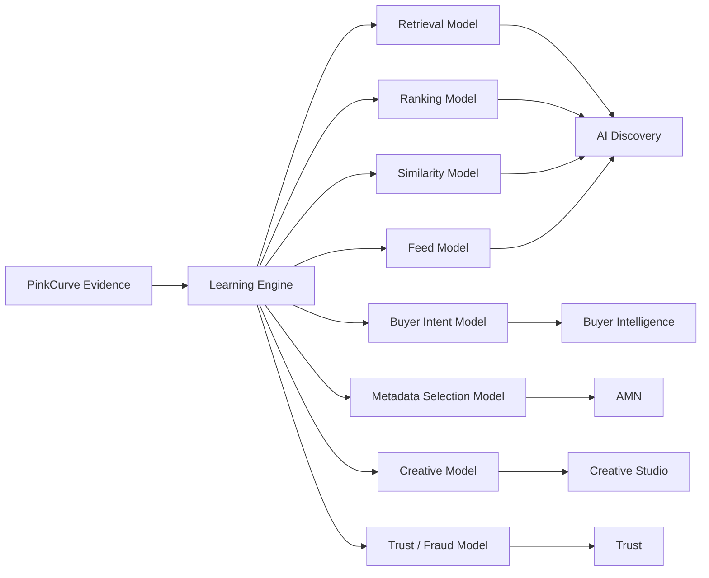

The Learning Engine **creates and improves learning models and other validated learning outputs**.

The consuming PinkCurve products **use those outputs to perform their own responsibilities**.

For example:

> **Learning Engine trains and validates a Ranking Model → AI Discovery consumes the Ranking Model → AI Discovery ranks Offerings.**

Similarly:

> **Learning Engine trains and validates a Buyer Intent Model → Buyer Intelligence consumes the model → Buyer Intelligence produces better Buyer Signals.**

And:

> **Learning Engine trains and validates a Metadata Selection Model → AMN consumes the model → AMN provides better adaptive metadata navigation.**

This separation is fundamental to the PinkCurve architecture.

The Learning Engine does **not** become the runtime decision-maker for the entire platform simply because it created a model.

Instead:

> **Learning Engine learns and produces models.
> PinkCurve products consume those models and perform their specialized responsibilities.**

The Learning Engine learns from:

* Buyer interactions;
* explicit Buyer feedback;
* negative feedback;
* Adaptive Metadata Navigation activity;
* discovery outcomes;
* Creative performance;
* Offering Knowledge;
* Seller activity;
* Trust signals;
* platform experiments;
* contextual evidence;
* Discovery Analytics.

The Learning Engine does not exist merely to increase engagement.

Its purpose is to improve PinkCurve's ability to help Buyers **discover what matters** while increasing legitimate value for Sellers and organizations and preserving:

* Trust;
* privacy;
* diversity;
* fairness;
* Buyer control;
* exploration;
* explainability;
* platform integrity.

As PinkCurve accumulates trustworthy evidence, the Learning Engine can progressively improve its purpose-specific models. New model versions are evaluated and validated before being made available to consuming products.

This creates a controlled learning cycle:

**PinkCurve activity → trustworthy evidence → Learning Engine → purpose-specific models and other learning outputs → consuming PinkCurve products → improved PinkCurve behavior → new evidence.**

The core principle is:

> **The Learning Engine learns and produces validated models and other learning outputs. Each consuming PinkCurve product uses those outputs to perform its own responsibility.**

---

# Purpose

PinkCurve becomes more valuable when useful discovery produces evidence that improves future discovery.

The core learning cycle is:

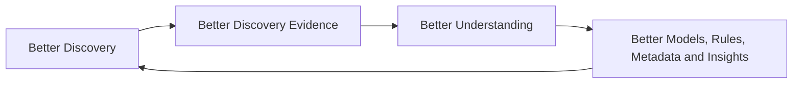

This differs from a conventional engagement loop:

```text
More Engagement
      ↓
More Engagement Optimization
      ↓
More Engagement
```

PinkCurve should not optimize for attention itself.

The Learning Engine should optimize toward **discovery quality, Buyer value, Seller value, and platform integrity**.

---

# Why Continuous Learning Matters

Without learning:

* discovery remains static;
* ranking does not improve from actual behavior;
* AMN cannot learn which metadata is useful;
* Creative performance remains guesswork;
* Offering Knowledge does not benefit from discovery evidence;
* negative feedback is not converted into improvement;
* Seller insights remain primarily descriptive rather than actionable;
* useful new discovery patterns remain unnoticed;
* Trust patterns are harder to identify;
* platform intelligence does not compound.

With responsible learning, PinkCurve can gradually improve based on real evidence rather than assumptions.

However, **continuous learning does not mean that every interaction immediately retrains a model**.

Every appropriate interaction may contribute evidence.

Evidence accumulates.

The Learning Engine determines when there is sufficient trustworthy information to justify new learning, evaluation, retraining, or another improvement.

---

# Learning Philosophy

PinkCurve should learn carefully.

Not every interaction is a correct learning signal.

For example:

```text
Buyer watches Creative for 20 seconds
```

might mean:

```text
Strong Interest
```

but it might also mean:

```text
Confusion
```

Likewise:

```text
Buyer clicks Offering
```

may indicate:

* relevance;
* curiosity;
* accidental interaction;
* misleading Creative.

The Learning Engine should therefore combine multiple signals rather than automatically treating activity as success.

---

# Learning Principles

### Learn From Discovery, Not Attention Alone

Clicks and viewing time are useful evidence but not final objectives.

### Explicit Buyer Intent Matters

Direct Buyer actions such as metadata selections, `Not Interested`, `Show More Like This`, search, and explicit preference changes should generally carry more meaning than weak inferred behavior.

### Negative Feedback Is Valuable

The system must learn what Buyers do not want as well as what they appear to like.

### Learning Must Be Explainable

PinkCurve should understand what evidence influenced important system changes.

### Facts Must Remain Facts

Learned behavior must not silently overwrite verified Offering Knowledge.

### Trust Overrides Optimization

A model must not increase exposure for a suspicious or unsafe Offering simply because that Offering performs well according to commercial or engagement metrics.

### Buyer Control Must Survive Learning

Personalization should not trap Buyers inside previous behavior.

### Exploration Must Survive Learning

Learning should not permanently favor Offerings, Sellers, categories, or Creative that accumulated evidence early.

### Learning Must Be Measured

A model change should not be assumed to be an improvement merely because an offline metric increased.

### Learning Must Be Reversible

Important learned outputs should be versioned and rollback-capable where appropriate.

### Complexity Must Follow Evidence

PinkCurve should not create sophisticated models before sufficient trustworthy evidence demonstrates that those models are needed.

---

# Learning Engine Position in PinkCurve

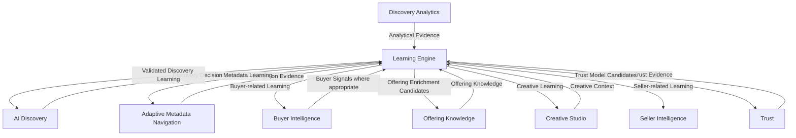

This is a logical product relationship.

It does not imply that every box must become:

* a microservice;
* a database;
* an independent project;
* a dedicated team;
* a department.

Those decisions belong to later System Design and organizational planning.

---

# Learning Inputs

The Learning Engine consumes evidence primarily from Discovery Analytics and other authorized PinkCurve products.

Potential inputs include:

* Discovery Events;
* Buyer feedback;
* AMN activity;
* Creative performance;
* Offering Knowledge;
* Seller activity;
* Trust signals;
* experiments;
* context;
* Buyer Intelligence signals where appropriate;
* AI Discovery decision context.

Conceptually:

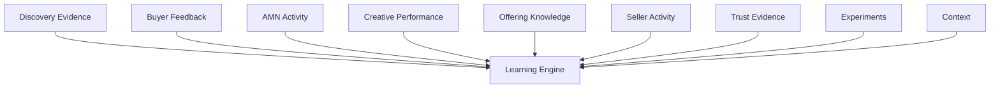

Not every input must necessarily pass through Discovery Analytics.

The exact interfaces will be determined during System Design.

---

# Signal Categories

## 1. Exposure Signals

These indicate that the Buyer had an opportunity to interact.

Examples:

* Offering presented;
* Creative displayed;
* metadata presented;
* search result displayed.

Exposure alone is a weak learning signal.

---

## 2. Interest Signals

These indicate possible interest.

Examples:

* Offering opened;
* meaningful Creative view;
* metadata selected;
* similar Offerings requested.

These signals are useful but remain ambiguous.

---

## 3. Strong Positive Signals

These indicate deliberate continuation of discovery.

Examples:

* Offering saved;
* `Show More Like This`;
* destination clicked;
* directions requested;
* contact initiated;
* positive rating;
* return to Offering.

---

## 4. Negative Signals

Examples include:

* `Not Interested`;
* `Show Fewer Like This`;
* hide Offering;
* hide Seller;
* irrelevant;
* repeated rapid skipping;
* metadata reversal.

Negative signals are essential to Buyer-controlled discovery.

---

## 5. Trust Signals

Examples include:

* misleading information;
* Offering reported;
* suspicious Seller;
* destination mismatch;
* fraud indicators;
* bot activity.

Trust signals should influence learning only through appropriate Trust policies.

They should not be treated as ordinary Buyer preference signals.

---

## 6. Adaptive Metadata Signals

AMN produces particularly valuable learning evidence.

Examples include:

* metadata presented;
* metadata selected;
* metadata ignored;
* metadata removed;
* metadata path completed;
* metadata path reset;
* metadata sequences leading to worthwhile discovery.

These signals help PinkCurve learn **how Buyers progressively communicate intent**.

---

# Signal Strength

PinkCurve should not assume every event has equal learning value.

A conceptual signal hierarchy may range from:

```text
Weak
│
├── Offering Presented
├── Creative Started
├── Meaningful View
├── Offering Opened
├── Metadata Selected
├── Save
├── Show More Like This
├── Destination Action
└── Explicit Feedback
Strong
```

However, signal strength depends on context.

Explicit negative feedback may be stronger than several positive implicit signals.

Signal weights should be validated rather than permanently hard-coded.

---

# From Evidence to Learning

The Learning Engine should preserve the distinction among evidence, analytics, learning, and operational use.

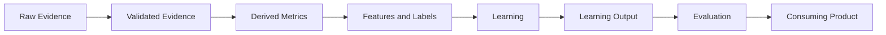

### Raw Events

Describe what actually happened.

Example:

```text
metadata_selected = "Waterproof"
```

### Derived Metrics

Provide analytical interpretation.

Example:

```text
42% of qualified trail-running sessions select Waterproof
```

### Learned Signals

Identify a learned relationship.

Example:

```text
Waterproof appears highly useful for trail-running discovery in this context
```

### Application

A consuming product uses the validated learning.

Example:

```text
AMN gives Waterproof higher presentation priority
```

This lineage improves:

* explainability;
* auditability;
* debugging;
* evaluation;
* governance.

---

# Discovery Analytics and Learning Engine

Discovery Analytics and Learning Engine are related but distinct products.

Discovery Analytics primarily asks:

> **What happened, and how should PinkCurve measure it?**

Learning Engine primarily asks:

> **What can PinkCurve responsibly learn from that evidence?**

Discovery Analytics may own:

* derived metrics;
* discovery journeys;
* QOV measurement;
* AMN metrics;
* Creative metrics;
* Feed metrics;
* diversity metrics;
* experiment measurement;
* Seller-value measurements.

Learning Engine may own:

* learned relationships;
* learned rules;
* model training;
* learned parameters;
* learned signals;
* label construction;
* feature engineering;
* improvement candidates;
* model evaluation.

The relationship is:

```text
Discovery Analytics
        ↓
Analytical Evidence
        ↓
Learning Engine
        ↓
Validated Learning
```

---

# Learning Outputs

The Learning Engine should support improvements across the PinkCurve platform.

Learning outputs may include:

* Learned Signals;
* Learned Rules;
* statistical relationships;
* scores;
* parameters;
* model candidates;
* validated model versions;
* metadata-usefulness learning;
* Offering enrichment candidates;
* Creative insights;
* Seller recommendation evidence;
* Buyer-related learning;
* Trust-model candidates;
* evaluation results.

Learning therefore serves the platform rather than one single model.

---

# Learning Engine Output Contract

Every significant Learning Engine output should be identifiable, versioned, traceable, and appropriate for its intended consumer.

A logical Learning Output may include:

* learning output identifier;
* output type;
* intended consuming product;
* applicable context;
* learned value, rule, parameter, score, or model reference;
* confidence or strength where appropriate;
* supporting evidence;
* evidence/provenance reference;
* model or rule version;
* evaluation status;
* creation time;
* validity period where appropriate;
* governance status;
* approval status.

The exact:

* schemas;
* APIs;
* databases;
* model-registry representation;
* storage format;
* deployment mechanism;

belong to later System Design and Data Design.

---

# Learning Outputs by Consumer

| Learning Output                   | Primary Consumer                  | Purpose                                  |
| --------------------------------- | --------------------------------- | ---------------------------------------- |
| Retrieval models or parameters    | AI Discovery                      | Improve candidate retrieval              |
| Ranking models or parameters      | AI Discovery                      | Improve Ranking                          |
| Intent inference learning         | Buyer Intelligence                | Improve Buyer intent interpretation      |
| Context relationships/models      | Buyer Intelligence / AI Discovery | Improve contextual interpretation        |
| Metadata usefulness learning      | AMN                               | Improve adaptive navigation              |
| Similarity models/representations | AI Discovery                      | Improve similar-Offering retrieval       |
| Exploration learning              | AI Discovery                      | Improve exploration strategy             |
| New-Offering exposure learning    | AI Discovery                      | Improve opportunity for new Offerings    |
| Diversity learning                | AI Discovery                      | Improve result-set diversity             |
| Feed composition learning         | AI Discovery                      | Improve Daily Discovery Feed             |
| Creative-performance learning     | Creative Studio / AI Discovery    | Improve Creative generation or selection |
| Offering enrichment candidates    | Offering Knowledge                | Improve learned Offering knowledge       |
| Buyer-related learned outputs     | Buyer Intelligence                | Improve Buyer Signals                    |
| Seller-related learned outputs    | Seller Intelligence               | Improve Seller recommendations           |
| Trust-model candidates            | Trust                             | Improve fraud, abuse, and risk detection |

Not every output needs to be an ML model.

During early PinkCurve phases, many outputs may instead be:

* rules;
* manually controlled weights;
* statistical relationships;
* thresholds;
* scores;
* parameters.

---

# Learning Objective 1: Improve AI Discovery

The Learning Engine may improve AI Discovery by producing learning for:

* candidate retrieval;
* Ranking;
* similar-Offering retrieval;
* context interpretation;
* exploration;
* new-Offering exposure;
* diversity;
* Feed composition;
* Creative selection.

AI Discovery remains responsible for production discovery decisions.

The Learning Engine does not directly rank Offerings in production.

---

# Candidate Retrieval Learning

The Learning Engine may identify relationships that improve retrieval.

Potential evidence includes:

* metadata alignment;
* semantic similarity;
* successful discovery paths;
* Buyer intent;
* category relationships;
* location/context;
* similar-Offering behavior.

Possible Learning Engine outputs include:

* retrieval weights;
* retrieval rules;
* retrieval parameters;
* embeddings or improved representations;
* retrieval models.

AI Discovery consumes the validated output.

---

# Ranking Learning

A future Ranking model may estimate concepts such as:

> **Expected Discovery Value**

using appropriate evidence such as:

* current Buyer intent;
* metadata selections;
* Offering relevance;
* context;
* Trust;
* positive feedback;
* negative feedback;
* discovery history;
* Creative effectiveness;
* diversity contribution;
* freshness;
* exploration value.

This should not be interpreted as one permanent mathematical formula.

The model architecture and target definition should evolve from real evidence.

Learning Engine may train and evaluate Ranking models.

AI Discovery uses approved models or parameters for production Ranking.

---

# Learning Objective 2: Improve Adaptive Metadata Navigation

AMN is a PinkCurve product that can become more effective through learning.

The Learning Engine may learn:

* which metadata dimensions are useful;
* which metadata should appear first;
* which metadata choices are confusing;
* which metadata sequences lead to Meaningful Discovery;
* which dimensions are useful for specific Offering categories;
* which dimensions matter in different locations or contexts;
* which metadata creates dead ends;
* which metadata should be deemphasized when irrelevant.

For example:

```text
Trail Running
      ↓
Waterproof
      ↓
Terrain
      ↓
Cushioning
      ↓
Offering Exploration
```

may prove more useful than presenting:

```text
Manufacturing Country
```

at that point in the Buyer journey.

This does not mean unused metadata should be deleted from Offering Knowledge.

It means the Learning Engine may learn **when metadata appears useful**, and AMN may use that learning to determine what should be presented.

The boundary is:

> **Learning Engine learns metadata usefulness.**
>
> **AMN performs adaptive navigation.**

---

# Learning Objective 3: Improve Offering Knowledge

Learning may identify patterns that enrich PinkCurve's understanding of Offerings.

Examples include:

* frequently selected attributes;
* emerging use cases;
* audience-response patterns;
* location relevance;
* seasonal relevance;
* useful metadata relationships;
* common negative-feedback patterns.

However, learned information must remain distinguishable from Seller- or organization-supplied facts.

For example:

```text
Seller Fact:
Waterproof = Yes

Learned Knowledge:
Frequently explored by Buyers looking for wet-weather trail running
```

The Learning Engine should not silently modify the factual property.

Instead, it may produce an **Offering Knowledge enrichment candidate**.

Offering Knowledge determines how validated Learned Knowledge becomes part of the Offering Knowledge model.

---

# Learning Objective 4: Improve Creative

The Learning Engine may identify:

* Creative formats that improve Buyer understanding;
* scenes that lead to useful exploration;
* messages that perform well;
* Creative that generates negative feedback;
* appropriate duration;
* Creative effectiveness in different contexts;
* Brand Recognition Creative associated with later exploration.

Creative learning should avoid optimizing toward clickbait.

A Creative that receives many clicks but produces high negative feedback may be harmful.

Creative Studio owns:

* Creative Briefs;
* concepts;
* scripts;
* storyboards;
* Creative Packages;
* Creative variants;
* Creative lifecycle.

Learning Engine provides validated Creative learning.

Creative Studio and AI Discovery consume it as appropriate.

---

# Learning Objective 5: Support Seller Intelligence

Learning should help produce evidence that Seller Intelligence can turn into useful Seller recommendations.

Examples include:

* Buyers frequently select a feature that current Creative does not emphasize;
* an Offering performs better in a particular geographic area;
* one Creative variant produces higher-quality discovery;
* Buyers frequently reject a particular message;
* a promotion generates interest but few destination visits;
* Offering Knowledge may be missing useful metadata;
* Brand Recognition exposure appears associated with later Offering exploration.

The Learning Engine produces evidence or learned relationships.

Seller Intelligence converts these into understandable recommendations.

Seller Experience presents the recommendations and allows Sellers to act on them.

The Learning Engine does **not** replace Seller Intelligence.

---

# Learning Objective 6: Support Buyer Intelligence

Buyer Intelligence represents PinkCurve's permitted understanding of how to serve a Buyer better now and over time.

The Learning Engine may help improve:

* preference interpretation;
* changing-interest recognition;
* metadata-interest relationships;
* negative-preference interpretation;
* context relationships;
* exploration/diversity preference models;
* longer-term pattern recognition.

Buyer Intelligence remains responsible for:

* Session Intent;
* Short-Term Interests;
* Persistent Preferences;
* Negative Preferences;
* Contextual Signals;
* Behavioral Signals;
* Inferred Intelligence;
* Buyer Signals.

The Learning Engine therefore **supports Buyer Intelligence** rather than "building" or owning it.

Current-session intent should often outweigh historical assumptions.

---

# Learning Objective 7: Support Trust

Learning may help identify patterns such as:

* suspicious Seller behavior;
* repeated misleading-content reports;
* coordinated bot traffic;
* artificial engagement;
* abnormal discovery behavior;
* destination inconsistencies;
* fraud indicators.

The Learning Engine may train or evaluate Trust-related model candidates.

However:

> **Trust owns operational Trust policy, decisions, and enforcement.**

Trust models should be governed separately from commercial optimization.

A fraud or safety decision should never be driven simply by an engagement or Seller-revenue objective.

---

# Types of Learning

PinkCurve should not assume that every improvement requires machine learning.

Several forms of learning may coexist.

## Rule Learning

Human-designed rules may be adjusted based on evidence.

Example:

```text
Repeated complaints about excessive Seller exposure
        ↓
Evaluate Seller concentration
        ↓
Adjust exposure rule
```

---

## Statistical Learning

Analysis may identify useful patterns.

Example:

```text
Metadata A produces substantially better exploration
than Metadata B in a particular context.
```

---

## Machine Learning

Models may learn relationships from historical discovery data.

Potential examples include:

* Ranking;
* retrieval;
* metadata selection;
* Creative selection;
* intent interpretation;
* similarity;
* Feed composition;
* Trust/fraud detection.

---

## AI-Assisted Analysis

LLMs or other AI systems may summarize patterns and propose hypotheses.

Examples:

* Seller recommendations;
* Offering Knowledge gaps;
* Creative improvement suggestions;
* unusual discovery patterns.

AI-generated interpretations must remain grounded in measured evidence.

---

# Models

The Learning Engine may eventually create or update several model families.

These may include:

* Ranking models;
* retrieval models;
* Buyer intent models;
* context models;
* metadata-selection models;
* similarity models;
* exploration models;
* Feed models;
* Creative-performance models;
* Trust/fraud model candidates.

However:

> **The existence of a learning problem does not automatically justify a dedicated ML model.**

PinkCurve should use:

* rules;
* simple scoring;
* statistical methods;
* manually controlled weights;

when those methods are sufficient.

More sophisticated models should be introduced when trustworthy evidence demonstrates meaningful value.

---

# Model Ownership

Model creation and model use are different responsibilities.

| Model                      | Learning / Training Responsibility     | Runtime Consumer               |
| -------------------------- | -------------------------------------- | ------------------------------ |
| Retrieval Model            | Learning Engine                        | AI Discovery                   |
| Ranking Model              | Learning Engine                        | AI Discovery                   |
| Buyer Intent Model         | Learning Engine                        | Buyer Intelligence             |
| Metadata Selection Model   | Learning Engine                        | AMN                            |
| Similarity Model           | Learning Engine                        | AI Discovery                   |
| Exploration Model          | Learning Engine                        | AI Discovery                   |
| Feed Model                 | Learning Engine                        | AI Discovery                   |
| Creative Performance Model | Learning Engine                        | Creative Studio / AI Discovery |
| Trust/Fraud Model          | Learning Engine under Trust governance | Trust                          |

Production model serving may be provided by the AI Platform.

This prevents Learning Engine from becoming the runtime decision system for every PinkCurve product.

---

# Embeddings

Embeddings may represent:

* Offerings;
* Buyer intent where permitted;
* metadata;
* Creative content;
* categories;
* semantic relationships.

PinkCurve should not assume embeddings must always be trained internally.

Early systems may use high-quality pretrained embedding models.

Custom or fine-tuned embeddings should be considered only when PinkCurve has sufficient evidence that they provide meaningful improvement.

Embeddings are therefore a **shared AI capability**, not exclusively a Learning Engine responsibility.

The Learning Engine may evaluate or improve them.

AI Discovery, AMN, Offering Knowledge, Buyer Intelligence, and other products may consume them.

---

# Features

Features used by learning systems should have documented meaning and provenance.

Examples include:

* current metadata selection;
* recent category interest;
* Offering Trust status;
* location distance;
* Offering freshness;
* Creative performance;
* Seller concentration;
* negative-feedback history.

PinkCurve should avoid creating large numbers of unexplained features that make system behavior difficult to understand.

Important features should be:

* documented;
* versioned;
* traceable;
* reproducible.

PinkCurve may eventually require reusable Feature Management.

A dedicated Feature Store should not be assumed before scale and evidence justify one.

---

# Labels

Machine-learning systems require targets or labels.

PinkCurve should be cautious when constructing labels because weak labels can teach the system the wrong objective.

For example:

```text
Clicked = Good Discovery
```

is too simplistic.

A richer learning target may consider combinations such as:

```text
Offering Opened
+
Positive Feedback
+
Metadata Alignment
+
Destination Action
-
Negative Feedback
```

The precise approach should be tested.

Labels should reflect meaningful discovery rather than activity alone.

Important label definitions should be:

* documented;
* versioned;
* reproducible;
* tied to a specific learning objective.

---

# Weak and Delayed Labels

Some outcomes cannot be observed immediately.

For example:

```text
Brand Recognition
      ↓
Buyer remembers Seller or organization
      ↓
Returns later
```

or:

```text
Community Resource
      ↓
Buyer obtains phone number
      ↓
Receives help offline
```

PinkCurve may therefore require:

* immediate labels;
* delayed labels;
* proxy labels;
* Offering-type-specific outcome measures.

The Learning Engine should acknowledge uncertainty rather than create false certainty from incomplete information.

---

# Training Data

Training data may include:

* validated Discovery Events;
* AMN navigation;
* Buyer feedback;
* Offering Knowledge;
* Creative interactions;
* QOV;
* Trust-qualified activity;
* experiment results.

Training data should exclude or appropriately handle:

* bots;
* fraudulent interactions;
* duplicate events;
* test traffic;
* suspicious Seller activity;
* broken instrumentation;
* invalid attribution.

Poor-quality analytical evidence creates poor-quality learning.

Training datasets should eventually be:

* identifiable;
* versioned;
* reproducible;
* privacy compliant;
* traceable to source evidence.

---

# QOV and Learning

Qualified Offering Visit may be useful learning evidence.

QOV is primarily a Discovery Analytics metric.

Discovery Analytics owns QOV measurement and qualification.

Learning Engine may consume QOV when appropriate for:

* Ranking labels;
* Seller-value learning;
* discovery-quality learning;
* Creative analysis;
* experiment evaluation.

The Learning Engine does not own QOV calculation.

If PinkCurve later creates a separate **Billable QOV**, that financial record should remain distinct from the analytical QOV unless a particular learning objective legitimately requires it.

---

# Fast, Medium, and Slow Improvement Loops

PinkCurve needs improvement at different speeds.

However, immediate adaptation should be distinguished from actual model learning.

---

## Fast Adaptation Loop — Session Response

Time scale:

```text
Seconds to Minutes
```

Examples:

* Buyer selects metadata;
* Buyer hides an Offering;
* Buyer changes location;
* Buyer selects `Not Interested`;
* Buyer requests similar Offerings;
* Buyer changes category;
* Buyer resets discovery.

The platform should usually react immediately.

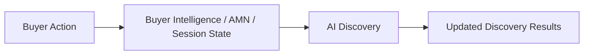

This usually requires:

* session-state updates;
* rules;
* lightweight scoring;
* immediate re-ranking.

It usually does **not** require model retraining.

The interaction becomes evidence that the Learning Engine may use later.

---

## Medium Learning Loop — Operational Learning

Time scale:

```text
Hours to Days
```

Potential examples include:

* metadata usefulness;
* Creative-performance patterns;
* Feed performance;
* feature aggregations;
* Seller-related patterns;
* trend behavior.

Some outputs at this time scale may remain Discovery Analytics calculations.

The Learning Engine participates when actual learned relationships, rules, parameters, or models are produced.

---

## Slow Learning Loop — Model Learning

Time scale:

```text
Days to Months
```

Examples include:

* Ranking-model retraining;
* retrieval-model evaluation;
* embedding changes;
* long-term Buyer-pattern modeling;
* fraud-model development;
* cross-Offering learning.

Slow learning should require stronger:

* evaluation;
* reproducibility;
* governance;
* deployment controls;
* monitoring;
* rollback.

---

# Learning Architecture

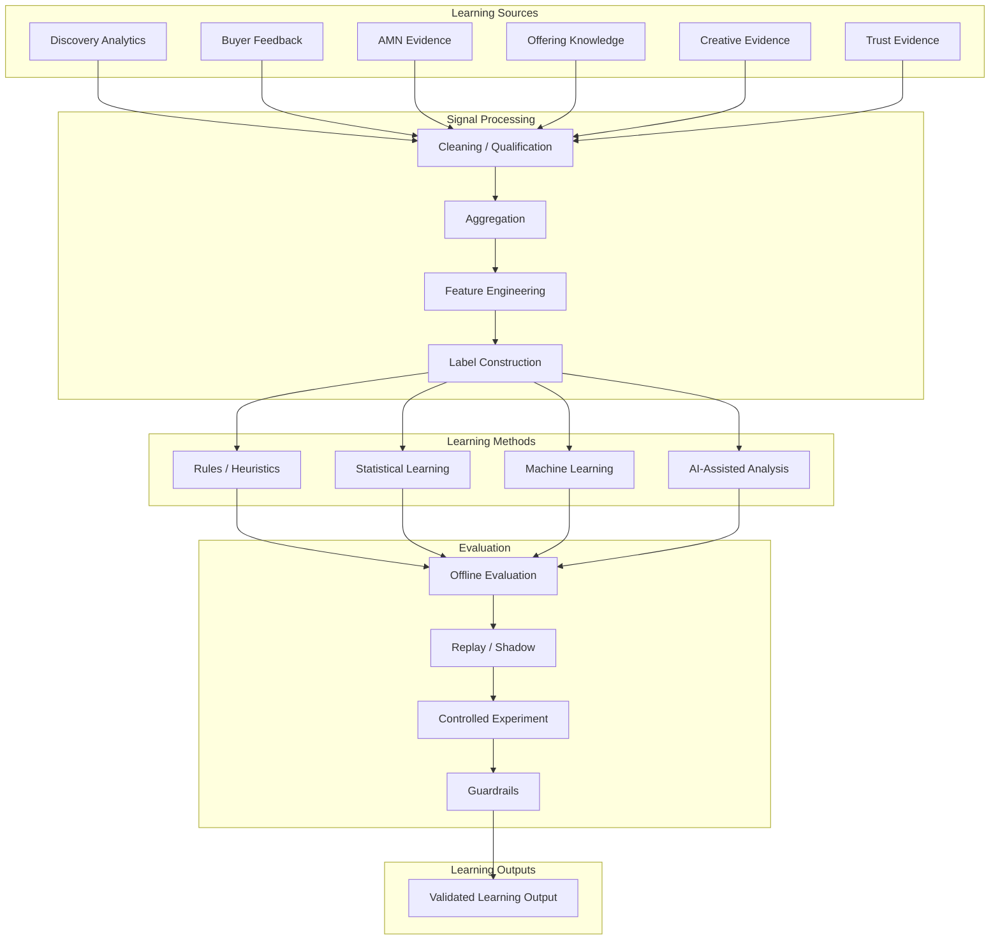

Not every learning output requires every stage.

A simple session-related rule may not require model training.

A new production Ranking model should require significantly stronger evaluation.

---

# Training Infrastructure

A future learning pipeline may follow:


The exact infrastructure should evolve with PinkCurve scale.

This logical pipeline spans several responsibilities:

**Data Architecture / Data Platform**

* validated data;
* curated data;
* storage;
* lineage.

**Learning Engine**

* feature development;
* labels;
* training;
* evaluation.

**AI Platform / MLOps**

* model registry;
* model serving;
* deployment infrastructure.

**Experimentation**

* controlled rollout;
* experiment assignment.

**Discovery Analytics**

* outcome measurement.

**Observability**

* system/model monitoring.

**Product/AI Governance**

* approval and rollback policy.

---

# Learning Output and Model Lifecycle

Learning Engine outputs must have controlled lifecycles.

PinkCurve should not create, retrain, update, or deploy models simply because new data has arrived.

A typical lifecycle is:

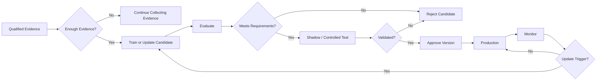

---

# Initial Model Creation

A model should be created only when sufficient trustworthy evidence exists to justify learning it.

Before sufficient evidence exists, PinkCurve may use:

* deterministic rules;
* manually controlled weights;
* statistical summaries;
* heuristics;
* simple scoring;
* controlled exploration;
* human-reviewed decisions.

This is particularly important during Alpha and early Beta.

PinkCurve should not create complex models simply because a capability might someday benefit from machine learning.

---

# Model Update Triggers

A model or significant learned output may be considered for updating when:

* sufficient new qualified evidence accumulates;
* measured performance degrades;
* data or behavior drifts;
* Buyer behavior materially changes;
* Offering composition materially changes;
* metadata behavior changes;
* geographic patterns change;
* seasonal patterns change;
* Creative behavior changes;
* new fraud or abuse patterns appear;
* controlled experiments identify promising improvements;
* scheduled evaluation recommends retraining;
* product requirements change;
* policy requirements change.

A trigger starts **evaluation or retraining**.

It does not automatically authorize production deployment.

---

# Scheduled and Event-Driven Learning

PinkCurve may eventually support both scheduled and event-driven learning.

## Scheduled Learning

Periodic evaluation may determine whether enough new evidence exists to justify retraining.

Possible future schedules may include:

* daily;
* weekly;
* monthly;
* other product-specific schedules.

The exact cadence should depend on:

* evidence volume;
* model type;
* product requirements;
* cost;
* rate of behavioral change;
* risk.

There should not be one universal retraining schedule for every model.

---

## Event-Driven Learning

Evaluation may also be triggered by conditions such as:

* detected drift;
* significant performance degradation;
* major Offering changes;
* substantial Buyer-behavior changes;
* new fraud patterns;
* important product changes;
* data-quality problems;
* Trust incidents.

The exact triggers belong to later System Design and Learning Operations.

---

# Retraining Does Not Mean Deployment

Retraining creates a new **candidate model or learned output**.

It does not automatically replace the current production version.

A candidate may need to pass:

1. data-quality validation;
2. offline evaluation;
3. comparison against the current production version;
4. privacy requirements;
5. Trust requirements;
6. fairness/diversity guardrails;
7. replay testing;
8. shadow evaluation;
9. controlled experimentation;
10. human review where appropriate.

Only an approved candidate becomes a production version.

---

# Model Registry and Versioning

Production models and other significant learned outputs should have identifiable versions.

Important metadata may include:

* model/output version;
* training-data period;
* training-dataset reference;
* feature definitions;
* label definition;
* evaluation results;
* deployment date;
* experiment history;
* approval status;
* rollback version.

This supports:

* reproducibility;
* auditing;
* debugging;
* rollback.

A shared Model Registry may eventually be provided through the AI Platform/MLOps foundation rather than being implemented separately inside every product.

---

# Learning Provenance

PinkCurve should be able to trace important learning from source evidence through operational use.

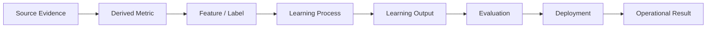

Learning provenance supports:

* explainability;
* debugging;
* auditability;
* model governance;
* Trust;
* privacy review;
* rollback.

---

# Offline Evaluation

Possible offline metrics include:

* precision;
* recall;
* Ranking measures such as NDCG;
* calibration;
* classification metrics where appropriate;
* metadata-selection quality;
* fraud-detection precision/recall.

Offline metrics provide evidence.

They do not prove Buyer value.

---

# Online Evaluation

Production experiments should measure actual PinkCurve outcomes.

Examples include:

* Meaningful Discovery;
* metadata-to-exploration rate;
* negative-feedback rate;
* QOV;
* Feed usefulness;
* diversity;
* new-Offering exposure;
* Seller value.

Discovery Analytics should provide the primary measurement framework.

---

# Guardrails

Every optimization should be evaluated against potential harm to other PinkCurve goals.

For example:

```text
New Ranking Model

CTR +12%
```

while:

```text
Negative Feedback +30%
Seller Diversity -25%
Trust Reports +8%
```

should not automatically be considered an improvement.

Possible guardrails include:

* negative feedback;
* Trust reports;
* Seller concentration;
* repetition;
* privacy impact;
* diversity;
* new-Offering opportunity;
* system latency.

---

# Deployment Safety

New models or important learning changes should be introduced carefully.

Possible stages include:

### Offline Evaluation

Test using appropriate historical data.

### Replay Testing

Run new logic against previous event sequences where useful.

### Shadow Mode

The new model produces predictions without affecting Buyers.

### Limited Rollout

Expose a small percentage of appropriate traffic.

### Controlled Experiment

Compare against current behavior.

### Gradual Expansion

Increase deployment only when evidence supports improvement.

### Rollback

Restore previous validated behavior when unacceptable degradation occurs.

---

# Model Serving

Learning Engine trains and validates learned model candidates.

Production model serving may be provided through PinkCurve's AI Platform.

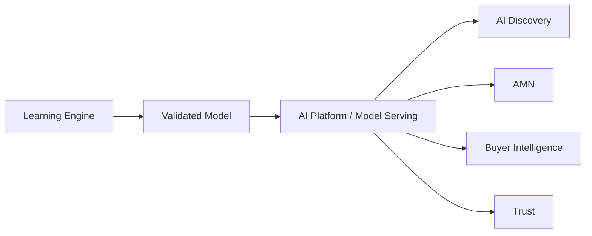

Not every Learning Engine output requires model serving.

Rules, parameters, scores, and learned relationships may use simpler mechanisms.

---

# Bias and Feedback Loops

Learning systems can reinforce their own past decisions.

For example:

```text
Seller A ranks highly
      ↓
Seller A receives more exposure
      ↓
Seller A receives more interactions
      ↓
Model receives more evidence about Seller A
      ↓
Seller A ranks even higher
```

This may create unfair concentration.

PinkCurve should monitor:

* exposure bias;
* popularity bias;
* Seller concentration;
* new-Offering disadvantage;
* category imbalance;
* geographic imbalance.

Learning Engine may identify these patterns.

Discovery Analytics measures them.

AI Discovery applies appropriate diversity and exploration controls.

Product Governance establishes acceptable policies.

---

# Exploration

Learning requires evidence about Offerings that do not already have large interaction histories.

The Learning Engine may evaluate:

* exploration strategy;
* new-Offering performance;
* alternative exposure;
* diversity effects.

AI Discovery owns operational exploration.

Exploration should remain:

* relevant enough to be useful;
* Trustworthy;
* controlled;
* measurable.

Exploration allows PinkCurve to learn rather than permanently reinforce early assumptions.

---

# Cold Start

## New Buyers

Runtime discovery may rely on:

* current session intent;
* AMN;
* search;
* location;
* trending content;
* new Offerings;
* broad diversity.

Long-term behavioral history should not be required for useful discovery.

Buyer Intelligence, AMN, and AI Discovery own the runtime Buyer cold-start experience.

Learning Engine may improve cold-start strategies over time.

---

## New Offerings

Runtime discovery may rely on:

* Offering Knowledge;
* metadata;
* semantic similarity;
* Trust status;
* Creative quality;
* Seller verification;
* controlled exploration.

New Offerings should not be penalized simply for lacking historical interaction evidence.

AI Discovery owns runtime Offering cold-start behavior.

Learning Engine may improve the strategy.

---

## New Sellers

Seller history may initially be limited.

Verification, Offering Knowledge quality, Creative quality, and early discovery evidence may provide initial signals.

Learning Engine may help improve how PinkCurve understands new-Seller outcomes while avoiding historical incumbency bias.

---

# Learning Across Offerings

PinkCurve may learn relationships across related Offerings.

For example:

```text
Waterproof
+
Trail Running
+
Winter Season
```

may produce patterns useful across many relevant Offerings.

Cross-Offering learning can accelerate improvement, particularly for new Offerings.

However, PinkCurve should not assume that behavior transfers equally across:

* categories;
* locations;
* price ranges;
* cultures;
* Offering types.

Transfer should be validated.

---

# Learning Across Offering Types

Commercial Products, public resources, promotions, events, community services, and Brand Recognition may have different definitions of success.

For example:

```text
Commercial Product
    → Destination Visit

Event
    → Save / Directions

Community Resource
    → Contact / Resource Access

Brand Recognition
    → Later Brand Exploration
```

The Learning Engine should not force all Offering types into one universal objective or label.

---

# Personalization

Learning may support personalized discovery, but personalization should remain controlled.

Potential evidence may include:

* explicit preferences;
* metadata interests;
* recent discovery;
* negative preferences;
* location preferences;
* historical behavior where permitted.

However, Buyer Intelligence owns the canonical understanding of the Buyer.

Learning Engine produces learned relationships or models that Buyer Intelligence may consume.

AI Discovery applies appropriate Buyer Signals.

Buyer Experience provides control.

PinkCurve must preserve the Buyer's ability to:

* change direction;
* reset discovery;
* remove appropriate preferences;
* explore outside previous patterns.

Current intent should often have priority over historical personalization.

---

# Privacy and Learning

Learning should follow PinkCurve privacy standards.

Important principles include:

* data minimization;
* purpose limitation;
* consent where required;
* retention controls;
* access controls;
* de-identification where appropriate;
* protection against unnecessary sensitive inference.

A model should not infer or use sensitive characteristics simply because prediction is technically possible.

Technical capability does not create legitimate product purpose.

---

# Seller Intelligence Integration

Learning Engine should provide evidence and learned relationships, not unexplained Seller conclusions.

For example:

Weak:

```text
Improve your Creative.
```

Better:

```text
Buyers selecting "Waterproof" frequently explore your Offering,
but your current Creative does not clearly show that feature.

Consider adding imagery that demonstrates it.
```

Seller Intelligence should provide enough evidence to make recommendations understandable.

Seller Experience should present those recommendations to the Seller.

---

# Buyer Intelligence Integration

Buyer Intelligence may use Learning Engine outputs to improve discovery continuity.

Potential areas include:

* preference interpretation;
* negative-interest interpretation;
* metadata relationships;
* diversity preferences;
* context relationships;
* longer-term behavioral patterns where permitted.

These capabilities must remain subordinate to Buyer control and privacy.

Buyer Intelligence—not Learning Engine—remains responsible for producing Buyer Signals.

---

# Trust Integration

Learning may help improve:

* fraud detection;
* abuse detection;
* bot detection;
* manipulation detection;
* destination-anomaly detection;
* suspicious behavior analysis.

However:

> **Trust owns operational Trust decisions.**

Learning outputs should not directly impose high-impact Trust actions without appropriate Trust policy, evaluation, and human oversight.

---

# Experimentation

Learning improvements should be tested where appropriate.

Potential experiment areas include:

* Ranking approaches;
* retrieval approaches;
* AMN metadata selection;
* Creative selection;
* Feed composition;
* Discovery Signals;
* negative-feedback handling;
* exploration rate;
* new-Offering exposure;
* Ranking diversity.

A possible lifecycle is:

```text
Candidate Improvement
        ↓
Offline Evaluation
        ↓
Replay / Shadow
        ↓
Limited Rollout
        ↓
Controlled Experiment
        ↓
Guardrail Evaluation
        ↓
Expansion or Rollback
```

Experimentation is a shared PinkCurve capability.

Discovery Analytics measures experiment results.

Learning Engine evaluates learned improvement.

The consuming product applies experimental behavior.

---

# Human Oversight

Human oversight may be needed when:

* model behavior changes unexpectedly;
* Seller exposure becomes highly concentrated;
* Trust reports increase;
* a learned recommendation affects sensitive content;
* fraud models produce uncertain high-impact decisions;
* new model behavior is difficult to explain;
* privacy or fairness concerns arise;
* model outputs conflict with product expectations.

Human review is particularly important during early PinkCurve development because platform behavior will evolve rapidly.

One individual may perform several oversight roles during Alpha.

The responsibilities nevertheless need to exist.

---

# Monitoring and Drift

Model performance may deteriorate as:

* Buyer behavior changes;
* Offering inventory changes;
* categories change;
* market conditions change;
* seasons change;
* locations change;
* Creative changes;
* metadata changes.

PinkCurve should eventually monitor:

* feature drift;
* prediction drift;
* outcome drift;
* category shifts;
* seasonal changes;
* geographic changes;
* Creative changes;
* metadata changes.

Drift does not automatically require retraining.

The system should first determine whether the observed change represents:

* real Buyer behavior;
* data-quality failure;
* instrumentation changes;
* bot activity;
* product changes;
* model degradation.

Responsibilities span:

| Responsibility       | Product / Capability             |
| -------------------- | -------------------------------- |
| Model interpretation | Learning Engine                  |
| Outcome measurement  | Discovery Analytics              |
| Technical health     | Observability                    |
| Data integrity       | Data Quality / Data Architecture |
| Manipulation/fraud   | Trust                            |

---

# Rollback

PinkCurve must be able to stop using a learned output when it produces unacceptable behavior.

Possible rollback conditions include:

* significant discovery degradation;
* Trust problems;
* unexpected Buyer behavior;
* excessive Seller concentration;
* unacceptable loss of diversity;
* corrupted data;
* model-serving problems;
* unacceptable experiment results;
* privacy concerns;
* policy violations.

Where appropriate, the previous validated version should remain available.

---

# Learning Failure Modes

PinkCurve should explicitly watch for harmful learning patterns.

### Click Optimization

The system learns sensational Creative because clicks are rewarded.

### Popularity Reinforcement

Popular Offerings receive increasing exposure while new Offerings disappear.

### Negative Feedback Ignored

The model continues showing similar unwanted content.

### Seller Concentration

A small number of Sellers dominate discovery.

### Metadata Narrowing

AMN repeatedly presents the same limited navigation paths.

### Filter Bubble

Historical behavior overwhelms current Buyer intent and exploration.

### Trust Contamination

Fraudulent engagement influences learning.

### Metric Gaming

Sellers manipulate activity to influence learned behavior.

Recognizing these failure modes early is part of Learning Engine design.

They should eventually become explicit test, monitoring, and governance scenarios.

---

# Learning Operations

Learning creates ongoing operational responsibilities.

These include:

* training-data review;
* model evaluation;
* model approval;
* experiment review;
* drift review;
* bias/fairness review;
* Trust-model review;
* rollback;
* incident investigation;
* model retirement;
* learning provenance review.

PinkCurve does not need a separate department for every responsibility.

During early phases, one person may wear multiple hats.

The responsibilities themselves must nevertheless be assigned.

---

# Current Status

## Implemented

Current implementation claims should be validated against the actual PinkCurve codebase.

Previously identified foundations include:

* basic event logging foundation;
* Offering Knowledge foundation;
* initial embedding capabilities.

---

## In Development

Previously identified work includes:

* Discovery Event model;
* AMN event model;
* Learning architecture;
* signal definitions.

---

## Planned

Potential future capabilities include:

* signal-processing pipeline;
* discovery feature pipeline;
* metadata-usefulness learning;
* initial Ranking learning;
* Creative-performance learning;
* Seller-related learning;
* Buyer Intelligence learning support;
* exploration strategy;
* experimentation infrastructure;
* model registry;
* shadow deployment;
* drift monitoring;
* Trust-learning integration;
* cross-Offering learning.

Implementation status should eventually be separated from long-lived Product Blueprint definitions if maintaining status inside these chapters becomes difficult.

---

# Alpha Learning Approach

PinkCurve Alpha should not begin with a large machine-learning infrastructure.

Initial learning should focus on:

```text
Discovery Events
      ↓
Reliable Analytics
      ↓
Rules / Weight Adjustments
      ↓
AMN Improvements
      ↓
Seller Insights
      ↓
Controlled Experiments
```

Examples include:

* increase priority of useful metadata;
* reduce repeated unwanted content;
* increase useful diversity;
* adjust new-Offering exposure;
* improve Creative recommendations;
* improve negative-feedback response.

Alpha should emphasize:

* reliable evidence;
* simple rules;
* manually controlled weights;
* statistical analysis;
* human review;
* explicit versioning;
* controlled experiments.

Only after sufficient trustworthy evidence exists should PinkCurve train sophisticated Ranking, retrieval, Buyer-intent, AMN, Feed, or other models.

The objective is:

> **Learn before building a large learning platform.**

---

# Beta Learning Evolution

As evidence increases, Beta may introduce:

* learned parameters;
* simple ML models;
* automated feature generation where justified;
* stronger offline evaluation;
* model registry capabilities;
* automated training pipelines where justified;
* shadow deployment;
* limited controlled rollout;
* improved drift monitoring.

Each additional capability should solve a demonstrated PinkCurve problem.

---

# Later Learning Evolution

As PinkCurve matures, the Learning Engine may support:

* specialized retrieval models;
* specialized Ranking models;
* Buyer-intent models;
* metadata-selection models;
* Feed composition models;
* Creative-performance models;
* Trust/fraud models;
* automated training pipelines;
* drift-triggered evaluation;
* scalable model registry;
* controlled automated deployment;
* sophisticated experimentation;
* stronger model governance.

The sophistication of Learning Engine should grow with:

1. trustworthy evidence;
2. demonstrated product value;
3. operational need;
4. PinkCurve scale.

It should not grow merely because more sophisticated technology becomes available.

---

# Hypotheses to Validate

## 1. Signal Quality

Do PinkCurve's captured signals represent Meaningful Discovery well enough to support learning?

## 2. AMN Learning

Can metadata-interaction evidence improve which metadata PinkCurve presents?

## 3. Ranking Improvement

Can learned Ranking improve discovery quality beyond heuristic Ranking?

## 4. Negative Feedback Value

Does explicit negative feedback materially improve future discovery?

## 5. Creative Learning

Can Creative-performance evidence improve visual discovery without encouraging clickbait?

## 6. Seller Insight Actionability

Do learning-supported recommendations help Sellers improve Offering Knowledge, Creative, or campaign performance?

## 7. Cross-Offering Transfer

Can useful learning transfer across related Offerings without creating incorrect assumptions?

## 8. Buyer Intelligence Value

Does permitted longer-term Buyer understanding improve discovery beyond current-session intent?

## 9. Exploration Value

Can controlled exploration improve discovery and fairness without significantly reducing Buyer relevance?

## 10. Model Value

When does a trained model provide enough improvement over rules, weights, or statistics to justify its additional complexity?

## 11. Learning Update Cadence

How frequently should different learned outputs be reevaluated or retrained?

---

# Open Questions

See [Open Decisions](19-open-decisions.md) for questions including:

* initial learning strategy;
* discovery-value label definition;
* AMN learning method;
* Ranking-model architecture;
* training-data requirements;
* feature-management requirements;
* model retraining cadence;
* exploration strategy;
* Buyer personalization limits;
* model explainability requirements;
* cross-Offering transfer;
* Seller fairness constraints;
* automated versus human model approval;
* model rollback criteria;
* Learning Engine output contract;
* product-specific model ownership;
* model update triggers;
* model deployment governance;
* learning provenance requirements.

---

# Relationship to AI Platform

Learning Engine may use shared AI Platform capabilities including:

* model training infrastructure;
* model registry;
* model serving;
* embeddings;
* evaluation tooling;
* deployment tooling;
* monitoring;
* rollback infrastructure.

Learning Engine remains the product responsible for learning.

AI Platform provides reusable technical capabilities.

---

# Relationship to Data Architecture

Learning depends on Data Architecture.

Data Architecture should eventually support:

* Discovery Events;
* curated analytics;
* Offering Knowledge;
* Buyer Signals where appropriate;
* Creative evidence;
* Trust evidence;
* training datasets;
* features;
* labels;
* learning provenance;
* model metadata;
* model versions;
* experiment results;
* retention;
* access controls.

The exact physical storage architecture belongs to Data Architecture and System Design.

---

# Relationship to Product Governance

Learning can change PinkCurve behavior.

Important learned changes may therefore require governance.

Potential governance responsibilities include:

* model approval;
* experiment approval;
* privacy review;
* Trust review;
* fairness review;
* rollout authorization;
* rollback authority;
* model retirement.

Governance should be proportional to the impact and risk of the learned output.

---

# Design Principles

### Learning Serves Discovery

Learning exists to improve Meaningful Discovery, not maximize attention.

### Start With Evidence

Do not build sophisticated models before reliable discovery evidence exists.

### Explicit Intent Matters

Direct Buyer choices should generally outweigh ambiguous inferred behavior.

### Negative Feedback Must Influence Learning

Knowing what Buyers reject is essential.

### AMN Is Learnable

Metadata navigation should improve from actual Buyer navigation evidence.

### Facts Remain Separate From Learned Interpretations

Learning may enrich Offering Knowledge but must not silently rewrite verified facts.

### Multiple Objectives Matter

Relevance, diversity, Trust, freshness, Buyer value, and Seller value should be considered together.

### Exploration Is Necessary

The system cannot learn about Offerings it never presents.

### Protect Against Feedback Loops

Past exposure should not automatically guarantee future exposure.

### Learning Must Be Reversible

Models, rules, parameters, and important learned outputs should be measurable, versioned, and rollback-capable where appropriate.

### Privacy Constrains Learning

Technical prediction capability does not automatically justify using personal information.

### Human Judgment Remains Important

Especially during early development, PinkCurve should review unexpected or high-impact model behavior.

### Retraining Is Not Deployment

A newly trained model is a candidate, not automatically a production model.

### Products Retain Their Responsibilities

Learning Engine produces validated learning.

The consuming product remains responsible for operational decisions.

### Complexity Follows Evidence

PinkCurve should not build sophisticated learning infrastructure until the evidence and product need justify it.

---

# Core Product Boundary

The Learning Engine should remain a **learning product**, not become a centralized decision-maker for PinkCurve.

The architecture should preserve these responsibilities:

| PinkCurve Product / Capability | Core Responsibility                                       |
| ------------------------------ | --------------------------------------------------------- |
| Discovery Analytics            | Measures discovery and produces analytical evidence       |
| Learning Engine                | Produces validated learning                               |
| Buyer Intelligence             | Understands Buyers and produces Buyer Signals             |
| AMN                            | Performs adaptive metadata navigation                     |
| AI Discovery                   | Performs intelligent discovery                            |
| Discovery Engine               | Core retrieval/Ranking engine inside AI Discovery         |
| Offering Knowledge             | Owns PinkCurve's structured Offering knowledge            |
| Creative Studio                | Creates and manages Creative                              |
| Seller Intelligence            | Produces Seller-facing intelligence and recommendations   |
| Trust                          | Performs Trust evaluation and operational Trust decisions |
| Buyer Experience               | Provides the Buyer-facing interface                       |
| Seller Experience              | Provides the Seller-facing interface                      |
| AI Platform                    | Provides shared AI/model infrastructure                   |
| Data Architecture              | Provides shared data architecture and governance          |

The central architectural principle remains:

> **Discovery Analytics measures. Learning Engine learns. Each PinkCurve product applies validated learning within its own responsibility.**

---

# Long-Term Direction

Over time, Learning Engine should help PinkCurve become more intelligent through actual experience.

The goal is not to create the largest possible collection of models.

The goal is not to retrain systems continuously simply because technology makes it possible.

The goal is to learn enough, at the appropriate time and with appropriate evidence, to make PinkCurve increasingly useful.

The desired long-term cycle is:

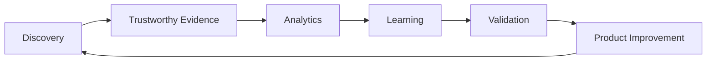

Every stage should remain accountable.

Learning should strengthen PinkCurve without sacrificing:

* Buyer autonomy;
* Trust;
* privacy;
* Seller opportunity;
* diversity;
* exploration;
* explainability;
* operational control.

The ultimate principle is:

> **Use trustworthy evidence to continuously improve PinkCurve's ability to help people discover worthwhile things.**

---

# Related Documents

* [Product Architecture](03-product-architecture.md)
* [Offering Knowledge](04-offering-knowledge.md)
* [Creative Studio](05-creative-studio.md)
* [Discovery Engine](06-discovery-engine.md)
* [Discovery Analytics](07-discovery-analytics.md)
* [Seller Intelligence](09-seller-intelligence.md)
* [AI Platform](10-ai-platform.md)
* [Data Architecture](11-data-architecture.md)
* [Security, Privacy, and Trust](12-security-privacy-and-trust.md)
* [Buyer Experience](20-buyer-experience.md)
* [Adaptive Metadata Navigation](23-adaptive-metadata-navigation.md)
* [Buyer Intelligence](24-buyer-intelligence.md)
* [Open Decisions](19-open-decisions.md)
* [Learning Engine Flow Diagram](../diagrams/learning-engine-flow.md)
