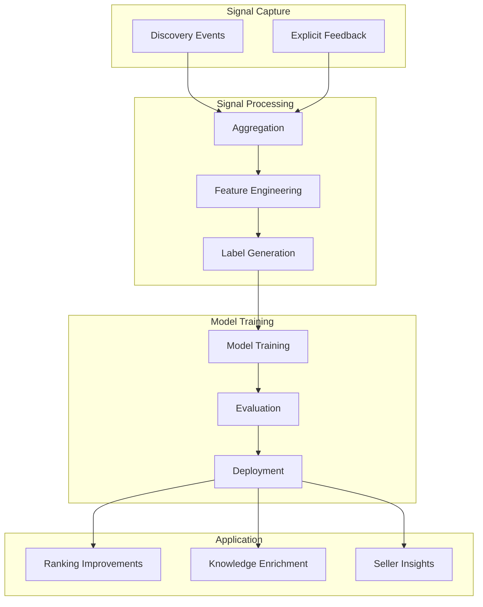
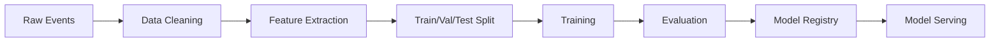

# Learning Engine

## Document Status

| Field | Value |
|-------|-------|
| **Status** | Draft |
| **Version** | 0.2 |
| **Owner** | PinkCurve Engineering Team |
| **Last Reviewed** | 2026-08-14 |
| **Related Components** | Discovery Analytics, Discovery Engine, Seller Intelligence |

---

## Overview

The Learning Engine processes discovery signals to continuously improve PinkCurve. It transforms buyer interactions into actionable improvements for discovery quality, Offering Knowledge, creative effectiveness, participant insights, and trust.

---

## Purpose

The Learning Engine creates a virtuous cycle:

```
Better Discovery → More Engagement → Better Signals → Better Learning → Better Discovery
```

Without continuous learning:
- Discovery quality remains static
- Matching doesn't improve from experience
- Insights don't reach sellers
- Platform value doesn't compound

---

## Learning Philosophy

PinkCurve learns from discovery rather than simply recording activity.

The objective is not to maximize clicks or engagement alone.

The objective is to continuously improve the buyer's ability to discover offerings that matter while respecting privacy, trust, and participant intent.

Learning should improve:

- Discovery relevance
- Offering Knowledge
- Creative quality
- Discovery Signals
- Trust signals
- Seller and participant insights
- Overall buyer experience

Every meaningful interaction becomes an opportunity to improve the platform.

---

## Learning Loop



---

## Signal Types

### Implicit Signals

Derived from buyer behavior without explicit input:

| Signal | Source | Interpretation |
|--------|--------|----------------|
| View duration | Analytics | Interest level |
| Scroll depth | Analytics | Engagement depth |
| Click-through | Analytics | Strong interest |
| Return visits | Analytics | Continued interest |
| Session patterns | Analytics | Intent indicators |

### Explicit Signals

Direct buyer input:

| Signal | Source | Interpretation |
|--------|--------|----------------|
| Saves | User action | Want to remember |
| Shares | User action | Want to recommend |
| Ratings | User input | Quality assessment |
| Feedback | User input | Direct preferences |

### Negative Signals

Indicators of poor matching:

| Signal | Source | Interpretation |
|--------|--------|----------------|
| Quick bounce | Analytics | Poor relevance |
| Skip pattern | Analytics | Not interested |
| Hide/dismiss | User action | Actively not interested |
| No engagement | Analytics | Likely poor match |

---

## Learning Objectives

### 1. Improve Discovery Matching

Learn which offerings best match buyer intent, context, and preferences:
- Feature importance for matching
- Segment-specific preferences
- Context-dependent relevance

### 2. Optimize Content Performance

Learn which creative assets performs better:
- Headline effectiveness
- Visual style impact
- Messaging resonance

### 3. Enrich Offering Knowledge

Infer knowledge from engagement patterns:
- Which features matter most
- Which audiences engage
- Effective positioning language
- Trust signals
- Discovery signals
- Seasonality
- Location relevance

### 4. Generate Seller Insights

Synthesize learnings into actionable recommendations:
- Offering improvement suggestions
- Audience insights
- Competitive positioning

Initially the Learning Engine generates insights primarily for sellers.

The architecture is intentionally extensible so that future community organizations and other participants may also receive relevant insights.

---

## Model Types

### Ranking Model (Planned)

Predicts buyer engagement probability:
- Input: Buyer signals, offering features, context
- Output: Engagement probability score
- Training: Historical engagement data
- Application: Discovery Engine ranking

### Embedding Model (Planned)

Learns semantic representations:
- Input: Offering knowledge, descriptions
- Output: Dense vector embeddings
- Training: Co-engagement patterns
- Application: Similarity search

### Content Performance Model (Planned)

Predicts creative effectiveness:
- Input: Creative content features
- Output: Predicted engagement
- Training: A/B test results
- Application: Creative optimization

---

## Training Infrastructure

### Data Pipeline



### Evaluation Framework

Models evaluated on:
- Offline metrics (precision, recall, AUC)
- Online metrics (A/B test performance)
- Business metrics (QOV rate, Discovery Score)

### Deployment

- Shadow mode for new models
- Gradual rollout
- Automatic rollback on degradation

---

## Feedback Loops

### Fast Loop (Real-time)
- Session-level signals
- Immediate re-ranking adjustments
- Simple heuristic updates

### Medium Loop (Daily)
- Aggregated daily signals
- Feature store updates
- Content performance updates

### Slow Loop (Weekly/Monthly)
- Model retraining
- Embedding updates
- Deep pattern analysis

---

## Cold Start Handling

### New Offerings
- Rely on Offering Knowledge features
- Explore-exploit balancing
- Category-based priors

### New Buyers
- Start with high-quality or popular offerings
- Quick preference inference
- Gradual personalization

### New Features
- A/B testing for impact measurement
- Gradual feature rollout
- Fallback to previous behavior

---

## Current Status

### Implemented
- Basic event logging (foundation)

### Planned
- Signal processing pipeline
- Feature store
- Initial ranking model
- A/B testing infrastructure
- Seller insight generation

---

## Hypotheses to Validate

1. **Signal sufficiency:** Do captured signals predict engagement well enough for effective learning?

2. **Learning velocity:** Can the system learn fast enough to provide value before patterns shift?

3. **Insight actionability:** Will learning-derived insights actually help sellers improve?

4. **Cross-offering learning:** Can learnings from one offering transfer to similar offerings?

---

## Related Documents

- [Discovery Analytics](07-discovery-analytics.md)
- [Discovery Engine](06-discovery-engine.md)
- [Seller Intelligence](09-seller-intelligence.md)
- [AI Platform](10-ai-platform.md)
- [Learning Engine Flow Diagram](../diagrams/learning-engine-flow.md)
