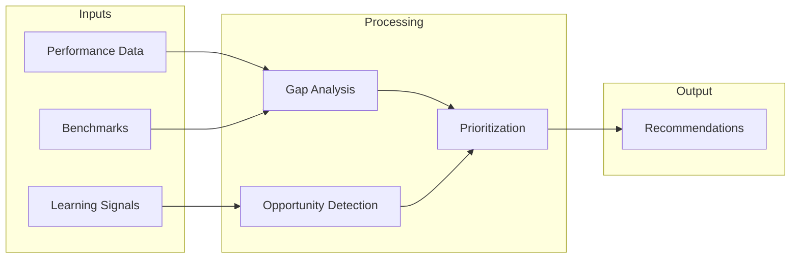

# Seller Intelligence

## Document Status

| Field | Value |
|-------|-------|
| **Status** | Draft |
| **Version** | 0.1 |
| **Owner** | PinkCurve Product Team |
| **Last Reviewed** | 2026-07-23 |
| **Related Components** | Learning Engine, Discovery Analytics, Product Knowledge |

---

## Overview

Seller Intelligence transforms platform learnings into actionable insights for sellers. It answers the question: "What should I do to improve my product's discovery and sales?"

---

## Purpose

Seller Intelligence helps sellers:

1. **Understand performance:** How are my products being discovered?
2. **Identify opportunities:** Where can I improve?
3. **Learn from patterns:** What works for similar products?
4. **Take action:** What specific changes should I make?

This creates value alignment: sellers succeed → platform succeeds.

---

## Intelligence Categories

### 1. Performance Intelligence

Understanding current state:

| Insight | Description |
|---------|-------------|
| Discovery funnel | Impressions → Views → Clicks → QPV |
| Trend analysis | Performance over time |
| Benchmarking | Performance vs. category peers |
| Anomaly alerts | Significant changes |

### 2. Audience Intelligence

Understanding who engages:

| Insight | Description |
|---------|-------------|
| Audience composition | Who discovers your products |
| Segment performance | Which audiences engage most |
| Geographic patterns | Where discovery happens |
| Intent patterns | Why buyers are looking |

### 3. Competitive Intelligence

Understanding market position:

| Insight | Description |
|---------|-------------|
| Category ranking | Position in category |
| Share of discovery | Portion of category impressions |
| Competitive gaps | Where competitors outperform |
| Differentiation opportunities | Where you could stand out |

### 4. Optimization Intelligence

Actionable recommendations:

| Insight | Description |
|---------|-------------|
| Knowledge gaps | Missing product information |
| Content suggestions | Creative improvements |
| Pricing signals | Price sensitivity indicators |
| Audience expansion | Untapped audience segments |

---

## Insight Delivery

### Dashboard (Planned)

Real-time and historical views:

```
┌─────────────────────────────────────────────────────────────┐
│  Seller Intelligence Dashboard                               │
├─────────────────────────────────────────────────────────────┤
│                                                              │
│  ┌─────────────────┐  ┌─────────────────┐  ┌──────────────┐ │
│  │  Discovery      │  │  QPV This       │  │  Category    │ │
│  │  Score: 72      │  │  Week: 234      │  │  Rank: #12   │ │
│  └─────────────────┘  └─────────────────┘  └──────────────┘ │
│                                                              │
│  ┌─────────────────────────────────────────────────────────┐│
│  │  Discovery Funnel                                       ││
│  │  ═══════════════════════════════════════ Impressions    ││
│  │  ═══════════════════════════════         Views          ││
│  │  ═══════════════════                     Clicks         ││
│  │  ═══════════                             QPV            ││
│  └─────────────────────────────────────────────────────────┘│
│                                                              │
│  ┌─────────────────────────────────────────────────────────┐│
│  │  Recommendations                                        ││
│  │  • Add 3 more product features to improve matching      ││
│  │  • Consider targeting "small business" segment          ││
│  │  • Your click-through rate is below category average    ││
│  └─────────────────────────────────────────────────────────┘│
└─────────────────────────────────────────────────────────────┘
```

### Alerts (Planned)

Proactive notifications:
- Performance drops
- Opportunities identified
- Competitive changes
- Action reminders

### Reports (Planned)

Periodic summaries:
- Weekly performance digest
- Monthly insights report
- Quarterly business review

---

## Recommendation Engine

### How Recommendations Work



### Recommendation Types

| Type | Example | Confidence |
|------|---------|------------|
| **Knowledge** | "Add target audience details" | High |
| **Content** | "Test a shorter headline" | Medium |
| **Pricing** | "Similar products priced 10% lower" | Medium |
| **Audience** | "Consider targeting segment X" | Low-Medium |

### Confidence Levels

Recommendations include confidence based on:
- Data volume supporting the insight
- Historical accuracy of similar recommendations
- Causal evidence vs. correlation

---

## Return on Discovery (ROD)

**Return on Discovery** helps sellers understand platform value:

```
ROD = (QPV × Estimated Conversion × AOV) / Platform Cost
```

Where:
- QPV = Qualified Product Visits delivered
- Estimated Conversion = Industry benchmark or seller-provided
- AOV = Average Order Value
- Platform Cost = Subscription + QPV fees

*Note: ROD is a seller-calculated metric; PinkCurve provides components but sellers input their conversion data.*

---

## Privacy in Intelligence

Seller Intelligence must balance insight with privacy:

- **Aggregated data only:** No individual buyer identification
- **Minimum thresholds:** Insights require minimum data volume
- **Competitive boundaries:** No revealing competitor specifics
- **Consent-based:** Buyer consent required for granular insights

---

## Current Status

### Implemented
- Basic product performance metrics

### Planned
- Full seller dashboard
- Recommendation engine
- Competitive benchmarking
- Insight alerts
- ROD calculator

---

## Success Metrics

How we measure Seller Intelligence effectiveness:

| Metric | Target |
|--------|--------|
| Recommendation adoption | >30% of recommendations acted on |
| Insight satisfaction | NPS >50 for intelligence features |
| Performance lift | Sellers acting on insights see >20% improvement |

---

## Related Documents

- [Learning Engine](08-learning-engine.md)
- [Discovery Analytics](07-discovery-analytics.md)
- [Success Metrics](14-success-metrics.md)
- [Seller Intelligence Flow Diagram](../diagrams/seller-intelligence-flow.md)
