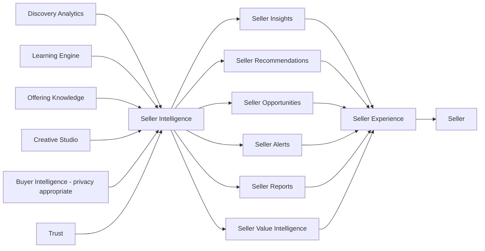
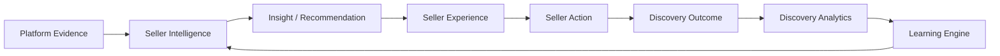
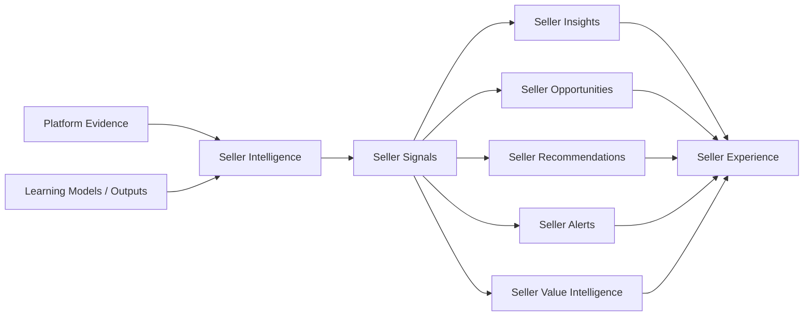
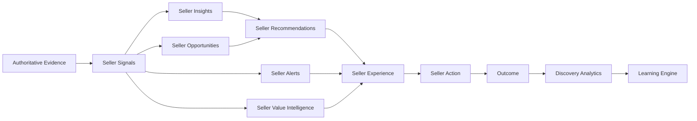
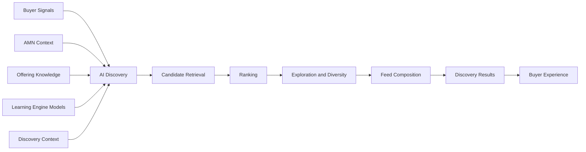
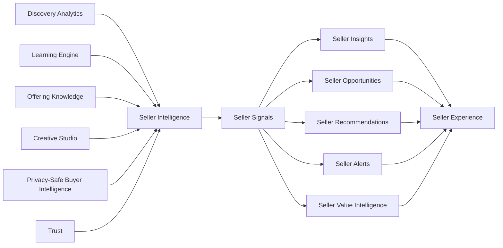
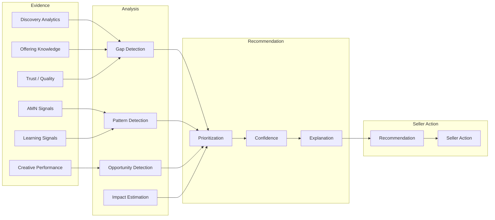

# Seller Intelligence

## Document Status

| Field                  | Value                                                                                                       |
| ---------------------- | ----------------------------------------------------------------------------------------------------------- |
| **Status**             | Draft                                                                                                       |
| **Version**            | 0.3                                                                                                         |
| **Owner**              | PinkCurve Product Team                                                                                      |
| **Last Reviewed**      | 2026-08-18                                                                                                  |
| **Related Components** | Learning Engine, Discovery Analytics, Offering Knowledge, Creative Studio, Discovery Engine, Trust & Safety |

---

## Overview

**Seller Intelligence** is the PinkCurve product responsible for transforming trustworthy discovery evidence, analytics, and validated learning into understandable and actionable intelligence for Sellers.

Its primary outputs are:

* **Seller Insights** — explanations of what is happening and what the evidence shows;
* **Seller Recommendations** — suggested actions the Seller may consider;
* **Seller Opportunities** — emerging opportunities identified from PinkCurve evidence;
* **Seller Alerts** — important conditions that may require Seller attention;
* **Seller Reports and Performance Summaries** — structured summaries of discovery activity and important changes;
* **Seller Value Intelligence** — evidence describing the value PinkCurve is delivering to the Seller;
* **Recommendation Confidence and Explanations** — information showing how certain PinkCurve is and what evidence supports the recommendation;
* **Recommendation Outcome Evidence** — measurement of whether Seller actions taken from PinkCurve recommendations actually improved outcomes.

Conceptually:



Seller Intelligence is not merely a dashboard or historical-reporting system.

It should help Sellers answer:

> **What is happening?**

> **Why might it be happening?**

> **What should I consider doing next?**

> **How confident is PinkCurve in that recommendation?**

> **What evidence supports it?**

> **Did the action actually help?**

Seller Intelligence is therefore the primary PinkCurve product that converts platform intelligence into Seller-facing guidance.

It consumes evidence from products such as:

* Discovery Analytics;
* Learning Engine;
* Offering Knowledge;
* Creative Studio;
* Buyer Intelligence where privacy-appropriate;
* Trust;
* AI Discovery and related discovery context where appropriate.

It then produces intelligence that is primarily consumed through **Seller Experience**.

The product boundary is:

> **Discovery Analytics measures.**

> **Learning Engine learns.**

> **Seller Intelligence interprets and recommends.**

> **Seller Experience presents and enables Seller action.**

> **The Seller decides.**

Seller Intelligence may recommend actions involving:

* Offering Knowledge;
* metadata;
* Creative;
* campaigns;
* Brand Recognition;
* promotions;
* geography;
* Trust or quality corrections;
* discovery strategy.

However, Seller Intelligence does not directly take over those product responsibilities.

For example:

> **Seller Intelligence identifies a Creative improvement opportunity → Seller Experience presents the recommendation → the Seller chooses to act → Creative Studio performs the Creative work.**

Likewise:

> **Seller Intelligence identifies missing Offering information → Seller Experience presents the recommendation → the Seller chooses whether and how to correct it → Offering Knowledge manages the updated knowledge.**

Seller Intelligence should also learn whether its own recommendations are useful.

The long-term loop is:



This allows PinkCurve to improve not only discovery, but also the quality of the advice it gives Sellers.

Seller Intelligence must preserve several important principles:

* recommendations must be understandable;
* observed evidence must remain distinguishable from interpretation;
* uncertainty should be communicated;
* Buyer privacy must be protected;
* competitive information must remain appropriately aggregated;
* Seller revenue must not be invented or overstated;
* Seller decisions remain Seller-controlled;
* Trust decisions remain owned by Trust;
* recommendation outcomes should be measured;
* a few high-quality recommendations are better than many weak ones.

While initially focused on commercial Sellers, the same architecture may later support appropriate intelligence for organizations, public-service providers, community-resource providers, and other PinkCurve Offering providers.

---

# Purpose

Seller Intelligence helps sellers:

1. **Understand discovery performance**
2. **Understand buyer interest**
3. **Identify knowledge or creative gaps**
4. **Recognize opportunities**
5. **Understand brand-recognition performance**
6. **Improve campaigns**
7. **Measure value received from PinkCurve**
8. **Take practical actions**
9. **Evaluate whether those actions worked**

The objective is to convert platform intelligence into decisions a seller can actually use.

---

# Seller Intelligence Philosophy

Seller Intelligence should follow several principles.

### Actionable, Not Merely Informational

A dashboard full of numbers is not intelligence unless the seller can understand what to do with them.

### Explainable

Recommendations should include supporting evidence.

### Evidence Before Certainty

PinkCurve should distinguish observed facts from interpretations and predictions.

### Privacy-Preserving

Seller insights should not expose individual buyer identity or unnecessarily detailed behavioral profiles.

### Discovery-Focused

Intelligence should primarily help sellers improve how their offerings are discovered.

### Seller-Controlled

PinkCurve may recommend actions, but the seller remains responsible for business decisions.

### Learn From Outcomes

PinkCurve should measure whether seller actions resulting from recommendations actually improve outcomes.

---

# Seller Intelligence Structure

A useful Seller Intelligence item should ideally contain three layers:

```text
Observation
     ↓
Interpretation
     ↓
Recommended Action
```

For example:

```text
Observation:
Buyers selecting "Waterproof" frequently explore your offering.

Interpretation:
Waterproof capability appears important in this discovery context.

Recommendation:
Consider showing the waterproof feature more clearly in your creative.
```

This is preferable to:

```text
Improve your advertising.
```

because the seller can understand both the evidence and the proposed action.

---

## Seller Signals

Seller Intelligence consumes evidence from multiple PinkCurve products and transforms relevant Seller-related evidence into structured **Seller Signals**.

A Seller Signal is a machine-consumable representation of a meaningful condition, pattern, change, opportunity, risk, or other intelligence relevant to a Seller, Offering, Creative, campaign, or Seller-related activity.

Seller Signals provide a standardized intelligence layer between raw or derived platform evidence and higher-level Seller Intelligence outputs such as Seller Insights, Seller Opportunities, Seller Recommendations, Seller Alerts, Seller Reports, and Seller Value Intelligence.

Conceptually:



The purpose of Seller Signals is to allow Seller Intelligence and authorized PinkCurve products to work with structured intelligence rather than depending only on human-readable reports or natural-language recommendations.

Seller Signals should preserve sufficient context, provenance, confidence, and evidence references so that PinkCurve can understand where a signal came from, what it means, how reliable it may be, and how it may appropriately be used.

### Evidence Is Not Automatically a Seller Signal

Not every input consumed by Seller Intelligence is itself a Seller Signal.

Seller Intelligence may consume information such as:

* Discovery Events;
* Discovery Analytics;
* Qualified Offering Visits;
* Buyer Signals where privacy-appropriate;
* AMN activity;
* Offering Knowledge;
* Creative information;
* Creative performance;
* Trust status;
* geographic evidence;
* campaign information;
* Learning Engine models;
* Learning Engine model outputs;
* statistical relationships;
* Seller actions;
* historical recommendation outcomes.

These inputs retain their own meanings and authoritative sources.

Seller Intelligence analyzes relevant evidence and may derive one or more Seller Signals from it.

For example:

```text
Discovery Analytics
    ↓
Meaningful exploration of an Offering
has declined over several periods.
    ↓
Seller Intelligence
    ↓
Seller Signal:
discovery_performance_decline
```

Similarly:

```text
AMN Evidence
    +
Offering Knowledge
    ↓
Buyers frequently select "Waterproof,"
but the Offering has no verified
waterproof information.
    ↓
Seller Intelligence
    ↓
Seller Signal:
offering_knowledge_gap
```

The distinction is important:

> **Platform evidence describes what PinkCurve has observed or derived. Seller Signals represent meaningful Seller-related intelligence derived from appropriate evidence.**

### Seller Signal Categories

Seller Signals may be organized into categories so that Seller Intelligence and consuming products can understand their purpose and appropriate use.

Initial categories may include:

| Seller Signal Category        | Example Signals                                                                                |
| ----------------------------- | ---------------------------------------------------------------------------------------------- |
| **Discovery Signals**         | discovery growth, discovery decline, QOV change, exploration change                            |
| **Offering Signals**          | Offering Knowledge gap, missing metadata, stale information, destination problem               |
| **Adaptive Metadata Signals** | frequently selected metadata, emerging metadata interest, metadata-related abandonment         |
| **Creative Signals**          | Creative performance improvement, Creative fatigue, early abandonment, missing visual emphasis |
| **Buyer Interest Signals**    | aggregated Buyer interest, emerging intent, frequently selected attributes                     |
| **Geographic Signals**        | regional interest, local opportunity, geographic performance change                            |
| **Trend Signals**             | increasing interest, declining interest, seasonal pattern, emerging category behavior          |
| **Brand Signals**             | qualified brand reach, repeat brand exposure, Brand Creative exploration                       |
| **Promotion Signals**         | Promotion performance, Promotion expiration effect, Promotion opportunity                      |
| **Opportunity Signals**       | Offering opportunity, Creative opportunity, geographic opportunity, category opportunity       |
| **Trust / Quality Signals**   | verification issue, broken destination, quality problem, required corrective action            |
| **Value Signals**             | QOV contribution, qualified reach, Brand Recognition contribution, Seller Value component      |
| **Recommendation Signals**    | recommendation response, recommendation adoption, recommendation effectiveness                 |

The exact taxonomy should evolve as PinkCurve develops.

PinkCurve should avoid creating unnecessary signal types before there is a clear product need.

### Logical Seller Signal Structure

A Seller Signal should have a consistent logical structure.

A conceptual Seller Signal may include:

```text
SellerSignal

signal_id
seller_id

signal_type
signal_category
signal_value

confidence
severity                 optional
priority                 optional

offering_id              optional
creative_id              optional
campaign_id              optional

context
evidence_references
source

model_reference          optional
model_version            optional

observed_at
generated_at
valid_until              optional
```

This structure is conceptual.

It is not a final database schema or API contract.

Detailed field definitions, data types, persistence, indexing, retention, and interfaces should be established later during Data Design and System Design.

### Signal Identity and Scope

Every Seller Signal should identify the Seller to whom the signal applies.

Where appropriate, the signal may also identify its narrower scope.

For example, a signal may apply to:

```text
Seller
```

or:

```text
Seller
   ↓
Offering
```

or:

```text
Seller
   ↓
Offering
   ↓
Creative
```

or:

```text
Seller
   ↓
Campaign
```

This allows Seller Intelligence to distinguish between Seller-wide intelligence and intelligence associated with a particular Offering, Creative, campaign, or other authorized Seller context.

### Seller Signal Value

The `signal_value` represents the meaningful information carried by the signal.

The value may be:

* categorical;
* numerical;
* directional;
* structured;
* contextual.

For example:

```text
signal_type:
discovery_performance_change

signal_value:
    direction = declining
    magnitude = moderate
```

Another signal might contain:

```text
signal_type:
metadata_interest

signal_value:
    metadata = "Waterproof"
    direction = increasing
```

Another might contain:

```text
signal_type:
geographic_opportunity

signal_value:
    region = "Bay Area"
    interest_direction = increasing
```

The exact representation should depend on the signal type.

### Confidence

Seller Signals should communicate uncertainty where appropriate.

Potential confidence levels may include:

* High;
* Medium;
* Low;
* Exploratory.

Confidence may depend on:

* evidence volume;
* evidence quality;
* stability over time;
* sample size;
* statistical strength;
* model confidence;
* consistency across evidence sources;
* experiment results;
* contextual relevance.

A weak or uncertain signal should not be presented as a strong fact.

### Evidence and Provenance

Seller Signals should preserve references to the evidence from which they were derived.

Conceptually:

```text
Evidence
   ↓
Seller Signal
   ↓
Seller Insight
   ↓
Seller Recommendation
```

PinkCurve should be able to trace an important recommendation back through the Seller Signal to the evidence that supported it.

For example:

```text
Recommendation:
Consider refreshing this Creative.
        ↓
Seller Insight:
Creative effectiveness appears to
be declining.
        ↓
Seller Signal:
creative_performance_decline
        ↓
Evidence:
Meaningful exploration decreased
across recent comparable periods.
```

This traceability supports:

* explainability;
* debugging;
* Seller Trust;
* quality review;
* model evaluation;
* recommendation evaluation;
* auditing.

### Source

Seller Signals should identify their source or contributing sources.

Possible sources may include:

* Discovery Analytics;
* Learning Engine;
* Offering Knowledge;
* Creative Studio;
* Buyer Intelligence;
* Adaptive Metadata Navigation;
* Trust;
* Seller activity;
* Seller feedback;
* recommendation outcomes.

Some Seller Signals may be derived from multiple sources.

For example:

```text
Discovery Analytics
        +
Adaptive Metadata Navigation
        +
Offering Knowledge
        ↓
Seller Intelligence
        ↓
Offering Knowledge Gap Signal
```

### Model-Derived Seller Signals

As PinkCurve develops, some Seller Signals may be produced or influenced by purpose-specific models created by the Learning Engine.

Where appropriate, Seller Signals should preserve the relevant model reference or model version.

For example:

```text
Platform Evidence
      ↓
Learning Engine
      ↓
Seller Opportunity Model v3
      ↓
Seller Intelligence
      ↓
Seller Opportunity Signal
```

This allows PinkCurve to determine which model contributed to a particular signal and later evaluate whether that model produced useful intelligence.

During Alpha, however, many Seller Signals may be generated using:

* rules;
* thresholds;
* statistics;
* analytical relationships;
* manually controlled weights;
* simple models.

PinkCurve should introduce more sophisticated learned models only when sufficient trustworthy evidence demonstrates that they provide value.

### Seller Signals, Insights, and Recommendations

Seller Signals should remain distinct from Seller Insights and Seller Recommendations.

A **Seller Signal** is structured machine-consumable intelligence.

A **Seller Insight** interprets one or more signals in a form that helps the Seller understand what may be happening.

A **Seller Recommendation** suggests an action the Seller may consider.

For example:

```text
Seller Signal

metadata_interest:
"Waterproof" is frequently selected.
        ↓
Seller Insight

Buyers exploring this Offering category
appear increasingly interested in
waterproof capability.
        ↓
Seller Recommendation

If this Offering is waterproof,
consider adding verified waterproof
information to Offering Knowledge.
```

Another example:

```text
Seller Signal

creative_performance_decline
        ↓
Seller Insight

Meaningful exploration associated with
this Creative has declined over recent
comparable periods.
        ↓
Seller Recommendation

Consider reviewing or refreshing
this Creative.
```

The architecture should therefore preserve:

> **Evidence → Seller Signal → Seller Insight → Seller Recommendation → Seller Action → Outcome**

Not every Seller Signal must result in a recommendation.

A signal may:

* contribute to an Insight;
* contribute to an Opportunity;
* trigger an Alert;
* contribute to Seller Value Intelligence;
* contribute to a Report;
* remain internal until additional evidence exists.

Likewise, a Seller Recommendation may depend on multiple Seller Signals rather than a single signal.

### Seller Signal Consumers

Seller Intelligence is the primary producer and consumer of Seller Signals.

Seller Signals may also be consumed by other authorized PinkCurve products where there is a clear product need.

Potential consumers include:

**Seller Experience**

Seller Experience may use appropriate Seller Signals to:

* present status;
* display trends;
* prioritize information;
* provide contextual explanations;
* support Seller workflows.

**Creative Studio**

Creative Studio may receive appropriate Creative-related signals when a Seller chooses to act on a Creative recommendation.

For example:

```text
creative_performance_decline
+
missing_feature_emphasis
        ↓
Creative Studio Context
```

**Offering Knowledge**

Offering Knowledge may receive appropriate knowledge-gap candidates when a Seller chooses to review or correct Offering information.

Seller Signals should not automatically overwrite authoritative Offering facts.

**Learning Engine**

Recommendation responses and recommendation outcomes may become evidence used by the Learning Engine to improve future learning and purpose-specific models.

**Trust**

Appropriate quality or risk evidence may be shared with Trust where necessary.

Seller Intelligence does not replace Trust evaluation or enforcement.

**Other PinkCurve Products**

Additional consumers may be identified during System Design.

Access should follow product responsibility, privacy, security, and least-privilege principles.

### Seller Signal Privacy

Seller Signals must not become a mechanism for exposing private Buyer Intelligence to Sellers.

For example, Seller Intelligence may produce:

```text
buyer_interest_signal:

Buyers exploring this category are
increasingly selecting lightweight options.
```

It should not produce Seller-visible signals such as:

```text
Buyer 12345 is interested in this Offering
and recently searched for lightweight shoes.
```

Buyer-related Seller Signals should therefore use appropriate:

* aggregation;
* anonymization where required;
* minimum cohort thresholds;
* geographic generalization;
* access controls;
* privacy policies.

The principle is:

> **Seller Signals may describe meaningful collective Buyer behavior without exposing unnecessary information about identifiable individual Buyers.**

### Seller Signal Freshness

Not all Seller Signals remain useful indefinitely.

Some signals may represent:

* current conditions;
* short-term changes;
* seasonal patterns;
* persistent conditions;
* historical evidence.

Where appropriate, Seller Signals should therefore include:

* observation time;
* generation time;
* validity period;
* expiration;
* freshness status.

For example, an emerging geographic opportunity from six months ago should not automatically be treated as a current opportunity.

### Seller Signal Lifecycle

A Seller Signal may conceptually follow a lifecycle such as:

```text
Evidence Observed
      ↓
Signal Generated
      ↓
Signal Validated
      ↓
Signal Available
      ↓
Signal Consumed
      ↓
Signal Updated / Superseded / Expired
```

Signals should not remain active indefinitely when the underlying evidence has changed.

The detailed lifecycle should be established during System Design.

### Seller Signal Quality

Seller Signals should be evaluated for quality.

Potential considerations include:

* evidence quality;
* evidence volume;
* freshness;
* statistical reliability;
* confidence;
* consistency;
* privacy;
* relevance;
* model quality where applicable.

Low-quality signals should not generate high-confidence recommendations.

The relationship should generally be:

```text
Reliable Evidence
      ↓
Reliable Seller Signal
      ↓
Grounded Seller Insight
      ↓
Trustworthy Recommendation
```

### Seller Signal Example

A complete conceptual example is:

```text
SellerSignal

signal_id:
SS-10427

seller_id:
S-1005

signal_category:
offering

signal_type:
offering_knowledge_gap

offering_id:
O-2031

signal_value:
    metadata = "Waterproof"
    condition = "missing"

confidence:
high

context:
Buyers frequently select "Waterproof"
while navigating comparable Offerings.

evidence_references:
AMN aggregated selection evidence
Offering Knowledge completeness evidence

source:
Adaptive Metadata Navigation
Discovery Analytics
Offering Knowledge

observed_at:
current analysis period
```

Seller Intelligence may then produce:

```text
Seller Insight:

Waterproof capability appears important
to Buyers exploring this category, but
PinkCurve does not currently have verified
waterproof information for this Offering.
```

followed by:

```text
Seller Recommendation:

If this Offering is waterproof, consider
adding verified waterproof information
to Offering Knowledge.
```

This example illustrates an important safety principle.

Seller Intelligence does not infer:

```text
The Offering is waterproof.
```

It recognizes:

```text
Buyers care about waterproof capability
+
PinkCurve does not know whether this
Offering is waterproof.
```

The Seller remains responsible for supplying accurate Offering information.

### Seller Signal Design Principle

Seller Signals establish a structured intelligence contract between Seller-related evidence and Seller Intelligence outputs.

The core relationship is:



The fundamental principle is:

> **Seller Intelligence converts trustworthy Seller-related evidence into structured Seller Signals. Seller Signals provide machine-consumable intelligence that supports Seller Insights, Opportunities, Recommendations, Alerts, Reports, and Seller Value Intelligence.**

Seller Signals should remain:

* evidence-based;
* structured;
* traceable;
* confidence-aware;
* privacy-preserving;
* time-aware;
* explainable;
* appropriately scoped;
* usable by authorized PinkCurve products.

The exact Seller Signal schema, storage model, APIs, event formats, access controls, and product interfaces should be defined later during PinkCurve Data Design and System Design.

---

## Seller Intelligence Outputs and Discovery Boundary

Seller Intelligence and AI Discovery both make intelligent decisions from PinkCurve evidence, but they serve fundamentally different purposes and produce fundamentally different outputs.

This distinction is important because the term **recommendation** can otherwise create confusion between Buyer discovery and Seller guidance.

### AI Discovery Responsibility

AI Discovery is responsible for determining which Offerings and Creative may be most worthwhile for a Buyer to discover in a particular context.

AI Discovery may use:

* Buyer Signals;
* session context;
* Adaptive Metadata Navigation context;
* Offering Knowledge;
* location context where appropriate;
* Learning Engine models and outputs;
* exploration strategies;
* diversity strategies;
* discovery history;
* other authorized discovery evidence.

AI Discovery performs capabilities such as:

* candidate retrieval;
* candidate filtering;
* relevance evaluation;
* ranking;
* similar-Offering retrieval;
* exploration;
* new-Offering exposure;
* diversity management;
* feed composition.

Its primary outputs are **discovery results** intended for Buyer Experience.

Conceptually:



At the PinkCurve product level, AI Discovery should therefore be described using terms such as:

* discovery;
* retrieval;
* ranking;
* selection;
* exploration;
* diversity;
* feed composition.

Although some underlying technologies may technically be described as recommender systems, PinkCurve should avoid using **Recommendation Engine** as the primary product-level name for AI Discovery.

This prevents confusion with Seller Recommendations.

The fundamental responsibility is:

> **AI Discovery determines what the Buyer may discover next.**

---

## Seller Intelligence Responsibility

Seller Intelligence serves a different purpose.

Seller Intelligence determines what meaningful conditions, patterns, opportunities, problems, or actions may be relevant to a Seller.

It consumes authorized evidence from PinkCurve products such as:

* Discovery Analytics;
* Learning Engine;
* Offering Knowledge;
* Creative Studio;
* Buyer Intelligence where privacy-appropriate;
* Adaptive Metadata Navigation;
* Trust;
* Seller activity;
* recommendation outcomes.

Seller Intelligence transforms this evidence into structured Seller Signals and higher-level Seller intelligence.

Conceptually:



The fundamental responsibility is:

> **Seller Intelligence determines what the Seller may consider doing next.**

---

## Two Classes of Seller Intelligence Outputs

Seller Intelligence produces two broad classes of outputs.

### 1. Structured Machine-Consumable Intelligence

The primary structured intelligence output is:

**Seller Signals**

Seller Signals represent meaningful Seller-, Offering-, Creative-, campaign-, opportunity-, quality-, discovery-, or value-related conditions in a structured format.

Seller Signals may be consumed internally by Seller Intelligence and, where appropriate, by other authorized PinkCurve products.

Examples include:

* discovery-performance signal;
* Offering Knowledge gap signal;
* metadata-interest signal;
* Creative-performance signal;
* geographic-opportunity signal;
* Brand Recognition signal;
* Promotion-performance signal;
* Trust/quality signal;
* Seller Value signal;
* recommendation-outcome signal.

Seller Signals provide the structured intelligence layer from which higher-level Seller Intelligence outputs may be produced.

### 2. Higher-Level Seller Intelligence Outputs

Seller Intelligence also produces higher-level outputs intended primarily for Seller-facing workflows.

These include:

* **Seller Insights**;
* **Seller Opportunities**;
* **Seller Recommendations**;
* **Seller Alerts**;
* **Seller Performance Summaries**;
* **Seller Reports**;
* **Seller Value Intelligence**;
* **Recommendation Confidence and Explanations**;
* **Recommendation Outcome Evidence**.

These outputs are primarily presented to Sellers through Seller Experience.

The relationship is:

```text
Authoritative Platform Evidence
        ↓
Seller Intelligence
        ↓
Seller Signals
        ↓
Seller Insights / Opportunities
        ↓
Seller Recommendations / Alerts
        ↓
Seller Experience
        ↓
Seller
        ↓
Seller Action
        ↓
Measured Outcome
```

Not every Seller Signal must become a Seller Recommendation.

A Seller Signal may instead:

* contribute to an Insight;
* contribute to an Opportunity;
* trigger an Alert;
* contribute to a Report;
* contribute to Seller Value Intelligence;
* remain internal until sufficient supporting evidence exists.

Likewise, one Seller Recommendation may depend on multiple Seller Signals.

---

## Recommendation Engine Is a Capability, Not an Output

The **Recommendation Engine** is not itself a Seller Intelligence output.

It is an internal **major capability of Seller Intelligence**.

Conceptually:

```text
Seller Intelligence
│
├── Signal Generation
│
├── Insight Generation
│
├── Opportunity Detection
│
├── Recommendation Engine
│   │
│   ├── Recommendation Generation
│   ├── Recommendation Prioritization
│   ├── Confidence Evaluation
│   └── Recommendation Explanation
│
├── Alert Detection
├── Seller Value Intelligence
└── Recommendation Evaluation
```

The Recommendation Engine consumes appropriate:

* Seller Signals;
* analytics;
* learned outputs;
* rules;
* contextual evidence;
* historical recommendation evidence;

and produces **Seller Recommendations**.

Therefore:

> **Recommendation Engine = Seller Intelligence capability.**

> **Seller Recommendation = Seller Intelligence output.**

This distinction should remain consistent throughout PinkCurve documentation.

---

## Signal, Insight, and Recommendation Are Different

Seller Signals, Seller Insights, and Seller Recommendations represent different levels of intelligence.

For example:

```text
Platform Evidence

Buyers frequently select "Waterproof"
when exploring comparable Offerings.
+
Offering Knowledge does not contain
verified waterproof information.
        ↓
Seller Signal

offering_knowledge_gap:
waterproof_information_missing
        ↓
Seller Insight

Waterproof capability appears important
to Buyers exploring this category, but
PinkCurve does not currently have verified
waterproof information for this Offering.
        ↓
Seller Recommendation

If this Offering is waterproof, consider
adding verified waterproof information
to Offering Knowledge.
```

The signal is structured intelligence.

The insight explains its meaning.

The recommendation proposes an action.

The Seller decides whether to take that action.

This separation improves:

* explainability;
* traceability;
* testing;
* auditing;
* model evaluation;
* Seller Trust;
* future system integration.

---

## AI Discovery and Seller Intelligence Must Remain Separate

AI Discovery and Seller Intelligence may use some of the same underlying PinkCurve evidence and Learning Engine capabilities, but their responsibilities should not be merged.

The distinction is:

| Area                    | AI Discovery                                                 | Seller Intelligence                                                                     |
| ----------------------- | ------------------------------------------------------------ | --------------------------------------------------------------------------------------- |
| Primary user            | Buyer                                                        | Seller                                                                                  |
| Primary question        | What may this Buyer want to discover?                        | What should this Seller know or consider doing?                                         |
| Primary inputs          | Buyer Signals, context, Offering Knowledge, learning models  | analytics, Seller-related evidence, learning outputs, Offering Knowledge                |
| Major capabilities      | retrieval, ranking, exploration, diversity, feed composition | signal generation, insight generation, opportunity detection, recommendation generation |
| Structured intelligence | discovery scores/candidates/context                          | Seller Signals                                                                          |
| Primary output          | Discovery Results                                            | Seller Intelligence Outputs                                                             |
| Presentation product    | Buyer Experience                                             | Seller Experience                                                                       |
| Human decision          | Buyer chooses what to explore                                | Seller chooses what action to take                                                      |

The architectural distinction can be summarized as:

> **AI Discovery determines what the Buyer may discover next.**

> **Seller Intelligence determines what the Seller may consider doing next.**

---

## Relationship With the Learning Engine

Neither AI Discovery nor Seller Intelligence should become responsible for training every model they use.

The Learning Engine may create and improve purpose-specific models that support both products.

For example:

```text
Learning Engine
      │
      ├── Retrieval Model ──────────→ AI Discovery
      ├── Ranking Model ────────────→ AI Discovery
      ├── Exploration Model ────────→ AI Discovery
      │
      ├── Seller Opportunity Model ─→ Seller Intelligence
      └── Recommendation Model ─────→ Seller Intelligence
```

The consuming product remains responsible for applying those models within its own product responsibility.

Therefore:

> **Learning Engine learns.**

> **AI Discovery applies learning to Buyer discovery.**

> **Seller Intelligence applies learning to Seller intelligence and guidance.**

---

## Relationship With Buyer and Seller Experience

AI Discovery and Seller Intelligence generally should not own the complete user interface.

Their outputs are consumed by the appropriate Experience products.

The Buyer-side flow is:

```text
Buyer Intelligence
      ↓
Buyer Signals
      ↓
AI Discovery
      ↓
Discovery Results
      ↓
Buyer Experience
      ↓
Buyer
```

The Seller-side flow is:

```text
PinkCurve Evidence
      ↓
Seller Intelligence
      ↓
Seller Signals
      ↓
Insights / Opportunities /
Recommendations / Alerts /
Value Intelligence
      ↓
Seller Experience
      ↓
Seller
```

Buyer Experience and Seller Experience remain responsible for presenting these capabilities through appropriate user interfaces and workflows.

---

## Product Vocabulary

To reduce architectural ambiguity, PinkCurve should use the following terminology consistently:

**AI Discovery**

Use:

* candidate retrieval;
* discovery ranking;
* discovery selection;
* exploration;
* diversity;
* new-Offering exposure;
* feed composition;
* Discovery Results.

Avoid using **Recommendation Engine** as the general product-level name for AI Discovery.

**Seller Intelligence**

Use:

* Seller Signals;
* Seller Insights;
* Seller Opportunities;
* Seller Recommendations;
* Seller Alerts;
* Seller Reports;
* Seller Value Intelligence;
* Recommendation Engine.

Within Seller Intelligence, **Recommendation Engine** refers specifically to the internal capability responsible for producing Seller Recommendations.

---

## Core Architectural Principle

The distinction between Buyer discovery and Seller guidance should remain explicit throughout Product Architecture, System Design, Data Design, API Design, UI Design, and implementation.

The core responsibility chain is:

```text
BUYER SIDE

Buyer Intelligence
      ↓
Buyer Signals
      ↓
AI Discovery
      ↓
Discovery Results
      ↓
Buyer Experience
      ↓
Buyer


SELLER SIDE

Platform Evidence
      ↓
Seller Intelligence
      ↓
Seller Signals
      ↓
Seller Insights / Opportunities /
Recommendations / Alerts /
Value Intelligence
      ↓
Seller Experience
      ↓
Seller
```

The fundamental PinkCurve product boundary is:

> **AI Discovery determines what the Buyer may discover next.**

> **Seller Intelligence determines what the Seller may consider doing next.**

> **Learning Engine provides validated learning and purpose-specific models that may improve both.**

> **Buyer Experience and Seller Experience provide the interfaces through which Buyers and Sellers interact with these capabilities.**

---

# Seller Intelligence Categories

## 1. Discovery Performance Intelligence

Helps sellers understand how their offerings participate in discovery.

Potential measures include:

* Offering presentations
* Meaningful creative views
* Offering exploration
* Saves
* Positive feedback
* Negative feedback
* Destination visits
* Qualified Offering Visits
* Repeat discovery
* Geographic discovery
* New buyer discovery
* Discovery trends

Different Offering types may require different outcomes.

---

## Discovery Journey

Seller Intelligence should not always reduce buyer behavior to a fixed funnel.

For example:

```text
Offering Presented
      ↓
Metadata Selected
      ↓
Offering Explored
      ↓
Saved
```

can represent a successful discovery journey without an immediate destination visit.

Likewise:

```text
Brand Creative Presented
      ↓
Buyer Later Explores Seller
```

requires a longer-term interpretation.

Seller Intelligence should therefore present **discovery journeys as well as funnels**.

---

# 2. Offering Intelligence

Offering Intelligence identifies how Offering Knowledge affects discovery.

Potential insights include:

* Missing knowledge
* Incomplete metadata
* Outdated information
* Frequently selected attributes
* Features buyers appear to care about
* Knowledge inconsistencies
* Missing location or availability information
* Weak destination information
* Knowledge quality issues

Example:

```text
Observation:
42% of trail-running discovery paths include "Waterproof."

Your Offering Knowledge does not currently specify waterproof status.

Recommendation:
Add verified waterproof information if applicable.
```

This helps sellers improve the knowledge PinkCurve uses for matching and navigation.

See: [Offering Knowledge](04-offering-knowledge.md)

---

# 3. Adaptive Metadata Intelligence

AMN creates a new kind of seller insight that traditional advertising platforms generally do not provide.

Seller Intelligence may show:

* Metadata buyers frequently select
* Metadata associated with deeper exploration
* Common metadata paths
* Metadata that causes buyers to leave
* Attributes buyers use when comparing alternatives
* Emerging metadata interests
* Metadata missing from the seller's Offering Knowledge

For example:

```text
Buyers exploring your category commonly navigate:

Running
   ↓
Trail
   ↓
Waterproof
   ↓
Cushioning
```

This tells the seller something about **how buyers think about discovery**, not merely what they click.

Seller Intelligence should not expose personally identifiable buyer navigation histories.

Insights should be aggregated appropriately.

---

# 4. Creative Intelligence

Creative Intelligence helps sellers understand how visual presentation affects discovery.

Possible insights include:

* Which creative variants perform best
* Which opening scenes attract useful exploration
* Whether viewers abandon content early
* Which creative creates negative feedback
* Whether important Offering Knowledge is missing visually
* Whether video duration appears too long
* Whether seller-provided creative performs better than generated creative
* Which creative works better in different discovery contexts

Example:

```text
Observation:
Your 15-second product demonstration produces more offering exploration
than your 30-second brand introduction.

Recommendation:
Consider using the shorter demonstration for product discovery placements.
```

Creative optimization should consider discovery quality rather than clicks alone.

See: [Creative Studio](05-creative-studio.md)

---

# 5. Buyer Interest Intelligence

Seller Intelligence may provide aggregated insight into **what buyers are looking for**.

Potential information includes:

* Common buyer intents
* Frequently selected metadata
* Category interests
* Geographic interest
* Seasonal patterns
* Promotion sensitivity
* Repeated buyer questions or concerns where available

PinkCurve should prefer intent-based insights over unnecessary demographic profiling.

For example:

```text
Strong Insight:
Buyers in this category frequently explore lower-maintenance options.
```

is often more useful and privacy-aligned than:

```text
Most buyers belong to demographic group X.
```

Buyer Intelligence and Seller Intelligence should remain logically separate.

---

# 6. Geographic Intelligence

Where location matters, sellers may receive aggregated insights such as:

* Cities or regions producing meaningful discovery
* Distance ranges associated with exploration
* Geographic differences in buyer interest
* Local trending activity
* Location-specific campaign effectiveness

Example:

```text
Your offering receives strong discovery activity within 10 miles,
but little exploration outside that range.
```

A seller might then adjust geographic campaign settings accordingly.

Location insights should use sufficient aggregation to protect buyer privacy.

---

# 7. Trend Intelligence

Seller Intelligence may identify meaningful changes over time.

Examples include:

* Rapid increase in discovery
* Declining offering interest
* Emerging metadata patterns
* Seasonal changes
* Geographic shifts
* New competitor activity at an aggregated level
* Rising category interest
* Creative fatigue

Trend information should distinguish statistical evidence from speculation.

---

# 8. Brand Recognition Intelligence

Brand Recognition is a distinct PinkCurve seller objective.

Seller Intelligence should help sellers understand whether brand-recognition campaigns are increasing meaningful awareness.

Potential metrics include:

* Qualified brand exposure
* Unique reach
* Repeat brand exposure
* Brand creative exploration
* Seller profile exploration
* Later offering exploration
* Geographic reach
* Category reach
* Brand-related saves or follows if supported

Example:

```text
12% of buyers who received your brand-recognition creative
later explored one of your offerings within the measurement window.
```

This is evidence of an association.

PinkCurve should not automatically claim that the brand campaign **caused** those later actions unless experimental evidence supports that conclusion.

---

# 9. Promotion Intelligence

Promotion analytics may help sellers understand:

* Promotion exposure
* Promotion exploration
* Destination visits
* Geographic performance
* Expiration effects
* Buyer interest before and during promotion
* Performance compared with non-promotional creative

PinkCurve should avoid encouraging constant discounting simply because promotions generate short-term clicks.

Seller Intelligence should consider longer-term discovery quality and seller value.

---

# 10. Opportunity Intelligence

Seller Intelligence should identify opportunities the seller may not immediately see.

Examples include:

* Missing metadata frequently used by buyers
* Underrepresented geographic demand
* Emerging buyer intent
* New category opportunity
* Creative format opportunity
* Brand-recognition opportunity
* Seasonal opportunity
* Promotion opportunity
* Offering Knowledge improvement

Opportunities should include enough evidence for sellers to evaluate them.

---

# 11. Trust and Quality Intelligence

Trust and quality affect seller discovery.

Potential seller-facing insights include:

* Verification incomplete
* Destination URL unavailable
* Offering information may be outdated
* Required information missing
* Buyer reports increasing
* Creative contains unsupported claims
* Offering suspended pending review
* Account-security action required

Sensitive fraud-detection methods should not be exposed in detail if doing so would make abuse easier.

The seller should nevertheless receive sufficient explanation to understand required corrective action.

See: [Security, Privacy, and Trust](12-security-privacy-and-trust.md)

---

# Competitive Intelligence

Competitive intelligence can provide value but requires careful boundaries.

PinkCurve should avoid exposing confidential information about individual competitors.

Appropriate aggregated insights may include:

* Category benchmarks
* Price-range distributions
* Common metadata
* Typical creative formats
* Discovery-performance ranges
* Category growth
* Buyer-interest trends

Example:

```text
Your offering's destination-visit rate is above the category median.
```

Rather than:

```text
Competitor X has a 14.2% click-through rate.
```

---

# Benchmarking

Benchmarks can help sellers understand performance.

Possible comparisons include:

* Seller historical performance
* Comparable Offering type
* Category
* Location
* Price band
* Campaign type
* Creative format

Benchmarks should only be shown when sufficient comparable data exists.

Small samples should not produce misleading comparisons.

---

# Recommendation Engine

The Recommendation Engine converts evidence into potential seller actions.



---

# Recommendation Types

Recommendations may include:

| Category           | Example                                        |
| ------------------ | ---------------------------------------------- |
| Offering Knowledge | Add missing availability information           |
| Metadata           | Add verified waterproof status                 |
| Creative           | Show the key feature earlier                   |
| Campaign           | Create a geographic variant                    |
| Brand Recognition  | Increase exposure in a relevant area           |
| Promotion          | Refresh an expired promotion                   |
| Trust              | Complete seller verification                   |
| Discovery          | Improve Offering Knowledge for better matching |
| Location           | Focus campaign within high-interest area       |

---

# Recommendation Confidence

Recommendations should not all appear equally certain.

Possible confidence levels include:

### High Confidence

Supported by strong and consistent evidence.

### Medium Confidence

Supported by meaningful evidence but with uncertainty.

### Exploratory

Potential opportunity worth testing.

The interface should communicate uncertainty clearly.

---

# Confidence Evidence

Confidence may depend on:

* Number of relevant observations
* Stability over time
* Data quality
* Comparable Offering sample size
* Experiment evidence
* Consistency across contexts
* Correlation versus causal evidence

A recommendation derived from a controlled experiment deserves different confidence than one derived from a weak correlation.

---

# Recommendation Explanation

A recommendation should ideally answer:

```text
What happened?
Why does PinkCurve think this matters?
What can I do?
How confident is PinkCurve?
How can we tell whether it worked?
```

Example:

```text
Observation:
Your trail-running shoe receives strong exploration from buyers
selecting "Waterproof."

Gap:
Your primary creative does not demonstrate this feature.

Recommendation:
Test a creative variant showing waterproof use.

Confidence:
Medium-High

Why:
Based on 620 qualified discovery sessions over the last 30 days.
```

Exact numbers are illustrative.

---

# Recommendation Lifecycle

Recommendations should have a lifecycle.

```text
Identified
    ↓
Presented
    ↓
Accepted / Ignored / Dismissed
    ↓
Seller Action
    ↓
Outcome Observed
    ↓
Recommendation Evaluated
```

PinkCurve should learn not only whether sellers follow recommendations, but whether the recommendations actually improve outcomes.

---

# Recommendation Feedback

Sellers should be able to provide feedback such as:

* Helpful
* Not relevant
* Already completed
* Cannot implement
* Incorrect
* Try later

This provides evidence about the quality of Seller Intelligence itself.

---

# Learning From Seller Actions

Seller Intelligence should form its own learning loop.

```text
Platform Evidence
      ↓
Recommendation
      ↓
Seller Action
      ↓
Discovery Changes
      ↓
Outcome Measurement
      ↓
Recommendation Learning
      ↺
```

For example:

```text
Recommendation:
Add verified waterproof metadata.

Seller Action:
Metadata added.

Outcome:
AMN matching improves and relevant exploration increases.
```

This evidence can help PinkCurve determine whether similar recommendations are useful elsewhere.

---

# Seller Value

Seller Intelligence should help sellers understand the value PinkCurve delivers.

Seller value may include:

* Qualified Offering Visits
* Meaningful discoveries
* Relevant audience reach
* Contacts
* Directions
* Saves
* Brand recognition
* Repeat interest
* Geographic reach
* Campaign learning
* Actionable intelligence

This is broader than click-through traffic alone.

---

# Seller Value Index

PinkCurve may develop an experimental **Seller Value Index** that summarizes several forms of value.

Conceptually:

```text
Seller Value
      │
      ├── Meaningful Discovery
      ├── Qualified Offering Visits
      ├── Qualified Reach
      ├── Brand Recognition
      ├── Buyer Interest
      ├── Actionable Intelligence
      └── Platform Cost
```

The exact model should not be fixed until validated with real seller behavior.

The Seller Value Index should be transparent enough for sellers to understand what contributes to it.

---

# Return on Discovery

The earlier concept of **Return on Discovery (ROD)** may still be useful for sellers who can provide their own commercial assumptions.

A conceptual estimate may use:

```text
Estimated Seller Value
----------------------
PinkCurve Cost
```

Potential inputs could include:

* Qualified Offering Visits
* Seller-provided conversion estimates
* Seller-provided average transaction value
* Other seller-measured outcomes

PinkCurve should distinguish clearly between:

### Observed PinkCurve Data

Such as QOV.

and:

### Seller-Provided Assumptions

Such as conversion rate or average order value.

PinkCurve should not present estimated revenue as verified revenue when it cannot observe seller transactions.

---

# Value Transparency

If PinkCurve charges for:

* Subscription
* Qualified visits
* Campaigns
* Brand recognition
* Other services

the Seller Dashboard should help explain:

```text
What seller paid
       ↓
What PinkCurve delivered
       ↓
What outcomes PinkCurve observed
```

This transparency is important for long-term seller trust.

---

# Dashboard

The Seller Intelligence Dashboard should prioritize clarity.

An example conceptual structure:

```text
┌───────────────────────────────────────────────────────┐
│ Seller Intelligence                                   │
├───────────────────────────────────────────────────────┤
│                                                       │
│ Discovery                                             │
│ • Meaningful Discoveries                              │
│ • Qualified Offering Visits                          │
│ • Discovery Trend                                    │
│                                                       │
├───────────────────────────────────────────────────────┤
│ Buyer Discovery Patterns                              │
│ • Most useful metadata                               │
│ • Geographic interest                                │
│ • Emerging buyer intent                              │
│                                                       │
├───────────────────────────────────────────────────────┤
│ Creative                                              │
│ • Best-performing creative                           │
│ • Creative requiring attention                       │
│                                                       │
├───────────────────────────────────────────────────────┤
│ Recommendations                                       │
│ 1. Add missing waterproof metadata                   │
│ 2. Test shorter creative                             │
│ 3. Update promotion expiration                       │
│                                                       │
├───────────────────────────────────────────────────────┤
│ Value                                                 │
│ • PinkCurve cost                                     │
│ • Qualified discovery delivered                      │
│ • Brand reach                                        │
└───────────────────────────────────────────────────────┘
```

The initial dashboard should remain simpler than this and grow with seller needs.

---

# Alerts

Seller Intelligence may provide proactive alerts when action is warranted.

Examples include:

* Sudden performance decline
* Offering information becoming stale
* Promotion expiration approaching
* Unusual negative feedback
* Broken destination URL
* Strong emerging metadata interest
* New geographic opportunity
* Campaign budget threshold
* Verification issue
* Suspicious activity affecting reporting

Alerts should avoid overwhelming sellers with low-value notifications.

---

# Reports

Periodic reports may include:

* Weekly discovery summary
* Monthly seller-value summary
* Brand-recognition report
* Campaign report
* Offering Knowledge improvement report
* Geographic discovery report

Reports should emphasize significant changes and recommended actions rather than reproduce the entire dashboard.

---

# AI-Assisted Seller Intelligence

AI may help explain analytical evidence in natural language.

For example:

```text
Analytics:
Waterproof metadata selection ↑ 23%
Creative Variant B exploration ↑ 12%
Negative feedback unchanged
```

AI may produce:

```text
Buyer interest in waterproof trail products increased this month.
Your demonstration creative appears to be benefiting from this trend.
Consider keeping the current creative active and testing a second
variant emphasizing wet-weather use.
```

AI-generated seller advice should remain grounded in verified analytics.

AI should not invent:

* Buyer behavior
* Competitive performance
* Revenue
* Causal explanations
* Market trends

without supporting evidence.

---

# Seller Intelligence and the Learning Engine

The Learning Engine provides:

* Patterns
* Learned signals
* Model outputs
* Statistical evidence
* Recommendation candidates

Seller Intelligence translates these into understandable seller-facing guidance.

The Learning Engine may determine:

```text
Feature importance for "Waterproof" increased.
```

Seller Intelligence might express:

```text
Buyers are increasingly using "Waterproof" when exploring
trail-running shoes. If your offering supports this feature,
make sure the information is complete and visible.
```

See: [Learning Engine](08-learning-engine.md)

---

# Seller Intelligence and Discovery Analytics

Discovery Analytics provides the factual evidence used by Seller Intelligence.

This includes:

* Discovery events
* AMN navigation
* Negative feedback
* Creative performance
* QOV
* Brand-recognition activity
* Geographic patterns
* Discovery journeys

Seller Intelligence should preserve the distinction between:

```text
Observed Data
     ↓
Analytical Interpretation
     ↓
Recommendation
```

See: [Discovery Analytics](07-discovery-analytics.md)

---

# Seller Intelligence and Offering Knowledge

Offering Knowledge determines what PinkCurve understands about the seller's offerings.

Seller Intelligence may identify:

* Knowledge gaps
* Outdated facts
* Missing metadata
* Missing images or video
* Inconsistent information
* Weak destination information

Seller changes should remain seller-controlled.

See: [Offering Knowledge](04-offering-knowledge.md)

---

# Seller Intelligence and Creative Studio

Seller Intelligence may recommend:

* New creative
* Creative refresh
* Shorter or longer variants
* Different feature emphasis
* Brand-recognition content
* Promotion creative
* Geographic variations

A seller may then move directly from the recommendation into Creative Studio.

This creates an important product loop:

```text
Seller Intelligence
       ↓
Recommendation
       ↓
Creative Studio
       ↓
New Creative
       ↓
Discovery
       ↓
Analytics
       ↺
```

See: [Creative Studio](05-creative-studio.md)

---

# Privacy

Seller Intelligence must preserve buyer privacy.

Principles include:

* No unnecessary buyer identification
* Aggregated reporting
* Minimum cohort thresholds
* Geographic aggregation
* Restricted sensitive categories
* No exposure of private buyer profiles
* Consent where appropriate
* Access controls

The seller should learn:

```text
What buyers collectively appear to want
```

not:

```text
Exactly what an identifiable individual buyer did.
```

---

# Minimum Data Thresholds

Some insights should not be generated when the sample is too small.

This protects:

* Buyer privacy
* Statistical reliability
* Seller confidence

For example, PinkCurve should not claim:

```text
Buyers strongly prefer Feature A
```

based on three sessions.

Thresholds should vary according to the type of insight and privacy risk.

---

# Competitive Privacy

Competitive insights should use aggregation and minimum thresholds.

PinkCurve should avoid revealing:

* Individual competitor conversion estimates
* Individual competitor campaign budgets
* Private seller performance
* Buyer lists
* Confidential offering information

Seller Intelligence should help sellers understand the market without becoming a mechanism for exposing competitors' private data.

---

# Success Metrics for Seller Intelligence

The effectiveness of Seller Intelligence should itself be measured.

Potential metrics include:

### Recommendation View Rate

Do sellers see the recommendations?

### Recommendation Adoption Rate

Do sellers take action?

### Recommendation Helpfulness

Do sellers consider recommendations useful?

### Recommendation Outcome Lift

Do adopted recommendations improve appropriate discovery measures?

### Recommendation Accuracy

How often are recommendations later shown to be useful or correct?

### Seller Value Understanding

Do sellers understand the value PinkCurve provides?

### Seller Retention

Do sellers continue using PinkCurve because the intelligence is useful?

Targets should not be fixed before baseline behavior exists.

---

# Avoid Premature Targets

The v0.2 targets:

```text
Recommendation adoption >30%
NPS >50
Performance lift >20%
```

should be treated as hypotheses rather than commitments.

Without baseline evidence, these numbers may create false precision.

Early PinkCurve should first establish:

```text
Baseline
    ↓
Experiment
    ↓
Observed Performance
    ↓
Reasonable Target
```

---

# Seller Intelligence Testing

Recommendations should be evaluated before widespread use.

Testing may include:

* Synthetic seller scenarios
* Historical replay
* Human review
* Controlled seller pilots
* A/B tests
* Recommendation outcome tracking
* Regression testing

For example:

```text
Test Scenario:
Offering receives high "Waterproof" metadata interest
but Offering Knowledge lacks waterproof status.

Expected Seller Intelligence:
Identify the gap.
Explain supporting evidence.
Recommend adding verified information.
Do not claim the offering is waterproof.
```

Detailed platform-wide testing procedures should be defined in the future Platform Testing and Evaluation document.

---

# Current Status

## Implemented

* Basic offering-performance metrics

---

## In Development

* Discovery Analytics foundation
* Seller insight model
* Seller dashboard requirements
* Recommendation framework

---

## Planned

* Seller Intelligence dashboard
* Offering Knowledge insights
* AMN intelligence
* Creative intelligence
* Geographic intelligence
* Brand-recognition intelligence
* Promotion intelligence
* Recommendation engine
* Recommendation confidence
* Recommendation feedback
* Recommendation outcome measurement
* Competitive benchmarks
* Seller Value measurement
* Seller Value Index experimentation
* Return on Discovery calculator
* Alerts
* Periodic reports
* AI-assisted explanation
* Trust and quality intelligence

---

# MVP Seller Intelligence

PinkCurve should start Seller Intelligence with a small number of highly understandable insights.

An MVP might provide:

```text
Discovery Summary
      +
QOV
      +
Top Buyer Metadata
      +
Negative Feedback
      +
Offering Knowledge Gaps
      +
Creative Performance
      +
Simple Recommendations
```

Example:

```text
Your offering received:
• 460 qualified presentations
• 84 offering explorations
• 27 destination visits

Most selected metadata:
• Waterproof
• Trail
• Lightweight

Potential improvement:
Your primary creative does not visibly demonstrate waterproof use.
```

This would already provide more actionable value than a large dashboard full of unexplained metrics.

More sophisticated prediction and recommendation models can be introduced later.

---

# Open Questions

See [Open Decisions](19-open-decisions.md) for decisions including:

* Seller Value Index definition
* ROD methodology
* Recommendation confidence methodology
* Benchmarking thresholds
* Competitive-intelligence boundaries
* Minimum reporting cohorts
* Brand-recognition attribution
* Recommendation outcome measurement
* Pricing intelligence policy
* AI-generated advice review
* Seller alert thresholds
* Recommendation personalization

---

# Design Principles

### Intelligence Must Lead Toward Action

Reporting alone is not enough.

### Explain the Evidence

Sellers should understand why PinkCurve is making a recommendation.

### Distinguish Facts From Interpretation

Observed analytics, learned patterns, and recommendations should remain identifiable.

### Buyer Intent Is Valuable Seller Intelligence

Understanding what buyers are trying to discover can be more useful than demographic profiling.

### AMN Creates Unique Insight

Metadata navigation can reveal how buyers think about an Offering category.

### Do Not Overclaim ROI

PinkCurve should clearly distinguish observed outcomes from seller-provided assumptions.

### Protect Buyer Privacy

Seller value does not require exposing individual buyers.

### Protect Competitive Privacy

Benchmarks should inform sellers without revealing competitors' confidential information.

### Measure Recommendations

PinkCurve should learn whether its advice actually helps.

### Start Simple

A few high-quality recommendations are more useful than many weak recommendations.

### Seller Control Remains Central

PinkCurve advises; the seller decides.

---

# Related Documents

* [Product Architecture](03-product-architecture.md)
* [Offering Knowledge](04-offering-knowledge.md)
* [Creative Studio](05-creative-studio.md)
* [Discovery Engine](06-discovery-engine.md)
* [Discovery Analytics](07-discovery-analytics.md)
* [Learning Engine](08-learning-engine.md)
* [AI Platform](10-ai-platform.md)
* [Data Architecture](11-data-architecture.md)
* [Security, Privacy, and Trust](12-security-privacy-and-trust.md)
* [Business Model](13-business-model.md)
* [Success Metrics](14-success-metrics.md)
* [Open Decisions](19-open-decisions.md)
* [Seller Intelligence Flow Diagram](../diagrams/seller-intelligence-flow.md)
