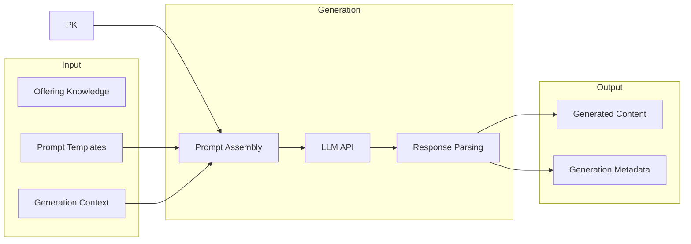
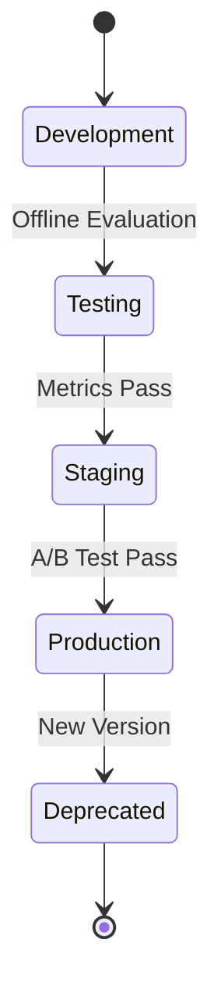

# AI Platform

## Document Status

| Field | Value |
|-------|-------|
| **Status** | Draft |
| **Version** | 0.2 |
| **Owner** | PinkCurve Engineering Team |
| **Last Reviewed** | 2026-08-10 |
| **Related Components** | Creative Studio, Discovery Engine, Learning Engine |

---

## Overview

The AI Platform provides the intelligence that enables PinkCurve to fulfill its mission of helping people discover what matters.

Rather than existing as a standalone capability, the AI Platform supports every stage of the discovery lifecycle—from understanding offerings and generating visual stories to matching buyers with relevant offerings, learning from discovery, and continuously improving the platform.

The AI Platform provides shared services, models, evaluation, and infrastructure that allow PinkCurve's components to evolve independently while benefiting from common AI capabilities.

---

## AI in the Discovery Lifecycle

The AI Platform provides shared intelligence that supports every stage of PinkCurve's discovery lifecycle.

```
Offering Knowledge
        ↓
Understanding
        ↓
Creative
        ↓
Discovery
        ↓
Learning
```

### Offering Knowledge

AI helps organize, enrich, and understand Offering Knowledge by extracting structured information, identifying relationships, improving completeness, and generating semantic representations.

### Understanding

AI interprets buyer intent, context, preferences, and offering semantics to better understand which offerings may be relevant.

### Creative

AI transforms Offering Knowledge into compelling visual stories, creative briefs, scripts, storyboards, and future multimedia content that communicate the value of an offering.

### Discovery

AI retrieves, ranks, personalizes, and explains offerings so buyers can efficiently discover what matters while maintaining trust and transparency.

### Learning

AI continuously learns from discovery signals, buyer interactions, and seller outcomes to improve Offering Knowledge, Creative Studio, Discovery Engine, and Seller Intelligence over time.


## AI Philosophy

Artificial intelligence exists to improve discovery, not to replace human judgment.

PinkCurve uses AI to help people discover relevant offerings more efficiently while maintaining trust, transparency, and privacy.

AI should:

* Improve discovery quality
* Simplify buyer experiences
* Assist sellers in communicating their offerings
* Continuously learn from meaningful discovery
* Respect participant privacy
* Provide explainable recommendations whenever practical

The success of the AI Platform is measured by whether it helps buyers discover worthwhile offerings—not by model complexity or the amount of AI used.

**Artificial intelligence is an enabling capability, not the product itself.**

---

## Shared AI Services

### Current Capabilities

| Capability | Technology | Use Case |
|------------|-----------|----------|
| Visual Story Generation | Claude API (Anthropic) | Visual story scripts |
| Basic Embeddings | Claude API | Initial offering embeddings |

### Planned Capabilities

| Capability | Technology (Candidate) | Use Case |
|------------|----------------------|----------|
| Vector Search | pgvector / Pinecone | Similarity search |
| Ranking Models | Custom ML | Discovery ranking |
| Embedding Models | Fine-tuned models | Semantic matching |
| Content Optimization | A/B + ML | Creative testing |

---

## Content Generation

### Architecture



### Prompt Engineering

Prompts are constructed from:
- **System context:** Platform-specific instructions
- **Offering knowledge:** Structured offering data
- **Generation parameters:** Duration, tone, focus
- **Output format:** Expected structure

### Quality Controls

- Input validation before generation
- Output parsing and validation
- Length and content checks
- Human review workflow (for critical content)

---

## Semantic Understanding

### Purpose

Embeddings enable semantic understanding:
- Offering similarity search
- Intent-to-offering matching
- Content clustering
- Semantic search

### Embedding Strategy (Planned)

| Entity | Embedding Source | Dimension |
|--------|-----------------|-----------|
| Offerings | Offering Knowledge text | TBD |
| Queries | Search queries | TBD |
| Content | Creative content | TBD |
| Buyers | Interaction patterns | TBD |

### Vector Storage (Planned)

Options under consideration:
- **pgvector:** PostgreSQL extension, simplest integration
- **Pinecone:** Managed vector database, better scaling
- **Weaviate:** Open-source, rich querying

See [Open Decisions](19-open-decisions.md) for vector database selection.

---

## Model Management

### Model Lifecycle



### Versioning

All models are versioned:
- Version ID
- Training date
- Training data snapshot
- Evaluation metrics
- Deployment history

### Monitoring

Production models monitored for:
- Latency
- Error rates
- Output quality metrics
- Drift detection

---

## API Design

### Internal AI API

Standardized interface for Shared AI Services:

```
POST /ai/generate
{
  "type": "creative_brief" | "script" | "storyboard",
  "input": { ... },
  "parameters": { ... }
}

POST /ai/embed
{
  "type": "offering" | "query" | "content",
  "text": "...",
  "model": "default" | "v2"
}

POST /ai/similar
{
  "embedding": [...],
  "top_k": 10,
  "filters": { ... }
}
```

### Rate Limiting

- Per-seller rate limits
- Burst allowance
- Graceful degradation

### Caching

- Embedding cache for repeated content
- Generation cache for identical inputs
- Cache invalidation on knowledge update

---

## Cost Management

### LLM API Costs

External LLM APIs charge per token:
- Track usage per seller, operation, model
- Set quotas and alerts
- Optimize prompts for efficiency

### Compute Costs

Self-hosted models (if/when used):
- GPU utilization monitoring
- Batch processing for non-real-time
- Auto-scaling based on demand

---

## Evaluation Framework

### Offline Evaluation

Before deployment:
- Standard benchmarks
- Historical data replay
- A/B simulation

### Online Evaluation

In production:
- A/B testing infrastructure
- Metric collection
- Statistical significance testing

### Human Evaluation

For content quality:
- Sample review workflows
- Quality scoring rubrics
- Feedback collection

---

## Security Considerations

### Data in Transit
- TLS for all API calls
- Encryption of embeddings

### Data at Rest
- Encrypted model artifacts
- Secure credential storage

### Input Validation
- Prompt injection prevention
- Content filtering
- Rate limiting

### Output Validation
- Content safety checks
- PII detection
- Format validation

---

## Current Status

### Implemented
- Claude API integration for generation
- Basic prompt templates
- Content generation endpoints

### In Progress
- Embedding generation
- Offering embedding storage

### Planned
- Vector similarity search
- Ranking model infrastructure
- A/B testing framework
- Model versioning system

---

## Technology Decisions

| Decision | Status | Notes |
|----------|--------|-------|
| Primary LLM | Claude (Anthropic) | Current choice |
| Vector DB | Open | pgvector vs. Pinecone |
| Embedding Model | Open | Claude vs. specialized |
| ML Framework | Open | Based on ranking needs |

---

## Related Documents

- [Creative Studio](05-creative-studio.md)
- [Discovery Engine](06-discovery-engine.md)
- [Learning Engine](08-learning-engine.md)
- [Data Architecture](11-data-architecture.md)
