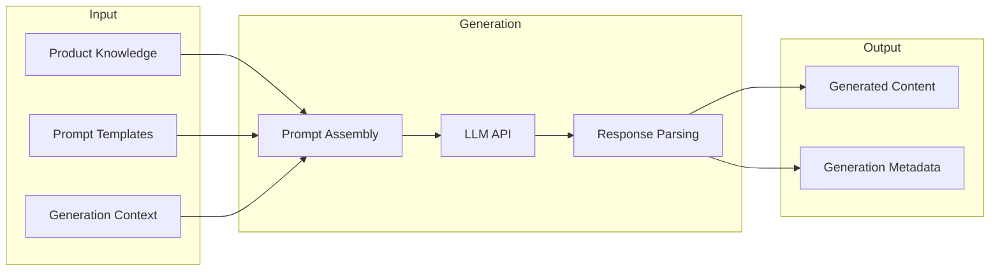
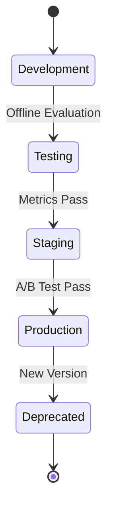

# AI Platform

## Document Status

| Field | Value |
|-------|-------|
| **Status** | Draft |
| **Version** | 0.1 |
| **Owner** | PinkCurve Engineering Team |
| **Last Reviewed** | 2026-07-23 |
| **Related Components** | Creative Studio, Discovery Engine, Learning Engine |

---

## Overview

The AI Platform provides shared AI/ML infrastructure for PinkCurve. It enables content generation, semantic understanding, matching, and continuous learning through standardized interfaces and managed infrastructure.

---

## AI Capabilities

### Current Capabilities

| Capability | Technology | Use Case |
|------------|-----------|----------|
| Content Generation | Claude API (Anthropic) | Creative briefs, scripts, storyboards |
| Basic Embeddings | Claude API | Initial product embeddings |

### Planned Capabilities

| Capability | Technology (Candidate) | Use Case |
|------------|----------------------|----------|
| Vector Search | pgvector / Pinecone | Similarity search |
| Ranking Models | Custom ML | Discovery ranking |
| Embedding Models | Fine-tuned models | Semantic matching |
| Content Optimization | A/B + ML | Creative testing |

---

## Content Generation

### Architecture



### Prompt Engineering

Prompts are constructed from:
- **System context:** Platform-specific instructions
- **Product knowledge:** Structured product data
- **Generation parameters:** Duration, tone, focus
- **Output format:** Expected structure

### Quality Controls

- Input validation before generation
- Output parsing and validation
- Length and content checks
- Human review workflow (for critical content)

---

## Embedding System

### Purpose

Embeddings enable semantic understanding:
- Product similarity search
- Intent-to-product matching
- Content clustering
- Semantic search

### Embedding Strategy (Planned)

| Entity | Embedding Source | Dimension |
|--------|-----------------|-----------|
| Products | Product Knowledge text | TBD |
| Queries | Search queries | TBD |
| Content | Creative content | TBD |
| Buyers | Interaction patterns | TBD |

### Vector Storage (Planned)

Options under consideration:
- **pgvector:** PostgreSQL extension, simplest integration
- **Pinecone:** Managed vector database, better scaling
- **Weaviate:** Open-source, rich querying

See [Open Decisions](19-open-decisions.md) for vector database selection.

---

## Model Management

### Model Lifecycle



### Versioning

All models are versioned:
- Version ID
- Training date
- Training data snapshot
- Evaluation metrics
- Deployment history

### Monitoring

Production models monitored for:
- Latency
- Error rates
- Output quality metrics
- Drift detection

---

## API Design

### Internal AI API

Standardized interface for AI capabilities:

```
POST /ai/generate
{
  "type": "creative_brief" | "script" | "storyboard",
  "input": { ... },
  "parameters": { ... }
}

POST /ai/embed
{
  "type": "product" | "query" | "content",
  "text": "...",
  "model": "default" | "v2"
}

POST /ai/similar
{
  "embedding": [...],
  "top_k": 10,
  "filters": { ... }
}
```

### Rate Limiting

- Per-seller rate limits
- Burst allowance
- Graceful degradation

### Caching

- Embedding cache for repeated content
- Generation cache for identical inputs
- Cache invalidation on knowledge update

---

## Cost Management

### LLM API Costs

External LLM APIs charge per token:
- Track usage per seller, operation, model
- Set quotas and alerts
- Optimize prompts for efficiency

### Compute Costs

Self-hosted models (if/when used):
- GPU utilization monitoring
- Batch processing for non-real-time
- Auto-scaling based on demand

---

## Evaluation Framework

### Offline Evaluation

Before deployment:
- Standard benchmarks
- Historical data replay
- A/B simulation

### Online Evaluation

In production:
- A/B testing infrastructure
- Metric collection
- Statistical significance testing

### Human Evaluation

For content quality:
- Sample review workflows
- Quality scoring rubrics
- Feedback collection

---

## Security Considerations

### Data in Transit
- TLS for all API calls
- Encryption of embeddings

### Data at Rest
- Encrypted model artifacts
- Secure credential storage

### Input Validation
- Prompt injection prevention
- Content filtering
- Rate limiting

### Output Validation
- Content safety checks
- PII detection
- Format validation

---

## Current Status

### Implemented
- Claude API integration for generation
- Basic prompt templates
- Content generation endpoints

### In Progress
- Embedding generation
- Product embedding storage

### Planned
- Vector similarity search
- Ranking model infrastructure
- A/B testing framework
- Model versioning system

---

## Technology Decisions

| Decision | Status | Notes |
|----------|--------|-------|
| Primary LLM | Claude (Anthropic) | Current choice |
| Vector DB | Open | pgvector vs. Pinecone |
| Embedding Model | Open | Claude vs. specialized |
| ML Framework | Open | Based on ranking needs |

---

## Related Documents

- [Creative Studio](05-creative-studio.md)
- [Discovery Engine](06-discovery-engine.md)
- [Learning Engine](08-learning-engine.md)
- [Data Architecture](11-data-architecture.md)
