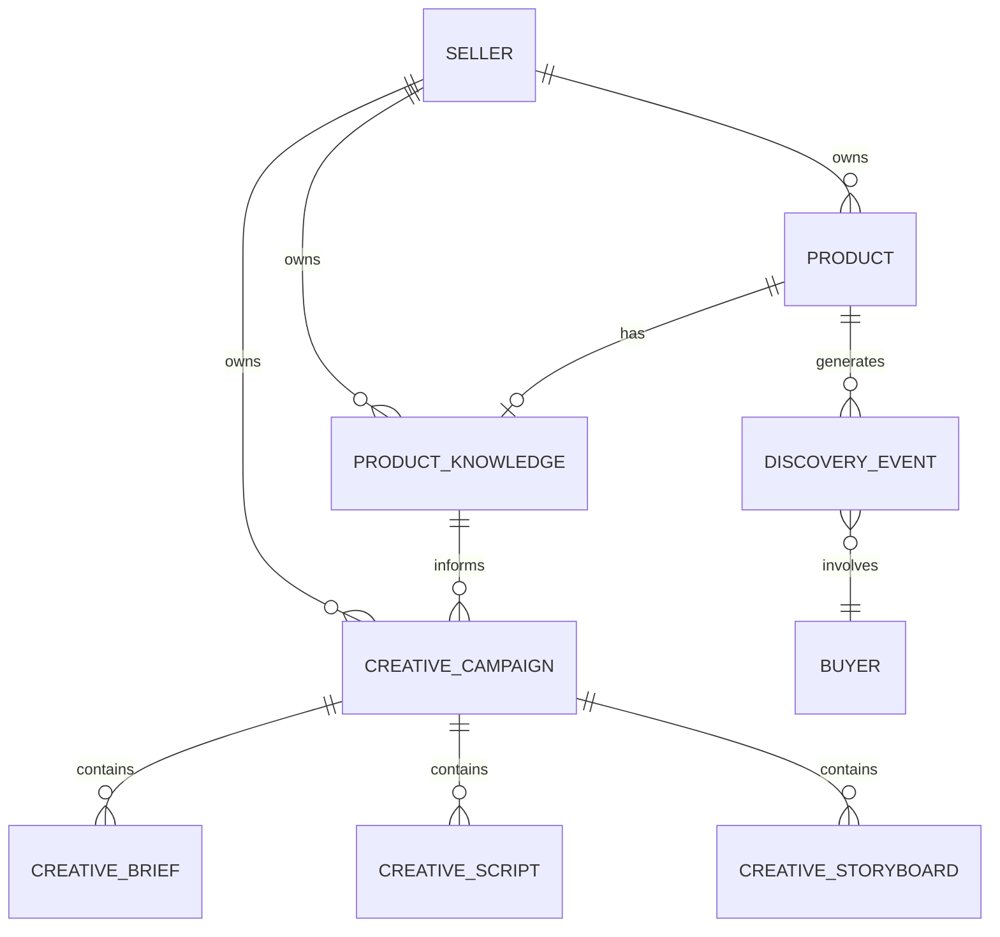
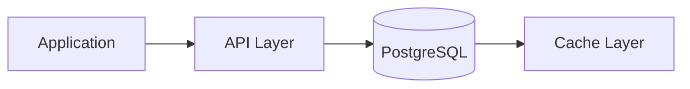
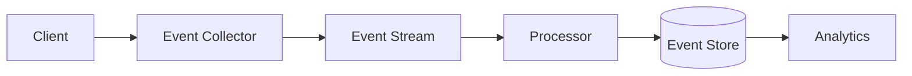

# Data Architecture

## Document Status

| Field | Value |
|-------|-------|
| **Status** | Draft |
| **Version** | 0.1 |
| **Owner** | PinkCurve Engineering Team |
| **Last Reviewed** | 2026-07-23 |
| **Related Components** | All platform components |

---

## Overview

This document describes PinkCurve's data architecture: how data is modeled, stored, processed, and governed. Good data architecture enables good features; poor data architecture creates compounding problems.

---

## Design Principles

1. **Data as Asset:** Treat data as a platform asset, not an afterthought
2. **Single Source of Truth:** Each entity has one authoritative source
3. **Schema-First:** Define schemas before implementation
4. **Observability:** Data quality is measurable and monitored
5. **Privacy-First:** Data minimization and protection by design

---

## Data Domains

### Core Entities

| Domain | Primary Entities | Database |
|--------|-----------------|----------|
| Sellers | sellers, users, subscriptions | PostgreSQL |
| Products | products, product_knowledge | PostgreSQL |
| Creative | campaigns, briefs, scripts, storyboards | PostgreSQL |
| Discovery | discovery_events, impressions | PostgreSQL + Events |
| Analytics | metrics, aggregates | PostgreSQL + Analytics |

### Entity Relationships



---

## Database Schema

### Primary Database: PostgreSQL (Cloud SQL)

#### Core Tables

```sql
-- Sellers (existing)
sellers (
    id UUID PRIMARY KEY,
    email VARCHAR(255) UNIQUE,
    company_name VARCHAR(255),
    created_at TIMESTAMPTZ,
    updated_at TIMESTAMPTZ
)

-- Products (existing)
products (
    id UUID PRIMARY KEY,
    seller_id UUID REFERENCES sellers,
    name VARCHAR(255),
    description TEXT,
    price NUMERIC(12,2),
    image_url TEXT,
    created_at TIMESTAMPTZ,
    updated_at TIMESTAMPTZ
)

-- Offering Knowledge (Stage 1B)
product_knowledge (
    id UUID PRIMARY KEY,
    seller_id UUID REFERENCES sellers ON DELETE CASCADE,
    product_id UUID REFERENCES products ON DELETE SET NULL,
    product_name VARCHAR(200),
    key_features JSONB DEFAULT '[]',
    key_benefits JSONB DEFAULT '[]',
    target_audiences JSONB DEFAULT '[]',
    unique_selling_points JSONB DEFAULT '[]',
    completeness_score INTEGER CHECK (0-100),
    status VARCHAR(30) CHECK (draft/active/archived),
    created_at TIMESTAMPTZ,
    updated_at TIMESTAMPTZ
)

-- Creative Campaigns (Stage 1B)
creative_campaigns (
    id UUID PRIMARY KEY,
    seller_id UUID REFERENCES sellers ON DELETE CASCADE,
    product_id UUID REFERENCES products ON DELETE SET NULL,
    knowledge_id UUID REFERENCES product_knowledge ON DELETE SET NULL,
    title VARCHAR(200),
    video_duration INTEGER CHECK (15/30/60),
    status VARCHAR(30) CHECK (draft/active/completed/archived),
    created_at TIMESTAMPTZ,
    updated_at TIMESTAMPTZ
)
```

#### JSONB Usage

We use JSONB for:
- Flexible, schema-evolving data (features, benefits)
- Nested structures (brand_voice, specifications)
- Arrays of varying length (keywords, FAQs)

JSONB guidelines:
- Always provide NOT NULL DEFAULT for JSONB columns
- Use '[]'::jsonb for arrays, '{}'::jsonb for objects
- Index frequently queried JSONB paths

---

## Data Flow

### Transactional Data



- Synchronous writes through API
- Read-through caching for frequent reads
- Transaction boundaries at API level

### Event Data (Planned)



- Async event collection
- Stream processing for enrichment
- Batch aggregation for analytics

---

## Indexing Strategy

### Primary Indexes

| Table | Index | Purpose |
|-------|-------|---------|
| product_knowledge | seller_id | Seller's products |
| product_knowledge | status | Active products |
| creative_campaigns | seller_id | Seller's campaigns |
| creative_campaigns | knowledge_id | Campaign-knowledge link |

### Future: Vector Indexes

For similarity search (planned):
- Product embeddings
- Query embeddings
- Content embeddings

---

## Data Quality

### Validation Layers

1. **API Validation:** Input schema validation
2. **Database Constraints:** CHECK, FK, NOT NULL
3. **Application Logic:** Business rule validation
4. **Monitoring:** Anomaly detection

### Quality Metrics

| Metric | Target |
|--------|--------|
| Completeness | >95% required fields populated |
| Consistency | 0 FK violations |
| Freshness | updated_at within SLA |
| Uniqueness | No duplicate records |

---

## Data Governance

### Ownership

| Domain | Owner | Steward |
|--------|-------|---------|
| Seller data | Product Team | Engineering |
| Offering data | Product Team | Engineering |
| Event data | Analytics Team | Engineering |

### Access Control

- Row-level security by seller_id
- API authentication required
- Admin roles for cross-seller access

### Retention

| Data Type | Retention | Rationale |
|-----------|-----------|-----------|
| Seller accounts | Duration + 30 days | Legal/support |
| Products | Duration + 30 days | Reference |
| Events | 2 years | Analytics |
| Aggregates | Indefinite | Reporting |

---

## Migration Strategy

### Schema Changes

1. Always use `IF NOT EXISTS` / `ADD COLUMN IF NOT EXISTS`
2. Migrations in application startup
3. Backward-compatible changes (add nullable, not remove)
4. Breaking changes require version coordination

### Data Backfill

For new columns with historical data:
1. Add column (nullable)
2. Backfill in batches
3. Add constraints after backfill
4. Update application code

---

## Backup and Recovery

### Current Configuration

| Setting | Value |
|---------|-------|
| Automated backups | Enabled |
| Retention | 7 days |
| Point-in-time recovery | Enabled |
| Transaction log retention | 7 days |

### Recovery Procedures

- Point-in-time recovery via Cloud SQL
- Cross-region backup (planned)
- Regular recovery testing (planned)

---

## Observability

### Metrics

- Query latency (p50, p95, p99)
- Connection pool utilization
- Table sizes
- Index usage

### Alerts

- High latency queries
- Connection exhaustion
- Replication lag (when applicable)
- Storage thresholds

---

## Technology Stack

| Component | Technology | Notes |
|-----------|------------|-------|
| Primary DB | PostgreSQL 15 | Cloud SQL |
| Caching | None (planned) | Redis candidate |
| Events | None (planned) | Pub/Sub candidate |
| Analytics | None (planned) | BigQuery candidate |
| Vector | None (planned) | pgvector candidate |

---

## Related Documents

- [Product Architecture](03-product-architecture.md)
- [Security, Privacy, and Trust](12-security-privacy-and-trust.md)
- [Offering Knowledge Schema](../schemas/offering-knowledge.schema.json)
