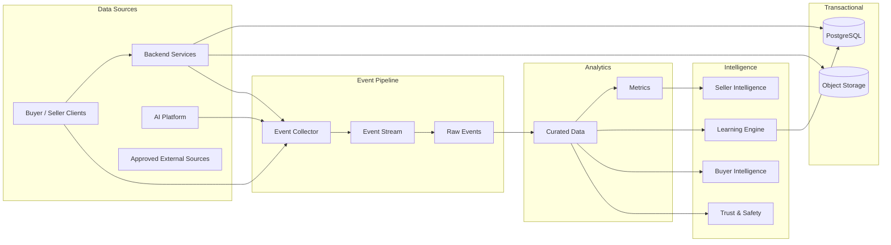

# Data Architecture

## Document Status

| Field                  | Value                      |
| ---------------------- | -------------------------- |
| **Status**             | Draft                      |
| **Version**            | 0.3                        |
| **Owner**              | PinkCurve Engineering Team |
| **Last Reviewed**      | 2026-08-19                 |
| **Related Components** | All platform components    |

---

## Overview

PinkCurve's Data Architecture defines how platform information is modeled, stored, exchanged, governed, protected, retained, and made available to the systems that create discovery value.

The architecture is centered on the **Offering**, but PinkCurve data extends far beyond offering records.

The platform must represent and connect:

* Buyers
* Sellers
* Organizations
* Accounts
* Offerings
* Offering Knowledge
* Metadata
* Creative assets
* Campaigns
* Buyer intent
* Adaptive Metadata Navigation
* Discovery events
* Buyer feedback
* Analytics
* Learned signals
* Seller Intelligence
* Trust and verification
* Billing
* Customer support
* AI and model information
* Operational data

Different kinds of data have different requirements.

Transactional account data may require strong relational consistency.

Discovery events may require high-volume event storage.

Creative assets may belong in object storage.

Embeddings may require vector indexing.

Analytics may eventually require columnar analytical storage.

The Data Architecture should therefore remain **logically unified but physically flexible**.

Good data architecture enables good discovery.

Poor data architecture can compromise discovery quality, learning, trust, privacy, seller reporting, and platform scalability.

---

# Data Architecture Philosophy

PinkCurve should treat data architecture as part of the product architecture rather than an implementation afterthought.

Several principles guide the design.

### Data Has Meaning

Fields should represent clearly defined product concepts rather than become miscellaneous storage.

### One Authoritative Source

Important facts should have an identifiable authoritative source.

Derived and learned information should not silently overwrite authoritative facts.

### Logical Model Before Physical Storage

PinkCurve should define what the data means before deciding where it is stored.

### Fit Storage to Workload

Not every dataset belongs in PostgreSQL.

### Preserve Provenance

The platform should know where important knowledge, metrics, and learned signals came from.

### Events Are Historical Evidence

Discovery events should represent what actually occurred and should not be rewritten simply because later interpretation changes.

### Privacy by Design

Collect only data justified by platform needs.

### Trust by Design

Data used for billing, verification, learning, and fraud detection requires stronger integrity controls.

### Data Must Be Testable

Schemas, pipelines, transformations, and analytical outputs should support validation and regression testing.

### Start Simple

The physical architecture should remain as simple as practical during early development.

---

# Logical Data Model

PinkCurve's logical data model is centered on the relationship between the people and organizations that provide Offerings and the Buyers who discover them.

The primary business roles are:

- **Buyer** — discovers and explores Offerings
- **Seller** — commercial provider of Offerings
- **Organization** — future public, community, nonprofit, or other provider of Offerings

The **Offering** remains the fundamental discovery object.

```text
Seller / Organization
        │
        ▼
     Offering
        │
        ▼
Offering Knowledge
        │
   ┌────┴────┐
   ▼         ▼
Metadata   Creative
   │         │
   └────┬────┘
        ▼
    Discovery
        ▲
        │
      Buyer
        │
        ▼
Discovery Events
        │
   ┌────┼─────┐
   ▼    ▼     ▼
Analytics Learning Trust
   │     │
   └──┬──┘
      ▼
  Intelligence

---

# Core Business Entities

PinkCurve's primary logical entities include:

* Buyer
* Seller
* Organization
* Offering
* Offering Knowledge
* Offering Metadata
* Creative Asset
* Creative Campaign
* Discovery Session
* Discovery Event
* Buyer Feedback
* Seller Account
* Subscription
* Invoice
* Trust Record
* Support Interaction

Buyer, Seller, and Organization represent distinct roles within PinkCurve and should remain explicit in the logical architecture.

The logical model intentionally avoids introducing a generic Participant entity unless a future architectural requirement demonstrates a clear need for one.

---

# Account and Identity Domain

PinkCurve accounts provide identity, authentication, authorization, verification, and access to platform capabilities.

Account requirements differ depending on the role.

### Buyer Accounts

Buyer accounts may support:

- Authentication
- Identity verification where required
- Saved Offerings
- Preferences
- Discovery history where permitted
- Reviews and ratings
- Feedback
- Privacy settings
- Security settings

### Seller Accounts

Seller accounts may support:

- Authentication
- Seller verification
- Verified contact information
- Organization or business information
- Offering management
- Creative management
- Seller Intelligence
- Billing
- Team access
- Security settings

### Organization Accounts

Future public, community, nonprofit, or other organizations may require capabilities similar to Seller accounts while operating under different verification, billing, and Offering policies.

The account architecture may share common authentication and identity infrastructure without requiring Buyers, Sellers, and Organizations to share the same business data model.

Authentication identity and product role should therefore remain conceptually separate.

---

# Seller and Organization Data

Sellers and Organizations provide Offerings for discovery.

Although they share the provider role, their business requirements may differ. Commercial Sellers may require subscriptions, billing, campaigns, and Seller Intelligence, while future public or community Organizations may operate under different policies and business models.

Common provider data may include:

* Account identity
* Organization name
* Contact information
* Verified contact person
* Verified phone
* Account status
* Registration time
* Verification status
* Geographic information
* Security information
* Subscription
* Billing configuration
* Workspace
* Team members
* Trust status

Sensitive security fields should be protected and access-controlled.

Not every application component should have direct access to all seller data.

---

# Buyer Data

Buyer data may include:

* Buyer account
* Authentication information
* Verification status
* Saved offerings
* Explicit preferences
* Discovery history where permitted
* Feedback
* Ratings
* Reviews
* Hidden offerings
* Hidden sellers
* Buyer settings
* Privacy settings

Potential logical entities include:

```text id="suvxh2"
buyers
buyer_preferences
buyer_reviews
buyer_ratings
buyer_feedback
buyer_saved_offerings
buyer_hidden_offerings
buyer_hidden_seller
buyer_logs
```

The exact physical design may consolidate or separate these entities depending on implementation needs.

Buyer data should follow strong privacy and minimization principles.

---

# Offering Model

The **Offering** remains PinkCurve's fundamental discovery object.

An Offering represents anything PinkCurve can present for discovery.

---

## Offering Types

| Offering Type      | Examples                                      |
| ------------------ | --------------------------------------------- |
| Product            | Consumer goods, electronics, clothing         |
| Commercial Service | Home repair, consulting, professional service |
| Promotion          | Discount, special offer                       |
| Event              | Conference, concert, workshop                 |
| Community Service  | Local resource, volunteer opportunity         |
| Public Service     | Government resource, public information       |
| Brand Recognition  | Brand-awareness discovery                     |
| Future Type        | New discoverable Offering categories          |

The Offering abstraction allows new discovery types without redesigning the complete data architecture.

---

# Offering Core Data

Core Offering data may include:

* Offering identifier
* Provider identifier
* Offering type
* Name
* Description
* Category
* Destination URL
* Status
* Location applicability
* Availability
* Created time
* Updated time

Type-specific attributes should not force every Offering into the same rigid schema.

---

# Offering Knowledge Domain

Offering Knowledge describes PinkCurve's evolving understanding of an Offering.

The logical model should distinguish:

```text id="1cjg4m"
Offering
    ↓
Offering Knowledge
    ↓
Knowledge Versions
    ↓
Knowledge Sources
```

Potential entities include:

```text id="9alt1g"
offering_knowledge
knowledge_versions
knowledge_sources
offering_metadata
offering_attributes
```

Offering Knowledge may contain:

* Features
* Benefits
* Use cases
* Audiences
* Specifications
* FAQs
* Metadata
* Differentiators
* Brand voice
* Semantic representations
* Completeness
* Quality
* Provenance

See: [Offering Knowledge](04-offering-knowledge.md)

---

# Source, Derived, and Learned Knowledge

The data model should preserve the distinction between:

### Source Knowledge

Seller- or authority-provided facts.

### Derived Knowledge

Information produced through extraction, classification, metadata generation, or AI enrichment.

### Learned Knowledge

Patterns inferred from discovery behavior.

Example:

```text id="pcdhuw"
Source:
Waterproof = Yes

Derived:
Category = Trail Running Shoe

Learned:
Frequently explored during wet-weather trail searches
```

These should not be stored in a way that makes them indistinguishable.

---

# Knowledge Provenance

Important PinkCurve knowledge should preserve sufficient provenance to identify where the knowledge came from and, where applicable, how it was created, transformed, or verified.

This is particularly important for Offering Knowledge because PinkCurve may combine Seller-provided information, external source information, AI-generated information, verified information, and derived knowledge.

Applicable provenance information may include:

- source type;
- source identifier;
- source version;
- source URL or external reference where applicable;
- originating Product or capability;
- generation method;
- Model identifier and Model version where applicable;
- Prompt or Prompt Version where applicable;
- creation time;
- update time;
- verification status;
- verified by;
- verification time.

For example:

    Seller URL / Seller Input
            ↓
    Offering Knowledge Source
            ↓
    AI Processing
            ↓
    AI-Generated Knowledge
            ↓
    Verification / Approval
            ↓
    Governed Offering Knowledge

PinkCurve should retain sufficient provenance to distinguish the authoritative source information from AI-generated, derived, transformed, or verified representations.

Provenance can support:

- explainability;
- debugging;
- Seller review;
- Trust and verification;
- auditing;
- correction workflows;
- Learning;
- Data Quality;
- investigation of incorrect or conflicting knowledge.

Knowledge provenance should be appropriate to the importance and use of the information.

PinkCurve does not need to preserve unlimited provenance for every temporary transformation.

Detailed platform-wide provenance and lineage requirements are defined later under **Provenance and Necessary Traceability**.

> **Knowledge used by PinkCurve should retain sufficient provenance to determine where important information came from and how authoritative, derived, AI-generated, and verified information relate to one another.**

---

# Metadata Domain

Metadata is a first-class PinkCurve data domain because it supports Adaptive Metadata Navigation.

Logical metadata entities may include:

```text id="wi6o4b"
metadata_dimensions
metadata_values
offering_metadata
metadata_relationships
metadata_usage_metrics
```

A metadata model should support:

* Category-specific dimensions
* Multiple values
* Hierarchies
* Relationships
* Location relevance
* Time relevance
* Learned usefulness
* Provenance

Metadata should not be reduced to one unstructured keyword array.

---

# Adaptive Metadata Navigation Data

AMN introduces discovery-state data such as:

* Metadata presented
* Metadata selected
* Metadata removed
* Metadata order
* Metadata path
* Candidate-set context
* Metadata reset
* Metadata usefulness

Example:

```text id="26xzqx"
Discovery Session
      ↓
Metadata Path
      ↓
Running
      ↓
Trail
      ↓
Waterproof
      ↓
Offering Exploration
```

AMN data may be represented partly as events rather than permanent relational state.

This preserves the exact discovery journey for later analytics and learning.

---

# Creative Domain

Creative data should separate metadata about creative assets from the media itself.

Logical entities may include:

```text id="rffwc5"
creative_campaigns
creative_assets
creative_briefs
creative_scripts
creative_storyboards
creative_variants
creative_versions
```

Relational storage may contain:

* Creative identifiers
* Offering relationships
* Campaign relationships
* Status
* Version
* Format
* Dimensions
* Duration
* Provenance
* Approval status

Large assets such as images and videos should normally reside in object storage rather than relational database columns.

---

# Creative Asset Storage

Conceptually:

```text id="8ojb9t"
PostgreSQL
    ↓
Creative Asset Metadata
    ↓
Object Storage Reference
    ↓
Image / Video / Audio
```

Object storage may contain:

* Images
* Videos
* Audio
* Generated files
* Uploaded seller assets
* Storyboards
* Derived media

The database stores references and metadata rather than duplicating large media files.

---

# Campaign Data

Campaigns may represent:

* Offering discovery
* Promotions
* Brand recognition
* Seasonal discovery
* Geographic campaigns
* Audience-specific campaigns

Campaign data may include:

* Seller
* Offering
* Objective
* Creative
* Start/end dates
* Geographic scope
* Budget where applicable
* Status
* Campaign type

Campaign data should remain separate from Offering facts because campaigns change without changing what the Offering fundamentally is.

---

# Discovery Domain

Discovery data records how buyers and offerings interact through PinkCurve.

Potential entities include:

```text id="u5sfrh"
discovery_sessions
discovery_events
offering_impressions
offering_viewing_logs
search_events
metadata_events
feedback_events
destination_events
```

Physical implementation may use a generalized event model rather than a separate table for each event type.

---

# Discovery Sessions

A Discovery Session groups related buyer interactions.

A session may contain:

* Session identifier
* Buyer identifier where permitted
* Start time
* End time
* Discovery surface
* Context
* Initial intent
* Location context
* Experiment assignments

Session data should not unnecessarily duplicate all individual event details.

---

# Discovery Events

Discovery Events represent historical facts about what occurred.

Examples include:

* Offering presented
* Creative viewed
* Metadata presented
* Metadata selected
* Search performed
* Offering opened
* Positive feedback
* Negative feedback
* Offering hidden
* Destination clicked
* Report submitted

Events should generally be append-oriented.

Later analytics may reinterpret them, but historical evidence should remain stable.

---

# Discovery Event Structure

A logical event may include:

```text id="nx1403"
discovery_event_id
event_type
timestamp
discovery_session_id
buyer_id
offering_id
seller_id
creative_id
surface
position
metadata_context
experiment_context
device_context
location_context
event_payload
```

Not every field is required for every event.

The exact schema should enforce minimum required information by event type.

---

# Raw Events vs. Derived Data

PinkCurve should maintain a clear distinction between historical evidence and the derived, analytical, learned, and intelligence outputs created from that evidence.

Conceptually:

    Raw Discovery Events
            ↓
    Curated Events
            ↓
    Discovery Analytics
            ↓
    Analytical Results
            │
            ├────────→ Learning Engine
            │              ↓
            │        Learning Outputs /
            │        Purpose-Specific Models
            │
            └────────→ Seller Intelligence
                           ↓
                     Seller Signals /
                     Insights /
                     Opportunities /
                     Recommendations

This flow is illustrative rather than mandatory.

Not every Learning Output or Seller Intelligence output must pass through every stage shown above.

For example, Products may use combinations of:

- Raw or Curated Events;
- Analytical Results;
- Offering Knowledge;
- Buyer Signals;
- Seller Signals;
- Trust information;
- contextual information;
- other authorized Product inputs.

The important architectural distinction is that Raw Events remain historical evidence, while downstream Products create independently meaningful outputs according to their own responsibilities.

Derived, Analytical, Learned, or Intelligence outputs should not silently replace or rewrite the Raw Events from which they were produced.

Where an independently meaningful downstream output is created, it should follow the applicable PinkCurve requirements for:

- identity;
- Logical Data Ownership;
- Source of Truth;
- provenance;
- necessary traceability;
- schema and versioning;
- privacy;
- retention;
- access control.

> **Raw Events preserve historical evidence. Downstream Products interpret that evidence and may create new authoritative Product outputs without changing the original historical record.**

---

# Buyer Feedback Domain

Buyer feedback should be represented explicitly.

Potential forms include:

* Positive feedback
* Negative feedback
* Rating
* Review
* Report
* Save
* Hide
* Show more like this
* Show fewer like this

Logical entities may include:

```text id="4pewfv"
buyer_feedback
buyer_rating
buyer_review
buyer_saved_offering
buyer_hidden_offering
```

Some may be represented as durable state plus corresponding events.

Example:

```text id="9gyq4a"
Event:
buyer_hidden_offering

State:
offering remains hidden for that buyer
```

The event records what happened.

The state supports future product behavior.

---

# Review and Rating Data

Reviews and ratings may include:

* Buyer
* Offering
* Rating
* Review content
* Creation time
* Modification history
* Moderation status
* Verification status
* Abuse flags

Reviews should integrate with Trust & Safety because fake reviews can corrupt buyer trust and Learning Engine signals.

---

# Analytics Domain

Analytics data should be distinguished from transactional application data.

Potential analytical datasets include:

* Discovery metrics
* AMN metrics
* Creative metrics
* Seller metrics
* Feed metrics
* QOV metrics
* Brand-recognition metrics
* Geographic aggregates
* Trust aggregates
* Experiment results

Analytics systems may initially use PostgreSQL but eventually benefit from specialized analytical storage.

---

# Analytics Storage Evolution

An early architecture may use:

```text id="l89yca"
PostgreSQL
    ↓
Small Aggregates
```

At larger scale:

```text id="uruiqz"
Discovery Events
      ↓
Event Pipeline
      ↓
Analytical Store / Warehouse
      ↓
Curated Tables
      ↓
Metrics / Dashboards / Learning
```

Candidate technologies may include BigQuery or equivalent analytical platforms.

Technology selection should depend on actual volume and workload.

---

# Learning Data Domain

Learning Engine data may include:

* Feature datasets
* Label datasets
* Training snapshots
* Learned signals
* Model predictions and other intermediate Model outputs where applicable
* Model Evaluation
* Experiment assignments
* Model evaluations

These should be distinguishable from source transactional data.

---

# Feature Data

Model features may originate from:

* Discovery events
* Metadata selections
* Offering Knowledge
* Creative performance
* Trust status
* Context
* Seller data
* Buyer preferences where permitted

Feature definitions should be documented.

A feature named:

```text id="zjyljg"
buyer_interest_score
```

is not useful unless PinkCurve knows:

* What it means
* How it is calculated
* What data it uses
* Its version
* Its privacy implications

---

# Training Dataset Versioning

Training datasets should support:

* Dataset identifier
* Time range
* Data sources
* Transformation version
* Label definition
* Exclusions
* Bot filtering
* Privacy processing
* Creation time

This improves model reproducibility.

---

# AI Platform Data

The AI Platform may produce operational metadata such as:

* Model identifier
* Provider
* Model version
* Prompt version
* Evaluation dataset
* Generation time
* Token usage
* Cost
* Validation results
* AI operation status

AI logs should avoid unnecessary storage of sensitive prompts or personal data.

---

# Embeddings and Vector Data

Embeddings may represent:

* Offerings
* Buyer intent
* Metadata
* Creative
* Categories

Logical embedding records may contain:

```text id="0vqs5q"
entity_id
entity_type
source_version
embedding_model
embedding_model_version
embedding
created_at
```

The vector itself may reside in:

* PostgreSQL with pgvector
* Dedicated vector storage
* Search infrastructure with vector indexing

The logical record should remain portable across technologies.

---

# Embedding Freshness

An embedding can become stale when:

* Offering Knowledge changes
* Metadata changes significantly
* Embedding model changes
* Representation strategy changes

PinkCurve should identify stale embeddings using source versions rather than blindly regenerating every vector.

---

# Seller and Buyer Intelligence Data

Seller Intelligence data may include:

* Recommendations
* Recommendation evidence
* Confidence
* Seller responses
* Recommendation status
* Recommendation outcomes

Logical entities may include:

```text id="o778pn"
seller_insights
seller_recommendations
seller_recommendation_feedback
seller_recommendation_outcomes
```

Buyer Intelligence may include:

* Saved preferences
* Negative preferences
* Discovery continuity
* Permitted longer-term patterns

Buyer Intelligence should be tightly governed by privacy requirements.

---

# Recommendation Lineage

Seller Intelligence should preserve sufficient lineage for important Seller Recommendations so PinkCurve can understand and, where appropriate, explain why a Recommendation was produced.

Recommendation lineage should follow the general principles defined under **Provenance and Necessary Traceability**.

Conceptually:

    Supporting Evidence
          ↓
    Analytical Results /
    Seller Signals
          ↓
    Seller Insight /
    Opportunity
          ↓
    Seller Recommendation
          ↓
    Seller Action
          ↓
    Observed Outcome

A Seller Recommendation should preserve the identifiers, references, versions, supporting evidence, or other provenance necessary for its Product and operational purpose.

This may include references to applicable:

- Seller Signals;
- Seller Insights;
- Seller Opportunities;
- Analytical Results;
- Learning Outputs or Model Versions;
- Offering or Campaign information;
- supporting evidence;
- Recommendation generation time.

A Recommendation does not need a direct relationship to every Raw Discovery Event that ultimately contributed to an aggregated Metric or learned result.

For example:

    Discovery Events
          ↓
    Discovery Analytics
          ↓
    Analytical Result
          ↓
    Seller Intelligence
          ↓
    Seller Signal
          ↓
    Seller Recommendation

The Seller Recommendation may reference the Seller Signal and applicable supporting Analytical Result rather than duplicating or directly referencing every underlying Discovery Event.

Where Seller action and subsequent outcomes are available and appropriate to retain, they may support evaluation of Recommendation usefulness and future Learning.

Detailed Recommendation behavior, explanation, and Seller-facing presentation belong to Seller Intelligence rather than Data Architecture.

> **Seller Recommendations should retain sufficient lineage to support their intended explanation, evaluation, Trust, debugging, and operational needs without requiring complete reconstruction of every upstream data transformation.**

---

# Trust and Safety Domain

Trust data is a major PinkCurve domain.

Potential entities include:

```text id="7junv4"
seller_verifications
buyer_verifications
organization_verifications
offering_verifications
trust_signals
risk_scores
fraud_cases
abuse_reports
bot_signals
moderation_actions
security_events
```

Trust information may have stricter access controls and retention requirements than ordinary application data.

---

# Verification Data

Verification data may include:

* Verification method
* Verification status
* Verification time
* Verified contact person
* Verified phone status
* Evidence references
* Reviewer
* Expiration where applicable

Sensitive verification evidence should not necessarily be stored in the same table as normal account profile information.

---

# Security Event Data

Security logs may include:

* Authentication events
* Failed login attempts
* Account recovery
* Suspicious IP activity
* Session anomalies
* Administrative actions
* Verification changes

Security logging should balance audit requirements with privacy and storage minimization.

---

# Billing Domain

Seller billing requires data separate from ordinary discovery analytics.

Potential entities include:

```text id="wofiqj"
seller_subscriptions
seller_invoices
seller_invoice_items
invoice_settings
payments
billing_events
billing_adjustments
billing_disputes
```

Billing data should support:

* Reconciliation
* Auditability
* Corrections
* Seller explanations
* Dispute handling

---

# Billable Discovery Events

If QOV or another discovery measure becomes billable, PinkCurve should distinguish:

```text id="2bf8se"
Discovery Event
      ↓
Qualification
      ↓
Bot / Fraud Validation
      ↓
Billable Event
      ↓
Invoice Item
```

A raw click should not automatically become a billable event.

Billing qualification should be reproducible and auditable.

---

# Customer Support Domain

PinkCurve should preserve customer-support interactions for service quality, disputes, trust investigations, and operational learning.

Potential entities include:

```text id="42ekk5"
customer_support_cases
customer_support_messages
customer_support_actions
customer_support_logs
support_escalations
```

A support case may relate to:

* Seller
* Buyer
* Offering
* Invoice
* Verification
* Trust report
* Campaign

Support information may contain sensitive material and therefore requires controlled access.

---

# Operational Data

Operational domains may include:

* Application logs
* API metrics
* Deployment information
* Job execution
* Queue status
* Error reporting
* Background-task state
* Cost telemetry

Operational data should remain logically separated from product analytics even if both are ultimately stored in shared infrastructure.

---

# Physical Storage Strategy

PinkCurve should select physical storage according to the characteristics and requirements of each workload.

Different Data Domains may require different combinations of:

- relational storage;
- flexible structured storage;
- Object Storage;
- Event storage;
- Analytical Storage;
- Vector storage;
- caching where justified;
- analytical or batch file formats.

A logical Data Domain does not require its own physical storage system.

Multiple PinkCurve Products and Data Domains may initially share infrastructure while retaining distinct Logical Data Ownership, authoritative Sources of Truth, schemas, access controls, and Product responsibilities.

PinkCurve should avoid unnecessary proliferation of storage technologies.

> **Storage technology should follow workload requirements rather than define Product or Data Domain boundaries.**

---

## PostgreSQL

PostgreSQL is appropriate for strongly structured transactional data such as:

* Sellers
* Buyers
* Organizations
* Accounts
* Offerings
* Offering Knowledge
* Metadata definitions
* Campaigns
* Reviews
* Ratings
* Recommendations
* Billing
* Support case metadata
* Trust state

PostgreSQL may also support early-stage Event storage, Analytics, flexible structured data, and Vector retrieval where appropriate.

---

## JSONB

JSONB can provide flexibility where attributes vary significantly.

Appropriate examples include:

* Specifications
* FAQs
* Brand voice
* Offering-type-specific attributes
* Structured AI output
* Event payloads
* Recommendation evidence

JSONB should not become a replacement for proper data modeling.

Frequently queried or integrity-critical fields should generally have explicit columns or normalized structures.

---

## JSONB Guidelines

Where JSONB is used:

* Define expected structure
* Validate at the application or schema layer
* Provide appropriate defaults
* Index frequently queried paths
* Avoid storing unrelated concepts in one document
* Version important schemas

Example:

```sql
key_features JSONB NOT NULL DEFAULT '[]'::jsonb
```

---

## Object Storage

Object storage is appropriate for:

* Images
* Video
* Audio
* Uploaded documents
* Generated creative files
* Model artifacts where applicable
* Dataset files

Candidate technology may include Google Cloud Storage or equivalent Object Storage.

Database records should maintain references and relevant metadata.

---

## Event Storage

Early-stage Events may remain in PostgreSQL where volume, processing, and reliability requirements permit.

As Event scale or processing requirements grow, PinkCurve may introduce dedicated Event transport, processing, or storage capabilities.

Conceptually:

    Application
        ↓
    Event Collector
        ↓
    Event Stream
        ↓
    Raw Event Storage
        ↓
    Curated Analytics

Candidate technologies may include Pub/Sub, Kafka, Object Storage, analytical systems, or equivalent technologies.

The Event architecture should evolve according to measured Product, workload, reliability, and operational requirements.

The logical meaning and Product Data Contract of an Event should remain independent of the physical Event technology.

---

## Analytical Storage

Early analytical workloads may operate from PostgreSQL or modest analytical exports where appropriate.

As workload grows, PinkCurve may introduce dedicated Analytical Storage such as:

- BigQuery;
- Snowflake;
- ClickHouse;
- equivalent warehouse, analytical database, or future technology.

Dedicated Analytical Storage should be introduced only when Product, workload, scale, performance, reliability, or operational requirements justify it.

The physical analytical technology does not determine ownership of Analytical Results.

For example, Discovery Analytics remains authoritative for the Analytical Results and QOV calculations it produces regardless of where the underlying analytical data is physically processed.

---

## Vector Storage

Vector storage may use:

- pgvector;
- managed Vector databases;
- Vector-capable search systems;
- other appropriate future infrastructure.

Vector technology should remain replaceable.

A Vector is a derived representation of an underlying entity or information object.

For example:

    Offering Knowledge
        ↓
    Embedding
        ↓
    Vector Representation
        ↓
    Vector Retrieval

The Vector representation may have its own technical identity, version, and lifecycle where required.

However, the Vector does not become authoritative for the underlying Offering Knowledge or other entity it represents.

> **The underlying entity remains authoritative; the Vector remains a derived representation.**

---

### Data Format Strategy

Different workloads may use different formats.

### Relational

Appropriate for:

* Core entities
* Integrity constraints
* Transactions

### JSON

Appropriate for:

* Flexible structured attributes
* API exchange
* AI structured output

### Parquet

Appropriate for:

* Analytical datasets
* Training datasets
* Large batch exports
* Historical archives

### Vector Representation

Appropriate for:

* Semantic retrieval
* Similarity
* ML representation

No single format should be forced onto every workload.

---

# Data Flow Architecture



Learned outputs written back to PostgreSQL should be stored as derived or learned data rather than silently modifying source facts.

---

# Source of Truth

Each major PinkCurve data concept should have a clearly defined authoritative Source of Truth.

The Source of Truth is the authoritative record, representation, or system of record that PinkCurve should rely upon when the same information exists in multiple locations, caches, derived representations, analytical systems, or consuming Products.

Source of Truth should be distinguished from:

- Logical Data Ownership;
- Physical Storage;
- data producer;
- data consumer;
- cached copies;
- derived representations.

A Product may consume or temporarily store another Product's data without becoming its authoritative source.

---

## Authoritative Sources

| Data Concept | Authoritative Source |
| --- | --- |
| Buyer identity | Buyer account / identity record |
| Seller identity | Seller account / identity record |
| Organization identity | Organization account / identity record |
| Offering existence and core identity | Offering record |
| Offering Knowledge | Authoritative Offering Knowledge record |
| Seller-provided Offering fact | Offering Knowledge source record |
| Metadata | Authoritative Metadata record |
| Creative metadata / Creative Package | Authoritative Creative Studio record |
| Creative media | Object Storage object + authoritative Creative metadata |
| Campaign | Authoritative Campaign record |
| Discovery Result | Authoritative Discovery Result record |
| Discovery Event | Raw Discovery Event record |
| Discovery Session | Discovery Session record |
| Buyer Feedback | Buyer Feedback record |
| Buyer Review | Buyer Review record |
| Buyer Rating | Buyer Rating record |
| Discovery metric | Authoritative Discovery Analytics result |
| Analytical Result | Authoritative Discovery Analytics result |
| QOV definition | Authoritative Discovery Analytics definition |
| QOV calculated result | Authoritative Discovery Analytics result |
| Learning Output | Authoritative Learning Output record |
| Purpose-specific learned Model | Authoritative Learning Engine Model record / Model artifact |
| Model Registry / Model-serving technical state | Authoritative AI Platform Model Registry / serving-state record |
| Prompt / Prompt Version | Authoritative AI Platform Prompt record / Prompt Version |
| AI Evaluation Result | Authoritative AI Platform Evaluation Result |
| Embedding / Vector representation | Authoritative representation maintained by the applicable generating capability |
| Underlying entity represented by a Vector | Authoritative source of the underlying entity |
| Buyer Signal | Authoritative Buyer Signal record |
| Seller Signal | Authoritative Seller Signal record |
| Seller Insight | Authoritative Seller Insight record |
| Seller Opportunity | Authoritative Seller Opportunity record |
| Seller Recommendation | Authoritative Seller Recommendation record |
| Seller Alert | Authoritative Seller Alert record |
| Seller Report | Authoritative Seller Report record |
| Seller Value Intelligence | Authoritative Seller Value Intelligence record |
| Seller Verification state | Authoritative Trust & Safety verification record |
| Buyer Verification state | Authoritative Trust & Safety verification record |
| Organization Verification state | Authoritative Trust & Safety verification record |
| Offering Verification state | Authoritative Trust & Safety verification record |
| Trust Signal | Authoritative Trust Signal record |
| Trust Decision | Authoritative Trust Decision record |
| Technical Risk Result | Authoritative result maintained by the producing technical capability |
| Fraud Case | Authoritative Trust & Safety Fraud Case record |
| Abuse Report | Authoritative Trust & Safety Abuse Report record |
| Moderation Action | Authoritative Trust & Safety Moderation Action record |
| Billable Event | Authoritative Billable Event record |
| Invoice Item | Authoritative Invoice Item record |
| Invoice | Authoritative Invoice record |
| Support Case | Authoritative Customer Support Case record |
| Operational platform data | Authoritative PinkCurve Platform or applicable operational-system record |

---

## Source of Truth Does Not Mean Only Copy

Authoritative data may be copied, cached, indexed, transformed, embedded, aggregated, or otherwise represented elsewhere when required.

For example:

    Offering Knowledge
        │
        │ authoritative
        ↓
    Offering facts
        │
        ├──→ AI Discovery
        ├──→ Creative Studio
        ├──→ Seller Intelligence
        └──→ Vector representation

The consuming Products and Vector representation do not become authoritative for the original Offering facts.

Similarly:

    Buyer Intelligence
        │
        │ authoritative
        ↓
    Buyer Signal
        │
        ├──→ AI Discovery
        └──→ Buyer Experience

Copies used by consuming Products do not become the Source of Truth for the Buyer Signal.

---

## Derived Data Has Its Own Source of Truth

Derived data should not be considered less important merely because it was derived.

When a PinkCurve Product creates a new independently meaningful data object, that object should have its own authoritative source.

Logical ownership of that object is defined separately under Data Ownership.

For example:

    Discovery Event
        ↓
    Discovery Analytics
        ↓
    Analytical Result
        ↓
    Seller Intelligence
        ↓
    Seller Signal

The authoritative sources are:

    Discovery Event
        → Discovery Event record

    Analytical Result
        → Discovery Analytics

    Seller Signal
        → Seller Intelligence

The Seller Signal does not become authoritative for the Analytical Result.

The Analytical Result does not become authoritative for the original Discovery Event.

Each independently meaningful object retains its own Source of Truth.

---

## Learned Data Has Its Own Authority

Learning Engine may produce:

- learned values;
- learned parameters;
- learned rules;
- scores;
- Model references;
- purpose-specific Models;
- other governed Learning Outputs.

Learning Engine is authoritative for the Learning Outputs it creates.

If a learned Model is registered, deployed, or served through AI Platform:

Learning Engine
    │
    │ authoritative for
    ↓
Purpose-Specific Learned Model
    │
    ↓
AI Platform
    │
    │ authoritative for
    ↓
Model Registry / Deployment /
Serving Technical State

Learning Engine remains authoritative for the purpose-specific Model.

AI Platform becomes authoritative for the technical Model Registry, deployment, serving, and operational state that it manages.

---

## Technical Results and Product Decisions Have Different Sources of Truth

Technical analysis should remain distinguishable from Product decisions.

For example:

    AI Platform
        ↓
    Technical Risk Result
        ↓
    Trust & Safety
        ↓
    Trust Decision

AI Platform or another technical capability may be authoritative for the Technical Risk Result it produced.

Trust & Safety is authoritative for the resulting Trust Decision.

The Technical Risk Result does not automatically become the Trust Decision.

---

## Billing Source of Truth

Billing records require particularly clear authority.

Conceptually:

    Discovery Event
        ↓
    Billing Qualification
        ↓
    Billable Event
        ↓
    Invoice Item
        ↓
    Invoice

The Discovery Event remains authoritative evidence that the Discovery activity occurred.

Billing determines whether the applicable Event qualifies for Billing.

Billing is authoritative for:

- Billing Qualification;
- Billable Event;
- Invoice Item;
- Invoice.

A raw Discovery Event should not automatically become an authoritative financial record.

---

## Vector and Cached Representations

Derived technical representations should never replace their authoritative source.

For example:

    Offering Knowledge
        ↓
    Embedding
        ↓
    Vector Index

The Vector may support semantic retrieval.

However:

> **The Vector is not the Source of Truth for the Offering Knowledge it represents.**

The same principle applies to:

- caches;
- search indexes;
- analytical copies;
- feature stores;
- temporary Product copies;
- denormalized representations.

These representations should retain sufficient reference to their authoritative underlying entity where required.

---

## Conflicting Data

When conflicting values exist, PinkCurve should use the designated authoritative Source of Truth unless an approved Product or administrative workflow changes that authoritative record.

For example:

    Seller-provided Offering fact
        ↓
    Offering Knowledge source record
        ↓
    AI-generated description

If the AI-generated description conflicts with an authoritative Seller-provided fact, the AI-generated representation should not silently overwrite the authoritative source.

Instead, an applicable correction, verification, approval, or update workflow should determine whether the authoritative information itself should change.

---

## Updating Authoritative Data

Derived systems and consuming Products should not directly overwrite authoritative source data merely because they detect a different value.

Conceptually:

    Derived / Consuming Product
            ↓
       detects change
            ↓
    Authorized Update Workflow
            ↓
    Authoritative Product / Domain
            ↓
       Source Updated

This protects the integrity of PinkCurve's authoritative data.

---

## Source of Truth Principle

> **Every important PinkCurve data concept should have a clearly identifiable authoritative Source of Truth.**

> **Copies, caches, indexes, Vectors, Analytics, AI outputs, and other derived representations do not replace their underlying authoritative source.**

> **When a Product creates a new independently meaningful data object, that new object may establish its own Source of Truth without changing ownership or authority of the data from which it was derived.**

> **Derived systems should not overwrite authoritative source data without an explicit authorized workflow.**

---

# Identifier Strategy

PinkCurve should use stable identifiers for major entities, records, and independently meaningful Product outputs that need to be referenced across Products, Data Domains, Events, APIs, Analytics, Learning, Trust, Billing, and operational systems.

Identifiers allow PinkCurve to determine which specific entity or data object is being referenced even when names, descriptions, attributes, or physical storage locations change.

Examples may include:

- `buyer_id`;
- `seller_id`;
- `organization_id`;
- `offering_id`;
- `offering_knowledge_id`;
- `metadata_id`;
- `creative_id`;
- `campaign_id`;
- `discovery_session_id`;
- `discovery_result_id`;
- `discovery_event_id`;
- `buyer_feedback_id`;
- `buyer_review_id`;
- `buyer_rating_id`;
- `buyer_signal_id`;
- `seller_signal_id`;
- `seller_insight_id`;
- `seller_opportunity_id`;
- `seller_recommendation_id`;
- `seller_alert_id`;
- `seller_report_id`;
- `model_id`;
- `model_version_id`;
- `trust_signal_id`;
- `trust_decision_id`;
- `billable_event_id`;
- `invoice_item_id`;
- `invoice_id`;
- `support_case_id`.

Not every internal or temporary object requires a permanent platform-wide identifier.

Stable identity should be introduced where an object must be reliably referenced, exchanged, traced, related, governed, or retained.

---

## Identifier Meaning

Each identifier should have one clear meaning.

For example:

    seller_id
        → identifies a Seller

    buyer_id
        → identifies a Buyer

    organization_id
        → identifies an Organization

    offering_id
        → identifies an Offering

An identifier should not change meaning depending on which Product is using it.

For example, `seller_id` should not mean a Seller in one Product and a Seller Account, Organization, or Offering provider relationship in another.

---

## Stable Identity

Identifiers should remain stable for the lifetime of the entity or independently meaningful data object where practical.

Changing:

- name;
- title;
- description;
- Metadata;
- status;
- physical storage location;
- Product representation

should not normally require changing the entity's identity.

For example:

    Offering
        ↓
    offering_id = stable

while:

    title
    description
    Metadata
    price
    status
        ↓
    may change

This allows PinkCurve Products to maintain reliable relationships and historical references as data evolves.

---

## Identifiers Across Product Boundaries

Product-to-Product data exchanges should use stable identifiers where the receiving Product needs to reference an existing PinkCurve entity or Product output.

For example:

    Buyer Intelligence
        ↓
    Buyer Signal
        ↓
    buyer_signal_id
    buyer_id
        ↓
    AI Discovery

or:

    AI Discovery
        ↓
    Discovery Result
        ↓
    discovery_result_id
    buyer_id
    offering_id
        ↓
    Buyer Experience

The receiving Product should not need to infer identity from names, descriptive text, or other unstable attributes.

Product Data Contracts should define the identifiers required for each important exchange.

---

## Entity Identifiers and Relationship Identifiers

An entity identifier establishes the identity of an entity.

It does not by itself define every relationship involving that entity.

For example:

    seller_id
        → identifies Seller

    offering_id
        → identifies Offering

The relationship:

    Seller
        ↓
    provides
        ↓
    Offering

should be represented deliberately through the applicable data relationship.

PinkCurve should not rely on ambiguous identifiers to represent multiple different relationships.

The Entity Relationships section defines these relationships separately.

---

## `provider_id`

PinkCurve should avoid using a generic `provider_id` where the meaning of the provider is ambiguous.

PinkCurve may support different provider relationships over time, including:

- Seller;
- Organization;
- public or community provider;
- other future provider types.

Where the provider type is known, the architecture should prefer an explicit identifier or explicitly modeled provider relationship.

For example:

    seller_id
        → Seller

    organization_id
        → Organization

    offering_id
        → Offering

If PinkCurve later requires a generalized Provider abstraction, that abstraction should be deliberately defined with:

- clear identity;
- provider type;
- relationships;
- ownership;
- authorization behavior.

A generic `provider_id` should not be introduced merely as a shortcut for unresolved entity modeling.

---

## Product Output Identity

Important Product outputs may require their own identifiers when they are independently meaningful and need to be referenced, traced, exchanged, evaluated, or governed.

For example:

    Buyer Intelligence
        ↓
    Buyer Signal
        ↓
    buyer_signal_id

    Seller Intelligence
        ↓
    Seller Recommendation
        ↓
    seller_recommendation_id

    AI Discovery
        ↓
    Discovery Result
        ↓
    discovery_result_id

    Learning Engine
        ↓
    Purpose-Specific Model
        ↓
    model_id + model_version_id

The identifier establishes the identity of the Product output.

Logical Data Ownership remains with the Product or Data Domain responsible for that output.

---

## Identifier and Version Distinction

Identity and version should remain distinguishable where an object evolves through multiple versions.

For example:

    Model
        ↓
    model_id

    Model Version
        ↓
    model_version_id

or:

    Offering Knowledge
        ↓
    offering_knowledge_id

    Offering Knowledge Version
        ↓
    applicable version identity

The exact versioning mechanism may differ by Data Domain.

Chapter 11 establishes the requirement to distinguish stable identity from version identity where versioning is necessary; detailed version schemas belong in System Design.

---

## Identifier Generation

The exact technical mechanism used to generate identifiers is an implementation decision.

Possible approaches may include:

- UUIDs;
- database-generated identifiers;
- distributed identifiers;
- other appropriate mechanisms.

Chapter 11 does not require one universal technical identifier format.

The important architectural requirements are that applicable identifiers are:

- unique within their defined scope;
- stable where required;
- unambiguous;
- usable across authorized Product boundaries;
- independent of mutable descriptive attributes.

---

## External and Internal Identifiers

PinkCurve may sometimes interact with identifiers created by external systems.

For example:

    PinkCurve Offering
        ↓
    offering_id

may also reference:

    Seller Product ID
    External Catalog ID
    Payment Provider ID
    External Model ID

External identifiers should not automatically replace PinkCurve's internal authoritative identity.

Where necessary, PinkCurve should maintain an explicit relationship between the PinkCurve identifier and the external identifier.

This protects PinkCurve from changes in external systems and preserves internal Entity Relationships.

---

## Identifier Security

Identifiers should not be treated as authorization credentials.

Knowing an identifier such as:

    buyer_id
    seller_id
    offering_id
    invoice_id

does not automatically authorize access to the corresponding data.

Access remains governed separately through:

- authentication;
- authorization;
- least privilege;
- Product responsibilities;
- Data Classification;
- privacy;
- Trust and security requirements.

---

## Identifier Principle

> **Every major PinkCurve entity and independently meaningful Product output that must be reliably referenced should have stable and unambiguous identity.**

> **Identifiers establish identity; they do not establish ownership, authorization, or every relationship involving the identified object.**

> **Products should exchange stable identifiers rather than infer identity from mutable names, descriptions, or physical storage locations.**

> **The technical identifier format may evolve without changing the architectural meaning of the entity.**

---

# Entity Relationships

Identifiers establish the identity of PinkCurve data objects.

Entity Relationships establish how those objects are connected.

For example:

    seller_id
        ↓
      provides
        ↓
    offering_id

represents the relationship that a particular Seller provides an Offering.

The identifiers independently identify the Seller and Offering.

The relationship establishes how those identified entities are connected.

Similarly:

    buyer_id
        ↓
    participates in
        ↓
    discovery_session_id
        ↓
    contains
        ↓
    discovery_event_id

allows PinkCurve to associate Discovery activity with the applicable Buyer and Discovery Session where permitted.

PinkCurve should explicitly represent important relationships when those relationships are required for Product behavior, retrieval, validation, Trust, Billing, Analytics, governance, or other legitimate operational purposes.

---

## Relationship Principles

Important PinkCurve relationships should be:

- explicit where practical;
- directional where direction has meaning;
- based on stable identifiers;
- understandable without relying on names or descriptive text;
- consistent with Logical Data Ownership;
- consistent with authoritative Sources of Truth;
- protected by applicable privacy and access requirements.

A relationship should exist because PinkCurve needs to understand or use the connection between objects.

Relationships should not be created merely to construct a universal graph of all PinkCurve data.

---

## Identity and Relationship Are Different

An object's identifier establishes what the object is.

A relationship establishes what the object is connected to.

For example:

    technical_risk_result_id

identifies a Technical Risk Result.

It does not identify what was evaluated.

The applicable relationship may be:

    technical_risk_result_id
            ↓
        evaluates
            ↓
        offering_id

or:

    technical_risk_result_id
            ↓
        evaluates
            ↓
         seller_id

Therefore:

> **An identifier gives an object identity. A relationship gives that object context.**

Both may be required for the object to be useful.

---

## Parent and Ownership Relationships

Some PinkCurve entities naturally exist within the context of another entity.

Examples include:

    Seller
      │
      └── Offering

    Offering
      │
      ├── Offering Knowledge
      ├── Metadata
      └── Creative

    Buyer
      │
      └── Discovery Session
              │
              └── Discovery Event

These relationships allow PinkCurve to retrieve related information efficiently and understand the business context of each record.

The relationship does not necessarily mean that the parent entity is the Logical Data Owner of every related object.

For example, a Seller may own or provide an Offering, while Offering Knowledge remains a distinct PinkCurve Data Domain with its own architectural responsibility.

---

## Product Output Relationships

Product outputs should retain the relationships necessary for consuming Products to understand their context.

For example:

    Buyer
      ↓
    Buyer Signal
      ↓
    AI Discovery

A Buyer Signal should identify the applicable Buyer and any additional context required to interpret the Signal.

Similarly:

    Seller
      ↓
    Seller Signal
      ↓
    Seller Insight
      ↓
    Seller Opportunity
      ↓
    Seller Recommendation

Each object has its own identity while maintaining the important relationships required by Seller Intelligence.

---

## Source and Derived Relationships

When PinkCurve derives a new independently meaningful object from another object, the new object may retain a reference to the applicable source or supporting evidence when that relationship is useful.

For example:

    Discovery Event
          ↓
    Analytical Result
          ↓
      Seller Signal

The objects remain distinct:

    discovery_event_id
    analytical_result_id
    seller_signal_id

The relationships among them may be preserved where required for:

- Product behavior;
- explanation;
- validation;
- Billing;
- Trust & Safety;
- Customer Support;
- governance;
- debugging;
- QA.

This does not require PinkCurve to preserve every possible transformation relationship.

---

## Many-to-One and One-to-Many Relationships

PinkCurve should support relationships according to the actual business model.

For example, one Seller may have many Offerings:

    seller_id
        │
        ├── offering_id A
        ├── offering_id B
        └── offering_id C

One Offering may generate many Discovery Events:

    offering_id
        │
        ├── discovery_event_id A
        ├── discovery_event_id B
        └── discovery_event_id C

And many Discovery Events may contribute to one Analytical Result:

    discovery_event_id A ──┐
    discovery_event_id B ──┼──→ analytical_result_id
    discovery_event_id C ──┘

Relationships should reflect actual Product requirements rather than forcing every relationship into the same structure.

---

## Many-to-Many Relationships

Some PinkCurve concepts may have many-to-many relationships.

For example, Metadata may apply to multiple Offerings, while an Offering may contain multiple Metadata values.

Conceptually:

    Offering A ──┐
                 ├── Metadata X
    Offering B ──┘

and:

    Offering A
        │
        ├── Metadata X
        ├── Metadata Y
        └── Metadata Z

Where many-to-many relationships are required, PinkCurve should represent them deliberately rather than duplicating authoritative objects unnecessarily.

The exact relational implementation belongs in System Design.

---

## Cross-Product Relationships

Important relationships frequently cross Product boundaries.

For example:

    Offering Knowledge
          ↓
    Structured Offering Information
          ↓
       AI Discovery

or:

    Discovery Analytics
          ↓
    Analytical Result
          ↓
    Seller Intelligence

or:

    Buyer Intelligence
          ↓
      Buyer Signal
          ↓
       AI Discovery

The consuming Product should receive or be able to resolve the identifiers necessary to understand the relationship.

Cross-Product relationships should later be governed through Product Data Contracts.

---

## Relationship Direction

Where direction carries business meaning, the direction should be explicit.

For example:

    seller_id
        ↓ provides
    offering_id

    buyer_signal_id
        ↓ applies to
    buyer_id

    seller_recommendation_id
        ↓ recommends action for
    seller_id

    invoice_item_id
        ↓ charges for
    billable_event_id

Direction helps PinkCurve understand the meaning of the relationship rather than merely knowing that two objects are associated.

---

## Relationships and Retrieval

Relationships should support the retrieval patterns required by PinkCurve Products.

For example, PinkCurve may need to answer:

    Which Offerings belong to this Seller?

    Which Discovery Events relate to this Offering?

    Which Buyer Signals currently apply to this Buyer?

    Which Seller Recommendations apply to this Seller?

    Which Billable Events produced this Invoice Item?

    Which Technical Risk Results apply to this Offering?

The logical Data Architecture should make these relationships possible.

Exact queries, indexes, joins, APIs, and database structures belong in System Design.

---

## Relationship Integrity

Where a relationship is important to Product correctness, PinkCurve should validate that the referenced objects are valid and that the relationship itself is permitted.

For example:

    invoice_item_id
        ↓
    billable_event_id

should not reference an unrelated or nonexistent Billable Event.

Similarly:

    offering_id
        ↓
    seller_id

should reflect the correct Seller relationship.

Validation may occur through:

- API validation;
- domain validation;
- database constraints;
- Product logic;
- QA;
- other appropriate mechanisms.

The exact implementation depends on the relationship and belongs in System Design.

---

## Relationships and Privacy

The existence of a relationship does not automatically authorize every Product to access both sides of that relationship.

For example:

    buyer_id
        ↓
    buyer_signal_id

may be structurally valid while access to the Buyer Signal remains restricted to authorized Products and purposes.

Relationships remain subject to:

- authentication;
- authorization;
- least privilege;
- privacy classification;
- purpose limitation;
- applicable retention and deletion requirements.

---

## Avoid a Universal Relationship Graph

PinkCurve should not attempt to connect every record to every possible upstream and downstream object.

Relationships should be preserved when they provide demonstrated value.

The objective is:

> **Enough relationship information to operate PinkCurve reliably, not a complete graph of everything that has ever happened to every piece of data.**

This keeps the architecture useful without creating unnecessary storage, complexity, and maintenance.

---

## Entity Relationship Principle

> **Important PinkCurve entities and Product outputs should have explicit relationships sufficient to establish their business context and support required retrieval, validation, exchange, Trust, Billing, governance, and Product behavior.**

> **Identifiers establish identity. Relationships establish context.**

> **Relationships should be preserved because PinkCurve needs them, not merely because they can be recorded.**

Detailed foreign keys, join tables, indexes, graph structures, and physical relationship implementations belong in later System Design.

---

# Provenance and Necessary Traceability

PinkCurve should preserve the origin of important information and the relationships necessary to understand, validate, explain, or operate important Product results.

PinkCurve does not require a generalized Data Lineage system that records every transformation of every piece of data.

Instead, provenance and traceability should be preserved where they serve a demonstrated Product, Trust, Billing, governance, debugging, Customer Support, QA, or legal requirement.

---

## Provenance

Provenance identifies where information came from.

PinkCurve should preserve appropriate provenance for important Source, Derived, Learned, Analytical, Intelligence, Trust, Billing, and AI-generated information when its origin is necessary for Product behavior, validation, explanation, governance, or operation.

Applicable provenance may identify:

- source data or source reference;
- originating Product or capability;
- applicable entity identifiers;
- source or data version;
- creation or observation time;
- generation method;
- Model and Model Version where applicable;
- Prompt Version where applicable;
- verification or approval information where applicable.

Detailed provenance requirements may differ by Data Domain.

Offering Knowledge provenance is described separately under **Knowledge Provenance**.

Provenance should distinguish authoritative source information from derived, learned, analytical, AI-generated, cached, or other representations where that distinction matters.

---

## AI-Generated Information

AI-generated information should preserve sufficient provenance when the origin of the result matters.

For example:

    Seller URL / Seller Input
        ↓
    Offering Knowledge Source
        ↓
    AI Processing
        ↓
    AI-Generated Metadata

Where required, PinkCurve may retain references such as:

    source_reference
    model_id
    model_version_id
    prompt_version
    generated_at

The exact provenance information depends on the purpose and importance of the generated result.

PinkCurve should not require every AI inference to preserve the same level of provenance.

---

## Necessary Traceability

Some PinkCurve processes require stronger traceability because the resulting record may affect money, Trust, Product behavior, or an important decision.

For example, Billing may require:

    Discovery Event
        ↓
    Billing Qualification
        ↓
    Billable Event
        ↓
    Invoice Item
        ↓
    Invoice

The purpose of this relationship is practical.

PinkCurve may need to determine:

> Which Invoice Items produced this Invoice?

> Which Billable Event produced this Invoice Item?

> Which qualified Discovery Event supports this Billable Event?

This allows PinkCurve to validate charges and respond to applicable Seller Billing questions.

---

## Trust & Safety Traceability

Trust & Safety may also require relationships among important evidence and decisions.

For example:

    offering_id
        ↓
    Technical Risk Result
        ↓
    Trust & Safety Evaluation
        ↓
    Trust Decision

The Technical Risk Result should identify the applicable subject.

The Trust Decision should retain the evidence or references required to understand and support the decision where necessary.

This does not require PinkCurve to reconstruct every technical operation performed during the evaluation.

---

## Analytics and Intelligence Traceability

Analytics and Intelligence Products should retain supporting relationships when those relationships provide actual Product or operational value.

For example:

    Discovery Events
        ↓
    Analytical Result
        ↓
    Seller Signal
        ↓
    Seller Insight
        ↓
    Seller Recommendation

PinkCurve does not necessarily need to preserve a complete record-by-record chain across this entire sequence.

Instead, each Product should preserve the identifiers, evidence, provenance, calculation references, versions, or aggregated supporting information required for its own responsibilities.

For example, a Seller Recommendation may need sufficient supporting evidence to explain why the recommendation was produced without retaining a direct relationship to every Raw Discovery Event that contributed to an aggregate Metric.

---

## Traceability Should Follow Need

The amount of traceability required depends on the data and business purpose.

Higher traceability may be appropriate for:

- Billing;
- Trust & Safety decisions;
- important Seller Recommendations;
- AI-generated Offering information;
- regulated or legally significant records;
- disputed results;
- important administrative actions.

Lower traceability may be sufficient for:

- temporary ranking candidates;
- caches;
- intermediate calculations;
- transient AI processing;
- recomputable technical representations;
- low-impact internal processing.

PinkCurve should not impose one universal traceability requirement on all data.

---

## Traceability Through Existing Relationships

Where possible, traceability should use the identifiers and Entity Relationships already required by PinkCurve Products.

For example:

    invoice_id
        ↓
    invoice_item_id
        ↓
    billable_event_id
        ↓
    discovery_event_id

These are useful business relationships independent of any generalized lineage system.

Similarly:

    seller_recommendation_id
        ↓
    seller_insight_id
        ↓
    supporting evidence reference

may provide sufficient explanation for a Seller Recommendation.

PinkCurve should prefer useful Product relationships over constructing a separate universal lineage graph.

---

## Avoid Duplicate Traceability Data

Traceability should not unnecessarily duplicate large amounts of source data.

Where appropriate, PinkCurve should preserve:

- identifiers;
- references;
- versions;
- evidence references;
- timestamps;
- source information;

rather than copying complete upstream records into every downstream object.

This reduces unnecessary storage while preserving the relationships PinkCurve actually needs.

---

## Traceability and Data Lifecycle

Traceability does not override:

- privacy;
- retention;
- deletion;
- security;
- access control;
- legal requirements.

If source data must be deleted or expires according to applicable policy, PinkCurve should not retain an unrestricted duplicate merely for traceability.

The amount and lifetime of traceability information should therefore reflect the purpose for which it is required.

---

## No Universal Lineage Requirement

PinkCurve should not build a universal Data Lineage system unless a future demonstrated requirement justifies one.

In particular, Chapter 11 does not require:

- a lineage record for every transformation;
- a universal lineage graph;
- complete reconstruction of every derived value;
- permanent storage of every intermediate processing step;
- separate lineage relationships duplicating existing Product relationships.

Future Products, regulations, operational requirements, or scale may justify stronger lineage capabilities in specific areas.

Such capabilities should be introduced when their value and consumers are understood.

---

## Provenance and Traceability Principle

> **PinkCurve should know where important information came from and preserve the relationships necessary to operate, validate, explain, and govern important results.**

> **The required level of traceability should be determined by actual Product and business need.**

> **Existing identifiers and Entity Relationships should be used wherever they provide sufficient traceability.**

> **PinkCurve should not build generalized Data Lineage without a demonstrated requirement.**

---

# Schema Strategy

Important PinkCurve data structures should have explicit schemas.

Schemas provide a shared definition of the structure and meaning of data used within and across PinkCurve Products, capabilities, and Platforms.

Schemas may be represented through:

- Database definitions;
- API schemas;
- JSON Schema;
- Event schemas;
- Validation models;
- other appropriate structured definitions.

Schema definitions should identify, where applicable:

- identifiers;
- required fields;
- optional fields;
- field types;
- relationships;
- constraints;
- schema version;
- field meaning;
- Logical Data Owner;
- applicable privacy or Data Classification requirements.

A schema should make the meaning of important data clear enough that producing and consuming Products do not need to independently interpret the same structure.

For example:

    Buyer Intelligence
        ↓
    Buyer Signal Schema
        ↓
    AI Discovery

The Buyer Signal schema should allow the consuming Product to understand the identity, structure, and meaning of the Buyer Signal without redefining Buyer Intelligence data.

Similarly:

    Discovery Analytics
        ↓
    Analytical Result Schema
        ↓
    Seller Intelligence

Seller Intelligence may consume the Analytical Result while Discovery Analytics remains responsible for the meaning of the Analytical Result it produces.

## Schema Ownership

Important schemas should have a clear Logical Data Owner.

The owner is responsible for defining the meaning and expected structure of the data.

Consuming Products should not independently redefine another Product's authoritative schema.

Changes should follow the applicable Schema Evolution and Product Data Contract requirements.

## Logical Schema vs Physical Implementation

Chapter 11 establishes the logical requirements for important PinkCurve data structures.

A logical schema does not require every Product to have:

- a separate database;
- a separate physical table;
- a separate service;
- a particular storage technology.

The same physical infrastructure may support multiple logical Data Domains while preserving clear schema and ownership boundaries.

Detailed:

- database tables;
- columns;
- foreign keys;
- indexes;
- physical partitioning;
- API payload definitions;
- serialization formats;

belong in System Design and implementation where appropriate.

## Schema and Product Data Contracts

When data crosses Product boundaries, its schema should become part of the applicable Product Data Contract.

Conceptually:

    Producer
        ↓
    Data Schema
        ↓
    Product Data Contract
        ↓
    Consumer

This allows PinkCurve to manage Product interfaces without requiring Products to depend on undocumented data structures.

## Schema Strategy Principle

> **Important PinkCurve data structures should have explicit, owned, versionable schemas with clearly defined meaning.**

> **Schemas define the structure of information; they do not require a particular physical storage implementation.**

---

# Schema Evolution

PinkCurve schemas will evolve as Products, Data Domains, interfaces, and platform capabilities evolve.

Schema evolution should allow PinkCurve to improve its data structures without unnecessarily breaking existing Products, historical data, integrations, or Product Data Contracts.

Schema changes should generally follow these principles:

- Prefer backward-compatible additions where practical.
- Version schemas and Product Data Contracts when compatibility cannot be preserved.
- Avoid destructive changes without preparation and validation.
- Preserve the meaning and identity of existing data during schema changes.
- Maintain valid Entity Relationships and references.
- Protect authoritative Source-of-Truth data during migration.
- Backfill existing data incrementally where required.
- Validate migrated and backfilled data.
- Test schema changes and migrations before production deployment.
- Support rollback or recovery where practical.
- Coordinate changes with affected producing and consuming Products.

For example:

    Buyer Intelligence
        ↓
    Buyer Signal Schema v1
        ↓
    AI Discovery

If Buyer Intelligence introduces a new optional field:

    Buyer Signal Schema v1
        +
    optional contextual signal

AI Discovery should normally be able to continue consuming the existing fields while support for the new field is introduced.

A breaking change may instead require:

    Existing Schema
        ↓
    New Schema Version
        ↓
    Producer Migration
        ↓
    Consumer Migration
        ↓
    Old Version Retired

The old version should not be removed until affected consumers have migrated or an explicit compatibility decision has been made.

Schema evolution should also distinguish between:

- changing the structure of data;
- changing the meaning of a field;
- changing relationships;
- changing validation rules;
- changing an authoritative Source of Truth;
- physically migrating data.

These changes may have different consequences and should not automatically be treated as equivalent.

Database migration behavior should not be embedded casually into application startup once production complexity increases.

A controlled migration capability should eventually manage production schema changes where appropriate.

Detailed migration tooling, deployment sequencing, compatibility mechanisms, and database migration procedures belong in System Design and implementation.

## Schema Evolution Principle

> **PinkCurve schemas should be allowed to evolve without unnecessarily breaking existing data, Product behavior, or Product-to-Product interfaces.**

> **Schema changes should preserve data meaning, identity, relationships, and authoritative Sources of Truth unless an explicit architectural or Product decision changes them.**

---

# Product Data Contracts

PinkCurve Products and capabilities frequently need to exchange information.

A Product Data Contract defines the agreed meaning, structure, identity, ownership, and usage expectations for important data exchanged between a producer and a consumer.

For example:

    Buyer Intelligence
        ↓
    Buyer Signal
        ↓
    AI Discovery

Buyer Intelligence produces Buyer Signals.

AI Discovery consumes Buyer Signals.

The Product Data Contract establishes what AI Discovery can expect to receive without transferring ownership of Buyer Signals from Buyer Intelligence to AI Discovery.

Product Data Contracts provide the data foundation for future Product interfaces.

They do not define the complete API, service, or deployment architecture.

---

## Purpose of a Product Data Contract

A Product Data Contract should make important Product-to-Product exchanges explicit.

For an exchange, PinkCurve should be able to determine:

    What information is being exchanged?

    Who owns the information?

    Who produces it?

    Who consumes it?

    What identifies it?

    What does it mean?

    What structure does it follow?

    Which version is being used?

    How current must it be?

    Who is authorized to use it?

A Product should not have to infer these properties from undocumented implementation behavior.

---

## Core Contract Elements

Depending on the data and purpose of the interface, a Product Data Contract should define appropriate elements such as:

| Contract Element | Purpose |
| --- | --- |
| Purpose | Why the data is exchanged |
| Logical Data Owner | Product or domain responsible for the meaning of the data |
| Producer | Product or capability producing the data |
| Consumer | Product or capability consuming the data |
| Identifier | Identity of the exchanged object |
| Related identifiers | Important entities or objects to which the data relates |
| Schema | Structure and meaning of the exchanged data |
| Schema version | Version of the structure being exchanged |
| Required fields | Information the consumer can depend upon |
| Optional fields | Information that may be present |
| Timestamp | When applicable information was created or observed |
| Freshness | How current the information should be |
| Expiration | When information should no longer be treated as current, where applicable |
| Provenance | Where important information originated |
| Privacy classification | Applicable privacy sensitivity |
| Authorization | Who may produce or consume the information |
| Confidence | Confidence in inferred or AI-generated information, where meaningful |
| Model version | Applicable Model Version where necessary |
| Source version | Applicable source version where necessary |
| Correlation reference | Reference used to associate related operations where needed |
| Trace reference | Operational diagnostic reference where needed |
| Compatibility expectations | How producers and consumers handle contract evolution |

Not every Product Data Contract requires every field.

The contract should contain the information necessary for the exchange rather than requiring a universal payload structure for all PinkCurve Products.

---

## Ownership Does Not Transfer Through Exchange

Consuming another Product's data does not transfer Logical Data Ownership.

For example:

    Buyer Intelligence
        │
        │ owns
        ↓
    Buyer Signal
        │
        │ exchanged with
        ↓
    AI Discovery

AI Discovery may:

- receive the Buyer Signal;
- use it for Discovery;
- temporarily cache it where appropriate;
- combine it with other authorized information.

AI Discovery does not become authoritative for the Buyer Signal.

Buyer Intelligence remains the Logical Data Owner of the Buyer Signal.

The authoritative Buyer Signal record remains the Source of Truth for that Signal.

Similarly:

    Discovery Analytics
        ↓
    Analytical Result
        ↓
    Seller Intelligence

Seller Intelligence may use the Analytical Result to create:

    Seller Signal
        ↓
    Seller Insight
        ↓
    Seller Opportunity
        ↓
    Seller Recommendation

Discovery Analytics remains the Logical Data Owner of the Analytical Result, while the authoritative Analytical Result remains its Source of Truth.

When Seller Intelligence creates a new independently meaningful Seller Intelligence object, Seller Intelligence becomes the Logical Data Owner of that object, and the applicable authoritative record becomes its Source of Truth.

---

## Identifiers in Product Data Contracts

Important exchanged objects should include or provide access to the identifiers required to establish identity and context.

For example, a Buyer Signal exchange may require:

    buyer_signal_id
    buyer_id

and applicable context.

A Seller Recommendation exchange may require:

    seller_recommendation_id
    seller_id

and references to applicable supporting information.

A Technical Risk Result may require:

    technical_risk_result_id
    subject identifier

where the subject identifier may be:

    offering_id
    seller_id
    buyer_id
    organization_id
    creative_id

or another applicable identifier.

The consumer should not need to infer the subject from names, descriptions, or unrelated values.

---

## Schema as Part of the Contract

The exchanged data should follow an explicit schema.

Conceptually:

    Product
        ↓
    Product Output
        ↓
    Schema
        ↓
    Product Data Contract
        ↓
    Consumer

The schema defines the structure and meaning of the information.

The Product Data Contract defines the expectations governing its exchange and use.

For example:

    Buyer Signal Schema
        ↓
    Buyer Signal Data Contract
        ↓
    AI Discovery

The contract may establish which fields are required, which are optional, which schema version is supported, and how the consumer should interpret the data.

---

## Freshness and Expiration

Some PinkCurve data represents current state and therefore has freshness requirements.

Buyer Signals are an important example.

A Buyer Signal may represent:

- current Session Intent;
- Short-Term Interest;
- Persistent Preference;
- Negative Preference;
- Contextual Signal;
- Behavioral Signal;
- inferred Buyer Intelligence.

These Signals may have different useful lifetimes.

A Product Data Contract may therefore specify:

    generated_at
    valid_at
    freshness
    expires_at

where appropriate.

For example:

    Buyer Signal
        ↓
    generated at 10:00
        ↓
    valid for current Discovery context
        ↓
    expires or becomes stale

AI Discovery should not automatically treat an expired Signal as current merely because it still exists in storage.

Not all data requires expiration.

Stable Offering facts, identity records, historical Events, and financial records have different lifecycle requirements.

---

## Provenance and Confidence

Derived, inferred, learned, or AI-generated information may require provenance or confidence information.

For example:

    Buyer Events
        ↓
    Buyer Intelligence
        ↓
    Inferred Buyer Signal

The applicable contract may include:

    provenance
    confidence
    generated_at

when these values help the consumer determine how the Signal should be used.

Similarly:

    Offering Knowledge
        ↓
    AI Processing
        ↓
    AI-Generated Metadata

may require references to:

    source
    source_version
    model_version
    generated_at

when those references are important for Product behavior, verification, or explanation.

PinkCurve should not require unnecessary provenance or confidence fields when they provide no meaningful value.

---

## Privacy and Authorization

A Product Data Contract should not only describe structure.

It should also establish applicable usage boundaries.

For example:

    Buyer Intelligence
        ↓
    Buyer Signal
        ↓
    Authorized Consumer

The existence of `buyer_signal_id` does not authorize every PinkCurve Product to retrieve the Buyer Signal.

The contract should respect:

- authentication;
- authorization;
- least privilege;
- privacy classification;
- purpose limitation;
- Buyer consent where applicable;
- retention and deletion requirements;
- Seller or Buyer isolation where applicable.

A Product should receive only the information necessary to perform its authorized responsibility.

---

## Contract Versioning

Product Data Contracts will evolve as PinkCurve evolves.

Changes should follow the Schema Evolution principles established in this chapter.

For example:

    Buyer Signal Contract v1
        ↓
    backward-compatible addition
        ↓
    Buyer Signal Contract v1.x

or, when compatibility cannot reasonably be preserved:

    Buyer Signal Contract v1
        ↓
    Buyer Signal Contract v2
        ↓
    Producer and Consumer Migration
        ↓
    v1 retired when appropriate

The exact versioning convention should be determined during System Design.

The architectural requirement is that producers and consumers should not silently introduce incompatible changes.

---

## Contract Validation

Where appropriate, PinkCurve should validate exchanged information against the applicable Product Data Contract.

Validation may include:

- required fields;
- field types;
- identifier validity;
- relationship validity;
- schema version;
- authorization;
- privacy requirements;
- freshness;
- allowed values;
- semantic constraints.

The appropriate level of validation depends on the importance and risk of the exchange.

For example, Billing and Trust exchanges may require stronger validation than low-impact internal informational exchanges.

---

## Contract Failure

A Product Data Contract should eventually define what happens when an exchange cannot satisfy the contract.

Examples include:

    required field missing

    unsupported schema version

    invalid identifier

    expired Buyer Signal

    unauthorized consumer

    invalid relationship

    malformed Event

The consuming Product should not silently reinterpret invalid data merely to continue processing.

Depending on the Product and importance of the exchange, appropriate behavior may include:

- rejection;
- fallback;
- retry;
- use of an earlier valid state;
- degraded behavior;
- logging;
- alerting;
- human review.

Detailed failure behavior belongs in System Design for the applicable interface.

---

## Product Data Contracts and Physical Architecture

A Product Data Contract is a logical architectural concept.

It does not require a particular exchange technology.

The same contract principles may apply whether information is exchanged through:

- synchronous API;
- asynchronous Event;
- shared authorized data access;
- batch processing;
- analytical dataset;
- another appropriate mechanism.

Therefore:

> **The Product Data Contract defines what information means and what the producer and consumer can expect.**

> **The interface implementation defines how that information is transported or accessed.**

This allows PinkCurve to change physical technologies without unnecessarily changing Product meaning.

---

## Product Data Contracts and System Design

Chapter 11 establishes the principles that future Product interfaces should follow.

Detailed System Design should later specify, for each important interface:

- purpose;
- caller;
- provider;
- input;
- output;
- identifiers;
- schema;
- version;
- authorization;
- privacy;
- freshness;
- provenance;
- errors;
- observability;
- failure behavior.

For example:

    AI Discovery
        ↓
    Buyer Intelligence Interface
        ↓
    Buyer Signal Contract

or:

    Seller Intelligence
        ↓
    Discovery Analytics Interface
        ↓
    Analytical Result Contract

The exact API endpoints, request and response payloads, protocols, message formats, service boundaries, and deployment mechanisms belong in System Design.

---

## Product Data Contract Principle

> **Important PinkCurve Product-to-Product data exchanges should have explicit contracts defining the identity, meaning, structure, ownership, version, and applicable usage expectations of the exchanged information.**

> **Products own the meaning of the data they create; consumers use that data according to the applicable contract.**

> **Product Data Contracts define the information boundary. They do not require a particular API, Event system, database, or physical implementation.**

---

# API Exchange vs Event Exchange

PinkCurve should use both synchronous APIs and asynchronous Events for Product-to-Product communication.

They serve different architectural purposes.

A useful general distinction is:

> **APIs commonly request current information or ask another Product to perform a capability.**

> **Events record that something happened and make that fact available to authorized downstream consumers.**

The appropriate mechanism should follow the purpose of the interaction rather than forcing all Product communication through one pattern.

---

## API Exchange

An API exchange commonly occurs when one Product needs information or a capability from another Product at a particular time.

Conceptually:

    Requesting Product
            ↓
        API Request
            ↓
    Providing Product
            ↓
        API Response

For example:

    AI Discovery
            ↓
    requests Buyer Signals
            ↓
    Buyer Intelligence
            ↓
    returns applicable
    current Buyer Signals

AI Discovery is effectively asking:

> **What does Buyer Intelligence know about this Buyer now?**

Buyer Intelligence remains responsible for the Buyer Signals it provides.

AI Discovery consumes those Signals as inputs to its Discovery decision.

Another example may be:

    Creative Studio
            ↓
    requests Offering Knowledge
            ↓
    Offering Knowledge
            ↓
    returns applicable
    structured Offering information

The API provides the information needed for the current operation.

---

## APIs May Request Capabilities

APIs are not limited to retrieving data.

A Product may call another Product or shared capability to perform an authorized operation.

Conceptually:

    Product
        ↓
    Capability Request
        ↓
    Providing Product / Platform
        ↓
    Result

For example:

    Creative Studio
        ↓
    requests AI capability
        ↓
    AI Platform
        ↓
    AI technical result
        ↓
    Creative Studio

AI Platform provides the technical AI capability.

Creative Studio remains responsible for the Creative Product behavior and resulting Product decision.

Therefore:

> **Calling another Product or Platform capability does not transfer Product responsibility to the provider of that capability.**

---

## Event Exchange

An Event represents something that happened.

For example:

    Buyer
        ↓
    selects Metadata
        ↓
    Discovery Event

The Event records the historical fact that the interaction occurred.

That Event may then become available to authorized consumers:

    Discovery Event
          ↓
      Event Pipeline
          │
          ├──→ Discovery Analytics
          ├──→ Buyer Intelligence
          └──→ Learning Engine

These consumers may use the same Event for different purposes.

Discovery Analytics may use it to calculate Metrics.

Buyer Intelligence may use it as evidence of Buyer behavior.

Learning Engine may use appropriate historical Events as learning data.

The original Event remains distinguishable from the interpretations and outputs subsequently created from it.

---

## Events Describe What Happened

Events should normally describe completed facts rather than instructions to downstream consumers.

For example:

    metadata_selected
    offering_viewed
    offering_explored
    offering_skipped
    seller_destination_clicked
    buyer_feedback_submitted

describe things that occurred.

An Event should not normally mean:

    Analytics, calculate this metric now.

or:

    Buyer Intelligence, update this preference now.

Those are downstream interpretations or actions.

Instead:

    metadata_selected
            ↓
    downstream consumers decide
    how the Event applies to
    their own responsibilities

This preserves Product boundaries.

---

## Events Do Not Normally Require Immediate Responses

An Event producer should generally not depend on every Event consumer responding before the originating Product can continue.

Conceptually:

    Buyer Interaction
          ↓
    Discovery Event
          ↓
    Event accepted
          ↓
    Buyer Experience continues

Meanwhile:

    Discovery Event
          │
          ├──→ Analytics
          ├──→ Learning
          └──→ Intelligence

may be processed asynchronously.

This reduces unnecessary coupling between Products.

If the originating Product requires an immediate answer before it can continue, an API or another synchronous interaction may be more appropriate.

---

## Current State vs Historical Fact

One useful distinction is:

    API
        → What is true or available now?

    Event
        → What happened?

For example:

    AI Discovery
        ↓
    Buyer Intelligence API
        ↓
    Current Buyer Signals

answers:

> **What Buyer Signals currently apply?**

Whereas:

    Buyer selected Metadata X
        ↓
    Discovery Event

records:

> **The Buyer selected Metadata X at this time.**

The Event should not be changed later merely because the Buyer's current interests change.

Current state may evolve.

Historical facts should remain historical evidence subject to applicable retention, privacy, and deletion requirements.

---

## APIs and Events May Work Together

The same Products may use both APIs and Events for different purposes.

For example:

    Buyer Intelligence
          ↓
    Buyer Signal API
          ↓
    AI Discovery

allows AI Discovery to obtain current Buyer Signals.

At another time:

    Discovery Interaction
          ↓
    Discovery Event
          ↓
    Buyer Intelligence

provides Buyer Intelligence with new behavioral evidence.

Conceptually:

    Discovery Event
          ↓
    Buyer Intelligence
          ↓
    updates Buyer Intelligence
          ↓
    Current Buyer Signals
          ↓
    API
          ↓
    AI Discovery

The Event communicates what happened.

The API provides the resulting current state when another Product needs it.

These mechanisms therefore complement rather than replace one another.

---

## Product Data Contracts Apply to Both

Both API and Event exchanges should follow applicable Product Data Contracts.

For an API:

    Caller
        ↓
    Request Contract
        ↓
    Provider
        ↓
    Response Contract

For an Event:

    Event Producer
        ↓
    Event Contract
        ↓
    Authorized Consumers

The contract may define, where appropriate:

- identifiers;
- schema;
- schema version;
- required and optional fields;
- ownership;
- authorization;
- privacy;
- timestamps;
- freshness;
- provenance;
- compatibility expectations.

The transport mechanism does not remove the need for clear data meaning.

---

## Event Identity and Time

Important Events should have sufficient identity and timing information.

For example:

    discovery_event_id
    event_type
    occurred_at
    applicable entity identifiers

An Event involving an Offering may reference:

    offering_id

An Event involving a Buyer may reference:

    buyer_id

where Buyer identity is permitted and necessary.

An Event may also include:

    discovery_session_id

when the Discovery Session provides necessary context.

The exact Event schema belongs in System Design.

---

## Duplicate Event Handling

Asynchronous Event systems may sometimes deliver or process the same Event more than once.

PinkCurve should therefore design important Event consumers so duplicate delivery does not incorrectly create duplicate business effects.

For example:

    Discovery Event
        ↓
    delivered twice

should not automatically create:

    two Billable Events

if only one valid billable interaction actually occurred.

Stable `discovery_event_id` values and appropriate validation can help consumers recognize repeated processing where required.

Detailed idempotency mechanisms belong in System Design.

---

## Event Ordering

PinkCurve should not assume that all distributed Events will always arrive in perfect order unless the applicable system explicitly guarantees that behavior.

For example:

    Event A occurred
        ↓
    Event B occurred

does not necessarily mean every downstream consumer will receive A before B.

Where ordering is important, the applicable Product or Event design should use appropriate timestamps, sequence information, state validation, or other mechanisms.

Exact ordering guarantees belong in System Design.

---

## Event Failure and Retry

An Event may be produced successfully while a downstream consumer is temporarily unavailable.

Conceptually:

    Event Producer
        ↓
    Event accepted
        ↓
    Consumer temporarily unavailable
        ↓
    retry / later processing

The originating Product should not necessarily fail merely because one downstream analytical or learning consumer is temporarily unavailable.

However, higher-integrity processes such as Billing or Trust may require stronger delivery, validation, reconciliation, and failure-handling requirements.

Detailed retry policies and delivery guarantees belong in System Design.

---

## Choosing API or Event Exchange

An API is generally appropriate when:

- an immediate response is needed;
- current state is requested;
- a Product capability must be performed now;
- the caller needs to know whether the request succeeded;
- the interaction naturally follows request/response behavior.

An Event is generally appropriate when:

- something has already happened;
- the historical fact should be preserved;
- multiple downstream Products may consume the information;
- immediate downstream processing is unnecessary;
- the producer should remain loosely coupled from consumers.

Some workflows appropriately use both.

The choice should follow Product behavior and data requirements rather than infrastructure preference.

---

## Avoid Unnecessary Complexity

Early PinkCurve does not need a sophisticated Event platform merely because the architecture supports Events.

For example, early implementation may record Discovery Events in PostgreSQL and process them using relatively simple mechanisms.

As volume and Product requirements grow, PinkCurve may evolve toward:

    Product
        ↓
    Event Collector
        ↓
    Event Stream
        ↓
    Raw Event Storage
        ↓
    Authorized Consumers

Technology should follow measured need.

The logical distinction between APIs and Events should remain valid even if the physical implementation changes.

---

## API and Event Ownership

The communication mechanism does not determine Data Ownership.

For example:

    Buyer Intelligence
        ↓ API
    Buyer Signal
        ↓
    AI Discovery

Buyer Intelligence remains the owner of the Buyer Signal.

Similarly:

    AI Discovery / Buyer Experience
        ↓
    Discovery Event
        ↓
    Discovery Analytics

Discovery Analytics does not become the owner of the original Discovery Event merely because it consumes the Event.

If Discovery Analytics creates a new Analytical Result from those Events, Discovery Analytics owns that new result.

---

## API and Event Exchange Principle

> **APIs commonly provide current information or perform requested capabilities.**

> **Events preserve facts about what happened and allow authorized downstream Products to react according to their own responsibilities.**

> **The same Products may use APIs and Events for different purposes.**

> **Product Data Contracts define the meaning and expectations of exchanged information regardless of whether the exchange occurs through an API or an Event.**

> **The physical API framework, Event technology, message broker, delivery guarantees, endpoints, topics, and deployment architecture belong in System Design.**

---

# Data Validation

PinkCurve should validate important data at multiple layers.

Validation protects data quality, Product behavior, security, Trust, Billing, Analytics, and Product-to-Product exchanges.

Different layers serve different purposes and should not be treated as interchangeable.

Conceptually:

    Client Validation
          ↓
    API / Contract Validation
          ↓
    Domain / Semantic Validation
          ↓
    Database Validation
          ↓
    Pipeline / Event Validation

The appropriate validation depends on the data and operation.

---

### Client Validation

Client validation improves usability by detecting obvious problems before information is submitted.

Examples include:

- missing required input;
- invalid formatting;
- invalid ranges;
- incomplete forms.

Client validation should not be trusted for security or authoritative enforcement.

A malicious, automated, outdated, or modified client may bypass client-side validation.

Therefore:

> **Important validation must also occur within trusted PinkCurve systems.**

---

### API and Product Data Contract Validation

Product interfaces should validate incoming information against the applicable API requirements and Product Data Contract.

Validation may include:

- required fields;
- optional-field structure;
- field types;
- identifiers;
- schema version;
- allowed values;
- authorization;
- applicable privacy requirements;
- freshness where required.

For example:

    AI Discovery
        ↓
    requests Buyer Signals
        ↓
    Buyer Intelligence

The interface should validate that the request contains the required identity and context and that the caller is authorized to receive the requested information.

Similarly, a consuming Product should not silently reinterpret a payload that violates the agreed Product Data Contract.

---

### Identifier Validation

Identifiers should be validated where their existence and meaning are important to the operation.

For example:

    offering_id
        ↓
    Offering

PinkCurve should not treat an unknown or malformed `offering_id` as a valid Offering.

Similarly:

    buyer_signal_id
        ↓
    Buyer Signal

should identify the intended Buyer Signal rather than merely containing a syntactically valid identifier.

---

### Relationship Validation

Important Entity Relationships should also be validated.

For example:

    offering_id
        ↓
    seller_id

should represent the correct Seller relationship.

Similarly:

    invoice_item_id
        ↓
    billable_event_id

should reference the applicable valid Billable Event.

A valid identifier does not automatically mean that the relationship between two valid objects is correct.

---

### Database Validation

Where appropriate, database controls may enforce structural integrity through:

- Foreign keys;
- Unique constraints;
- NOT NULL constraints;
- CHECK constraints;
- Transactions;
- other appropriate database rules.

Database validation provides an important integrity layer but should not be expected to understand every Product or business rule.

---

### Pipeline and Event Validation

Events and data pipelines should validate incoming data before allowing invalid information to contaminate downstream systems.

Validation may include:

- Event identity;
- Event type;
- required fields;
- timestamps;
- applicable entity identifiers;
- schema version;
- duplicate handling;
- structural validity;
- applicable semantic rules.

For example:

    Invalid Discovery Event
            ↓
    should not silently become
            ↓
    Discovery Analytics
            ↓
    Learning Data
            ↓
    Buyer / Seller Intelligence

Higher-integrity processes such as Billing may require additional validation before an Event qualifies for financial use.

---

### Semantic Validation

Syntactically valid data may still be logically incorrect.

Semantic validation determines whether the information makes sense within the applicable Product or business context.

For example:

    promotion_end < promotion_start

should be rejected even if both timestamps are syntactically valid.

Other examples may include:

    Invoice Item
        → references an Event that is not billable

    Seller Recommendation
        → references the wrong Seller

    Buyer Signal
        → has already expired for the intended use

Semantic validation should normally be performed by the Product or domain that understands the applicable meaning and business rules.

---

### Validation Strength Should Follow Risk

Not every PinkCurve data operation requires identical validation.

Stronger validation should generally be applied where errors could significantly affect:

- Billing;
- Trust & Safety;
- identity;
- privacy;
- security;
- authoritative Offering information;
- important Product decisions;
- analytical integrity.

Lower-risk temporary or intermediate technical data may require simpler validation.

Validation effort should reflect the consequences of incorrect data.

---

## Data Validation Principle

> **PinkCurve should validate important data at multiple appropriate layers rather than relying on any single validation mechanism.**

> **Structural validity does not guarantee semantic correctness.**

> **Identifiers, Entity Relationships, Product Data Contracts, and important business rules should be validated where their correctness matters.**

> **Client validation improves usability but must not be treated as a security or integrity boundary.**

---

# Data Quality Dimensions

PinkCurve should monitor several quality dimensions.

### Completeness

Is required information present?

### Accuracy

Is information correct?

### Consistency

Do related datasets agree?

### Freshness

Is time-sensitive information current?

### Uniqueness

Are duplicates controlled?

### Validity

Does data satisfy expected rules?

### Provenance

Can PinkCurve identify the source?

### Integrity

Has the data been modified appropriately?

---

# Avoid Premature Quality Targets

Targets such as:

```text id="4qz0hb"
Completeness >95%
```

may eventually be useful but should not be universal without context.

Some Offering types require different information.

A better approach is:

```text id="3lzfg1"
Required data defined by context
        ↓
Baseline quality measured
        ↓
Operational targets established
```

---

# Data Observability

PinkCurve should monitor important data flows and Data Domains so that data problems can be detected before they significantly affect Product behavior, Analytics, Learning, Trust, Billing, or other operations.

Data Observability complements infrastructure monitoring.

Infrastructure monitoring asks questions such as:

> Is the database available?

> Is the service running?

> Is the Event pipeline operating?

Data Observability asks:

> Is the data arriving, valid, current, complete, and behaving as expected?

---

## Important Data Observability Conditions

PinkCurve should monitor, where appropriate, for:

- missing Events;
- Event-volume anomalies;
- schema failures;
- Product Data Contract failures;
- Event contract rejection;
- pipeline latency;
- stale data;
- duplicate Events;
- unexpected null-rate changes;
- broken Entity Relationships;
- invalid identifiers;
- Vector freshness;
- analytical discrepancies;
- Billing reconciliation failures.

As PinkCurve intelligence capabilities develop, observability may also include:

- Buyer Signal freshness failures;
- Seller Signal freshness failures;
- Buyer Signal schema failures;
- Seller Signal schema failures;
- Model Version mismatches;
- Offering Knowledge version mismatches;
- stale analytical results;
- failed or incomplete Product-to-Product exchanges;
- unexpected changes in important derived-data distributions.

Not every Data Domain requires every type of monitoring.

Observability should reflect the importance, risk, and operational requirements of the data.

---

## Product Data Contract Observability

Important Product-to-Product exchanges should be observable.

For example:

    Buyer Intelligence
        ↓
    Buyer Signal
        ↓
    AI Discovery

PinkCurve may need to detect conditions such as:

    Buyer Signal missing

    Buyer Signal expired

    unsupported schema version

    required field missing

    Product Data Contract rejected

Similarly:

    Discovery Analytics
        ↓
    Analytical Result
        ↓
    Seller Intelligence

should allow PinkCurve to detect whether expected Analytical Results are missing, stale, malformed, or incompatible with the consuming Product.

---

## Event Observability

Event-based processing should allow PinkCurve to detect significant problems such as:

    expected Events missing

    unusual Event volume

    duplicate Events

    malformed Events

    Event schema mismatch

    excessive processing delay

    downstream processing failure

For example:

    Discovery Event
          ↓
    Event Processing
          ↓
    Discovery Analytics

A functioning Event infrastructure does not necessarily mean that the correct Discovery Events are being received.

Both infrastructure health and data behavior matter.

---

## Intelligence Freshness

Some intelligence has a useful lifetime.

For example:

    Buyer Signal
        ↓
    freshness / expiration
        ↓
    AI Discovery

PinkCurve should be able to detect when time-sensitive intelligence becomes stale or is being consumed outside its intended useful period.

The same principle may apply to Seller Signals, Analytical Results, Model outputs, or other time-sensitive derived information.

Stable historical records do not require the same freshness expectations.

---

## Model and Version Observability

Where Product behavior depends on a particular Model, Model Version, Offering Knowledge Version, schema version, or other important versioned input, PinkCurve should be able to detect significant incompatibilities.

For example:

    Product expects
    Model Version B
          ↓
    receives result from
    incompatible Model Version A

or:

    Consumer expects
    Schema Version 2
          ↓
    Producer sends
    incompatible Schema Version 1

Such mismatches should not remain silently undetected when they could materially affect Product behavior.

---

## Billing Observability

Billing requires stronger Data Observability because data errors may directly affect Sellers and PinkCurve financial records.

PinkCurve should be able to detect important discrepancies among:

    Discovery Event
        ↓
    Billing Qualification
        ↓
    Billable Event
        ↓
    Invoice Item
        ↓
    Invoice

Examples include:

- duplicate Billable Events;
- missing qualified Events;
- Invoice Items without valid Billable Events;
- unexpected Billing totals;
- reconciliation failures.

Detailed Billing controls belong in Billing and System Design.

---

## Observability Should Lead to Action

Observability is useful only when important detected problems can be investigated or corrected.

Depending on severity, a detected condition may result in:

- logging;
- warning;
- alerting;
- retry;
- rejection;
- reconciliation;
- temporary fallback;
- administrative investigation;
- QA investigation;
- Product or Platform remediation.

Not every anomaly requires immediate human intervention.

The response should reflect the consequence and risk of the problem.

---

## Avoid Premature Observability Complexity

Early PinkCurve should not attempt to build a large universal Data Observability platform before operational needs justify it.

Initial monitoring may focus on the highest-value conditions, such as:

- missing or invalid Discovery Events;
- schema failures;
- stale critical data;
- broken important relationships;
- Product Data Contract failures;
- Billing reconciliation failures.

Additional monitoring can be introduced as Products, data volume, and operational complexity grow.

---

## Data Observability Principle

> **PinkCurve should be able to detect when important data is missing, invalid, stale, inconsistent, incompatible, or behaving unexpectedly.**

> **Data Observability complements infrastructure monitoring: a healthy system does not necessarily contain healthy data.**

> **Observability effort should reflect the importance and risk of the affected data and Product behavior.**

---

# Data Ownership

Each major PinkCurve Data Domain should have clear logical ownership.

Data ownership identifies the PinkCurve Product or authoritative domain responsible for the meaning, structure, correctness, and appropriate use of the data.

Data ownership should be distinguished from:

- authoritative Source of Truth;
- Physical Storage responsibility;
- operational responsibility;
- data producer;
- data consumer.

These responsibilities may belong to different parts of PinkCurve.

### Logical Data Ownership

Logical Data Ownership identifies the Product or domain responsible for defining and managing a data object.

Examples include:

| Data Domain | Logical Owner |
| --- | --- |
| Buyer identity / account | Buyer Account / Identity |
| Seller identity / account | Seller Account / Identity |
| Organization identity / account | Organization Account / Identity |
| Offering | Offering |
| Offering Knowledge | Offering Knowledge |
| Metadata | Offering Knowledge / applicable Metadata domain |
| Creative data / Creative Package | Creative Studio |
| Campaign data | Creative Studio |
| Discovery Results | AI Discovery |
| Discovery Events | Discovery |
| Discovery metrics / Analytical Results | Discovery Analytics |
| QOV | Discovery Analytics |
| Learning Outputs | Learning Engine |
| Purpose-specific learned Models | Learning Engine |
| AI technical platform data | AI Platform |
| Buyer Signals | Buyer Intelligence |
| Seller Signals | Seller Intelligence |
| Seller Insights | Seller Intelligence |
| Seller Opportunities | Seller Intelligence |
| Seller Recommendations | Seller Intelligence |
| Seller Alerts | Seller Intelligence |
| Seller Reports | Seller Intelligence |
| Seller Value Intelligence | Seller Intelligence |
| Verification state | Trust & Safety |
| Trust Signals | Trust & Safety |
| Trust Decisions | Trust & Safety |
| Billable Events | Billing |
| Invoice Items | Billing |
| Invoices | Billing |
| Support Cases | Customer Support |
| Operational platform data | PinkCurve Platform / applicable operational domain |

The logical owner is responsible for the meaning and integrity of the data even when another Product consumes it.

For example:

    Buyer Intelligence
        │
        │ owns
        ↓
    Buyer Signal
        │
        │ consumed by
        ↓
    AI Discovery

AI Discovery may use Buyer Signals when making Discovery decisions, but it does not become the owner of those Buyer Signals.

Similarly:

    Discovery Analytics
        │
        │ owns
        ↓
    Analytical Result / QOV
        │
        │ consumed by
        ↓
    Seller Intelligence

Seller Intelligence may use Analytical Results to create Seller Signals, Insights, Opportunities, or Recommendations.

Discovery Analytics remains the Logical Data Owner of the Analytical Results it produces.

Seller Intelligence becomes the Logical Data Owner of the new independently meaningful Seller Intelligence objects it creates.

The applicable authoritative records remain the Sources of Truth for those objects.

### Ownership of Derived Data

When a Product creates a new independently meaningful data object from data owned by another Product, the producing Product owns the new object.

For example:

    Discovery Events
        ↓
    Discovery Analytics
        ↓
    Analytical Result
        ↓
    Seller Intelligence
        ↓
    Seller Signal

The ownership chain is:

    Discovery
        → Discovery Event

    Discovery Analytics
        → Analytical Result

    Seller Intelligence
        → Seller Signal

Ownership therefore follows the independently meaningful data object, not simply the original source data.

The new owner does not become the owner of its source data.

### Authoritative Source of Truth

Logical ownership and Source of Truth are closely related but are not identical concepts.

The authoritative Source of Truth identifies the record or system that should be treated as authoritative when the same information appears in multiple places.

For example:

    Buyer Intelligence
        → owns Buyer Signals

    Buyer Signal store
        → authoritative source for Buyer Signals

    AI Discovery cache
        → temporary copy used for Discovery

The cached copy does not become authoritative.

The Source of Truth strategy is defined separately in this chapter.

### Physical Storage Responsibility

Logical ownership does not determine where data must physically reside.

Multiple PinkCurve Products may use the same physical database or storage infrastructure.

For example:

    Buyer Intelligence
        ↓
    Buyer Signals
        ↓
    Shared PostgreSQL
        ↓
    PinkCurve Platform

and:

    Seller Intelligence
        ↓
    Seller Signals
        ↓
    Shared PostgreSQL
        ↓
    PinkCurve Platform

Buyer Intelligence remains the logical owner of Buyer Signals.

Seller Intelligence remains the logical owner of Seller Signals.

PinkCurve Platform may provide and operate the shared PostgreSQL infrastructure.

Therefore:

> **Logical Product ownership does not require separate physical databases.**

This allows PinkCurve to preserve clear Product boundaries without introducing unnecessary infrastructure.

### Operational Responsibility

Operational responsibility concerns the infrastructure used to store and operate the data.

Depending on the architecture, PinkCurve Platform may provide shared capabilities such as:

- databases;
- Object Storage;
- Event infrastructure;
- analytical infrastructure;
- caching;
- Backup and Recovery;
- environment separation;
- monitoring infrastructure;
- Data Migration support.

AI Platform may provide corresponding shared infrastructure for AI-specific technical data and capabilities.

Operational responsibility for infrastructure does not automatically transfer logical ownership of the data stored or processed by that infrastructure.

### Producer and Consumer Responsibilities

A Product may produce data, consume data, or both.

For every important Product-to-Product exchange, PinkCurve should be able to identify:

    Data Owner

    Producer

    Consumer

    Authoritative Source

These roles should not be assumed to be the same.

For example:

    Buyer Intelligence
        ↓
    produces Buyer Signal
        ↓
    AI Discovery
        ↓
    consumes Buyer Signal

and:

    AI Discovery
        ↓
    produces Discovery Result
        ↓
    Buyer Experience
        ↓
    consumes Discovery Result

Each Product remains responsible for the independently meaningful data it creates.

### Ownership Does Not Mean Unrestricted Access

Owning or consuming a Data Domain does not eliminate PinkCurve's security, privacy, Trust, or governance requirements.

Access should remain governed by:

- authentication;
- authorization;
- least privilege;
- purpose limitation;
- Data Classification;
- privacy requirements;
- Seller-level or Buyer-level isolation where applicable;
- service identity;
- administrative controls;
- auditing.

A Product should receive only the data required to perform its authorized responsibilities.

### Early-Stage PinkCurve

During early development, one person may perform several Product, Engineering, Data, Operations, or administrative roles.

This does not remove the architectural ownership boundaries.

For example, the same person may initially develop:

    Buyer Intelligence
    AI Discovery
    Discovery Analytics
    Seller Intelligence

but the data produced by those Products should still have distinct logical ownership.

This allows PinkCurve to preserve a clean architecture as the organization, Products, and implementation grow.

### Core Ownership Principle

> **Data ownership follows responsibility for the meaning, structure, integrity, and appropriate use of the data, not the person operating the system or the physical location where the data is stored.**

And:

> **When a PinkCurve Product creates a new independently meaningful data object, that Product normally owns the new object while the ownership of its source data remains unchanged.**

---

# Access Control

Access to PinkCurve data should be determined by data sensitivity, Product responsibility, and legitimate operational need.

Access should follow principles including:

- Authentication;
- Authorization;
- Least privilege;
- Role-based access where appropriate;
- Seller-level isolation;
- Buyer-level isolation where appropriate;
- Administrative permissions;
- Service identities;
- Audit logging;
- Restricted access to Trust, Billing, identity, security, and other sensitive information.

Products should not automatically receive complete access to another Product's Data Domain merely because they consume some of its information.

For example:

    Buyer Intelligence
        ↓
    Buyer Signals
        ↓
    AI Discovery

AI Discovery may be authorized to consume the Buyer Signals required for Discovery without receiving unrestricted access to all Buyer Intelligence data.

Similarly:

    Discovery Analytics
        ↓
    Analytical Results
        ↓
    Seller Intelligence

Seller Intelligence should receive the analytical information required for its responsibilities rather than unrestricted access to all underlying Analytics data.

Product Data Contracts should identify applicable authorization and privacy expectations for important Product-to-Product exchanges.

Application-layer authorization remains necessary even when database-level protections such as row-level security are used.

Physical access to shared storage does not imply logical authorization to every Data Domain stored there.

## Access Control Principle

> **PinkCurve Products and users should receive only the data access necessary to perform their authorized responsibilities.**

> **Logical Data Ownership, physical storage access, and authorization are separate concepts.**

---

# Data Classification

PinkCurve should classify information according to its sensitivity and intended use.

Initial classifications may include:

### Public

Information intentionally available through PinkCurve Discovery or other public experiences.

### Internal

Operational or technical information not intended for public exposure.

### Confidential

Non-public business or behavioral information such as Seller business data, Buyer activity, and internal Analytics.

### Restricted

Highly sensitive information such as identity, payment, security, Trust, verification, or other information requiring stronger protection.

Data Classification should help determine appropriate requirements for:

- access;
- authorization;
- encryption;
- logging;
- retention;
- export;
- sharing;
- AI usage;
- Product-to-Product exchange.

Classification should apply according to the actual sensitivity and purpose of the information rather than merely the Product or database in which it resides.

Detailed classification rules belong in Security, Privacy, and Trust and future governance specifications.

---

# Buyer Privacy

Buyer identity, behavioral information, preferences, interactions, and other Buyer-related data require deliberate privacy protection.

PinkCurve should avoid collecting or retaining unnecessary Buyer information simply because personalization or future analysis could potentially use it.

Buyer data should follow principles including:

- Data minimization;
- Purpose limitation;
- Appropriate consent;
- Access control;
- Retention control;
- De-identification where appropriate;
- Appropriate reset or deletion behavior.

The amount of Buyer information collected should reflect demonstrated Product need.

For example:

    Buyer Interaction
        ↓
    Discovery Event
        ↓
    Buyer Intelligence

does not imply that every possible detail about the Buyer should be collected or retained.

Only information appropriate to the intended PinkCurve purpose should be used.

Buyer information exchanged among Products remains subject to applicable privacy requirements and Product Data Contracts.

See: [Security, Privacy, and Trust](12-security-privacy-and-trust.md)

---

# Inferred Buyer Intelligence Privacy

Privacy requirements also apply to Buyer Intelligence inferred from Buyer activity.

Conceptually:

    Buyer Events
        ↓
    Buyer Intelligence
        ↓
    Inferred Buyer Signal

An inferred Buyer Signal is derived data, but it may still describe a Buyer, the Buyer's interests, preferences, intent, behavior, or context.

Derived information therefore does not automatically escape privacy requirements.

Depending on the Signal and its purpose, Buyer Signals may require:

- Data Classification;
- Purpose limitation;
- Access control;
- appropriate consent;
- freshness or expiration;
- retention limits;
- reset or deletion behavior;
- de-identification where appropriate.

For example, a short-term Buyer Signal representing current Session Intent may have a much shorter useful lifetime than a deliberately retained persistent preference.

Conceptually:

    Session Intent
        → short-lived

    Short-Term Interest
        → limited useful lifetime

    Persistent Preference
        → retained according to purpose
          and applicable Buyer controls

The exact lifecycle should depend on the Signal category and Product purpose.

Products consuming Buyer Signals should receive only the information necessary for their authorized responsibilities.

For example:

    Buyer Intelligence
        ↓
    Buyer Signal
        ↓
    AI Discovery

does not give AI Discovery unrestricted access to the underlying Buyer history from which the Signal was inferred.

## Inferred Buyer Intelligence Privacy Principle

> **Derived Buyer Intelligence remains Buyer-related information and should receive privacy protection appropriate to its meaning, sensitivity, purpose, and lifecycle.**

> **Inference does not remove privacy obligations.**

---

# Location Data

Location data may range from:

- Country
- Region
- City
- Approximate location
- Precise coordinates

PinkCurve should collect and store only the minimum geographic precision necessary for the applicable Product or operational purpose.

Precise location should receive stronger protection than general city-level or regional information.

Historical location retention should be justified separately from real-time Discovery use.

Location data remains subject to applicable:

- privacy;
- consent;
- access control;
- Data Classification;
- retention;
- deletion requirements.

> **PinkCurve should use the minimum location precision necessary for the intended purpose and should not retain more precise or historical location data merely because it is available.**

---

# IP Addresses and Security Data

IP addresses and related security data may be collected and used for legitimate security and Trust purposes such as:

- Fraud detection;
- Account security;
- Bot detection;
- Abuse investigation;
- Security investigation.

Such information should be collected, accessed, and retained according to its security purpose and privacy sensitivity.

IP addresses and security data should not automatically become long-term Buyer or Seller behavioral-profile data.

For example:

    IP Address
        ↓
    Fraud / Bot / Security Analysis
        ↓
    Security or Trust Result

does not automatically imply:

    IP Address
        ↓
    Buyer Personalization Profile

If another Product proposes using security data for a different purpose, that use should require an explicit Product, privacy, and governance decision rather than occurring automatically.

Access should follow least privilege, and retention should reflect the purpose for which the information was collected.

> **Security data should be used for legitimate security and Trust purposes and should not automatically become long-term personalization or behavioral-profile data.**

---

# Data Retention

Data retention should be determined by the purpose, requirements, and lifecycle of the data rather than by one global PinkCurve retention period.

Different retention rules may apply to:

- Account data;
- Offering data;
- Offering Knowledge;
- Metadata;
- Creative assets;
- Discovery Events;
- aggregated Analytics;
- Buyer history;
- Buyer Signals;
- Seller Signals and Seller Intelligence outputs;
- Trust and verification records;
- security logs;
- fraud evidence;
- Billing records;
- Customer Support records;
- AI technical logs;
- Model and evaluation records;
- training datasets;
- operational records.

Retention requirements may depend on factors such as:

- Product purpose;
- privacy;
- Buyer or Seller expectations;
- security;
- Trust & Safety;
- Billing and financial requirements;
- legal or regulatory requirements;
- analytical value;
- operational requirements;
- storage cost.

Different objects within the same Data Domain may also require different retention periods.

For example:

    Discovery Event
        ↓
    historical evidence

may have a different retention requirement from:

    Buyer Signal
        ↓
    current inferred intelligence

A short-term Buyer Signal may expire when it is no longer useful even though the underlying permitted Discovery Event may have a different retention period.

Similarly:

    Security Log
        ↓
    security purpose

should not automatically be retained indefinitely merely because it may someday be useful.

---

## Fixed Retention Periods

Earlier PinkCurve designs considered fixed durations such as:

    Events: 2 years
    Aggregates: indefinite

Chapter 11 should not establish these durations prematurely.

Specific retention periods should remain open until applicable:

- business;
- Product;
- privacy;
- legal;
- security;
- analytical;
- operational;
- cost

requirements are understood.

When a retention period is established, the decision should be documented explicitly.

---

## Retention and Product Data Contracts

Where retained information is exchanged across Product boundaries, retention by the consuming Product should remain consistent with the authorized purpose of the exchange.

For example:

    Buyer Intelligence
        ↓
    Buyer Signal
        ↓
    AI Discovery

does not mean AI Discovery should automatically retain the Buyer Signal indefinitely.

The consuming Product should retain exchanged information only as long as necessary for its authorized responsibility or other explicitly approved purpose.

---

## Retention and Derived Data

Derived information should have its own appropriate retention policy.

Creating a derived object does not automatically justify retaining it forever.

For example:

    Buyer Events
        ↓
    Buyer Intelligence
        ↓
    Buyer Signal

The Buyer Signal may have a shorter useful lifecycle than its permitted source data.

Similarly, temporary:

- recommendation candidates;
- intermediate AI results;
- caches;
- derived technical representations

may require little or no long-term retention.

---

## Retention Principle

> **PinkCurve should retain data for as long as it serves a legitimate and defined purpose or applicable requirement—not simply because the data can be stored.**

> **Different Data Domains and different objects within those domains may require different retention periods.**

> **Specific retention durations should be established only when Product, business, privacy, legal, security, analytical, operational, and cost requirements are sufficiently understood.**

---

# Data Deletion

PinkCurve data should not be deleted arbitrarily.

Deletion should be performed only by the applicable Logical Data Owner, or by an authorized PinkCurve administrator or Product/capability acting according to defined rules.

Depending on the data, the creator or responsible owner may be:

- a Buyer;
- a Seller;
- an Organization;
- a PinkCurve Product;
- an authorized PinkCurve capability;
- PinkCurve itself.

For example:

    Seller
        ↓
    creates Offering
        ↓
    Seller may request or perform
    authorized Offering deletion

or:

    Buyer
        ↓
    creates Buyer Account
        ↓
    Buyer may request
    authorized Account deletion

PinkCurve administrators may perform deletion when required for legitimate administrative, legal, privacy, Trust & Safety, security, or operational purposes.

---

## Product-Created Data

PinkCurve Products and capabilities may create their own data.

For example:

    Buyer Intelligence
        ↓
    Buyer Signal

    Seller Intelligence
        ↓
    Seller Recommendation

    Discovery Analytics
        ↓
    Analytical Result

The Logical Data Owner or other explicitly authorized Product or capability responsible for the applicable lifecycle operation should manage deletion according to the applicable lifecycle and retention requirements.

A consuming Product should not independently delete another Product's authoritative data.

---

## Deletion Authorization

Before deletion, PinkCurve should determine that the requester or system performing the deletion is authorized to do so.

Conceptually:

    Deletion Request
        ↓
    Identify Data
        ↓
    Verify Authority
        ↓
    Check Applicable Requirements
        ↓
    Delete / Retain as Required

Deletion authority does not mean that every record can always be deleted immediately.

Some information may need to remain because of:

- Billing requirements;
- legal requirements;
- security requirements;
- Trust & Safety requirements;
- fraud investigation;
- other required retention obligations.

These exceptions should be governed by the applicable PinkCurve policy rather than handled arbitrarily.

---

## Related Data

Deleting an authoritative object may require PinkCurve to handle related data appropriately.

For example:

    Offering
        ↓
    Offering Knowledge
    Metadata
    Creative references
    technical representations

The exact behavior depends on the relationship and purpose of the related data.

Related information may need to be:

- deleted;
- disconnected;
- expired;
- de-identified;
- retained according to an applicable requirement.

Chapter 11 does not require one universal deletion rule for every related representation.

Detailed deletion behavior should be defined for the applicable Product or Data Domain during System Design and implementation.

---

## Derived and Cached Data

Derived or cached representations should not prevent authorized deletion of their authoritative underlying data.

Where necessary, PinkCurve Products and Platforms should provide appropriate mechanisms for handling affected:

- caches;
- indexes;
- Vectors;
- derived representations;
- temporary copies.

The implementation should follow the applicable Product, privacy, retention, and operational requirements.

Chapter 11 does not require a universal platform-wide dependency graph solely for deletion.

---

## Deletion and Historical Records

Some historical information may need different treatment from active Product data.

For example, applicable:

- Billing records;
- Trust & Safety records;
- security records;
- legally required records

may need to remain for a defined period even when related active data is deleted.

Where appropriate, identifying information may instead be removed or de-identified while required historical records are retained.

Such behavior should be determined by the applicable legal, privacy, Trust, Billing, security, and retention requirements.

---

## Data Deletion Principle

> **PinkCurve data should be deleted only by its authorized creator or owner, an authorized PinkCurve administrator, or an authorized Product/capability acting according to defined lifecycle rules.**

> **Deletion should follow Data Ownership, authorization, retention, privacy, legal, Trust, Billing, security, and operational requirements.**

> **PinkCurve should handle related data appropriately without requiring a universal deletion mechanism for every Data Domain and technical representation.**

---

# Backup and Recovery

PinkCurve should protect important persistent data against accidental loss, corruption, infrastructure failure, deployment failure, and other recoverable operational incidents.

Backup and Recovery should primarily be provided as shared infrastructure capabilities rather than independently implemented by every PinkCurve Product.

Conceptually:

    PinkCurve Products
          ↓
    Persistent Data
          ↓
    PinkCurve Platform
          ↓
    Backup and Recovery

PinkCurve Platform should provide appropriate Backup and Recovery capabilities for shared operational data infrastructure.

AI Platform should provide or coordinate corresponding Backup and Recovery capabilities for AI-specific technical infrastructure and data where applicable.

---

## PinkCurve Platform Responsibility

PinkCurve Platform should eventually provide appropriate shared capabilities such as:

- automated backups;
- backup retention;
- Point-in-Time Recovery where appropriate;
- restore procedures;
- recovery monitoring;
- recovery testing;
- access control for backup and recovery operations.

Individual PinkCurve Products should not each need to create independent backup systems for shared infrastructure.

For example:

    Buyer Intelligence
        ↓
    Buyer Signals
        ↓
    Shared PostgreSQL
        ↓
    PinkCurve Platform
        ↓
    Backup and Recovery

Buyer Intelligence remains the Logical Data Owner of Buyer Signals.

PinkCurve Platform provides the infrastructure responsible for protecting and recovering the underlying stored data.

Backup responsibility does not transfer Logical Data Ownership to PinkCurve Platform.

---

## AI Platform Responsibility

AI Platform may manage or coordinate Backup and Recovery for applicable AI-specific technical infrastructure and data.

Examples may include:

- Model artifacts;
- Model configuration;
- AI technical metadata;
- evaluation artifacts;
- AI-specific indexes or technical representations;
- other persistent AI Platform data.

The exact boundary between PinkCurve Platform and AI Platform should follow the platform responsibilities defined elsewhere in the Blueprint.

AI Platform does not become the owner of Product data merely because that data passes through or is stored using AI infrastructure.

---

## Recovery

When important data is lost or corrupted, PinkCurve should use the applicable recovery capability to restore valid protected data where recovery is possible.

Conceptually:

    Data Failure
        ↓
    Determine Recovery Point
        ↓
    Restore Protected Data
        ↓
    Validate Recovery
        ↓
    Resume Operation

Recovery should restore data from an appropriate protected backup or recovery mechanism rather than attempting to recreate missing authoritative data through unrelated Product logic.

Products may participate in validation after recovery, but the infrastructure recovery mechanism should remain a Platform responsibility where applicable.

---

## Recovery Validation

The existence of a backup does not prove that the data can actually be recovered.

PinkCurve should periodically test important recovery procedures.

Testing should verify, where appropriate:

- backups can be accessed;
- data can be restored;
- restored data is usable;
- important relationships remain valid;
- recovery procedures are understood;
- applicable Products can resume operation.

Recovery testing should be proportional to the importance of the affected data and system.

---

## Backup Security

Backups may contain the same sensitive information as production systems.

Backup data should therefore receive appropriate:

- access control;
- encryption;
- retention;
- privacy protection;
- security monitoring.

A backup should not become an uncontrolled copy of Restricted or Confidential PinkCurve data.

---

## Backup and Recovery Principle

> **PinkCurve Platform should provide shared Backup and Recovery capabilities for PinkCurve operational data infrastructure.**

> **AI Platform should provide or coordinate corresponding protection for applicable AI-specific technical infrastructure and data.**

> **Logical Data Ownership remains with the responsible Product or Data Domain regardless of which Platform provides Backup and Recovery.**

> **A backup is useful only if PinkCurve can successfully recover and validate the protected data.**

---

# Recovery Objectives

Recovery requirements should reflect the importance and operational impact of the affected PinkCurve data and system.

Two important recovery objectives are:

## Recovery Point Objective — RPO

RPO describes how much recent data loss PinkCurve can tolerate when recovering from a failure.

Different systems may require different RPOs.

For example, Billing, identity, Trust, and other important transactional data may require stronger recovery protection than temporary or low-impact technical data.

## Recovery Time Objective — RTO

RTO describes how quickly PinkCurve should restore an affected system or data capability after a failure.

Different Products and Platforms may require different recovery times according to their importance and operational impact.

PinkCurve should not establish one universal RPO or RTO for all systems.

Specific recovery objectives should be determined later based on:

- Product criticality;
- business impact;
- data importance;
- Billing requirements;
- Trust and security requirements;
- operational requirements;
- infrastructure capabilities;
- recovery cost.

PinkCurve Platform should manage recovery objectives for applicable shared PinkCurve infrastructure.

AI Platform should manage or coordinate recovery objectives for applicable AI-specific technical infrastructure.

Detailed RPO and RTO targets should be established during System Design and operational planning.

## Recovery Objectives Principle

> **Recovery requirements should reflect the importance of the affected data and system rather than applying one recovery target to all of PinkCurve.**

> **Chapter 11 establishes the need for RPO and RTO; specific numerical targets should be defined later when operational requirements are understood.**

---

# Derived Data Recovery

Not all derived or temporary data requires the same Backup and Recovery protection as authoritative or important persistent data.

Derived does not automatically mean disposable or recomputable.

An independently meaningful derived Product output may itself be authoritative and may require appropriate Backup and Recovery protection.

Examples may include:

- temporary caches;
- recommendation candidates;
- some embeddings or Vector representations;
- temporary or intermediate analytical processing data;
- intermediate AI processing data;
- other technical data that can safely be recreated when necessary.

PinkCurve may choose not to back up such data with the same rigor when:

- the authoritative source remains protected;
- loss of the derived data does not create unacceptable Product or business impact;
- recreation is straightforward and reliable;
- recreation does not require preservation of unnecessary historical processing state;
- the cost of stronger Backup and Recovery protection is not justified.

This is a Backup and Recovery decision, not a requirement to make all PinkCurve data reproducible.

---

## Important Data Should Use Recovery

Important persistent PinkCurve data should normally rely on the applicable Backup and Recovery capability.

For example:

    Important Data Lost or Corrupted
            ↓
    PinkCurve Platform
    or AI Platform
            ↓
    Backup / Recovery
            ↓
    Restore Data
            ↓
    Validate Recovery

PinkCurve should not depend on reconstructing important authoritative or business data from downstream systems, historical transformations, Models, prompts, or other derived information when protected recovery is available.

---

## Recreation of Derived Technical Data

Some technical representations may naturally be recreated after recovery of their authoritative source.

For example:

    Offering Knowledge
            ↓
    Embedding / Vector Representation

If the Vector representation is lost but the authoritative Offering Knowledge remains protected, PinkCurve may recreate the Vector when needed.

The same principle may apply to:

- caches;
- search indexes;
- temporary recommendation candidates;
- selected derived technical representations.

Recreation of these representations does not mean reconstructing the authoritative underlying data.

The authoritative data should remain protected through the applicable Backup and Recovery strategy.

---

## Recovery Protection Should Follow Importance

Backup and Recovery protection should reflect the value and consequence of losing the data.

Conceptually:

    Authoritative / Important Persistent Data
            ↓
    Stronger Backup and Recovery

    Temporary / Easily Recreated Technical Data
            ↓
    Protection based on need and cost

This allows PinkCurve to control infrastructure cost without weakening protection for important data.

Whether data is Source, Derived, Learned, Analytical, or AI-generated should inform recovery design, but should not by itself determine the required level of protection.

---

## Derived Data Recovery Principle

> **PinkCurve should use Backup and Recovery to protect important authoritative and persistent data.**

> **Derived data is not automatically disposable; independently meaningful derived Product outputs may require strong Backup and Recovery protection.**

> **Temporary or safely recreated derived technical data may receive different recovery protection when the business and Product consequences justify it.**

> **PinkCurve should not build a general architecture for reconstructing lost authoritative data from Models, prompts, transformations, or downstream derived information.**

---

# Data Migration

Data Migration is the controlled movement of data from an existing source to a defined destination.

A Data Migration should clearly identify:

- what data will be migrated;
- why the migration is required;
- the source of the data;
- the destination of the data;
- the authoritative Source of Truth;
- applicable Data Ownership;
- relationships that must remain valid;
- how the original data will be protected;
- how migrated data will be validated;
- what happens if the migration is unsuccessful.

Conceptually:

    Identify Data to Migrate
            ↓
    Identify Source
            ↓
    Identify Destination
            ↓
    Protect / Back Up Original Data
            ↓
    Test Migration
            ↓
    Perform Migration
            ↓
    Validate Migrated Data
            ↓
    Confirm Successful Migration
            ↓
    Retire Old Data When Appropriate

The original data should not be removed merely because the migration process has started.

PinkCurve should first confirm that the migrated data is complete, accurate, usable, and correctly related before retiring the previous copy where retirement is appropriate.

---

## Protect Original Data

Before an important Data Migration, PinkCurve should protect the existing valid data so that an unsuccessful migration does not unnecessarily cause data loss.

Conceptually:

    Original Data
        ↓
    Protected Copy / Backup
        ↓
    Migration
        ↓
    Validation

If the migration fails or produces unacceptable results:

    Migration Failure
        ↓
    Stop / Correct Migration
        ↓
    Recover Original Valid Data
        ↓
    Investigate
        ↓
    Retry When Ready

The appropriate protection mechanism may use PinkCurve Platform or AI Platform Backup and Recovery capabilities depending on the data and infrastructure involved.

---

## Migration Validation

After migration, PinkCurve should validate the migrated data before treating the migration as complete.

Validation may include:

- record completeness;
- data accuracy;
- identifiers;
- Entity Relationships;
- schema compatibility;
- Source-of-Truth consistency;
- Data Classification;
- access controls;
- Product functionality;
- applicable Data Quality checks.

The exact validation depends on the Data Domain and migration.

For example, migrating Billing records requires different validation from migrating a Vector index.

---

## Product Ownership During Migration

Data Migration does not change Logical Data Ownership merely because data moves to different physical infrastructure.

For example:

    Buyer Intelligence
        ↓
    Buyer Signals
        ↓
    Storage A
        ↓
      Migration
        ↓
    Storage B

Buyer Intelligence remains the Logical Data Owner of Buyer Signals.

Changing physical storage does not automatically change:

- Product Ownership;
- authoritative meaning;
- Source of Truth;
- privacy requirements;
- access requirements.

Any intentional change to these responsibilities should be treated as a separate architectural decision.

---

## Platform Responsibility

Data Migration should generally be supported by the Platform responsible for the applicable infrastructure.

PinkCurve Platform should provide or coordinate migration capabilities for applicable shared PinkCurve infrastructure.

AI Platform should provide or coordinate migration capabilities for applicable AI-specific technical infrastructure.

The owning Product should participate where Product knowledge is required to validate that the migrated data remains correct and usable.

Conceptually:

    Owning Product
        ↓
    defines meaning and validates data

    PinkCurve Platform / AI Platform
        ↓
    provides migration capability

These responsibilities complement one another.

---

## Schema Migration

Schema Evolution may sometimes require changes to existing stored data.

Such changes may involve:

    Schema Change
        ↓
    Data Transformation
        ↓
    Validation

These implementation migrations should follow the Schema Evolution principles established earlier in this chapter.

They should not be confused with every broader Data Migration operation.

Detailed database migration tooling and deployment sequencing belong in System Design and implementation.

---

## Data Migration Principle

> **PinkCurve should treat Data Migration as a controlled movement of identified data from a known source to a defined destination.**

> **Important original data should be protected before migration so PinkCurve can recover if the migration is unsuccessful.**

> **A migration is not complete until the migrated data has been validated.**

> **Moving data does not automatically change Logical Data Ownership or authoritative Source of Truth.**

---

# Data Testing

PinkCurve data should be tested after data structures, schemas, pipelines, migrations, Product Data Contracts, or other important data behavior are created or changed.

The purpose of Data Testing is to verify that PinkCurve data remains accurate, complete, valid, consistent, and usable by the Products and capabilities that depend on it.

Data Testing should primarily be performed through PinkCurve QA processes using documented test procedures.

The Product or Data Domain responsible for the data should help define the expected meaning and correct behavior.

Conceptually:

    Data / System Change
            ↓
    QA Test Procedure
            ↓
    Execute Data Tests
            ↓
    Validate Results
            ↓
    Problem Found?
        ↙          ↘
      Yes           No
       ↓             ↓
    Correct        Accept
       ↓
    Retest

---

## Important Data Tests

Depending on the change and Data Domain, testing may include:

- Schema validation;
- constraint testing;
- identifier validation;
- Entity Relationship validation;
- Product Data Contract testing;
- API data-exchange testing;
- Event validation;
- data-pipeline testing;
- duplicate-Event testing;
- Data Migration testing;
- Data Quality testing;
- Analytics reconciliation;
- Billing reconciliation;
- Backup and Recovery testing.

Not every change requires every type of test.

The tests should reflect the data, Product behavior, and risk involved.

---

## Data Quality Testing

Data Testing should verify applicable Data Quality dimensions established in this chapter.

These include:

- Completeness;
- Accuracy;
- Consistency;
- Freshness;
- Uniqueness;
- Validity;
- Provenance;
- Integrity.

For example:

    Updated Data
        ↓
    QA Validation
        ↓
    Complete?
    Accurate?
    Valid?
    Missing?
    Duplicated?
    Relationships correct?

The applicable quality expectations should be defined by the Product or Data Domain rather than applying one universal numerical standard to all PinkCurve data.

---

## Test Cases

Test procedures should include appropriate cases such as:

- normal data;
- boundary conditions;
- missing data;
- incorrect data;
- duplicate data;
- invalid identifiers;
- invalid Entity Relationships;
- incompatible schemas;
- stale data where applicable;
- fraudulent or suspicious patterns where applicable;
- high-volume conditions where appropriate.

Test cases should reflect realistic Product behavior and known failure conditions.

---

## Product Data Contract Testing

Important Product-to-Product exchanges should be tested against their Product Data Contracts.

For example:

    Buyer Intelligence
        ↓
    Buyer Signal
        ↓
    AI Discovery

QA should be able to verify that applicable:

- required fields are present;
- identifiers are valid;
- relationships are correct;
- schema versions are compatible;
- data meaning is preserved;
- authorization rules are respected;
- freshness requirements are satisfied.

The same principle applies to Event-based exchanges.

---

## Migration Testing

Important Data Migrations should be tested before the migrated data is accepted for production use.

Testing should verify, where appropriate:

- the intended data was migrated;
- no required data is missing;
- values remain accurate;
- identifiers remain valid;
- Entity Relationships remain correct;
- schemas remain compatible;
- Product behavior continues to work;
- the original protected data can be recovered if necessary.

Migration should not be considered successful merely because the migration process completed without a technical error.

---

## Billing Testing

Billing data deserves particularly careful testing because errors may directly affect Sellers and PinkCurve financial records.

Testing may validate relationships such as:

    Discovery Event
        ↓
    Billing Qualification
        ↓
    Billable Event
        ↓
    Invoice Item
        ↓
    Invoice

QA should verify that Billing items are based on valid qualified events and that Billing reconciliation produces the expected results.

Detailed Billing test procedures belong in the applicable Billing and QA specifications.

---

## Recovery Testing

Backup existence alone does not prove recoverability.

QA and Platform operations should periodically verify that important protected data can actually be restored and validated.

Recovery testing should involve the applicable:

    PinkCurve Platform
        or
    AI Platform
        +
    Owning Product / Data Domain
        +
    QA

The Platform performs or supports the recovery.

The owning Product verifies that the recovered data remains meaningful and usable.

QA verifies the applicable test procedure and expected result.

---

## Test Procedures

Important Data Testing should follow documented procedures.

A test procedure should eventually identify, where appropriate:

- purpose;
- data or capability being tested;
- prerequisites;
- test data;
- test steps;
- expected results;
- validation criteria;
- failure conditions;
- corrective action;
- retesting requirements.

Detailed procedures do not belong in Chapter 11.

They should be maintained in the applicable PinkCurve QA, Platform Testing, Product Testing, or System Design documentation.

---

## Data Testing Principle

> **Data Testing verifies that PinkCurve data remains accurate, complete, valid, consistent, and usable after important data or system changes.**

> **QA should perform testing using defined procedures, while the responsible Product or Data Domain defines the expected meaning and correct behavior of its data.**

> **Testing depth should reflect the importance and risk of the affected data and Product behavior.**

---

# Test Data

PinkCurve QA should have appropriate test data for validating Products, Data Domains, Product interfaces, Platforms, and important business processes.

Test data should represent the conditions PinkCurve expects to encounter without unnecessarily depending on production data.

Test datasets may include representative:

- Sellers;
- Buyers;
- Organizations;
- Offering types;
- Offering Knowledge;
- Metadata and Metadata navigation paths;
- Creative variants;
- Discovery Sessions;
- Discovery Events;
- Buyer Signals;
- Seller Signals;
- positive feedback;
- negative feedback;
- Trust and verification cases;
- fraud and suspicious behavior;
- Bot traffic;
- Product Data Contract exchanges;
- Billing cases;
- Customer Support cases;
- AI and Model-related cases where applicable.

Test datasets should include both normal and abnormal conditions so QA can verify expected behavior and failure handling.

---

## Synthetic Test Data

Synthetic data should be used where it can adequately represent the condition being tested.

Synthetic test data should be clearly identifiable as test data and separated from production use.

For example:

    Synthetic Discovery Event
            ↓
    Test Environment
            ↓
    Discovery Analytics Test
            ↓
    Test Result

It should not accidentally become:

    Synthetic Discovery Event
            ↓
    Production Analytics
            ↓
    Production Learning
            ↓
    Buyer / Seller Intelligence
            ↓
    Production Product Behavior

Similarly, synthetic Billing activity should never accidentally create real Seller charges or financial records.

---

## Production Data

Production data should not be freely copied into Development, Testing, or other lower environments merely because it provides realistic test cases.

If production-derived information is required for an approved testing purpose, PinkCurve should apply appropriate:

- authorization;
- privacy protection;
- Data Classification;
- minimization;
- de-identification or anonymization where appropriate;
- security controls.

The preferred approach should be to use representative synthetic or specifically prepared test data whenever practical.

---

## Test Data Ownership and Lifecycle

Test data should have a defined purpose and lifecycle.

PinkCurve should be able to distinguish:

    Production Data
        from
    Test Data

Test data should not become authoritative Product data merely because it uses the same schemas or identifiers as production data.

Temporary test data should be removed when it is no longer required according to the applicable testing and retention requirements.

---

## Test Data Principle

> **PinkCurve should maintain representative test data sufficient to validate Products, interfaces, Platforms, and important business processes without contaminating production data or unnecessarily exposing production information.**

> **Test data should remain identifiable, controlled, and separated from production use.**d

---

# Environment Separation

PinkCurve should maintain appropriate separation among:

- Development;
- Testing;
- Staging;
- Production.

Each environment serves a different purpose and should be managed so that development and testing activities do not unintentionally affect Production systems, data, Analytics, Learning, Billing, Trust, or Product behavior.

Conceptually:

    Development
        ↓
    Testing
        ↓
    Staging
        ↓
    Production

Promotion through environments should occur through controlled development, testing, and deployment processes rather than by treating the environments as interchangeable.

---

## Production Data Protection

Production data should not be freely copied into Development, Testing, Staging, or other lower environments.

Test environments should normally use:

- synthetic data;
- specifically prepared test datasets;
- appropriately generated representative data.

Where production-derived data is necessary for an approved testing or diagnostic purpose, PinkCurve should apply appropriate:

- authorization;
- Data Classification;
- minimization;
- sanitization;
- de-identification or anonymization where appropriate;
- privacy protection;
- security controls.

The use of production-derived data should be justified by the testing or operational need.

---

## Production Isolation

Development or testing activity should not accidentally affect Production.

For example:

    Test Discovery Event
        ✕
    Production Discovery Analytics

    Test Buyer Signal
        ✕
    Production AI Discovery

    Test Seller Activity
        ✕
    Production Billing

    Test Trust Decision
        ✕
    Production Seller / Buyer Account

Test Events, Signals, transactions, and other test records should remain within their intended environment.

---

## Environment Configuration

Each environment may require different:

- databases;
- credentials;
- service identities;
- API configuration;
- external-service configuration;
- storage locations;
- Event infrastructure;
- AI configuration;
- Billing configuration;
- security permissions.

PinkCurve should avoid configurations that make it easy for Development or Testing systems to unintentionally connect to Production resources.

The exact environment topology belongs in System Design and deployment architecture.

---

## Access Control

Access to environments should follow appropriate authorization and least-privilege principles.

Production access should generally receive stronger controls than Development or Testing access because Production may contain:

- real Buyer and Seller information;
- authoritative Product data;
- Billing information;
- Trust and security information;
- operational credentials;
- other Confidential or Restricted information.

Environment separation does not replace Product-level or data-level Access Control.

Both protections are required where applicable.

---

## Backup Before Important Production Changes

Where an important Production data change or Data Migration could create meaningful risk of data loss or corruption, the applicable PinkCurve Platform or AI Platform recovery capability should protect the original valid data before the change.

This is separate from Test Data isolation.

Conceptually:

    Existing Production Data
            ↓
    Backup / Recovery Protection
            ↓
    Approved Change
            ↓
    Validation
        ↙       ↘
    Failure     Success
       ↓           ↓
    Recover      Continue

This protects Production data from unsuccessful changes while Environment Separation protects Production from Development and Testing activity.

---

## Environment Separation Principle

> **Development, Testing, Staging, and Production should remain appropriately separated so that work in one environment does not unintentionally affect another.**

> **Production data should not be freely copied into lower environments.**

> **Test data should remain isolated from Production, while important Production changes should use appropriate Backup and Recovery protection.**

---

# Current Physical Architecture

The early PinkCurve physical architecture should remain simple and use existing infrastructure where practical.

Current or early implementation may include:

| Capability | Current / Early Technology |
| --- | --- |
| Primary relational database | PostgreSQL / Cloud SQL |
| Flexible structured data | PostgreSQL JSONB |
| Media / Object Storage | Cloud Object Storage as needed |
| Early Event storage | PostgreSQL |
| Early analytical storage | PostgreSQL where sufficient |
| Early Vector storage | PostgreSQL / pgvector where appropriate |
| AI services | External Model APIs and applicable AI Platform capabilities |
| Backend hosting | Cloud Run |
| Frontend hosting | Firebase |

These technologies describe the current or early physical implementation.

They do not define permanent architectural boundaries.

For example:

    Buyer Intelligence
        ↓
    Buyer Signals

and:

    Seller Intelligence
        ↓
    Seller Signals

may initially use the same PostgreSQL infrastructure while remaining logically separate Data Domains with different ownership.

Similarly:

    Discovery Events
        ↓
    PostgreSQL

may be appropriate during early development without requiring PinkCurve to introduce a dedicated Event-streaming platform.

---

## Keep Early Infrastructure Simple

PinkCurve should avoid introducing separate databases, warehouses, Event platforms, Vector databases, or other infrastructure before Product requirements and measured workload justify them.

The early architecture should favor:

- operational simplicity;
- lower cost;
- easier development;
- easier Backup and Recovery;
- easier testing;
- fewer infrastructure dependencies.

As PinkCurve grows, individual workloads may move to specialized infrastructure when there is a demonstrated reason.

Conceptually:

    Simple Shared Infrastructure
            ↓
    Measure Product and Data Needs
            ↓
    Identify Limitation
            ↓
    Introduce Specialized Capability
            ↓
    Migrate Carefully

Technology should follow measured Product and operational need.

---

## Logical Architecture Remains Independent

Physical simplicity should not weaken logical architecture.

Even when multiple Products share the same database:

    Shared PostgreSQL
          │
          ├── Buyer Intelligence Data
          ├── Seller Intelligence Data
          ├── Offering Knowledge
          ├── Discovery Data
          ├── Trust Data
          └── Billing Data

PinkCurve should continue preserving:

- Logical Data Ownership;
- authoritative Sources of Truth;
- stable identifiers;
- Entity Relationships;
- schemas;
- Product Data Contracts;
- Access Control;
- privacy;
- Data Classification.

> **Shared physical infrastructure does not mean shared logical ownership.**

---

## Physical Architecture Evolution

PinkCurve may introduce specialized storage or processing technologies as requirements grow.

Examples may eventually include:

- dedicated Event infrastructure;
- analytical warehouse or analytical database;
- dedicated Vector storage;
- specialized search infrastructure;
- additional Object Storage;
- caching infrastructure.

Such changes should be driven by demonstrated requirements such as:

- data volume;
- query workload;
- latency;
- reliability;
- Product requirements;
- security;
- operational complexity;
- cost.

The specific technologies should remain implementation decisions rather than permanent requirements of Chapter 11.

---

## Current Physical Architecture Principle

> **PinkCurve should keep its early physical data architecture as simple as practical while preserving clear logical Data Ownership and architectural boundaries.**

> **Specialized infrastructure should be introduced when measured Product, data, scale, reliability, or operational requirements justify it.**

> **Physical technology may evolve without changing the fundamental meaning and ownership of PinkCurve data.**

---

# Growth Architecture

As PinkCurve grows, parts of the physical Data Architecture may evolve from shared infrastructure into more specialized data capabilities.

This evolution should be driven by measured Product, workload, reliability, performance, security, and operational requirements rather than by an assumption that a larger architecture is automatically better.

Conceptually:

    PinkCurve Products
            ↓
    Transactional / Operational Data
            ↓
        PostgreSQL
            │
            ├──────── Object Storage
            │
            ├──────── Vector Capability
            │
            └──────── Event Capability
                            ↓
                       Raw Events
                            ↓
                  Analytical Processing
                            ↓
                    Analytical Storage
                            │
              ┌─────────────┼─────────────┐
              ↓             ↓             ↓
        Discovery       Learning       Buyer /
        Analytics        Engine         Seller
                                      Intelligence

This represents a possible evolution, not a required final topology.

---

## Evolution from Shared Infrastructure

During early development, several Data Capabilities may share PostgreSQL:

    PostgreSQL
        │
        ├── Transactional Data
        ├── Events
        ├── Early Analytics
        ├── JSONB
        └── Vector Retrieval

As requirements grow, PinkCurve may separate individual workloads.

For example:

    PostgreSQL
        → Transactional Data

    Object Storage
        → Media / Large Objects

    Event Infrastructure
        → Event Transport / Processing

    Analytical Storage
        → Large-Scale Analytics

    Vector System
        → Specialized Semantic Retrieval

    Cache
        → High-Frequency Temporary Access

Each separation should solve a demonstrated problem.

---

## Event Architecture Evolution

Increasing Event volume or the need for multiple independent consumers may justify dedicated Event infrastructure.

For example:

    Product Interaction
            ↓
       Event Collector
            ↓
       Event Stream
            ↓
       Raw Event Storage
            │
            ├──→ Discovery Analytics
            ├──→ Learning Engine
            ├──→ Buyer Intelligence
            └──→ other authorized consumers

The Event remains a historical fact.

Each consuming Product remains responsible for the independently meaningful information it creates from that Event.

The physical Event technology should not determine Product ownership.

---

## Analytical Architecture Evolution

As Discovery Events and analytical workloads grow, PinkCurve may introduce dedicated Analytical Storage.

Conceptually:

    Raw Events
        ↓
    Validation / Processing
        ↓
    Curated Analytical Data
        ↓
    Discovery Analytics
        ↓
    Analytical Results / QOV

Discovery Analytics remains authoritative for the analytical measures it defines and calculates.

The use of a warehouse, analytical database, or other specialized technology does not transfer ownership of those Analytical Results to the storage platform.

---

## Learning Architecture Evolution

Learning Engine may consume appropriate historical and analytical data to create purpose-specific learned outputs and Models.

Conceptually:

    Historical Evidence
            +
    Appropriate Analytical Data
            ↓
       Learning Engine
            ↓
    Purpose-Specific Models
    and Learning Outputs
            ↓
      Consuming Products

The physical storage used for training data, Model artifacts, or evaluation data may evolve independently from the Product responsibility of Learning Engine.

AI Platform may provide shared technical AI capabilities and infrastructure while Learning Engine remains responsible for its purpose-specific Models and Learning behavior as defined elsewhere in the Blueprint.

---

## Intelligence Architecture Evolution

Buyer Intelligence and Seller Intelligence may require increasingly specialized processing as PinkCurve grows.

For example:

    Buyer Events
        ↓
    Buyer Intelligence
        ↓
    Buyer Signals

and:

    Discovery Analytics
        +
    Seller / Offering Information
        ↓
    Seller Intelligence
        ↓
    Seller Signals
    Insights
    Opportunities
    Recommendations
    Alerts
    Reports
    Value Intelligence

These Products may initially use shared PostgreSQL and later adopt specialized processing or storage when justified.

Physical evolution should not change their Logical Data Ownership.

---

## Vector Architecture Evolution

Initial Vector retrieval may use PostgreSQL with pgvector where appropriate.

As scale or retrieval requirements grow, PinkCurve may evaluate dedicated Vector infrastructure.

Conceptually:

    Authoritative Data
        ↓
    Derived Vector
        ↓
    Vector Retrieval Capability

The authoritative entity remains the Source of Truth.

Moving Vectors from one physical system to another should not change the identity or ownership of the underlying entity.

---

## Platform Responsibilities During Growth

As physical infrastructure becomes more specialized, PinkCurve Platform should continue providing or coordinating applicable shared operational infrastructure.

This may include:

- relational infrastructure;
- Object Storage;
- Event infrastructure;
- analytical infrastructure;
- caching;
- Backup and Recovery;
- environment management;
- Data Migration;
- operational monitoring.

AI Platform should provide or coordinate applicable shared AI-specific technical capabilities and infrastructure.

Products remain responsible for Product decisions, business behavior, and the independently meaningful data they create.

---

## Growth Triggers

PinkCurve should introduce specialized infrastructure when measurable requirements justify it.

Possible triggers include:

- data volume;
- Event volume;
- query workload;
- latency;
- throughput;
- reliability;
- availability;
- security;
- privacy;
- analytical workload;
- AI workload;
- operational complexity;
- infrastructure cost;
- Product requirements.

Growth alone does not automatically require every possible infrastructure component.

---

## Growth Architecture Principle

> **PinkCurve's Data Architecture should evolve incrementally from simple shared infrastructure toward specialized capabilities only when measured requirements justify the change.**

> **Physical architecture may change substantially as PinkCurve grows while Logical Data Ownership, stable identity, authoritative Sources of Truth, Product Data Contracts, privacy, provenance, and Product responsibilities remain preserved.**

> **Technology evolution should support PinkCurve Products rather than redefine their responsibilities.**

---

# Current Status

PinkCurve is currently in early development.

The implemented Data Architecture represents an initial foundation and does not yet implement the complete architecture described in this chapter.

Current implementation includes foundational capabilities such as:

- PostgreSQL transactional storage;
- basic Seller and Seller Account data;
- basic Offering Knowledge;
- Creative Campaign foundations;
- basic relational constraints;
- early application APIs.

These implementations should be treated as the starting point for PinkCurve Data Architecture rather than the final architecture.

As PinkCurve Products and capabilities are implemented, the physical Data Architecture should evolve according to the principles established in this chapter.

---

## Architecture vs Implementation Status

Chapter 11 defines the intended PinkCurve Data Architecture.

Implementation status describes how much of that architecture currently exists.

These should remain distinct.

Conceptually:

    Data Architecture
        ↓
    Defines intended structure,
    ownership, relationships,
    contracts, governance,
    and evolution

    Implementation
        ↓
    Builds those capabilities
    incrementally

A capability described in Chapter 11 does not imply that it has already been implemented.

Similarly, an early implementation choice does not automatically become a permanent architectural requirement.

---

## Status Tracking

Detailed implementation progress should eventually be tracked through PinkCurve Product Roadmap, Project Planning, implementation documentation, or other appropriate project-management mechanisms rather than maintained extensively inside Data Architecture.

Chapter 11 may retain a concise implementation snapshot where useful, but detailed task and completion status should remain outside the architectural specification.

> **PinkCurve Data Architecture defines where PinkCurve is going architecturally; implementation status records how far PinkCurve has progressed toward it.**

---

# Open Questions

Chapter 11 establishes the architectural principles for PinkCurve Data Architecture, but some implementation, technology, policy, and operational decisions intentionally remain open.

The authoritative register for unresolved Blueprint decisions should remain:

[Open Decisions](19-open-decisions.md)

Chapter 11 should not duplicate the complete Open Decisions register.

Important Data Architecture areas that may still require future decisions include:

- physical Vector-storage technology;
- Event-processing and Event-transport technology;
- timing and selection of dedicated Analytical Storage;
- caching technology where required;
- detailed physical storage boundaries;
- Product Data Contract implementation;
- API and Event interface design;
- detailed schema definitions;
- detailed Event schemas;
- Data Domain-specific retention periods;
- Data Domain-specific deletion behavior;
- detailed Data Classification rules;
- Backup and Recovery objectives, including specific RPO and RTO targets;
- production-derived test-data policy;
- detailed Data Migration procedures;
- Data Observability tooling and thresholds;
- Model and AI technical data storage;
- long-term analytical and training-data storage;
- infrastructure evolution thresholds.

Some questions should remain open until PinkCurve has sufficient Product, operational, legal, privacy, security, scale, cost, or implementation evidence to make a responsible decision.

---

## Architectural Decisions vs Implementation Decisions

Not every unresolved implementation choice is an unresolved architectural principle.

For example:

    Architectural Principle
        ↓
    Vector is a derived representation.
    Authoritative entity remains the Source of Truth.

may already be established even though:

    Implementation Decision
        ↓
    pgvector?
    managed Vector database?
    another Vector-capable system?

remains open.

Similarly:

    Architectural Principle
        ↓
    Events preserve historical facts.

may be established while:

    Implementation Decision
        ↓
    PostgreSQL?
    Pub/Sub?
    Kafka?
    another Event technology?

remains open.

PinkCurve should preserve this distinction so technology decisions can evolve without repeatedly reopening established architectural principles.

---

## Decision Timing

Open decisions should be resolved when there is sufficient information to make the decision well.

Relevant evidence may include:

- MVP requirements;
- Product requirements;
- measured workload;
- scale;
- performance;
- reliability;
- privacy;
- security;
- Trust requirements;
- legal requirements;
- operational complexity;
- infrastructure cost;
- development effort.

PinkCurve should avoid making permanent technology decisions earlier than necessary.

At the same time, decisions that block implementation, security, privacy, Trust, Billing, or Product correctness should be resolved before the affected capability is deployed.

---

## Open Questions Principle

> **Chapter 11 establishes Data Architecture principles; Chapter 19 should remain the authoritative register for unresolved decisions.**

> **An implementation choice may remain open even when the underlying architectural principle has already been decided.**

> **PinkCurve should resolve open decisions when sufficient evidence exists or when the decision becomes necessary for implementation.**

---

# Design Principles

The following principles summarize the PinkCurve Data Architecture established in this chapter.

### Offering-Centered, Not Offering-Only

Offering is the primary discovery object, but PinkCurve Data Architecture must also represent Buyers, Sellers, Organizations, interactions, intelligence, Trust, Billing, Customer Support, operational data, and other information required by PinkCurve Products.

### Preserve Authoritative Source Truth

Authoritative source data should remain distinguishable from derived, learned, cached, analytical, and technical representations.

Derived systems should not silently overwrite authoritative information.

### Logical Ownership Is Independent of Physical Storage

Each important Data Domain should have clear Logical Data Ownership.

Multiple Products may share the same physical database or infrastructure without sharing ownership of the data.

> **Logical Product ownership does not require separate physical databases.**

### Stable Identity Enables Reliable Relationships

Major PinkCurve entities and independently meaningful Product outputs should have stable identifiers.

Products should exchange identifiers rather than relying on names, descriptions, or physical storage locations to establish identity.

### Entity Relationships Should Be Explicit

Important relationships among Buyers, Sellers, Organizations, Offerings, Events, Signals, Recommendations, Billing records, and other PinkCurve entities should be represented deliberately.

A valid identifier does not by itself prove that a relationship is valid.

### Separate Events From Interpretation

Events preserve historical facts about what happened.

Metrics, Signals, learned outputs, recommendations, and other interpretations should remain distinguishable from the Events and source evidence from which they were derived.

### APIs and Events Serve Different Purposes

APIs commonly provide current information or perform requested capabilities.

Events preserve facts about what happened and allow authorized downstream Products to process those facts according to their own responsibilities.

The same Products may use both mechanisms for different purposes.

### Product Data Exchanges Require Contracts

Important Product-to-Product data exchanges should follow explicit Product Data Contracts defining applicable identity, meaning, structure, ownership, version, authorization, privacy, freshness, provenance, and compatibility expectations.

Product Data Contracts define the information boundary without requiring a particular transport technology.

### Metadata Is First-Class Data

Metadata should be structured, identifiable, governable, and reusable.

Adaptive Metadata Navigation depends on reliable Metadata rather than treating Metadata as incidental descriptive text.

### Preserve Necessary Provenance and Lineage

Important derived, learned, analytical, or AI-generated information should preserve sufficient provenance and lineage to understand where it came from and how it was produced when that information is necessary.

Traceability should serve a defined Product, Trust, analytical, operational, or governance purpose rather than becoming unnecessary historical complexity.

### Data Quality Enables Reliable Products and Intelligence

PinkCurve Products, Analytics, AI, and Learning capabilities depend on the quality of their underlying data.

Important data should be evaluated for applicable:

- Completeness;
- Accuracy;
- Consistency;
- Freshness;
- Uniqueness;
- Validity;
- Provenance;
- Integrity.

### Validate at Appropriate Layers

Important data should be validated at appropriate Client, API / Contract, Product / Semantic, database, Event, and pipeline layers.

Structural validity does not guarantee semantic correctness.

### Privacy Shapes Data Architecture

Buyer identity, activity, preferences, Signals, location, security information, and other sensitive data should be collected, used, retained, and exchanged according to legitimate Product purposes and applicable privacy requirements.

Derived or inferred Buyer Intelligence does not automatically escape privacy obligations.

### Access Follows Need

Products, users, services, and administrators should receive only the data access necessary for their authorized responsibilities.

Data Ownership, physical storage access, and authorization are separate concepts.

### Retention Follows Purpose

PinkCurve should not apply one universal retention period to all data.

Retention should reflect the purpose, sensitivity, lifecycle, operational need, and applicable legal, privacy, Trust, Billing, security, analytical, and cost requirements of the data.

### Deletion Requires Authority

Data should be deleted only by an authorized creator or owner, an authorized PinkCurve administrator, or an authorized Product or capability acting according to defined lifecycle rules.

Related data should be handled according to its ownership, purpose, retention requirements, and relationship to the deleted information.

### Billing Requires Strong Integrity

Billing data and Billable Events require stronger validation, reconciliation, traceability, and testing because errors may directly affect Sellers and PinkCurve financial records.

### Backup and Recovery Protect Important Data

Important authoritative and persistent data should be protected through appropriate PinkCurve Platform or AI Platform Backup and Recovery capabilities.

Backup existence alone does not prove recoverability.

Recovery should be tested and validated.

### Migration Protects Original Data

Important Data Migration should identify the data being moved, its source, its destination, and its Logical Data Ownership and authoritative Source of Truth.

Original valid data should be protected before migration, and migrated data should be validated before the migration is considered complete.

### Test Data Must Remain Separate

Synthetic and test data should remain distinguishable from Production data and should not accidentally affect Production Analytics, Learning, Buyer Intelligence, Seller Intelligence, Trust, Billing, or Product behavior.

### QA Verifies Data Correctness

Important data changes should be tested using documented QA procedures.

The responsible Product or Data Domain defines expected meaning and behavior, while QA verifies that the implementation produces the expected result.

### Data Observability Complements Infrastructure Monitoring

A technically healthy database, service, or pipeline does not necessarily contain healthy data.

PinkCurve should be able to detect important missing, invalid, stale, inconsistent, incompatible, or unexpected data conditions.

### Use Storage Appropriate to the Workload

Transactional records, flexible structured data, media, Events, Analytics, Vectors, and temporary caches may have different physical storage requirements.

No single storage technology or data format should be forced across all PinkCurve workloads.

### Keep Early Physical Architecture Simple

PinkCurve should avoid unnecessary infrastructure during early development.

Multiple logical Data Capabilities may initially share PostgreSQL or other simple infrastructure while retaining clear logical boundaries.

Specialized infrastructure should be introduced when measured requirements justify the additional cost and complexity.

### Products Own Product Decisions

PinkCurve Products own their Product decisions and business behavior.

Data Architecture provides the reliable information foundation through:

- identity;
- structures;
- relationships;
- contracts;
- storage;
- provenance;
- lineage;
- governance;
- protection;
- access.

Data Architecture does not make Product decisions.

### Architecture Must Evolve

PinkCurve Data Architecture should support new Offering types, Products, intelligence capabilities, workloads, and physical technologies without requiring continual redesign of its foundational principles.

Technology may evolve while identity, ownership, authoritative Sources of Truth, Product responsibilities, privacy, and Product Data Contracts remain preserved.

---

## Core Data Architecture Principle

> **PinkCurve Data Architecture defines how PinkCurve information is identified, represented, related, exchanged, stored, governed, protected, traced, tested, recovered, and retained so that PinkCurve Products can reliably perform their responsibilities.**

> **PinkCurve Products own Product decisions and business behavior.**

> **Physical technology should support these responsibilities without determining them.**

---

# Related Documents

Chapter 11 should be read together with the PinkCurve Product and architectural documents that define the Products, capabilities, responsibilities, and requirements supported by Data Architecture.

### Core Architecture and Product Documents

- [Product Architecture](03-product-architecture.md)
- [Offering Knowledge](04-offering-knowledge.md)
- [Creative Studio](05-creative-studio.md)
- [Discovery Engine](06-discovery-engine.md)
- [Discovery Analytics](07-discovery-analytics.md)
- [Learning Engine](08-learning-engine.md)
- [Seller Intelligence](09-seller-intelligence.md)
- [AI Platform](10-ai-platform.md)
- [Buyer Experience](20-buyer-experience.md)
- [Adaptive Metadata Navigation](23-adaptive-metadata-navigation.md)
- [Buyer Intelligence](24-buyer-intelligence.md)

### Governance, Trust, and Business Documents

- [Security, Privacy, and Trust](12-security-privacy-and-trust.md)
- [Business Model](13-business-model.md)
- [Success Metrics](14-success-metrics.md)
- [Product Roadmap](15-product-roadmap.md)
- [Open Decisions](19-open-decisions.md)
- [Verification and Approval](27-verification-and-approval.md)

### Supporting Schemas

- [Offering Knowledge Schema](../schemas/offering-knowledge.schema.json)

Detailed System Design, Product interface specifications, Product Data Contracts, physical schemas, API definitions, Event schemas, QA procedures, and operational specifications should be documented separately as PinkCurve moves from Product Blueprint architecture into implementation.
