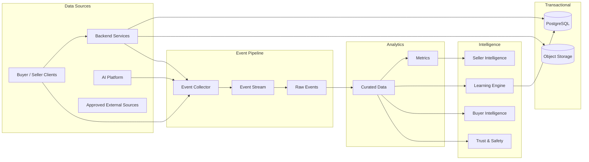

# Data Architecture

## Document Status

| Field                  | Value                      |
| ---------------------- | -------------------------- |
| **Status**             | Draft                      |
| **Version**            | 0.3                        |
| **Owner**              | PinkCurve Engineering Team |
| **Last Reviewed**      | 2026-08-19                 |
| **Related Components** | All platform components    |

---

## Overview

PinkCurve's Data Architecture defines how platform information is modeled, stored, exchanged, governed, protected, retained, and made available to the systems that create discovery value.

The architecture is centered on the **Offering**, but PinkCurve data extends far beyond offering records.

The platform must represent and connect:

* Buyers
* Sellers
* Organizations
* Accounts
* Offerings
* Offering Knowledge
* Metadata
* Creative assets
* Campaigns
* Buyer intent
* Adaptive Metadata Navigation
* Discovery events
* Buyer feedback
* Analytics
* Learned signals
* Seller Intelligence
* Trust and verification
* Billing
* Customer support
* AI and model information
* Operational data

Different kinds of data have different requirements.

Transactional account data may require strong relational consistency.

Discovery events may require high-volume event storage.

Creative assets may belong in object storage.

Embeddings may require vector indexing.

Analytics may eventually require columnar analytical storage.

The Data Architecture should therefore remain **logically unified but physically flexible**.

Good data architecture enables good discovery.

Poor data architecture can compromise discovery quality, learning, trust, privacy, seller reporting, and platform scalability.

---

# Data Architecture Philosophy

PinkCurve should treat data architecture as part of the product architecture rather than an implementation afterthought.

Several principles guide the design.

### Data Has Meaning

Fields should represent clearly defined product concepts rather than become miscellaneous storage.

### One Authoritative Source

Important facts should have an identifiable authoritative source.

Derived and learned information should not silently overwrite authoritative facts.

### Logical Model Before Physical Storage

PinkCurve should define what the data means before deciding where it is stored.

### Fit Storage to Workload

Not every dataset belongs in PostgreSQL.

### Preserve Provenance

The platform should know where important knowledge, metrics, and learned signals came from.

### Events Are Historical Evidence

Discovery events should represent what actually occurred and should not be rewritten simply because later interpretation changes.

### Privacy by Design

Collect only data justified by platform needs.

### Trust by Design

Data used for billing, verification, learning, and fraud detection requires stronger integrity controls.

### Data Must Be Testable

Schemas, pipelines, transformations, and analytical outputs should support validation and regression testing.

### Start Simple

The physical architecture should remain as simple as practical during early development.

---

# Logical Data Model

PinkCurve's logical data model is centered on the relationship between the people and organizations that provide Offerings and the Buyers who discover them.

The primary business roles are:

- **Buyer** — discovers and explores Offerings
- **Seller** — commercial provider of Offerings
- **Organization** — future public, community, nonprofit, or other provider of Offerings

The **Offering** remains the fundamental discovery object.

```text
Seller / Organization
        │
        ▼
     Offering
        │
        ▼
Offering Knowledge
        │
   ┌────┴────┐
   ▼         ▼
Metadata   Creative
   │         │
   └────┬────┘
        ▼
    Discovery
        ▲
        │
      Buyer
        │
        ▼
Discovery Events
        │
   ┌────┼─────┐
   ▼    ▼     ▼
Analytics Learning Trust
   │     │
   └──┬──┘
      ▼
  Intelligence

---

# Core Business Entities

PinkCurve's primary logical entities include:

* Buyer
* Seller
* Organization
* Offering
* Offering Knowledge
* Offering Metadata
* Creative Asset
* Creative Campaign
* Discovery Session
* Discovery Event
* Buyer Feedback
* Seller Account
* Subscription
* Invoice
* Trust Record
* Support Interaction

Buyer, Seller, and Organization represent distinct roles within PinkCurve and should remain explicit in the logical architecture.

The logical model intentionally avoids introducing a generic Participant entity unless a future architectural requirement demonstrates a clear need for one.

---

# Account and Identity Domain

PinkCurve accounts provide identity, authentication, authorization, verification, and access to platform capabilities.

Account requirements differ depending on the role.

### Buyer Accounts

Buyer accounts may support:

- Authentication
- Identity verification where required
- Saved Offerings
- Preferences
- Discovery history where permitted
- Reviews and ratings
- Feedback
- Privacy settings
- Security settings

### Seller Accounts

Seller accounts may support:

- Authentication
- Seller verification
- Verified contact information
- Organization or business information
- Offering management
- Creative management
- Seller Intelligence
- Billing
- Team access
- Security settings

### Organization Accounts

Future public, community, nonprofit, or other organizations may require capabilities similar to Seller accounts while operating under different verification, billing, and Offering policies.

The account architecture may share common authentication and identity infrastructure without requiring Buyers, Sellers, and Organizations to share the same business data model.

Authentication identity and product role should therefore remain conceptually separate.

---

# Seller and Organization Data

Sellers and Organizations provide Offerings for discovery.

Although they share the provider role, their business requirements may differ. Commercial Sellers may require subscriptions, billing, campaigns, and Seller Intelligence, while future public or community Organizations may operate under different policies and business models.

Common provider data may include:

* Account identity
* Organization name
* Contact information
* Verified contact person
* Verified phone
* Account status
* Registration time
* Verification status
* Geographic information
* Security information
* Subscription
* Billing configuration
* Workspace
* Team members
* Trust status

Sensitive security fields should be protected and access-controlled.

Not every application component should have direct access to all seller data.

---

# Buyer Data

Buyer data may include:

* Buyer account
* Authentication information
* Verification status
* Saved offerings
* Explicit preferences
* Discovery history where permitted
* Feedback
* Ratings
* Reviews
* Hidden offerings
* Hidden sellers
* Buyer settings
* Privacy settings

Potential logical entities include:

```text id="suvxh2"
buyers
buyer_preferences
buyer_reviews
buyer_ratings
buyer_feedback
buyer_saved_offerings
buyer_hidden_offerings
buyer_hidden_seller
buyer_logs
```

The exact physical design may consolidate or separate these entities depending on implementation needs.

Buyer data should follow strong privacy and minimization principles.

---

# Offering Model

The **Offering** remains PinkCurve's fundamental discovery object.

An Offering represents anything PinkCurve can present for discovery.

---

## Offering Types

| Offering Type      | Examples                                      |
| ------------------ | --------------------------------------------- |
| Product            | Consumer goods, electronics, clothing         |
| Commercial Service | Home repair, consulting, professional service |
| Promotion          | Discount, special offer                       |
| Event              | Conference, concert, workshop                 |
| Community Service  | Local resource, volunteer opportunity         |
| Public Service     | Government resource, public information       |
| Brand Recognition  | Brand-awareness discovery                     |
| Future Type        | New discoverable Offering categories          |

The Offering abstraction allows new discovery types without redesigning the complete data architecture.

---

# Offering Core Data

Core Offering data may include:

* Offering identifier
* Provider identifier
* Offering type
* Name
* Description
* Category
* Destination URL
* Status
* Location applicability
* Availability
* Created time
* Updated time

Type-specific attributes should not force every Offering into the same rigid schema.

---

# Offering Knowledge Domain

Offering Knowledge describes PinkCurve's evolving understanding of an Offering.

The logical model should distinguish:

```text id="1cjg4m"
Offering
    ↓
Offering Knowledge
    ↓
Knowledge Versions
    ↓
Knowledge Sources
```

Potential entities include:

```text id="9alt1g"
offering_knowledge
knowledge_versions
knowledge_sources
offering_metadata
offering_attributes
```

Offering Knowledge may contain:

* Features
* Benefits
* Use cases
* Audiences
* Specifications
* FAQs
* Metadata
* Differentiators
* Brand voice
* Semantic representations
* Completeness
* Quality
* Provenance

See: [Offering Knowledge](04-offering-knowledge.md)

---

# Source, Derived, and Learned Knowledge

The data model should preserve the distinction between:

### Source Knowledge

Seller- or authority-provided facts.

### Derived Knowledge

Information produced through extraction, classification, metadata generation, or AI enrichment.

### Learned Knowledge

Patterns inferred from discovery behavior.

Example:

```text id="pcdhuw"
Source:
Waterproof = Yes

Derived:
Category = Trail Running Shoe

Learned:
Frequently explored during wet-weather trail searches
```

These should not be stored in a way that makes them indistinguishable.

---

# Knowledge Provenance

Important knowledge should support provenance fields such as:

* Source type
* Source identifier
* Source version
* Generated by
* Model version where applicable
* Created time
* Verified by
* Verification status

Provenance improves:

* Explainability
* Debugging
* Seller review
* Trust
* Auditing
* Learning

---

# Metadata Domain

Metadata is a first-class PinkCurve data domain because it supports Adaptive Metadata Navigation.

Logical metadata entities may include:

```text id="wi6o4b"
metadata_dimensions
metadata_values
offering_metadata
metadata_relationships
metadata_usage_metrics
```

A metadata model should support:

* Category-specific dimensions
* Multiple values
* Hierarchies
* Relationships
* Location relevance
* Time relevance
* Learned usefulness
* Provenance

Metadata should not be reduced to one unstructured keyword array.

---

# Adaptive Metadata Navigation Data

AMN introduces discovery-state data such as:

* Metadata presented
* Metadata selected
* Metadata removed
* Metadata order
* Metadata path
* Candidate-set context
* Metadata reset
* Metadata usefulness

Example:

```text id="26xzqx"
Discovery Session
      ↓
Metadata Path
      ↓
Running
      ↓
Trail
      ↓
Waterproof
      ↓
Offering Exploration
```

AMN data may be represented partly as events rather than permanent relational state.

This preserves the exact discovery journey for later analytics and learning.

---

# Creative Domain

Creative data should separate metadata about creative assets from the media itself.

Logical entities may include:

```text id="rffwc5"
creative_campaigns
creative_assets
creative_briefs
creative_scripts
creative_storyboards
creative_variants
creative_versions
```

Relational storage may contain:

* Creative identifiers
* Offering relationships
* Campaign relationships
* Status
* Version
* Format
* Dimensions
* Duration
* Provenance
* Approval status

Large assets such as images and videos should normally reside in object storage rather than relational database columns.

---

# Creative Asset Storage

Conceptually:

```text id="8ojb9t"
PostgreSQL
    ↓
Creative Asset Metadata
    ↓
Object Storage Reference
    ↓
Image / Video / Audio
```

Object storage may contain:

* Images
* Videos
* Audio
* Generated files
* Uploaded seller assets
* Storyboards
* Derived media

The database stores references and metadata rather than duplicating large media files.

---

# Campaign Data

Campaigns may represent:

* Offering discovery
* Promotions
* Brand recognition
* Seasonal discovery
* Geographic campaigns
* Audience-specific campaigns

Campaign data may include:

* Seller
* Offering
* Objective
* Creative
* Start/end dates
* Geographic scope
* Budget where applicable
* Status
* Campaign type

Campaign data should remain separate from Offering facts because campaigns change without changing what the Offering fundamentally is.

---

# Discovery Domain

Discovery data records how buyers and offerings interact through PinkCurve.

Potential entities include:

```text id="u5sfrh"
discovery_sessions
discovery_events
offering_impressions
offering_viewing_logs
search_events
metadata_events
feedback_events
destination_events
```

Physical implementation may use a generalized event model rather than a separate table for each event type.

---

# Discovery Sessions

A Discovery Session groups related buyer interactions.

A session may contain:

* Session identifier
* Buyer identifier where permitted
* Start time
* End time
* Discovery surface
* Context
* Initial intent
* Location context
* Experiment assignments

Session data should not unnecessarily duplicate all individual event details.

---

# Discovery Events

Discovery Events represent historical facts about what occurred.

Examples include:

* Offering presented
* Creative viewed
* Metadata presented
* Metadata selected
* Search performed
* Offering opened
* Positive feedback
* Negative feedback
* Offering hidden
* Destination clicked
* Report submitted

Events should generally be append-oriented.

Later analytics may reinterpret them, but historical evidence should remain stable.

---

# Discovery Event Structure

A logical event may include:

```text id="nx1403"
event_id
event_type
timestamp
session_id
buyer_id
offering_id
provider_id
creative_id
surface
position
metadata_context
experiment_context
device_context
location_context
event_payload
```

Not every field is required for every event.

The exact schema should enforce minimum required information by event type.

---

# Raw Events vs. Derived Data

PinkCurve should maintain a clear separation:

```text id="9znmuq"
Raw Discovery Event
        ↓
Curated Event
        ↓
Derived Metric
        ↓
Learned Signal
        ↓
Recommendation / Model
```

This lineage prevents analytical interpretation from becoming confused with original evidence.

---

# Buyer Feedback Domain

Buyer feedback should be represented explicitly.

Potential forms include:

* Positive feedback
* Negative feedback
* Rating
* Review
* Report
* Save
* Hide
* Show more like this
* Show fewer like this

Logical entities may include:

```text id="4pewfv"
buyer_feedback
buyer_rating
buyer_review
buyer_saved_offering
buyer_hidden_offering
```

Some may be represented as durable state plus corresponding events.

Example:

```text id="9gyq4a"
Event:
buyer_hidden_offering

State:
offering remains hidden for that buyer
```

The event records what happened.

The state supports future product behavior.

---

# Review and Rating Data

Reviews and ratings may include:

* Buyer
* Offering
* Rating
* Review content
* Creation time
* Modification history
* Moderation status
* Verification status
* Abuse flags

Reviews should integrate with Trust & Safety because fake reviews can corrupt buyer trust and Learning Engine signals.

---

# Analytics Domain

Analytics data should be distinguished from transactional application data.

Potential analytical datasets include:

* Discovery metrics
* AMN metrics
* Creative metrics
* Seller metrics
* Feed metrics
* QOV metrics
* Brand-recognition metrics
* Geographic aggregates
* Trust aggregates
* Experiment results

Analytics systems may initially use PostgreSQL but eventually benefit from specialized analytical storage.

---

# Analytics Storage Evolution

An early architecture may use:

```text id="l89yca"
PostgreSQL
    ↓
Small Aggregates
```

At larger scale:

```text id="uruiqz"
Discovery Events
      ↓
Event Pipeline
      ↓
Analytical Store / Warehouse
      ↓
Curated Tables
      ↓
Metrics / Dashboards / Learning
```

Candidate technologies may include BigQuery or equivalent analytical platforms.

Technology selection should depend on actual volume and workload.

---

# Learning Data Domain

Learning Engine data may include:

* Feature datasets
* Label datasets
* Training snapshots
* Learned signals
* Model predictions
* Experiment assignments
* Model evaluations

These should be distinguishable from source transactional data.

---

# Feature Data

Model features may originate from:

* Discovery events
* Metadata selections
* Offering Knowledge
* Creative performance
* Trust status
* Context
* Seller data
* Buyer preferences where permitted

Feature definitions should be documented.

A feature named:

```text id="zjyljg"
buyer_interest_score
```

is not useful unless PinkCurve knows:

* What it means
* How it is calculated
* What data it uses
* Its version
* Its privacy implications

---

# Training Dataset Versioning

Training datasets should support:

* Dataset identifier
* Time range
* Data sources
* Transformation version
* Label definition
* Exclusions
* Bot filtering
* Privacy processing
* Creation time

This improves model reproducibility.

---

# AI Platform Data

The AI Platform may produce operational metadata such as:

* Model identifier
* Provider
* Model version
* Prompt version
* Evaluation dataset
* Generation time
* Token usage
* Cost
* Validation results
* AI operation status

AI logs should avoid unnecessary storage of sensitive prompts or personal data.

---

# Embeddings and Vector Data

Embeddings may represent:

* Offerings
* Buyer intent
* Metadata
* Creative
* Categories

Logical embedding records may contain:

```text id="0vqs5q"
entity_id
entity_type
source_version
embedding_model
embedding_model_version
embedding
created_at
```

The vector itself may reside in:

* PostgreSQL with pgvector
* Dedicated vector storage
* Search infrastructure with vector indexing

The logical record should remain portable across technologies.

---

# Embedding Freshness

An embedding can become stale when:

* Offering Knowledge changes
* Metadata changes significantly
* Embedding model changes
* Representation strategy changes

PinkCurve should identify stale embeddings using source versions rather than blindly regenerating every vector.

---

# Seller and Buyer Intelligence Data

Seller Intelligence data may include:

* Recommendations
* Recommendation evidence
* Confidence
* Seller responses
* Recommendation status
* Recommendation outcomes

Logical entities may include:

```text id="o778pn"
seller_insights
seller_recommendations
seller_recommendation_feedback
seller_recommendation_outcomes
```

Buyer Intelligence may include:

* Saved preferences
* Negative preferences
* Discovery continuity
* Permitted longer-term patterns

Buyer Intelligence should be tightly governed by privacy requirements.

---

# Recommendation Lineage

Seller recommendations should support traceability.

```text id="qt486z"
Discovery Events
      ↓
Metric
      ↓
Learned Signal
      ↓
Recommendation
      ↓
Seller Action
      ↓
Outcome
```

Recommendation records should preserve enough information to explain why the recommendation was generated.

---

# Trust and Safety Domain

Trust data is a major PinkCurve domain.

Potential entities include:

```text id="7junv4"
seller_verifications
buyer_verifications
organization_verifications
offering_verifications
trust_signals
risk_scores
fraud_cases
abuse_reports
bot_signals
moderation_actions
security_events
```

Trust information may have stricter access controls and retention requirements than ordinary application data.

---

# Verification Data

Verification data may include:

* Verification method
* Verification status
* Verification time
* Verified contact person
* Verified phone status
* Evidence references
* Reviewer
* Expiration where applicable

Sensitive verification evidence should not necessarily be stored in the same table as normal account profile information.

---

# Security Event Data

Security logs may include:

* Authentication events
* Failed login attempts
* Account recovery
* Suspicious IP activity
* Session anomalies
* Administrative actions
* Verification changes

Security logging should balance audit requirements with privacy and storage minimization.

---

# Billing Domain

Seller billing requires data separate from ordinary discovery analytics.

Potential entities include:

```text id="wofiqj"
seller_subscriptions
seller_invoices
seller_invoice_items
invoice_settings
payments
billing_events
billing_adjustments
billing_disputes
```

Billing data should support:

* Reconciliation
* Auditability
* Corrections
* Seller explanations
* Dispute handling

---

# Billable Discovery Events

If QOV or another discovery measure becomes billable, PinkCurve should distinguish:

```text id="2bf8se"
Discovery Event
      ↓
Qualification
      ↓
Bot / Fraud Validation
      ↓
Billable Event
      ↓
Invoice Item
```

A raw click should not automatically become a billable event.

Billing qualification should be reproducible and auditable.

---

# Customer Support Domain

PinkCurve should preserve customer-support interactions for service quality, disputes, trust investigations, and operational learning.

Potential entities include:

```text id="42ekk5"
customer_support_cases
customer_support_messages
customer_support_actions
customer_support_logs
support_escalations
```

A support case may relate to:

* Seller
* Buyer
* Offering
* Invoice
* Verification
* Trust report
* Campaign

Support information may contain sensitive material and therefore requires controlled access.

---

# Operational Data

Operational domains may include:

* Application logs
* API metrics
* Deployment information
* Job execution
* Queue status
* Error reporting
* Background-task state
* Cost telemetry

Operational data should remain logically separated from product analytics even if both are ultimately stored in shared infrastructure.

---

# Physical Storage Strategy

PinkCurve should use different storage technologies according to data characteristics.

A conceptual architecture is:

```text id="y6ppni"
                 PinkCurve Data
                       │
     ┌─────────────────┼─────────────────┐
     ↓                 ↓                 ↓
Relational Data    Event / Analytics    Media
     │                 │                 │
 PostgreSQL        Event Store /       Object
                   Warehouse           Storage
     │
     ├──────────── Vector Data
     │                 │
     │            Vector Index
     │
     └──────────── Flexible JSON
                    where appropriate
```

The platform should avoid unnecessary proliferation of storage systems during early development.

---

# PostgreSQL

PostgreSQL is appropriate for strongly structured transactional data such as:

* Sellers
* Buyers
* Organizations
* Accounts
* Offerings
* Offering Knowledge
* Metadata definitions
* Campaigns
* Reviews
* Ratings
* Recommendations
* Billing
* Support case metadata
* Trust state

PostgreSQL may also support early-stage analytics and vector retrieval through extensions.

---

# JSONB

JSONB can provide flexibility where attributes vary significantly.

Appropriate examples include:

* Specifications
* FAQs
* Brand voice
* Offering-type-specific attributes
* Structured AI output
* Event payloads
* Recommendation evidence

JSONB should not become a replacement for proper data modeling.

Frequently queried or integrity-critical fields should generally have explicit columns or normalized structures.

---

# JSONB Guidelines

Where JSONB is used:

* Define expected structure
* Validate at the application or schema layer
* Provide appropriate defaults
* Index frequently queried paths
* Avoid storing unrelated concepts in one document
* Version important schemas

Example:

```sql
key_features JSONB NOT NULL DEFAULT '[]'::jsonb
```

---

# Object Storage

Object storage is appropriate for:

* Images
* Video
* Audio
* Uploaded documents
* Generated creative files
* Model artifacts where applicable
* Dataset files

Potential technology:

* Google Cloud Storage or equivalent

Database records should maintain references and relevant metadata.

---

# Event Storage

High-volume Discovery Events may eventually require infrastructure optimized for append-heavy workloads and analytical processing.

Early-stage events may remain in PostgreSQL.

As scale grows, event data may flow through:

```text id="deaq3u"
Application
     ↓
Event Collector
     ↓
Event Stream
     ↓
Raw Event Storage
     ↓
Curated Analytics
```

Potential technologies include:

* Google Pub/Sub
* Kafka
* BigQuery
* Object-based event archives
* Equivalent systems

Technology choice should follow measured scale.

---

# Analytical Storage

Large analytical workloads may eventually use a columnar warehouse such as:

* BigQuery
* Snowflake
* ClickHouse
* Equivalent technologies

PinkCurve should not introduce a separate analytics warehouse before workload justifies the complexity.

---

# Vector Storage

Vector storage may use:

* pgvector
* Managed vector database
* Search engine vector features
* Other future infrastructure

Vector technology should remain replaceable.

The authoritative source remains Offering Knowledge or another underlying entity—not the vector representation itself.

---

# Data Format Strategy

Different workloads may use different formats.

### Relational

Appropriate for:

* Core entities
* Integrity constraints
* Transactions

### JSON

Appropriate for:

* Flexible structured attributes
* API exchange
* AI structured output

### Parquet

Appropriate for:

* Analytical datasets
* Training datasets
* Large batch exports
* Historical archives

### Vector Representation

Appropriate for:

* Semantic retrieval
* Similarity
* ML representation

No single format should be forced onto every workload.

---

# Data Flow Architecture



Learned outputs written back to PostgreSQL should be stored as derived or learned data rather than silently modifying source facts.

---

# Source of Truth

Each major data concept should have an authoritative source.

Examples:

| Data                    | Authoritative Source                   |
| ----------------------- | -------------------------------------- |
| Seller identity         | Seller account / identity system       |  
| Buyer identity          | Buyer account / identity system        |    
| Organization identity   | Organization account / identity system |
| Offering existence      | Offering record                        |
| Seller-provided feature | Offering Knowledge source record       |
| Creative file           | Object storage + creative metadata     |
| Discovery event         | Raw event store                        |
| Derived metric          | Analytics pipeline                     |
| Learned signal          | Learning Engine                        |
| Seller recommendation   | Seller Intelligence                    |
| Invoice                 | Billing system                         |
| Verification state      | Trust & Safety                         |

Derived systems should not overwrite authoritative source data without an explicit workflow.

---

# Data Lineage

PinkCurve should be able to trace important derived information backward.

Example:

```text id="88xpa8"
Seller Recommendation
       ↓
Learned Signal
       ↓
Metric
       ↓
Curated Events
       ↓
Raw Discovery Events
```

Another example:

```text id="402466"
AI-Generated Metadata
       ↓
AI Model + Prompt Version
       ↓
Offering Knowledge Source
       ↓
Seller URL / Seller Input
```

Lineage becomes increasingly important as PinkCurve introduces AI and learning.

---

# Schema Strategy

Important data structures should have explicit schemas.

Schemas may be represented through:

* Database definitions
* API schemas
* JSON Schema
* Event schemas
* Validation models

Schema definitions should identify:

* Required fields
* Types
* Constraints
* Version
* Meaning
* Ownership

---

# Schema Evolution

Schemas will change as PinkCurve evolves.

Schema changes should follow principles such as:

* Prefer backward-compatible additions
* Version external contracts
* Avoid destructive migrations without preparation
* Backfill incrementally
* Test migrations
* Support rollback where practical

Database migration behavior should not be embedded casually into application startup once production complexity increases.

A dedicated migration system should eventually manage production schema evolution.

---

# Data Validation

Validation should occur at multiple layers.

### Client Validation

Improve usability but should not be trusted for security.

### API Validation

Validate request structure and business requirements.

### Database Validation

Use:

* Foreign keys
* Unique constraints
* NOT NULL
* CHECK constraints
* Transactions

### Pipeline Validation

Validate event and analytical data.

### Semantic Validation

Check whether data makes sense.

Example:

```text id="qc91jm"
promotion_end < promotion_start
```

should be rejected even if both timestamps are syntactically valid.

---

# Data Quality Dimensions

PinkCurve should monitor several quality dimensions.

### Completeness

Is required information present?

### Accuracy

Is information correct?

### Consistency

Do related datasets agree?

### Freshness

Is time-sensitive information current?

### Uniqueness

Are duplicates controlled?

### Validity

Does data satisfy expected rules?

### Provenance

Can PinkCurve identify the source?

### Integrity

Has the data been modified appropriately?

---

# Avoid Premature Quality Targets

Targets such as:

```text id="4qz0hb"
Completeness >95%
```

may eventually be useful but should not be universal without context.

Some Offering types require different information.

A better approach is:

```text id="3lzfg1"
Required data defined by context
        ↓
Baseline quality measured
        ↓
Operational targets established
```

---

# Data Observability

PinkCurve should eventually monitor data systems for:

* Missing events
* Event-volume anomalies
* Schema failures
* Pipeline latency
* Stale data
* Duplicate events
* Unexpected null rates
* Broken relationships
* Vector freshness
* Analytical discrepancies
* Billing reconciliation errors

Data observability complements infrastructure monitoring.

---

# Data Ownership

Each domain should have clear ownership.

Example:

| Domain                  | Primary Owner         |
| ----------------------- | --------------------- |
| Buyer / Account         | Product + Engineering |
| Seller / Account        | Product + Engineering |
| Organization / Account  | Product + Engineering |
| Offering                | Product               |
| Offering Knowledge      | Product               |
| Discovery Events        | Discovery / Analytics |
| Analytics               | Analytics / Data      |
| Learning Data           | ML / Engineering      |
| Trust Data              | Trust & Safety        |
| Billing                 | Finance / Operations  |
| Support                 | Customer Operations   |

Early PinkCurve may have one person filling multiple responsibilities, but ownership boundaries should still be conceptually defined.

---

# Access Control

Access should be determined by data sensitivity and operational need.

Possible controls include:

* Authentication
* Authorization
* Role-based access
* Seller-level isolation
* Administrative permissions
* Service identities
* Audit logging
* Restricted access to trust and billing information

Application-layer authorization remains necessary even if database-level row security is used.

---

# Data Classification

PinkCurve should eventually classify information into categories such as:

### Public

Information intentionally visible through discovery.

### Internal

Operational information not publicly exposed.

### Confidential

Seller business data, buyer activity, internal analytics.

### Restricted

Sensitive identity, payment, security, trust, or verification information.

Classification can guide:

* Access
* Encryption
* Logging
* Retention
* Export
* AI usage

---

# Buyer Privacy

Buyer behavioral data deserves particular care.

PinkCurve should avoid collecting unnecessary information simply because personalization could potentially use it.

Buyer data should follow:

* Data minimization
* Purpose limitation
* Appropriate consent
* Access controls
* Retention controls
* De-identification where appropriate
* Ability to remove or reset appropriate history

See: [Security, Privacy, and Trust](12-security-privacy-and-trust.md)

---

# Location Data

Location may range from:

* Country
* Region
* City
* Approximate location
* Precise coordinates

PinkCurve should store the minimum geographic precision necessary.

Precise location should receive stronger protection than general city-level information.

Historical location retention should be justified separately from real-time discovery use.

---

# IP Addresses and Security Data

IP addresses may be useful for:

* Fraud detection
* Account security
* Bot detection
* Abuse investigation

They should not automatically become long-term behavioral-profile data.

Access and retention should reflect their security and privacy sensitivity.

---

# Data Retention

Retention should be determined by data purpose rather than one global duration.

Different rules may apply to:

* Account data
* Offering data
* Discovery events
* Aggregated analytics
* Buyer history
* Security logs
* Fraud evidence
* Billing records
* Support records
* AI logs
* Training datasets

The v0.2 fixed durations such as:

```text id="7ubmex"
Events: 2 years
Aggregates: indefinite
```

should remain open until business, privacy, legal, analytical, and cost requirements are understood.

Retention decisions should be documented explicitly.

---

# Data Deletion

Deletion may involve more than removing one relational row.

For example, deleting an Offering may affect:

* Offering Knowledge
* Metadata
* Creative assets
* Vector embeddings
* Search indexes
* Cached records
* Analytical references

Historical analytics may require de-identification rather than complete removal in some contexts.

Deletion behavior must be designed according to legal, privacy, billing, trust, and analytical requirements.

---

# Backup and Recovery

Transactional systems should support:

* Automated backups
* Point-in-time recovery
* Backup retention
* Restore procedures
* Recovery testing

Backup existence alone does not prove recoverability.

PinkCurve should periodically test restoration.

---

# Recovery Objectives

As PinkCurve matures, critical systems should define:

### Recovery Point Objective — RPO

How much recent data loss can be tolerated?

### Recovery Time Objective — RTO

How quickly must service be restored?

Different systems may have different requirements.

Billing and transactional account data may require stronger guarantees than recomputable analytics.

---

# Recomputable Data

Some derived data can be regenerated.

Examples may include:

* Aggregated metrics
* Embeddings
* Recommendation candidates
* Some model features

If authoritative source data remains intact, PinkCurve may choose not to back up all derived data with the same rigor.

This can reduce cost and complexity.

---

# Migration Strategy

Schema migrations should follow a controlled process.

A typical migration may be:

```text id="jay6kr"
Define change
     ↓
Review
     ↓
Test against representative data
     ↓
Deploy backward-compatible schema
     ↓
Backfill
     ↓
Deploy application change
     ↓
Validate
     ↓
Remove obsolete structure later
```

Breaking migrations should be rare.

---

# Data Backfill

Historical backfills should support:

* Batching
* Retry
* Progress tracking
* Validation
* Idempotency
* Resource limits

Large backfills should not unnecessarily disrupt production workloads.

---

# Data Testing

Data Architecture requires its own testing.

Examples include:

* Schema tests
* Constraint tests
* Migration tests
* Event validation tests
* Data-pipeline tests
* Duplicate-event tests
* Referential-integrity tests
* Backfill tests
* Analytics reconciliation
* Billing reconciliation
* Recovery tests

Test datasets should include:

* Normal cases
* Boundary cases
* Missing data
* Incorrect data
* Duplicate data
* Fraudulent patterns
* High-volume cases

Detailed test procedures belong in the future Platform Testing and Evaluation document.

---

# Data for Platform Testing

PinkCurve should support test datasets representing:

* Sellers
* Buyers
* Offering types
* Offering Knowledge
* Metadata paths
* Creative variants
* Discovery sessions
* Positive feedback
* Negative feedback
* Trust issues
* Bot traffic
* Billing cases

Synthetic data should be clearly separated from production data.

Test records should never accidentally affect production analytics or billing.

---

# Environment Separation

PinkCurve should maintain separation between:

* Development
* Testing
* Staging
* Production

Production data should not be copied freely into lower environments.

Where production-derived test data is necessary, it should be appropriately sanitized or anonymized.

---

# Current Physical Architecture

The early PinkCurve implementation primarily uses:

| Component        | Current / Early Technology     |
| ---------------- | ------------------------------ |
| Primary Database | PostgreSQL / Cloud SQL         |
| Frontend Hosting | Firebase                       |
| Backend Hosting  | Cloud Run                      |
| Media Storage    | Cloud object storage as needed |
| AI Services      | External model APIs            |

The physical architecture should remain simple during early development.

---

# Planned Data Capabilities

| Capability               | Candidate Technology                |
| ------------------------ | ----------------------------------- |
| Transactional Storage    | PostgreSQL                          |
| Flexible Structured Data | PostgreSQL JSONB                    |
| Vector Retrieval         | pgvector or dedicated vector system |
| Event Transport          | Pub/Sub, Kafka, or equivalent       |
| Analytics Warehouse      | BigQuery or equivalent              |
| Object Storage           | Cloud Storage or equivalent         |
| Caching                  | Redis or equivalent                 |
| Analytical File Format   | Parquet where appropriate           |

These are candidate technologies, not permanent architectural commitments.

---

# MVP Data Architecture

PinkCurve's MVP should avoid deploying unnecessary infrastructure.

A reasonable early architecture may be:

```text id="py3nhx"
Web / Mobile Client
        ↓
Backend APIs
        ↓
PostgreSQL
        │
        ├── Core Entities
        ├── Offering Knowledge
        ├── Metadata
        ├── Campaigns
        ├── Buyer State
        └── Early Discovery Events
        │
        ├──────── Object Storage
        │          └── Images / Video
        │
        └──────── Vector Capability
                   └── Initial Semantic Retrieval
```

Early analytics may operate from PostgreSQL or modest event exports.

Only when event scale or analytical workload justifies it should PinkCurve introduce a separate event platform or warehouse.

---

# Growth Architecture

As platform scale increases:

```text id="m0fvbd"
Transactional Services
       ↓
   PostgreSQL
       │
       ├──────── Object Storage
       │
       ├──────── Vector Storage
       │
       └──────── Event Stream
                     ↓
                 Raw Events
                     ↓
               Analytics Store
                     ↓
          ┌──────────┼──────────┐
          ↓          ↓          ↓
       Metrics    Learning   Intelligence
```

This evolution should be driven by measured need.

---

# Current Status

## Implemented

* PostgreSQL transactional database
* Basic seller and seller-account data
* Basic Offering Knowledge
* Creative campaign foundation
* Basic relational constraints
* Early application APIs

---

## In Development

* Offering-centered schema
* Buyer model
* Metadata model
* Discovery event model
* Creative asset model
* Data-quality rules

---

## Planned

* Buyer account and identity model
* Seller verification model
* Buyer verification model
* Future Organization account model
* Buyer review and rating data
* Buyer feedback and preference data
* Offering viewing logs
* AMN data model
* Discovery-session model
* Knowledge provenance
* Knowledge versioning
* Creative asset storage
* Event-processing architecture
* Analytics storage
* Learning datasets
* Vector storage
* Seller recommendation data
* Seller invoices and invoice settings
* Customer support logs
* Trust and verification data
* Bot and fraud event data
* Data lineage
* Data classification
* Retention policies
* Data observability
* Recovery testing
* Test-data architecture

---

# Open Questions

See [Open Decisions](19-open-decisions.md) for questions including:

* Vector-storage technology
* Event-processing architecture
* Analytics warehouse timing
* Buyer-data retention
* Discovery-event retention
* Review and rating model
* AMN event representation
* Knowledge versioning
* Seller billing event qualification
* Data classification
* Recommendation lineage
* Production-derived test data policy
* Long-term analytics storage
* Backup and recovery objectives

---

# Design Principles

### Offering-Centered, Not Offering-Only

Offering is the discovery object, but PinkCurve's data architecture must also represent buyers, sellers, interactions, intelligence, trust, and operations.

### Preserve Source Truth

Derived and learned information should not silently overwrite authoritative facts.

### Separate Events From Interpretation

Historical evidence should remain distinguishable from metrics and learned signals.

### Metadata Is First-Class Data

AMN depends on structured, governable metadata.

### Use the Right Storage for the Data

Transactional records, media, events, analytics, and vectors have different requirements.

### Keep Physical Architecture Simple Initially

Introduce specialized infrastructure only when justified.

### Preserve Lineage

Important outputs should be traceable to their source evidence.

### Privacy Shapes Architecture

Buyer activity, location, identity, and security data require deliberate controls.

### Billing Requires Strong Integrity

Billable events require stronger validation and auditability than ordinary analytics.

### Test Data Must Be Isolated

Synthetic or test activity should never contaminate production analytics, learning, or billing.

### Data Quality Enables Intelligence

AI and Learning Engine quality cannot exceed the quality of their underlying data.

### Architecture Must Evolve

PinkCurve should support future Offering types and intelligence capabilities without continual redesign.

---

# Related Documents

* [Product Architecture](03-product-architecture.md)
* [Offering Knowledge](04-offering-knowledge.md)
* [Creative Studio](05-creative-studio.md)
* [Discovery Engine](06-discovery-engine.md)
* [Discovery Analytics](07-discovery-analytics.md)
* [Learning Engine](08-learning-engine.md)
* [Seller Intelligence](09-seller-intelligence.md)
* [AI Platform](10-ai-platform.md)
* [Security, Privacy, and Trust](12-security-privacy-and-trust.md)
* [Business Model](13-business-model.md)
* [Open Decisions](19-open-decisions.md)
* [Offering Knowledge Schema](../schemas/offering-knowledge.schema.json)
