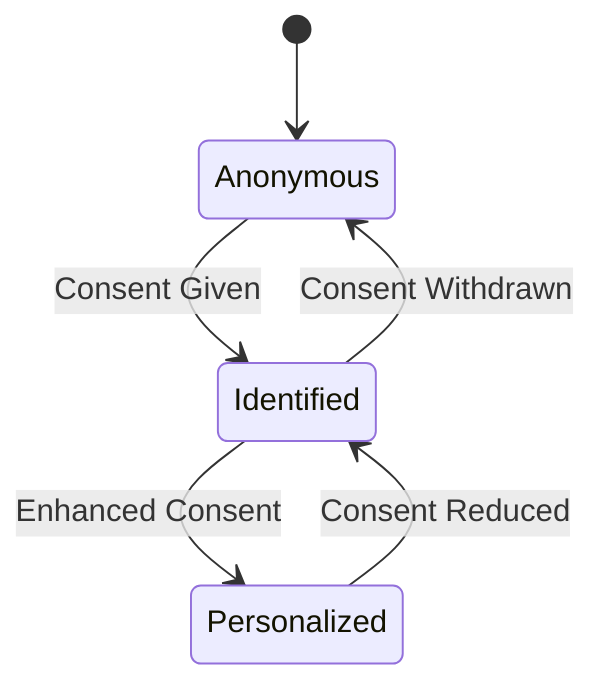

# Security, Privacy, and Trust

## Document Status

| Field | Value |
|-------|-------|
| **Status** | Draft |
| **Version** | 0.1 |
| **Owner** | PinkCurve Engineering Team |
| **Last Reviewed** | 2026-07-23 |
| **Related Components** | All platform components |

---

## Overview

Trust is foundational to PinkCurve's value proposition. Buyers must trust that products are authentic and recommendations are genuine. Sellers must trust that their data is protected and the platform is fair. This document outlines our approach to security, privacy, and trust.

---

## Core Principles

### 1. Privacy by Design

Privacy is not an afterthought—it's a constraint from the start:
- Collect only what we need
- Protect what we collect
- Delete what we no longer need
- Be transparent about what we do

### 2. Security as Foundation

Security enables everything else:
- Defense in depth
- Principle of least privilege
- Secure by default
- Continuous monitoring

### 3. Trust Through Transparency

Build trust by being honest:
- Clear policies
- Explainable systems
- Honest communication
- Accountable operations

---

## Privacy Framework

### Data Minimization

| Data Type | Collection Policy |
|-----------|------------------|
| Buyer identity | Only with explicit consent |
| Browsing behavior | Session-level, anonymized default |
| Purchase data | Never (we don't process transactions) |
| Location | Country/region only, with consent |
| Device info | Minimal for fraud prevention |

### Consent Management

#### Consent Levels

| Level | Data Usage | User Control |
|-------|-----------|--------------|
| **Anonymous** | No personal tracking | Default state |
| **Identified** | Session continuity | Opt-in required |
| **Personalized** | Behavioral history | Explicit consent |

### Data Subject Rights

Support for:
- **Access:** See what data we have
- **Correction:** Fix incorrect data
- **Deletion:** Remove personal data
- **Portability:** Export data
- **Objection:** Opt out of processing

---

## Buyer Trust

### Discovery Integrity

Buyers must trust that discovery is genuine:
- Ranking based on relevance, not payment
- Sponsored content clearly labeled
- No fake reviews or engagement
- Authentic product information

### Anti-Manipulation

Protect buyers from:
- Fake products
- Misleading descriptions
- Inflated ratings
- Deceptive practices

### Explainability

Buyers can understand:
- Why they see certain products (simplified)
- What data influences recommendations
- How to adjust preferences

---

## Seller Trust

### Platform Fairness

Sellers must trust fair treatment:
- Transparent discovery criteria
- No arbitrary ranking manipulation
- Equal access to features by tier
- Clear policies and enforcement

### Data Protection

Seller data protection:
- Competitive data not shared
- API security and access control
- Secure credential handling
- Regular security assessments

### Seller Authenticity

Verify seller legitimacy:
- Business verification process
- Product authenticity checks
- Policy compliance monitoring
- Fraud detection

---

## Security Architecture

### Authentication & Authorization

| Component | Mechanism |
|-----------|-----------|
| Seller auth | Firebase Auth + JWT |
| API auth | Bearer tokens |
| Admin auth | Role-based access |
| Service auth | Service accounts |

### Data Protection

| Layer | Protection |
|-------|------------|
| In transit | TLS 1.3 |
| At rest | Cloud SQL encryption |
| Backups | Encrypted backups |
| Secrets | Secret Manager |

### Infrastructure Security

| Control | Implementation |
|---------|----------------|
| Network | VPC, firewall rules |
| Access | IAM, least privilege |
| Audit | Cloud Audit Logs |
| Monitoring | Cloud Monitoring |

---

## Fraud Prevention

### Seller Fraud

Detect and prevent:
- Fake business registrations
- Counterfeit products
- Policy violations
- Payment fraud

### Buyer Fraud

Detect and prevent:
- Bot traffic
- Click fraud
- Fake engagement
- Account abuse

### Detection Signals

| Signal | Indicates |
|--------|-----------|
| Traffic patterns | Bot behavior |
| Session anomalies | Fraudulent activity |
| Content patterns | Policy violations |
| Account behavior | Abuse patterns |

---

## Incident Response

### Severity Levels

| Level | Description | Response Time |
|-------|-------------|---------------|
| P1 | Data breach, system compromise | Immediate |
| P2 | Service outage, vulnerability | 1 hour |
| P3 | Security issue, no active exploit | 24 hours |
| P4 | Minor issue, no impact | 1 week |

### Response Process

1. **Detect:** Monitoring alerts or reports
2. **Assess:** Determine severity and scope
3. **Contain:** Limit damage
4. **Remediate:** Fix root cause
5. **Recover:** Restore service
6. **Review:** Post-incident analysis

### Communication

- Internal: Immediate notification chain
- Sellers: If their data affected
- Buyers: If their data affected
- Regulators: As required by law

---

## Compliance Considerations

### Data Protection Regulations

| Regulation | Applicability | Status |
|------------|--------------|--------|
| GDPR | EU users | To be implemented |
| CCPA | California users | To be implemented |
| Others | As applicable | To be assessed |

### Industry Standards

| Standard | Applicability | Status |
|----------|--------------|--------|
| SOC 2 | Platform operations | Future |
| PCI DSS | Not applicable | We don't handle payments |

---

## Security Development

### Secure Development Lifecycle

1. **Design:** Security requirements, threat modeling
2. **Development:** Secure coding, code review
3. **Testing:** Security testing, vulnerability scanning
4. **Deployment:** Secure configuration, access control
5. **Operations:** Monitoring, patching, incident response

### Vulnerability Management

- Regular dependency updates
- Vulnerability scanning
- Penetration testing (planned)
- Bug bounty (future consideration)

---

## Current Status

### Implemented
- TLS for all traffic
- Cloud SQL encryption
- Firebase Auth
- Basic access controls
- Audit logging

### Planned
- Enhanced fraud detection
- Consent management system
- Security testing automation
- Compliance documentation
- Incident response playbooks

---

## Open Questions

See [Open Decisions](19-open-decisions.md) for:
- Consent management platform selection
- GDPR compliance implementation timeline
- Security certification prioritization

---

## Related Documents

- [Design Principles](02-design-principles.md)
- [Data Architecture](11-data-architecture.md)
- [Product Architecture](03-product-architecture.md)
