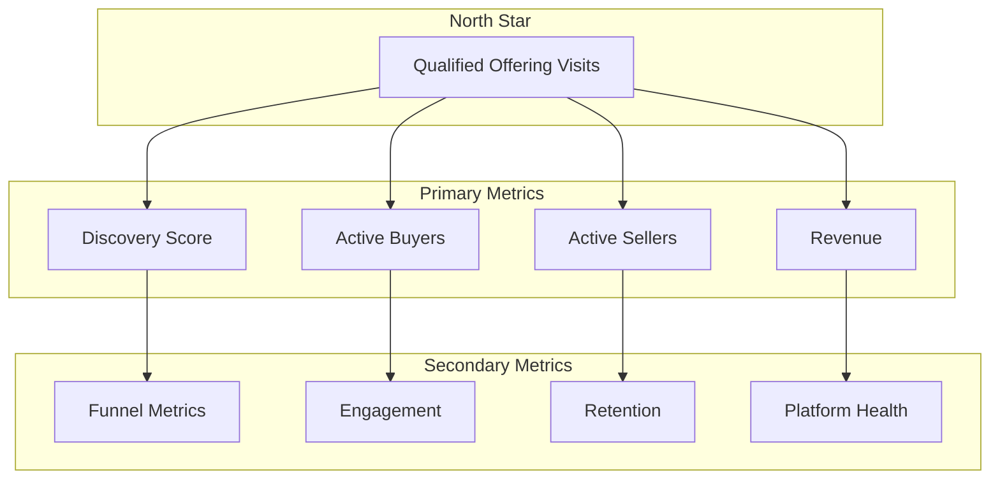

# Success Metrics

## Document Status

| Field | Value |
|-------|-------|
| **Status** | Draft |
| **Version** | 0.2 |
| **Owner** | PinkCurve Product Team |
| **Last Reviewed** | 2026-08-11 |
| **Related Components** | All platform components |

---

## Overview

This document defines how PinkCurve measures success.

Success is measured not only by platform growth, but by the value PinkCurve creates for Buyers, Sellers, and the discovery ecosystem.

Metrics should guide better decisions rather than simply produce better numbers.

PinkCurve prioritizes metrics that reflect meaningful discovery, long-term trust, continuous learning, and sustainable business value.

---

## Metric Principles

### 1. Measure What Matters
Focus on outcomes, not just outputs. QOV matters more than impressions.

### 2. Avoid Goodhart's Law
"When a measure becomes a target, it ceases to be a good measure."
Use multiple metrics; don't over-optimize any single one.

### 3. Leading and Lagging
Track leading indicators (predictive) and lagging indicators (outcomes).

### 4. Honest Assessment
Report metrics honestly, including when they're bad. Learning requires truth.

### 5. Trust Matters

Growth without trust is not success.

PinkCurve measures trust through buyer confidence, seller authenticity, platform integrity, and fraud prevention.

Long-term trust takes priority over short-term growth.

---

## Metric Categories

### North Star Metric

**Qualified Offering Visits (QOV)**

The primary unit of value we deliver.

| Dimension | Metric |
|-----------|--------|
| Volume | Total QOV / period |
| Growth | QOV growth rate |
| Quality | QOV-to-conversion estimate |

Why QOV:
- Represents genuine buyer interest
- Aligns seller value with platform success
- Measurable without transaction data

### Discovery Metrics

| Metric | Definition | Target |
|--------|------------|--------|
| Discovery Score | Composite discovery effectiveness | Track trend |
| Impression-to-View Rate | % impressions that become views | >5% |
| View-to-Click Rate | % views that become clicks | >10% |
| Click-to-QOV Rate | % clicks that qualify | >80% |

*Note: Discovery Score is experimental; targets are hypotheses.*

### Seller Metrics

| Metric | Definition | Target |
|--------|------------|--------|
| Active Sellers | Sellers with active offerings | Growth |
| Seller Retention | 30/60/90 day retention | >80% |
| Offering Coverage | Offerings with complete offering knowledge | >70% |
| ARPS | Average revenue per seller | Track trend |

### Buyer Metrics

| Metric | Definition | Target |
|--------|------------|--------|
| Monthly Active Buyers | Unique buyers engaging | Growth |
| Session Depth | Offerings viewed per session | >3 |
| Return Rate | Buyers returning within 30 days | >30% |
| NPS | Buyer satisfaction | >40 |

### Platform Health Metrics

| Metric | Definition | Target |
|--------|------------|--------|
| Uptime | System availability | >99.9% |
| API Latency | p95 response time | <200ms |
| Error Rate | Failed requests | <0.1% |
| Data Quality | Schema validation pass rate | >99% |

---

## Metric Hierarchy



---

## Measurement Framework

### Instrumentation

| Layer | What We Track |
|-------|--------------|
| Frontend | Discovery interactions, clicks, engagement |
| Backend | API calls, processing times |
| Database | Query patterns, data quality |
| Infrastructure | Availability, performance |

### Data Pipeline

```
Events → Collection → Processing → Storage → Analysis → Dashboards
```

### Reporting Cadence

| Report | Frequency | Audience |
|--------|-----------|----------|
| Real-time dashboard | Continuous | Engineering |
| Daily metrics | Daily | Team |
| Weekly review | Weekly | Leadership |
| Monthly report | Monthly | Stakeholders |

---

## Anti-Metrics

Things we explicitly do NOT optimize for:

| Anti-Metric | Why We Avoid |
|-------------|--------------|
| Total impressions | Encourages spam, not quality |
| Time on site (alone) | Can indicate confusion, not value |
| Vanity followers | Doesn't translate to value |
| Feature count | More isn't better |
| AI-generated content volume | More AI content does not necessarily improve discovery |

---

## Learning Metrics

The Learning Engine should continuously improve PinkCurve over time.

Examples include:

| Metric | Purpose |
|---------|----------|
| Discovery Score Improvement | Measure learning effectiveness |
| Recommendation Improvement | Better relevance over time |
| Model Accuracy | Ranking quality |
| Fraud Detection Accuracy | Trust improvement |
| Feedback Utilization | Percentage of feedback incorporated |

---

## Trust Metrics

Trust is one of PinkCurve's strategic assets.

Examples include:

| Metric | Purpose |
|---------|----------|
| Verified Seller Rate | Percentage of verified Sellers |
| Buyer Report Resolution | Time to resolve reports |
| Fraud Detection Rate | Platform protection |
| False Positive Rate | Avoid unnecessary blocking |
| Buyer Trust Score | Confidence in discovery experience |

---

## Experimentation

### A/B Testing

For significant changes:
- Define hypothesis and metrics
- Determine sample size for significance
- Run for sufficient duration
- Analyze results honestly

### Guardrail Metrics

Metrics that should not degrade during experiments:
- Platform reliability
- Seller retention
- Discovery Trust Indicators
- Data quality

---

## Dashboards

### Executive Dashboard (Planned)
- North star trend
- Primary metrics summary
- Key alerts

### Product Dashboard (Planned)
- Discovery funnel
- Feature adoption
- Quality metrics

### Engineering Dashboard (Planned)
- System health
- Performance metrics
- Error rates

---

## Current Status

### Implemented
- Basic page view tracking
- Server-side logging

### Planned
- Full event tracking
- Dashboard infrastructure
- A/B testing framework
- Automated reporting

---

## Related Documents

- [Business Model](13-business-model.md)
- [Discovery Analytics](07-discovery-analytics.md)
- [Seller Intelligence](09-seller-intelligence.md)
