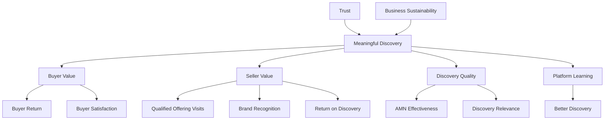

# Success Metrics

## Document Status

| Field | Value |
|-------|-------|
| **Status** | Draft |
| **Version** | 0.3 |
| **Owner** | PinkCurve Product Team |
| **Last Reviewed** | 2026-08-20 |
| **Related Components** | All platform components |

---

## Overview

Success at PinkCurve is not defined simply by traffic, impressions, clicks, revenue, or the number of Offerings on the platform.

PinkCurve succeeds when Buyers repeatedly discover things that matter, Sellers receive measurable value from that discovery, trust remains strong, the platform continuously learns, and the business can sustainably fund the ecosystem.

This is PinkCurve's guiding measurement principle:

> **PinkCurve succeeds when Buyers repeatedly discover things that matter, Sellers receive measurable value from that discovery, trust remains strong, the platform continuously learns, and the business can sustainably fund the ecosystem.**

Success therefore has several interconnected dimensions:

```text
Buyer Value
      ↓
Meaningful Discovery
      ↓
Seller Value
      ↓
Platform Learning
      ↓
Better Discovery
      ↓
Greater Buyer Value
```

All of this must operate within two essential boundaries:

```text
Trust
  +
Business Sustainability
```

Metrics exist to help PinkCurve understand whether this system is working.

They should guide better decisions rather than simply produce better numbers.

---

## Success Philosophy

PinkCurve should measure outcomes that reflect its mission rather than optimize conventional engagement metrics simply because they are easy to measure.

The objective is not:

- Maximum impressions
- Maximum clicks
- Maximum screen time
- Maximum advertising exposure
- Maximum number of Offerings viewed

The objective is:

**Meaningful Discovery.**

A Buyer who quickly discovers one worthwhile Offering may represent a more successful experience than a Buyer who scrolls through fifty Offerings without finding anything useful.

Similarly, a Seller receiving ten highly relevant Buyer visits may receive more value than a Seller receiving hundreds of low-quality clicks.

PinkCurve therefore evaluates success through a balanced measurement system.

---

# Metric Principles

## 1. Measure What Matters

Focus on outcomes rather than activity alone.

Examples:

```text
Impression
     ↓
View
     ↓
Interest
     ↓
Meaningful Discovery
```

Each stage provides information, but the later stages generally represent stronger evidence of value.

---

## 2. Meaningful Discovery Comes Before Engagement

Engagement is useful only when it contributes to discovery.

PinkCurve should not intentionally make the platform difficult, addictive, or unnecessarily time-consuming simply to increase engagement metrics.

The objective is to help Buyers discover worthwhile Offerings efficiently.

---

## 3. Avoid Goodhart's Law

> "When a measure becomes a target, it ceases to be a good measure."

No single metric should control PinkCurve.

QOV, Discovery Score, return rate, revenue, Brand Recognition, and other metrics must be interpreted together.

---

## 4. Measure Leading and Lagging Indicators

Leading indicators help predict future outcomes.

Examples:

- Offering Knowledge completeness
- Buyer return behavior
- Trust verification
- Discovery relevance
- Destination quality

Lagging indicators measure resulting outcomes.

Examples:

- QOV
- Seller retention
- Revenue
- Brand Recognition outcomes
- Buyer satisfaction

Both are necessary.

---

## 5. Measure Positive and Negative Signals

Positive engagement alone can create misleading conclusions.

PinkCurve should also measure:

- Not Interested
- Hide
- Dismiss
- Report
- Block
- Quick abandonment
- Repeated skipping
- Discovery failures

Negative signals are important inputs to the Learning Engine.

---

## 6. Trust Is a Success Metric

Growth without trust is not success.

PinkCurve measures trust through:

- Seller authenticity
- Offering authenticity
- Buyer confidence
- Fraud prevention
- Billing integrity
- Report resolution
- Platform security

Long-term trust takes priority over short-term growth.

---

## 7. Measure Sustainability

A platform that Buyers love but cannot financially operate cannot fulfill its mission over the long term.

PinkCurve therefore measures both:

```text
Value Created
      +
Cost to Create That Value
```

Business sustainability is part of product success.

---

## 8. Learn Before Setting Permanent Targets

Many PinkCurve metrics have not yet been validated.

Targets should therefore evolve through:

```text
Alpha
  ↓
Establish Baselines
  ↓
Beta
  ↓
Understand Behavior
  ↓
MVP
  ↓
Establish Operating Targets
  ↓
Growth
  ↓
Optimize Validated Metrics
```

Early targets are hypotheses, not promises.

---

# PinkCurve Success Framework

PinkCurve measures success across six major dimensions.

```text
PinkCurve Success
       │
       ├── Buyer Value
       │
       ├── Seller Value
       │
       ├── Discovery Quality
       │
       ├── Trust
       │
       ├── Learning
       │
       └── Business Sustainability
```

These dimensions should be evaluated together.

Strong performance in one dimension should not be achieved by damaging another.

---

# Meaningful Discovery

Meaningful Discovery is the central concept connecting PinkCurve's metrics.

A **Meaningful Discovery** occurs when PinkCurve helps a Buyer find an Offering, Seller, organization, resource, event, service, or other discoverable item that creates genuine value or interest.

Meaningful Discovery does not always produce the same action.

Different Offering types may produce different meaningful outcomes.

| Discovery Type | Possible Meaningful Outcomes |
|----------------|-----------------------------|
| Commercial Product | QOV, save, share, later exploration |
| Commercial Service | QOV, contact, directions |
| Promotion | QOV, save, later visit |
| Event | Event exploration, directions, registration destination |
| Community Service | Contact, directions, resource engagement |
| Public Service | Information or resource engagement |
| Brand Discovery | Relevant reach, repeat recognition, later Offering exploration |

PinkCurve should therefore avoid forcing every type of discovery into a single click-based measurement.

---

# North Star Framework

PinkCurve does not rely on one numerical North Star metric for every platform activity.

Instead, the conceptual North Star is:

> **Meaningful Discovery**

The primary outcome metric depends on the type of discovery.

For commercial Offering discovery, **Qualified Offering Visits (QOV)** remain one of PinkCurve's strongest outcome metrics.

For Brand Recognition, relevant awareness and repeat recognition require a different metric family.

For community and public discovery, meaningful actions may include resource engagement, directions, contacts, or other useful outcomes.

This approach allows PinkCurve to maintain one mission while measuring different forms of value appropriately.

---

# Buyer Value Metrics

Buyer metrics measure whether PinkCurve actually helps Buyers discover worthwhile things.

## Core Buyer Metrics

| Metric | Purpose |
|--------|---------|
| Active Buyers | Measure Buyer participation |
| New Buyers | Measure new Buyer adoption |
| Returning Buyers | Measure continued usefulness |
| 7-Day Return Rate | Early indication of repeat value |
| 30-Day Return Rate | Longer-term usefulness |
| Meaningful Discovery Rate | Percentage of discovery journeys producing meaningful outcomes |
| Save Rate | Buyer wants to remember an Offering |
| Share Rate | Buyer considers an Offering worth sharing |
| QOV Rate | Commercial discovery resulting in qualified Seller visits |
| Negative Feedback Rate | Discovery judged irrelevant or unwanted |
| Report Rate | Potential trust or quality problems |
| Buyer Satisfaction | Direct assessment of Buyer experience |
| Buyer Trust | Confidence in PinkCurve discovery |

---

## Time to Meaningful Discovery

PinkCurve should measure how efficiently Buyers find something worthwhile.

Conceptually:

```text
Buyer Opens PinkCurve
        ↓
Discovery Begins
        ↓
Buyer Navigates
        ↓
Meaningful Discovery
```

**Time to Meaningful Discovery** measures the time or interaction effort required to reach that outcome.

Lower time may indicate better discovery when accompanied by strong satisfaction and outcome signals.

The objective is not to keep Buyers on PinkCurve longer.

The objective is to help them discover efficiently.

---

# Daily Discovery Metrics

The Daily Discovery Feed is intended to make PinkCurve useful even when Buyers do not begin with a specific search.

It should provide opportunities to discover:

- New Offerings
- Trending Offerings
- Nearby Offerings
- Seasonal Offerings
- Promotions
- Community information
- Brand discovery
- Personalized discoveries

Important measurements may include:

| Metric | Purpose |
|--------|---------|
| Daily Active Buyers | Daily Buyer participation |
| Weekly Active Buyers | Weekly participation |
| Monthly Active Buyers | Broader Buyer participation |
| DAU/MAU | Frequency of Buyer return |
| WAU/MAU | Weekly habit strength |
| Feed Meaningful Discovery Rate | Useful discoveries originating from feed |
| 7-Day Return Rate | Whether Buyers return after initial discovery |
| 30-Day Return Rate | Longer-term usefulness |
| New Offering Engagement | Interest in newly available Offerings |
| Trending Engagement | Value of trending discovery |
| Nearby Engagement | Value of location-aware discovery |
| Feed Negative Feedback Rate | Irrelevant feed content |
| Repetition Rate | Whether Buyers are seeing excessive duplicate content |

PinkCurve should seek useful recurring behavior rather than addictive engagement.

---

# Discovery Quality Metrics

Discovery quality measures whether PinkCurve is matching Buyers with relevant Offerings.

| Metric | Purpose |
|--------|---------|
| Discovery Score | Experimental composite discovery measure |
| Impression-to-View Rate | Initial Buyer interest |
| View-to-Engagement Rate | Deeper interest |
| View-to-Click Rate | Interest in Seller destination |
| Click-to-QOV Rate | Quality of outbound traffic |
| Save Rate | Strong future interest |
| Share Rate | Strong perceived value |
| Negative Feedback Rate | Poor matching |
| Hide/Dismiss Rate | Active rejection |
| Report Rate | Trust or quality concern |
| Discovery Diversity | Variety of Sellers and Offerings |
| Repeat Exposure Rate | Detect excessive repetition |

Discovery Score remains experimental and should evolve as PinkCurve gathers real data.

---

# Qualified Offering Visit Metrics

A **Qualified Offering Visit (QOV)** represents a meaningful Buyer visit delivered by PinkCurve to a Seller destination.

QOV is particularly important for commercial Offering discovery.

Relevant metrics include:

| Metric | Purpose |
|--------|---------|
| Total QOV | Qualified Seller visits delivered |
| QOV per Offering | Offering-level discovery performance |
| QOV per Seller | Seller-level value |
| QOV Rate | Qualified visits relative to discovery |
| Click-to-QOV Rate | Outbound traffic quality |
| Cost per QOV | Seller acquisition economics |
| PinkCurve Cost per QOV | Platform delivery economics |
| QOV Growth | Growth of qualified discovery |
| QOV by Category | Category-level performance |
| QOV by Geography | Geographic performance |
| QOV by Discovery Surface | Feed/search/browse/AMN performance |

QOV should not be confused with raw clicks.

Bot traffic, artificial activity, duplicates, and invalid events should not qualify.

---

# Brand Recognition Metrics

Brand Recognition represents a different form of Seller value from QOV.

QOV is typically associated with a specific Offering and qualified Buyer action.

Brand Recognition may be associated with:

- Seller
- Brand
- Product line
- Category presence
- Geographic presence
- Specific Offering when appropriate

A Brand Recognition campaign does not require an immediate Seller-site visit to create value.

Conceptually:

```text
Seller / Brand
      ↓
Relevant Exposure
      ↓
Repeated Appropriate Exposure
      ↓
Buyer Familiarity
      ↓
Future Consideration
      ↓
Possible Offering Discovery
      ↓
Possible Future QOV
```

---

## Brand Recognition Metrics

Potential measurements include:

| Metric | Purpose |
|--------|---------|
| Relevant Reach | Buyers reached within intended discovery context |
| Unique Reach | Unique Buyers exposed |
| Exposure Frequency | Average relevant exposures per Buyer |
| Repeat Discovery Rate | Buyers encountering the brand more than once |
| Geographic Reach | Exposure within intended geographic markets |
| Category Reach | Exposure within relevant categories |
| Brand Engagement | Buyer interaction with brand-related discovery |
| Brand-to-Offering Exploration | Buyers later exploring Seller Offerings |
| Later QOV | Downstream qualified visits following earlier exposure |
| Negative Feedback Rate | Detect excessive or irrelevant exposure |
| Frequency Saturation | Detect excessive repetition |

---

## Brand Recognition Index

PinkCurve may eventually develop an experimental **Brand Recognition Index**.

Possible inputs could include:

- Relevant reach
- Repeat exposure
- Brand engagement
- Later Offering exploration
- Geographic/category penetration
- Buyer feedback

However, PinkCurve should not define a permanent formula until sufficient real-world data exists.

Brand Recognition should first be measured through transparent component metrics.

---

# Adaptive Metadata Navigation Metrics

Adaptive Metadata Navigation (AMN) helps Buyers navigate large Offering spaces through meaningful metadata.

PinkCurve must measure whether AMN actually improves discovery.

Potential metrics include:

| Metric | Purpose |
|--------|---------|
| AMN Usage Rate | Percentage of discovery journeys using AMN |
| Metadata Selection Rate | Buyer interaction with metadata navigation |
| Candidate Reduction | How effectively navigation narrows Offerings |
| AMN Meaningful Discovery Rate | Meaningful outcomes following AMN use |
| AMN QOV Rate | Commercial outcomes following AMN |
| Time to Discovery | Efficiency after navigation |
| Navigation Abandonment | Buyers leaving during navigation |
| Negative Feedback Reduction | Whether AMN improves relevance |
| Metadata Usefulness | Which metadata helps Buyers most |
| Metadata Dead Ends | Navigation paths producing no useful results |

AMN should not be considered successful merely because Buyers interact with metadata.

It succeeds when navigation helps Buyers discover worthwhile Offerings more efficiently.

---

# Seller Value Metrics

Seller metrics measure whether PinkCurve creates measurable business value.

| Metric | Purpose |
|--------|---------|
| Active Sellers | Sellers actively participating |
| Active Offerings | Discoverable Seller supply |
| Seller Activation | Sellers reaching meaningful platform use |
| Seller Retention | Continued Seller participation |
| QOV | Qualified Seller traffic |
| Brand Recognition | Awareness value |
| Seller ROD | Estimated Return on Discovery |
| Recommendation Adoption | Seller use of Seller Intelligence |
| Offering Improvement Rate | Sellers acting on recommendations |
| Seller Satisfaction | Direct Seller feedback |
| Seller Support Resolution | Quality of Seller support |

---

# Return on Discovery Metrics

**Return on Discovery (ROD)** helps Sellers understand the value PinkCurve provides relative to Seller cost.

Conceptually:

```text
ROD =
Estimated Value Created Through PinkCurve
÷
Seller PinkCurve Cost
```

ROD may incorporate:

- QOV
- Seller-provided conversion assumptions
- Average Order Value
- Brand Recognition
- Discovery improvements
- Other measurable Seller outcomes

PinkCurve should distinguish measured values from Seller estimates.

ROD should help Sellers evaluate PinkCurve without implying that PinkCurve directly caused every resulting transaction.

---

# Offering Knowledge Metrics

Offering Knowledge quality directly affects discovery quality.

Potential metrics include:

| Metric | Purpose |
|--------|---------|
| Knowledge Completeness | Required and useful knowledge coverage |
| Knowledge Freshness | Whether Offering information remains current |
| Knowledge Accuracy | Correctness of Offering information |
| Seller Approval Rate | Acceptance of AI-extracted knowledge |
| Knowledge Improvement | Learning-driven enrichment |
| Discovery Correlation | Relationship between knowledge quality and discovery performance |

PinkCurve should test whether higher Offering Knowledge quality actually improves discovery outcomes.

---

# Creative Studio Metrics

Creative Studio should be measured according to whether creative content improves understanding and discovery.

Potential metrics include:

| Metric | Purpose |
|--------|---------|
| Creative Completion | Successful asset generation |
| Seller Approval | Seller acceptance of generated creative |
| Creative Engagement | Buyer interaction |
| Creative-to-QOV | Commercial discovery outcome |
| Creative-to-Save | Future Buyer interest |
| Creative Variant Lift | A/B performance difference |
| Creative Cost | Generation economics |
| Human Revision Rate | Amount of manual correction required |
| Creative Accuracy | Consistency with Offering Knowledge |

The volume of AI-generated creative is not itself a success metric.

---

# Seller Intelligence Metrics

Seller Intelligence succeeds when insights lead to useful Seller actions.

Potential metrics include:

| Metric | Purpose |
|--------|---------|
| Recommendation View Rate | Seller awareness of recommendations |
| Recommendation Adoption | Seller acts on recommendations |
| Recommendation Accuracy | Whether recommendation is supported by outcomes |
| Performance Lift | Improvement following adopted recommendations |
| Seller Intelligence Usage | Continued use of intelligence features |
| Seller Satisfaction | Seller assessment of usefulness |

Seller Intelligence should be evaluated on actionability rather than report volume.

---

# Learning Engine Metrics

The Learning Engine should continuously improve PinkCurve.

Potential metrics include:

| Metric | Purpose |
|--------|---------|
| Discovery Improvement | Better discovery outcomes over time |
| Ranking Improvement | Better relevance |
| Recommendation Improvement | Better Seller recommendations |
| Knowledge Improvement | Better Offering Knowledge |
| Creative Improvement | Better-performing creative |
| Feedback Utilization | Buyer/Seller feedback incorporated |
| Model Accuracy | Offline predictive quality |
| Online Model Lift | Real-world model improvement |
| Drift Detection | Identify changing behavior |
| Learning Velocity | Time required to incorporate useful signals |

The Learning Engine succeeds when the platform becomes measurably better—not simply when more models are trained.

---

# Trust Metrics

Trust is one of PinkCurve's strategic assets.

## Seller Trust and Verification

| Metric | Purpose |
|--------|---------|
| Verified Seller Rate | Seller verification coverage |
| Verified Offering Rate | Offering verification coverage |
| Verification Failure Rate | Potential risk |
| Verification Time | Operational efficiency |
| Seller Fraud Detection | Fraud prevention |
| False Positive Rate | Avoid unfair Seller blocking |

---

## Buyer Trust

| Metric | Purpose |
|--------|---------|
| Buyer Trust Score | Buyer confidence |
| Report Rate | Potential discovery problems |
| Report Resolution Time | Response quality |
| Repeat Trust Incidents | Recurring platform problems |
| Scam Exposure Rate | Buyer exposure to fraudulent Offerings |
| Misleading Offering Rate | Discovery integrity |
| Buyer Complaint Rate | Trust problems |

---

## Platform Integrity

Potential metrics include:

- Bot detection rate
- Click fraud rate
- Fake account detection
- Account takeover detection
- Spam detection
- Malicious review detection
- Policy violation rate
- Fraud detection precision
- Fraud detection recall
- False positive rate

Trust metrics should be reviewed alongside growth metrics.

---

# Mobile Experience Metrics

PinkCurve is designed around a visual, mobile-first Buyer experience.

Mobile quality should therefore be measured directly.

Potential metrics include:

| Metric | Purpose |
|--------|---------|
| Mobile Active Buyers | Mobile usage |
| Mobile Meaningful Discovery Rate | Mobile discovery effectiveness |
| Mobile QOV Rate | Commercial mobile outcomes |
| Mobile Return Rate | Continued mobile usefulness |
| Mobile Interaction Error Rate | UI problems |
| Mobile Page Performance | PinkCurve mobile responsiveness |
| Mobile Abandonment | Discovery failures |
| Mobile AMN Effectiveness | Navigation quality on small screens |

Mobile success should not be inferred from desktop performance.

---

# Seller Destination Metrics

PinkCurve does not control Seller websites, but Seller destination quality affects the overall discovery journey.

Potential measurements include:

| Metric | Purpose |
|--------|---------|
| Destination URL Validity | Ensure links work |
| Mobile Compatibility | Seller destination usability on mobile |
| Destination Availability | Detect unavailable pages |
| Destination Redirect Quality | Ensure Buyer reaches intended Offering |
| Destination Handoff Success | Successful PinkCurve-to-Seller transition |
| Destination Error Rate | Broken destination experience |
| Destination Quality Signal | Overall destination health |

Where technically and legally appropriate, PinkCurve may also analyze PinkCurve-side return patterns following destination handoff.

Seller Intelligence may use these signals to recommend improvements.

PinkCurve should distinguish between discovery problems and Seller destination problems.

---

# Platform Health Metrics

A useful discovery platform must also be reliable.

| Metric | Purpose |
|--------|---------|
| Uptime | Platform availability |
| API Latency | Backend responsiveness |
| Feed Latency | Discovery experience speed |
| Error Rate | Application reliability |
| Database Performance | Data-layer health |
| Event Delivery Rate | Analytics completeness |
| Data Quality | Trustworthiness of data |
| Mobile Performance | Buyer experience |
| AI Service Availability | AI capability reliability |

Specific operating targets should be established during Beta and MVP based on real usage requirements.

---

# Business Sustainability Metrics

PinkCurve must eventually generate enough economic value to sustain its services.

Potential metrics include:

| Metric | Purpose |
|--------|---------|
| Revenue | Total platform revenue |
| Revenue Growth | Business growth |
| ARPS | Average Revenue Per Seller |
| Seller CAC | Cost to acquire a Seller |
| Buyer Acquisition Cost | Cost to acquire Buyers where applicable |
| Seller LTV | Lifetime Seller economic value |
| Gross Margin | Revenue after direct delivery costs |
| Cost per QOV | Economics of qualified discovery |
| Cost per Meaningful Discovery | Platform efficiency |
| AI Cost per Active Seller | AI economics |
| AI Cost per Active Buyer | Buyer-side AI economics |
| Verification Cost | Trust operating cost |
| Support Cost | Customer service economics |
| Infrastructure Cost | Platform operating cost |
| Seller Retention | Revenue durability |
| Operating Margin | Long-term business sustainability |

Profitability is not the primary Alpha objective.

However, cost and economic data should be collected from the beginning so that PinkCurve understands the economics of delivering discovery.

---

# Cost-to-Value Measurement

PinkCurve should understand both sides of the economic equation.

```text
Value Created
      ↓
QOV
Brand Recognition
Seller Intelligence
Buyer Discovery
      ↓
Compared With
      ↓
Cost to Deliver
      ↓
Infrastructure
AI
Trust
Support
Creative
Operations
```

A feature that creates value but costs significantly more than Sellers are willing to pay may require redesign.

Similarly, a low-cost capability that provides little Buyer or Seller value should not be retained simply because it is inexpensive.

---

# Metric Hierarchy

PinkCurve's metric hierarchy should reflect the complete ecosystem.



Trust and sustainability act as essential constraints on the entire system.

---

# Measurement Framework

## Instrumentation

| Layer | What PinkCurve Measures |
|-------|-------------------------|
| Buyer Experience | Discovery interactions, navigation, feedback |
| Seller Experience | Offering management, campaigns, intelligence usage |
| Discovery Engine | Retrieval, ranking, relevance |
| Creative Studio | Generation and creative performance |
| Analytics | Discovery outcomes |
| Learning Engine | Improvement over time |
| Trust | Verification, fraud, abuse |
| Backend | APIs and processing |
| Database | Data quality and performance |
| Infrastructure | Reliability and cost |

Instrumentation should be designed before relying on a metric.

A metric without trustworthy instrumentation can create misleading conclusions.

---

# Data Pipeline

```text
Events
   ↓
Validation
   ↓
Fraud / Bot Filtering
   ↓
Collection
   ↓
Processing
   ↓
Storage
   ↓
Aggregation
   ↓
Metrics
   ↓
Analysis
   ↓
Learning
   ↓
Dashboards / Decisions
```

Metric quality depends on event quality.

Bot traffic, testing traffic, duplicate events, and known fraudulent activity should be identified before business metrics are calculated.

---

# Test and Experiment Metrics

PinkCurve should distinguish production behavior from testing activity.

Test data should not contaminate:

- QOV
- Seller billing
- Brand Recognition
- Buyer metrics
- Seller performance
- Learning Engine training
- Business reporting

Test events should be clearly identifiable.

Testing metrics may include:

- Test coverage
- Scenario coverage
- Regression failures
- Discovery test accuracy
- Model evaluation performance
- Mobile device coverage
- Browser coverage
- Data quality test results

Detailed testing procedures and test-data strategy should be documented separately during implementation planning.

---

# Experimentation

## A/B Testing

For significant product, ranking, creative, or discovery changes:

1. Define the hypothesis.
2. Define primary success metrics.
3. Define guardrail metrics.
4. Determine required sample size.
5. Run for sufficient duration.
6. Analyze results.
7. Document conclusions.
8. Deploy, revise, or reject the change.

Experiments should test hypotheses rather than justify predetermined decisions.

---

## Guardrail Metrics

Experiments should not improve one metric by damaging important platform values.

Guardrails may include:

- Buyer Trust
- Negative Feedback Rate
- Seller Retention
- Discovery Diversity
- Fraud Rate
- Platform Reliability
- Mobile Performance
- Data Quality
- Privacy compliance

For example, a ranking model that increases clicks but substantially increases Buyer reports should not automatically be considered successful.

---

# Alpha Metrics

Alpha exists primarily to determine whether PinkCurve works.

Primary Alpha objectives include:

- Verify instrumentation
- Validate core Buyer flows
- Validate Seller onboarding
- Validate Offering Knowledge
- Validate basic discovery
- Validate mobile experience
- Validate AMN concepts
- Validate trust workflows
- Identify technical failures
- Establish initial cost baselines

Alpha metrics should primarily establish baselines rather than enforce aggressive business targets.

---

# Beta Metrics

Beta exists primarily to determine whether real Buyers and Sellers receive value.

Important Beta questions include:

- Do Buyers understand PinkCurve?
- Do Buyers find relevant Offerings?
- Do Buyers return?
- Does Daily Discovery remain useful?
- Does AMN improve discovery?
- Do Sellers receive meaningful traffic?
- Does QOV represent Seller value?
- Does Brand Recognition create measurable value?
- Are Trust Signals understandable?
- Does Seller Intelligence provide useful recommendations?
- What does it cost PinkCurve to deliver these services?

Beta should establish realistic operating ranges.

---

# MVP Metrics

MVP should demonstrate that PinkCurve's core value exchange works.

```text
Buyers Receive Value
        ↓
Buyers Return
        ↓
Sellers Receive Value
        ↓
Sellers Continue Participating
        ↓
Some Sellers Are Willing to Pay
        ↓
PinkCurve Learns and Improves
```

MVP success should not require every long-term PinkCurve capability to be complete.

It should demonstrate that the core discovery system creates repeatable value.

---

# Growth Metrics

After MVP validation, PinkCurve can begin establishing stronger growth targets.

Potential areas include:

- Buyer growth
- Seller growth
- Seller retention
- QOV growth
- Brand Recognition adoption
- Revenue growth
- Gross margin
- Lower cost per discovery
- Improved Learning Engine performance
- Expanded categories
- Expanded geography

Growth should not compromise trust or discovery quality.

---

# Reporting Cadence

| Report | Frequency | Purpose |
|--------|-----------|---------|
| Operational Dashboard | Continuous | System health and incidents |
| Daily Metrics | Daily | Discovery and operational monitoring |
| Weekly Review | Weekly | Product and learning decisions |
| Monthly Review | Monthly | Business and ecosystem health |
| Experiment Review | Per experiment | Validate hypotheses |
| Trust Review | Regular | Fraud, abuse, verification, Buyer protection |
| Cost Review | Monthly | Business sustainability |

Cadence may evolve as PinkCurve grows.

---

# Dashboards

## Executive Dashboard

Should eventually summarize:

- Meaningful Discovery
- Buyer return
- QOV
- Brand Recognition
- Active Sellers
- Seller retention
- Trust
- Revenue
- Operating costs
- Major risks

---

## Buyer Experience Dashboard

Potential measurements:

- Active Buyers
- Meaningful Discovery Rate
- Daily Discovery
- AMN effectiveness
- Return behavior
- Negative feedback
- Mobile performance
- Buyer trust

---

## Seller Dashboard

Potential measurements:

- Offering discovery
- QOV
- Brand Recognition
- Offering performance
- Audience patterns
- Geographic patterns
- Seller ROD
- Seller Intelligence recommendations

---

## Product Dashboard

Potential measurements:

- Discovery funnel
- Discovery Score
- Feature usage
- AMN
- Creative performance
- Experiment results
- Buyer feedback

---

## Engineering Dashboard

Potential measurements:

- System availability
- Latency
- Errors
- Database performance
- AI service health
- Event processing
- Data quality
- Infrastructure cost

---

## Trust Dashboard

Potential measurements:

- Seller verification
- Offering verification
- Fraud detection
- Buyer reports
- Abuse
- Bot traffic
- False positives
- Incident resolution

---

# Metrics We Measure but Do Not Optimize in Isolation

PinkCurve measures many activity metrics because they help explain Buyer behavior, Seller performance, platform operations, and discovery quality.

However, these metrics should not become optimization goals by themselves.

> **PinkCurve measures activity to understand behavior, but optimizes for meaningful outcomes.**

| Metric | Why We Measure It | Why We Do Not Optimize It Alone |
|--------|-------------------|--------------------------------|
| Impressions | Understand exposure, reach, and Brand Recognition | More exposure does not necessarily create more value |
| Raw Clicks | Understand Buyer actions and discovery paths | Clicks may be low-quality, accidental, fraudulent, or irrelevant |
| Time on Site | Understand Buyer behavior and possible engagement | Longer sessions may indicate difficulty or confusion |
| Offerings Viewed | Understand the discovery journey | More views may indicate poor matching rather than successful discovery |
| Screen Time | Understand usage patterns | PinkCurve does not seek addictive engagement |
| AI Content Volume | Understand Creative Studio activity and cost | More generated content does not necessarily improve discovery |
| Model Complexity | Understand technical and operational requirements | More complex AI does not necessarily produce better discovery |
| Seller Spend | Understand business activity and economics | Higher spending should not determine organic discovery relevance |

These metrics remain valuable as diagnostic and contextual signals.

They should be interpreted together with stronger outcome measures such as Meaningful Discovery, QOV, Brand Recognition, Buyer satisfaction, negative feedback, trust, and Seller value.

For example, a large number of Offerings viewed may indicate healthy exploration in one context, but in another context it may indicate that the Buyer is struggling to find something relevant.

Similarly, high impression volume may be useful for Brand Recognition, but excessive or irrelevant exposure may create Buyer fatigue and reduce trust.

PinkCurve therefore does not assume that more activity means greater success.

**Quality of discovery matters more than quantity of activity.**

---

# Current Status

## Implemented

- Basic page-view tracking
- Server-side logging
- Basic Offering performance measurement

## In Development

- Discovery event instrumentation
- Offering embedding measurement

## Planned

- Full discovery event tracking
- Buyer metrics
- Seller metrics
- QOV qualification
- Brand Recognition measurement
- AMN metrics
- Trust metrics
- Mobile metrics
- Seller destination metrics
- Business sustainability metrics
- Dashboard infrastructure
- A/B testing framework
- Automated reporting
- Cost-to-value measurement

---

# Open Questions

See [Open Decisions](19-open-decisions.md) for questions including:

- Formal definition of Meaningful Discovery
- QOV qualification criteria
- Discovery Score weighting
- Brand Recognition measurement methodology
- Whether to create a Brand Recognition Index
- AMN success criteria
- Buyer return targets
- Seller retention targets
- Mobile performance targets
- Destination Quality methodology
- Seller ROD methodology
- Minimum data thresholds for Seller Intelligence
- Alpha baseline requirements
- Beta success thresholds
- MVP launch criteria
- Cost-per-Meaningful-Discovery methodology

---

# Success Principles

## Buyer Value Comes First

Buyer discovery must create genuine usefulness.

## Seller Value Must Be Measurable

PinkCurve must demonstrate what value Sellers receive.

## QOV Measures Offering Discovery

QOV remains an important commercial outcome metric but does not represent every form of PinkCurve value.

## Brand Recognition Requires Different Measurement

Brand awareness may create value before an Offering click occurs.

## Discovery Should Be Efficient

PinkCurve should help Buyers find worthwhile Offerings without requiring unnecessary browsing.

## AMN Must Prove Its Value

Adaptive Metadata Navigation should be measured according to whether it improves discovery.

## Mobile Must Be Measured Directly

A mobile-first platform must understand mobile discovery quality independently.

## Trust Is Part of Success

Growth that damages Buyer or Seller trust is not successful growth.

## Learning Must Produce Improvement

The Learning Engine succeeds only when PinkCurve becomes measurably better.

## Economics Matter From the Beginning

Profitability may come later, but costs should be understood from Alpha onward.

## Metrics Evolve With Evidence

Alpha establishes baselines. Beta establishes understanding. MVP establishes operating targets. Growth optimizes validated metrics.

---

# Guiding Light

PinkCurve's measurement system ultimately returns to one principle:

> **PinkCurve succeeds when Buyers repeatedly discover things that matter, Sellers receive measurable value from that discovery, trust remains strong, the platform continuously learns, and the business can sustainably fund the ecosystem.**

Every major PinkCurve metric should help answer at least one part of that statement.

If a metric does not help PinkCurve understand Buyer value, Seller value, discovery quality, trust, learning, or sustainability, its importance should be questioned.

**Measure what matters. Discover what matters.**

---

## Related Documents

- [Executive Summary](00-executive-summary.md)
- [Design Principles](02-design-principles.md)
- [Product Architecture](03-product-architecture.md)
- [Offering Knowledge](04-offering-knowledge.md)
- [Creative Studio](05-creative-studio.md)
- [Discovery Engine](06-discovery-engine.md)
- [Discovery Analytics](07-discovery-analytics.md)
- [Learning Engine](08-learning-engine.md)
- [Seller Intelligence](09-seller-intelligence.md)
- [AI Platform](10-ai-platform.md)
- [Data Architecture](11-data-architecture.md)
- [Security, Privacy, and Trust](12-security-privacy-and-trust.md)
- [Business Model](13-business-model.md)
- [Product Roadmap](15-product-roadmap.md)
- [Open Decisions](19-open-decisions.md)
- [Buyer Experience](20-buyer-experience.md)