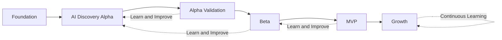

# Product Roadmap

## Document Status

| Field | Value |
|-------|-------|
| **Status** | Draft |
| **Version** | 0.3 |
| **Owner** | PinkCurve Product Team |
| **Last Reviewed** | 2026-08-21 |
| **Related Components** | All platform components |

---

## Overview

PinkCurve's roadmap is organized around proving and progressively strengthening meaningful discovery rather than simply delivering an increasing number of features.

The roadmap follows the continuous discovery lifecycle:

```text
Offering Knowledge
        ↓
Creative
        ↓
AI Discovery
        ↓
Buyer Experience
        ↓
Trust
        ↓
Discovery Analytics
        ↓
Learning
        ↓
Intelligence
        ↓
Continuous Improvement
```

PinkCurve's development progresses through Foundation, AI Discovery Alpha, Alpha Validation, Beta, MVP, and Growth stages.

Each stage should validate important assumptions about Buyer value, Seller value, discovery quality, trust, learning, operational feasibility, and business sustainability before the platform advances.

AI-powered discovery is included from the Alpha stage because intelligent discovery is a fundamental part of PinkCurve's product hypothesis.

The objective of the roadmap is not to implement the largest possible number of features.

The objective is to progressively prove that PinkCurve can help Buyers discover worthwhile Offerings, provide measurable value to Sellers, maintain trust, continuously learn, and sustainably support the discovery ecosystem.

**PinkCurve's roadmap is driven by validated discovery value, not by the number of features completed.**

---

## Roadmap Philosophy

### Build → Measure → Learn

PinkCurve follows an iterative development process:

1. **Build:** Implement the smallest useful version of a capability
2. **Measure:** Observe how Buyers, Sellers, and the platform respond
3. **Learn:** Evaluate results and identify improvements
4. **Improve:** Incorporate learning into the next iteration

This cycle repeats throughout the life of the platform.

```text
Build
  ↓
Measure
  ↓
Learn
  ↓
Improve
  ↓
Build Again
```

The roadmap should therefore remain adaptable.

A capability that does not produce the expected value should be improved, redesigned, simplified, or removed rather than retained merely because it was part of the original plan.

---

## Development Principles

### 1. Meaningful Discovery First

PinkCurve does not measure development progress primarily by how many Offerings, screens, models, or features have been implemented.

The central question is:

> **Can PinkCurve help a Buyer discover something worthwhile without requiring the Buyer to navigate large amounts of irrelevant information?**

A Buyer who quickly discovers one worthwhile Offering may represent a more successful experience than a Buyer who scrolls through fifty Offerings without finding anything useful.

The roadmap therefore prioritizes discovery quality over feature quantity.

---

### 2. Validate the Real PinkCurve Experience

Early versions of PinkCurve should simplify scale and operational complexity without removing the capabilities that define the product.

Alpha may intentionally limit:

- Number of Buyers
- Number of Sellers
- Number of Offerings
- Number of categories
- Geographic coverage
- Infrastructure scale
- Automation
- Advanced analytics
- Advanced Seller Intelligence

However, Alpha should still include the fundamental PinkCurve experience:

- Offering Knowledge
- AI-assisted discovery
- Buyer registration
- Buyer Discovery Profile
- Adaptive Metadata Navigation (AMN)
- Visual mobile discovery
- Discovery Signals
- Trust mechanisms
- Buyer feedback
- Discovery measurement

The purpose of Alpha is not merely to determine whether the software operates.

The purpose is to determine whether **PinkCurve's approach to discovery works**.

---

### 3. AI from the Beginning

AI-powered discovery is part of the Alpha experience.

AI may initially support:

- Offering Knowledge enrichment
- Buyer intent understanding
- Semantic Offering understanding
- Offering embeddings
- Semantic retrieval
- Relevance evaluation
- Discovery ranking
- Metadata understanding
- Adaptive Metadata Navigation
- Discovery Signal generation

Alpha does not require the final production machine-learning architecture.

Initial discovery may combine:

- Large Language Models
- Embeddings
- Vector similarity
- Rules
- Metadata
- Buyer preferences
- Context
- Trust Signals

More sophisticated ranking and personalization models can later be developed using actual PinkCurve discovery data.

**Alpha should simplify PinkCurve's scale and operational complexity, not remove the intelligence that defines the product.**

---

### 4. Mobile First

The Buyer experience is designed primarily for mobile devices.

Every major Buyer capability should therefore be evaluated for:

- Small-screen usability
- Visual clarity
- Navigation simplicity
- Interaction speed
- Discovery efficiency
- AMN usability
- Discovery Signal clarity
- Seller destination handoff
- Mobile destination compatibility

Desktop experiences may also be supported, but should not determine the primary Buyer design.

---

### 5. Trust from the Beginning

Trust cannot be added after discovery is launched.

Verification, abuse prevention, Offering quality, Buyer protection, privacy, reporting, fraud detection, and platform security should evolve alongside the discovery system.

Early Trust capabilities do not need to be fully automated.

AI-assisted detection and human review may operate together during Alpha and Beta while PinkCurve learns which trust mechanisms are effective.

---

### 6. Registered Buyer Participation

Buyer registration is part of PinkCurve's discovery architecture.

Registered Buyer accounts enable:

- Discovery continuity
- Buyer Discovery Profiles
- Personalized Daily Discovery
- AMN continuity
- Saved Offerings
- Negative feedback
- Ratings and comments
- Brand Recognition measurement
- Learning across sessions
- Bot and abuse prevention
- Greater platform accountability

Registration should remain lightweight, privacy-conscious, and focused on information that improves discovery, trust, and platform operation.

PinkCurve should know enough about the Buyer to improve discovery and trust, while collecting no more information than necessary.

---

### 7. Learn from Real Discovery

Advanced Learning Engine and Seller Intelligence capabilities require meaningful discovery data.

PinkCurve should avoid building sophisticated intelligence based entirely on assumptions.

Real Buyer interactions should progressively provide the signals needed to improve:

- Ranking
- Personalization
- AMN
- Offering Knowledge
- Creative effectiveness
- Discovery Signals
- Brand Recognition
- Seller Intelligence
- Trust
- Fraud detection

---

### 8. Incremental Value

Each development stage should provide useful capabilities and generate learning that improves the next stage.

PinkCurve should not build large amounts of infrastructure without demonstrating how that infrastructure contributes to meaningful discovery or platform operation.

---

### 9. Hypothesis-Driven Development

Major features begin as hypotheses.

Examples include:

- AI-assisted discovery improves relevance
- Offering Knowledge improves matching
- AMN reduces Buyer confusion
- Discovery Signals improve Buyer understanding
- Registered Buyer profiles improve discovery continuity
- Daily Discovery encourages useful return visits
- Meaningful Discovery improves Buyer return
- QOV provides measurable Seller value
- Brand Recognition provides measurable Seller value
- AI-generated creative improves Offering discovery
- Trust Signals improve Buyer confidence

These hypotheses should be validated through testing and real platform behavior.

---

# Stage 1: Foundation

**Theme:** Establish the trusted data, Offering, AI, creative, and testing foundations required for intelligent discovery.

---

## 1A. Offering Foundation

### Implemented / In Progress

- Seller authentication
- Seller onboarding
- Basic Offering management
- Offering Knowledge schema
- Offering Knowledge relationships
- Offering Knowledge capture workflow
- Offering Knowledge completeness scoring

### Planned Evolution

- AI-assisted Offering Knowledge extraction
- Offering Knowledge enrichment
- Offering verification
- Offering Knowledge versioning
- Bulk import
- Additional Offering types

Offering Knowledge provides the semantic foundation required for intelligent discovery.

---

## 1B. Creative Studio Foundation

### Implemented / In Progress

- Creative briefs
- Script generation
- Storyboard generation
- Creative Campaign entity
- Campaign-to-artifact relationships
- Offering Knowledge integration
- LLM-based content generation

### Planned Evolution

- Multiple creative variations
- Seller-provided video
- Seller-provided images
- AI-assisted visual storytelling
- Creative quality evaluation
- Creative performance measurement

Creative Studio should help Sellers communicate Offering value clearly without requiring expensive professional content production.

---

## 1C. AI Platform Foundation

### Initial Capabilities

- LLM integration
- Prompt management
- Offering embeddings
- Embedding storage
- Semantic similarity
- AI evaluation foundation
- AI cost tracking
- Model and prompt version tracking

The initial AI Platform should support rapid experimentation without requiring the final production AI architecture.

AI infrastructure should remain replaceable so that PinkCurve can adopt better models and technologies as they become available.

---

## 1D. Trust Foundation

### Seller Trust

- Email verification
- Phone / OTP verification
- Seller identity verification
- Business verification
- Offering verification
- Basic policy enforcement

### Platform Protection

- Bot detection foundation
- Rate limiting
- Basic fraud detection
- Abuse reporting
- Security logging
- Suspicious activity detection
- Human review workflows for high-risk cases

Trust mechanisms should be strengthened continuously rather than treated as a one-time implementation phase.

---

## 1E. Testing Foundation

Before external Alpha testing, PinkCurve should establish repeatable testing procedures and representative test data.

### Test Data

Create representative:

- Test Sellers
- Test Buyers
- Test Buyer Discovery Profiles
- Test Offerings
- Offering Knowledge
- Creative assets
- Categories
- Locations
- Trust states
- Buyer preferences
- Buyer intents
- Fraud scenarios
- Abuse scenarios
- Bot traffic scenarios

### Test Procedures

Testing should cover:

- Offering Knowledge quality
- AI intent understanding
- Semantic retrieval
- Discovery relevance
- Discovery ranking
- AMN navigation
- Discovery Signals
- Mobile Buyer experience
- Seller destination handoff
- Trust and verification
- Fraud and bot scenarios
- Discovery event accuracy
- Privacy and consent behavior
- Performance
- Reliability
- AI cost

Test activity should be clearly identifiable so that it does not contaminate production discovery metrics or Learning Engine data.

Detailed test datasets, test cases, expected results, and execution procedures should be maintained separately from the Product Blueprint as implementation and validation artifacts.

---

# Stage 2: AI Discovery Alpha

**Theme:** Determine whether the fundamental PinkCurve discovery experience works.

Alpha should contain enough intelligence to test PinkCurve's actual product hypothesis.

---

## 2A. Buyer Registration

PinkCurve Buyers register before participating in the personalized discovery experience.

Registration should remain lightweight.

### Initial Capabilities

- Buyer account creation
- Email and/or phone verification
- Privacy controls
- Consent controls
- General interests
- General location when appropriate
- Initial discovery preferences

PinkCurve should collect only information that supports legitimate discovery, trust, security, measurement, and platform operation.

---

## 2B. Buyer Discovery Profile

PinkCurve maintains a Buyer Discovery Profile that evolves through Buyer-provided preferences and discovery interactions.

Potential signals include:

- Stated interests
- AMN selections
- Search activity
- Categories explored
- Offerings viewed
- Saved Offerings
- Shared Offerings
- "Not Interested"
- Hide actions
- Seller blocks
- Discovery history
- Location context when permitted
- Return behavior

The Buyer Discovery Profile exists to improve discovery.

It should not become an unnecessary surveillance profile.

Buyers should have meaningful control over important preferences and personalization settings.

---

## 2C. AI-Powered Discovery

Alpha discovery should include:

- Buyer intent understanding
- Offering semantic understanding
- Offering embeddings
- Semantic retrieval
- AI-assisted relevance evaluation
- Context-aware matching
- Initial ranking
- Quality filtering
- Trust filtering
- Diversity controls

The Alpha ranking system may combine:

```text
Buyer Discovery Profile
        +
Current Buyer Intent
        +
Context
        +
Offering Knowledge
        +
Semantic Similarity
        +
Trust Signals
        +
Quality Signals
        ↓
AI-Assisted Discovery
```

A fully trained PinkCurve ranking model is not required for Alpha.

Alpha should generate the real discovery data required to build better models later.

---

## 2D. Adaptive Metadata Navigation (AMN)

AMN helps Buyers progressively navigate the Offering space using metadata relevant to their current discovery context.

Initial AMN capabilities should test:

- Dynamic metadata selection
- Buyer-driven refinement
- Category-sensitive navigation
- Context-sensitive navigation
- Intent-sensitive metadata
- Visual presentation
- Small-screen usability
- Progressive narrowing without information overload

AMN should help Buyers communicate what matters without requiring complicated queries or navigating large filter panels.

AMN effectiveness should be measured through actual Buyer discovery outcomes.

---

## 2E. Discovery Signals

PinkCurve should translate complex discovery intelligence into simple Buyer-facing signals.

Initial Discovery Signals may include:

- Nearby
- Verified Seller
- Business Verified
- Trending
- Limited-Time Promotion
- Matches Your Interests
- New Offering
- Trust warnings where appropriate

Discovery Signals should remain concise and should not overwhelm the visual Offering experience.

---

## 2F. Visual Mobile Discovery

The Alpha Buyer experience should include:

- Visual-first Offering presentation
- Mobile-first layouts
- Simple navigation
- AMN
- Discovery Signals
- Offering exploration
- Save
- Share
- Not Interested
- Hide
- Report
- Block Seller where appropriate
- Seller destination click-through

The interface should avoid unnecessary text, metadata, controls, and clutter that interfere with visual discovery.

The objective is not to show Buyers the largest possible number of Offerings.

The objective is to help Buyers discover worthwhile Offerings efficiently.

---

## 2G. Seller Destination Handoff

Because transactions occur on Seller destinations rather than PinkCurve, the handoff experience is part of discovery quality.

Alpha should test:

- Seller destination links
- Mobile destination behavior
- Deep links where available
- Mobile-specific Seller URLs where available
- Redirect reliability
- Return-to-PinkCurve behavior
- Broken destination detection

Seller destinations that are difficult to use on mobile devices may reduce the value of discovery even when PinkCurve successfully identifies a relevant Offering.

PinkCurve should measure this experience and eventually provide guidance to Sellers when destination quality creates Buyer friction.

---

## 2H. Daily Discovery

Alpha should begin testing PinkCurve as a destination Buyers can return to regularly.

The Daily Discovery experience may include:

- Relevant Offerings
- New Offerings
- Trending Offerings
- Local discovery
- Promotions
- Seasonal relevance
- Community information when appropriate
- Brand Recognition content where appropriate

Daily Discovery should prioritize relevance, usefulness, variety, and trust rather than feed volume.

Repeated exposure should be managed carefully to avoid Buyer fatigue.

---

## 2I. Buyer Feedback

Buyer feedback should be available from Alpha because it provides essential discovery and trust signals.

Examples include:

- Save
- Share
- Rating where appropriate
- Comment where appropriate
- Not Interested
- Hide
- Report
- Block Seller

Positive and negative feedback should contribute to future discovery improvements.

---

## 2J. Discovery Instrumentation

Alpha should capture the events required to understand discovery.

Examples include:

- Offering shown
- Offering explored
- AMN interaction
- Discovery Signal interaction
- Save
- Share
- Not Interested
- Hide
- Report
- Seller click-through
- Qualified Offering Visit where measurable
- Return discovery activity
- Brand exposure where applicable

Instrumentation should support later Discovery Analytics, Learning Engine, Seller Intelligence, Brand Recognition, and Trust capabilities.

---

# Stage 3: Alpha Validation

**Theme:** Determine whether PinkCurve creates meaningful discovery.

Alpha validation should focus on learning rather than growth.

---

## 3A. Meaningful Discovery Validation

Evaluate whether Buyers are discovering worthwhile Offerings.

Important questions include:

- Did the Buyer find something relevant?
- How quickly did meaningful discovery occur?
- How many irrelevant Offerings were encountered first?
- Did AMN help?
- Did Discovery Signals help?
- Did the Buyer save, share, explore, or visit the Seller?
- Did the Buyer provide positive or negative feedback?
- Did the Buyer return to PinkCurve?

A Buyer who discovers one worthwhile Offering quickly may represent a better outcome than a Buyer who views fifty Offerings without finding anything useful.

---

## 3B. AI Discovery Quality

Evaluate:

- Intent understanding
- Retrieval relevance
- Ranking quality
- Embedding quality
- AI consistency
- Failure cases
- Hallucination risk
- Latency
- Model reliability
- AI cost per discovery session
- AI cost per meaningful discovery

AI cost should be evaluated from Alpha onward so PinkCurve does not build a discovery architecture that becomes economically unsustainable at scale.

---

## 3C. AMN Validation

Evaluate:

- Metadata usefulness
- Navigation clarity
- Number of steps to meaningful discovery
- Buyer abandonment
- Metadata confusion
- Category differences
- Intent differences
- Mobile usability
- Whether AMN reduces irrelevant Offerings

AMN should simplify discovery rather than become another complicated filtering system.

---

## 3D. Mobile Validation

Evaluate:

- Small-screen clarity
- Swipe and navigation behavior
- Visual presentation
- Loading performance
- Discovery Signal presentation
- AMN usability
- Seller destination handoff
- Seller destination mobile compatibility
- Return-to-PinkCurve experience

---

## 3E. Trust Validation

Evaluate:

- Seller verification effectiveness
- Buyer verification effectiveness
- Offering authenticity
- Buyer confidence
- Reporting workflows
- Fraud detection
- Bot detection
- Abuse prevention
- False positives
- Human review requirements

Trust failures discovered during Alpha should be treated as product-learning signals rather than merely operational incidents.

---

## 3F. Seller Value Validation

Evaluate whether Sellers receive meaningful discovery.

Early indicators include:

- Relevant Offering exploration
- Qualified Offering Visits
- Buyer saves
- Buyer shares
- Geographic relevance
- Repeat discovery
- Seller satisfaction
- Offering performance differences

The purpose is not yet to maximize Seller revenue.

The purpose is to determine whether PinkCurve creates enough measurable value that Sellers would want to continue participating.

---

# Stage 4: Beta

**Theme:** Expand participation and begin learning systematically from real discovery behavior.

Beta introduces more Buyers, Sellers, Offerings, categories, and discovery contexts.

---

## 4A. Discovery Analytics

Develop the analytics foundation required to understand discovery at greater scale.

Capabilities include:

- Full discovery event pipeline
- Discovery funnel
- Meaningful Discovery metrics
- QOV measurement
- AMN analytics
- Buyer return metrics
- Trust metrics
- AI performance metrics
- Seller performance metrics
- Brand Recognition metrics
- Mobile discovery metrics

Discovery Analytics should measure activity while optimizing PinkCurve for meaningful outcomes.

---

## 4B. Learning Engine v1

Capabilities include:

- Signal processing
- Feature generation
- Feedback incorporation
- Negative signal learning
- Initial model training
- Ranking evaluation
- A/B testing
- Model monitoring
- Learning from Buyer return behavior
- Trust and fraud learning signals

Real PinkCurve discovery data should increasingly replace assumptions and manually designed heuristics.

---

## 4C. Improved Discovery Ranking

Capabilities may include:

- Learned ranking models
- Better personalization
- Context-aware ranking
- Trust integration
- Quality integration
- Diversity controls
- Exploration versus exploitation
- Cold-start improvements
- Negative feedback integration

The ranking system should continue prioritizing relevance rather than Seller spending.

---

## 4D. Personalization

Using registered Buyer profiles and appropriate consent:

- Personalized Daily Discovery
- Preference learning
- Cross-session discovery continuity
- Personalized AMN
- Recommendation improvements
- Discovery history
- Preference controls
- Personalization controls

Buyers should retain meaningful control over their discovery preferences.

---

## 4E. Seller Intelligence v1

Initial Seller Intelligence may include:

- Discovery performance
- QOV
- Offering performance
- Discovery funnel
- Offering Knowledge recommendations
- Geographic patterns
- Basic audience insights
- Creative performance
- Trust-related recommendations
- Discovery trend analysis

Advanced recommendations should be introduced only when sufficient data supports them.

Seller Intelligence should provide aggregated insights rather than expose individual Buyer identities or discovery histories.

---

## 4F. Brand Recognition Pilot

Brand Recognition should be tested as a distinct Seller value proposition.

Brand Recognition is not necessarily tied to an immediate Offering click or QOV.

Its purpose may include creating familiarity with a Seller, organization, service, or brand so that Buyers recognize and consider it later.

Initial measurement may include:

- Relevant reach
- Unique Buyer reach
- Repeat exposure
- Exposure frequency
- Brand exploration
- Later Offering exploration
- Later QOV
- Buyer saves
- Negative feedback
- Geographic reach
- Audience relevance

Brand Recognition should not be evaluated solely through QOV because awareness may create value before an immediate Offering visit occurs.

Registered Buyer accounts allow PinkCurve to measure relevant repeat exposure and subsequent discovery more reliably across sessions.

Seller reporting should use aggregated Buyer information and should not reveal individual Buyer identities or discovery histories.

---

## 4G. Creative Optimization

Capabilities may include:

- Creative variation testing
- A/B testing
- Creative performance measurement
- Seller recommendations
- Offering Knowledge feedback
- Audience-specific creative
- Human review where appropriate

Creative optimization should focus on improving Buyer understanding and meaningful discovery rather than maximizing attention alone.

---

## 4H. Trust and Fraud Expansion

As Beta participation increases, PinkCurve should strengthen:

- Seller verification
- Buyer verification
- Offering verification
- Fraud models
- Bot detection
- Behavioral anomaly detection
- Reporting workflows
- Trust Signals
- Human review operations
- Enforcement procedures

Trust should continuously improve through real platform experience.

---

# Stage 5: MVP

**Theme:** Demonstrate that PinkCurve's core value exchange works reliably enough for initial market operation.

MVP does not mean that every planned PinkCurve capability has been implemented.

MVP means the core PinkCurve system has demonstrated useful and repeatable value.

---

## 5A. Buyer Validation

PinkCurve should demonstrate that Buyers can:

- Register easily
- Understand the discovery experience
- Establish useful discovery preferences
- Navigate effectively with AMN
- Receive relevant AI-powered discovery
- Understand Discovery Signals
- Discover worthwhile Offerings
- Provide meaningful feedback
- Trust the platform
- Return for future discovery

---

## 5B. Seller Validation

PinkCurve should demonstrate that Sellers can:

- Register and become verified
- Create and manage Offerings
- Build useful Offering Knowledge
- Provide or create compelling creative assets
- Reach relevant Buyers
- Receive measurable discovery value
- Understand basic Seller Intelligence
- See sufficient value to continue using PinkCurve

---

## 5C. Discovery Validation

The platform should demonstrate:

- Meaningful Discovery
- Effective AI retrieval
- Effective AI-assisted ranking
- Useful AMN navigation
- Useful Discovery Signals
- Acceptable discovery latency
- Reliable event measurement
- Effective negative feedback
- Effective mobile discovery
- Continuous improvement potential

---

## 5D. Trust Validation

The platform should demonstrate:

- Seller verification
- Buyer verification
- Offering verification
- Abuse prevention
- Bot protection
- Fraud detection
- Reporting and review
- Privacy controls
- Reliable Trust Signals
- Human escalation where appropriate

---

## 5E. Seller Destination Validation

Because PinkCurve does not process transactions, Seller destination quality remains important.

MVP should demonstrate reliable:

- Offering destination linking
- Mobile destination handling
- Broken-link detection
- Click-through measurement
- QOV measurement where possible
- Return-to-PinkCurve experience

PinkCurve should understand when poor Seller destination experiences reduce the value of otherwise successful discovery.

---

## 5F. Business Validation

Initial business validation should determine:

- Whether Sellers receive measurable value
- Whether Sellers are willing to pay
- Whether QOV is a useful value and revenue unit
- Whether Brand Recognition creates additional Seller value
- Whether AI and infrastructure costs are sustainable
- Whether verification costs are manageable
- Whether customer support costs are manageable
- Whether human review requirements are manageable
- Whether PinkCurve can move toward sustainable operations

Profitability does not need to be fully achieved at MVP.

However, PinkCurve should begin demonstrating that its value and cost structure can support a sustainable business.

---

## MVP Success Principle

The MVP should demonstrate the basic PinkCurve value cycle:

```text
Buyer Registers
        ↓
PinkCurve Understands Buyer Intent
        ↓
AI + Offering Knowledge + AMN
Enable Relevant Discovery
        ↓
Buyer Discovers Something Meaningful
        ↓
Buyer Returns
        ↓
Seller Receives Measurable Value
        ↓
Seller Continues Using PinkCurve
        ↓
Discovery Signals Improve Learning
        ↓
PinkCurve Improves
        ↓
Better Meaningful Discovery
```

MVP is therefore a validation milestone, not the end of product development.

---

# Stage 6: Growth and Continuous Improvement

**Theme:** Expand PinkCurve while continuously improving discovery quality, trust, intelligence, and platform sustainability.

---

## 6A. Advanced Learning Engine

Capabilities may include:

- Advanced ranking models
- Faster learning loops
- Cross-Offering learning
- Better personalization
- Model experimentation
- Automated model evaluation
- Drift detection
- Continuous optimization
- Better cold-start handling
- Discovery pattern analysis

---

## 6B. Seller Intelligence v2

Capabilities may include:

- Advanced audience intelligence
- Competitive insights
- Opportunity detection
- Actionable recommendations
- ROD analysis
- Brand Recognition intelligence
- Predictive insights
- Offering optimization
- Creative recommendations
- Geographic opportunity analysis

---

## 6C. Advanced Creative Studio

Capabilities may include:

- AI Visual Storytelling
- Video generation where appropriate
- Seller-provided video enhancement
- Multi-format creative
- Creative personalization
- Automated creative experimentation with oversight
- Performance-driven creative recommendations

PinkCurve should continue supporting Seller-created content rather than requiring AI-generated creative.

---

## 6D. Brand Recognition

Expand validated Brand Recognition capabilities:

- Campaign management
- Audience relevance
- Geographic targeting
- Frequency management
- Brand lift indicators
- Discovery attribution
- Seller reporting
- Cost optimization
- Value optimization

Brand Recognition should remain consistent with PinkCurve's discovery philosophy.

It should help relevant Buyers become familiar with worthwhile Sellers and organizations rather than create repetitive or intrusive advertising.

---

## 6E. Platform Scale

Capabilities may include:

- Infrastructure scaling
- Caching
- Event-stream scaling
- Analytics scaling
- AI cost optimization
- Model serving optimization
- Multi-region deployment where justified
- High availability
- Operational automation
- Improved observability

Scaling decisions should follow demonstrated demand rather than anticipated demand alone.

---

## 6F. Enterprise Capabilities

Capabilities may include:

- Team collaboration
- API access
- Custom integrations
- Advanced security
- Enterprise analytics
- Large Offering portfolios
- Administrative controls
- Advanced account management
- Enterprise support

---

## 6G. Community and Public Discovery

After the commercial discovery model is sufficiently validated, PinkCurve may expand to:

- Community organizations
- Public services
- Local resources
- Volunteer opportunities
- Public information
- Non-commercial Offerings
- Community events

These Offering types can use the same fundamental discovery architecture while adopting success metrics appropriate to their purpose.

For example, community discovery may measure:

- Resource exploration
- Directions requested
- Contact actions
- Saves
- Shares
- Community engagement

rather than QOV alone.

---

# Roadmap Progression



The roadmap is intentionally iterative.

Failure to validate an important hypothesis should cause PinkCurve to improve the relevant capability rather than automatically move to the next stage.

---

## Major Validation Gates

| Stage | Primary Question |
|-------|------------------|
| **Foundation** | Can PinkCurve reliably represent Offerings and provide the data, AI, trust, and testing foundation for intelligent discovery? |
| **AI Discovery Alpha** | Can AI + Offering Knowledge + Buyer context + AMN create useful discovery? |
| **Alpha Validation** | Are Buyers actually experiencing Meaningful Discovery? |
| **Beta** | Can PinkCurve learn and improve from real discovery behavior? |
| **MVP** | Do Buyers return and do Sellers receive enough measurable value to sustain participation? |
| **Growth** | Can PinkCurve expand while preserving discovery quality, trust, simplicity, and sustainable economics? |

---

## Key Dependencies

| Dependency | Enables |
|------------|---------|
| Offering Knowledge | AI understanding, Creative Studio, Discovery |
| Buyer Registration | Discovery continuity, personalization, feedback, trust |
| Buyer Discovery Profile | Personalized discovery, Daily Discovery, AMN |
| AI Platform | Semantic understanding and intelligent discovery |
| Embeddings / Semantic Retrieval | Relevant candidate retrieval |
| Trust Foundation | Safe external Alpha testing |
| Event Instrumentation | Analytics, Learning, Seller Intelligence |
| Test Data and Procedures | Reliable Alpha validation |
| Real Discovery Data | Learned ranking and advanced intelligence |
| Consent Framework | Personalized learning and Buyer control |
| Discovery Analytics | Learning Engine and Seller Intelligence |
| Mobile Experience | Primary Buyer adoption |
| Seller Destination Handoff | QOV and Seller value |
| Buyer Feedback | Learning, personalization, trust |
| Verified Participants | Platform accountability and trust |

---

## Roadmap Risks

| Risk | Impact | Mitigation |
|------|--------|------------|
| Poor discovery quality | Buyers do not find value | Alpha validation, AI evaluation, AMN iteration |
| AI cost too high | Unsustainable economics | Measure cost early, optimize architecture |
| AI quality problems | Poor or misleading discovery | Evaluation, guardrails, human review |
| AMN complexity | Buyer confusion | Mobile testing, progressive refinement |
| Poor mobile experience | Reduced Buyer adoption | Mobile-first design and testing |
| Weak Buyer registration conversion | Reduced participation | Lightweight registration and clear Buyer value |
| Loss of Buyer trust | Reduced adoption | Verification, Trust Signals, privacy, reporting |
| Seller fraud | Buyer harm | Verification, detection, human review |
| Bot / Buyer abuse | Invalid metrics and Seller harm | Buyer verification, bot detection, anomaly detection |
| Insufficient discovery data | Weak learning | Controlled Alpha/Beta expansion |
| Weak Seller value | Poor Seller retention | QOV, Brand Recognition, Seller Intelligence |
| Seller destination not mobile-friendly | Poor post-click Buyer experience | Detect, measure, signal, and provide Seller guidance |
| Brand Recognition overexposure | Buyer fatigue | Frequency controls, relevance, negative feedback |
| Technical complexity | Delays | Prototype first and phase implementation |
| Resource constraints | Slower development | Prioritize core discovery hypotheses |
| Market feedback contradicts assumptions | Product direction changes | Build → Measure → Learn |

---

## Roadmap Management

This roadmap describes product evolution rather than a fixed calendar schedule.

Specific implementation dates should be maintained separately once engineering work is planned.

Roadmap priorities may change based on:

- Alpha results
- Buyer feedback
- Seller feedback
- Discovery Analytics
- AI evaluation
- AMN performance
- Trust incidents
- Technical findings
- Cost findings
- Mobile testing
- Market validation
- Business model validation

PinkCurve should not advance simply because a scheduled date has arrived.

It should advance when sufficient evidence supports the next stage.

---

## How to Read This Roadmap

- **Stages** represent maturity and validation milestones rather than rigid release dates.
- **Capabilities within stages** may overlap when dependencies allow.
- **Foundation** establishes the minimum architecture required to test PinkCurve properly.
- **Alpha** tests whether the fundamental AI-powered PinkCurve discovery experience works.
- **Alpha Validation** determines what works, what fails, and what needs improvement.
- **Beta** expands participation and begins systematic learning from real discovery.
- **MVP** demonstrates repeatable Buyer value, Seller value, trust, and initial business viability.
- **Growth** expands the platform after the core value proposition has been validated.
- **Learning continues throughout every stage.**

---

## Guiding Principle

PinkCurve's roadmap ultimately serves one objective:

> **Build the simplest platform capable of delivering trustworthy, AI-powered, Meaningful Discovery—and continuously improve it through real Buyer and Seller experience.**

PinkCurve should not become more complicated merely because more technology becomes available.

As the intelligence underneath the platform becomes more sophisticated, the experience presented to Buyers should become simpler, more relevant, and more useful.

**More intelligence underneath. Less confusion on the surface.**

---

## Related Documents

- [Product Architecture](03-product-architecture.md)
- [Offering Knowledge](04-offering-knowledge.md)
- [Creative Studio](05-creative-studio.md)
- [Discovery Engine](06-discovery-engine.md)
- [Discovery Analytics](07-discovery-analytics.md)
- [Learning Engine](08-learning-engine.md)
- [Seller Intelligence](09-seller-intelligence.md)
- [AI Platform](10-ai-platform.md)
- [Data Architecture](11-data-architecture.md)
- [Security, Privacy, and Trust](12-security-privacy-and-trust.md)
- [Business Model](13-business-model.md)
- [Success Metrics](14-success-metrics.md)
- [Open Decisions](19-open-decisions.md)