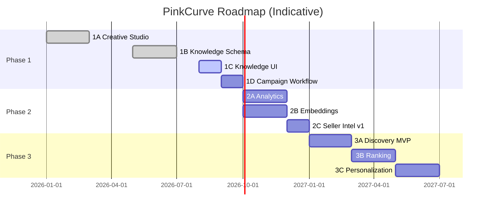

# Product Roadmap

## Document Status

| Field | Value |
|-------|-------|
| **Status** | Draft |
| **Version** | 0.1 |
| **Owner** | PinkCurve Product Team |
| **Last Reviewed** | 2026-07-23 |
| **Related Components** | All platform components |

---

## Overview

This roadmap outlines the planned development of PinkCurve. It represents current thinking, not commitments. Priorities may shift based on learnings and market feedback.

---

## Development Philosophy

### Build-Measure-Learn

1. **Build:** Implement minimum viable feature
2. **Measure:** Collect data on usage and impact
3. **Learn:** Adjust based on evidence

### Incremental Value

Each phase should deliver standalone value, not just set up future phases.

### Hypothesis-Driven

Major features start as hypotheses to be validated, not assumptions.

---

## Current State

### Implemented

| Component | Capabilities |
|-----------|-------------|
| Seller Platform | Auth, basic product management |
| Products | CRUD, workspace organization |
| Creative Studio | Briefs, scripts, storyboards (basic) |

### Recently Added (Stage 1B)

| Component | Capabilities |
|-----------|-------------|
| Product Knowledge | Table schema, entity model |
| Creative Campaigns | Campaign container, linking |

---

## Phase 1: Foundation (Current)

**Theme:** Establish core entities and workflows

### 1A: Creative Studio Foundation ✓
- Creative briefs generation
- Script generation
- Storyboard generation
- Workspace organization

### 1B: Knowledge & Campaign Structure ✓
- Product Knowledge table
- Creative Campaign entity
- Campaign-to-artifact linking
- Knowledge-to-campaign linking

### 1C: Knowledge Capture UI (Planned)
- Product Knowledge input forms
- Completeness scoring display
- Knowledge management workflow
- Integration with Creative Studio

### 1D: Campaign Workflow (Planned)
- Campaign creation flow
- Artifact generation within campaigns
- Campaign status management
- Multi-artifact organization

---

## Phase 2: Intelligence

**Theme:** Add learning and insights capabilities

### 2A: Analytics Foundation
- Discovery event schema
- Event collection infrastructure
- Basic metrics dashboard
- Seller performance view

### 2B: Embedding Infrastructure
- Product embedding generation
- Vector storage (pgvector or alternative)
- Similarity search API
- Integration with Discovery

### 2C: Seller Intelligence v1
- Performance dashboard
- Basic benchmarking
- Simple recommendations
- Trend visualization

---

## Phase 3: Discovery

**Theme:** Enable buyer-side discovery

### 3A: Discovery MVP
- Product browse experience
- Basic search
- Category navigation
- Click-through tracking

### 3B: Discovery Ranking
- Relevance-based ranking
- Embedding similarity search
- Quality signals integration
- A/B testing infrastructure

### 3C: Personalization (Requires Consent Framework)
- User preference capture
- Personalized feed
- Recommendation engine
- Privacy-preserving design

---

## Phase 4: Learning Loop

**Theme:** Close the feedback loop

### 4A: Learning Engine v1
- Signal processing pipeline
- Basic ranking model
- Feedback incorporation
- Model evaluation

### 4B: Content Optimization
- Creative A/B testing
- Performance-based suggestions
- Automated optimization (with oversight)
- Multi-variant generation

### 4C: Seller Intelligence v2
- Competitive insights
- Audience intelligence
- Actionable recommendations
- ROD calculator

---

## Phase 5: Scale

**Theme:** Scale and mature the platform

### 5A: Platform Scaling
- Infrastructure scaling
- Performance optimization
- Multi-region (if needed)
- High availability

### 5B: Enterprise Features
- Team collaboration
- API access
- Custom integrations
- Advanced security

### 5C: Video Generation
- Storyboard-to-video
- Video optimization
- Format variations
- Video analytics

---

## Roadmap Visualization

*Timeline is indicative. Actual dates will depend on learnings and priorities.*

---

## Dependencies

| Dependency | Blocks |
|------------|--------|
| Product Knowledge UI | Campaign workflows |
| Event infrastructure | Analytics, Learning |
| Vector search | Advanced Discovery |
| Consent framework | Personalization |

---

## Risks to Roadmap

| Risk | Impact | Mitigation |
|------|--------|------------|
| Hypothesis invalidation | Scope change | Early validation |
| Technical complexity | Delays | Prototype first |
| Resource constraints | Reduced scope | Prioritize ruthlessly |
| Market feedback | Direction change | Stay adaptable |

---

## How to Read This Roadmap

- **Phases** are thematic groupings, not strict sequences
- **Work within phases** may overlap or reorder
- **Timelines** are indicative; we estimate in relative terms
- **Scope** may change as we learn more

---

## Related Documents

- [Product Architecture](03-product-architecture.md)
- [Success Metrics](14-success-metrics.md)
- [Open Decisions](19-open-decisions.md)
